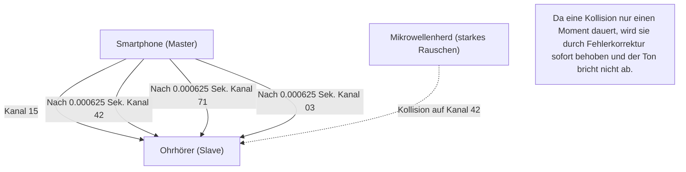

## 1. Befreiung von Kabeln

Ohrhörer, Mäuse, Tastaturen, Smartwatches, Autonavigationssysteme. Viele der digitalen Geräte um uns herum haben heute keine Kabel mehr, sondern sind durch eine unsichtbare, magische Leitung namens „Bluetooth“ verbunden.

Wenn Wi-Fi die „Hauptverkehrsader des Internets“ ist, die große Datenmengen mit hoher Geschwindigkeit über weite Strecken sendet, dann ist Bluetooth wie die „Kapillaren“, die nahegelegene Geräte energiesparend und mühelos miteinander verbinden. Aber warum liefert das eigene Smartphone in einer Umgebung, in der unzählige Bluetooth-Geräte schwirren, wie in städtischen Gebieten oder überfüllten Zügen, den eigenen Sound an die Ohrhörer, ohne dass es zu „Interferenzen“ (Überschneidungen) kommt?

Dahinter verbirgt sich eine erstaunliche Kommunikationstechnologie, die sich die physikalischen Eigenschaften von Funkwellen geschickt zunutze macht.

## 2. Das „Hart umkämpfte Gebiet“ des 2.4GHz-Bandes

Die von Bluetooth zur Kommunikation verwendeten Funkwellen sind elektromagnetische Wellen mit einer Frequenz, die als „**2.4GHz-Band (Gigahertz-Band)**“ bezeichnet wird.
Dieses 2.4GHz-Band ist als „ISM-Band (Industry, Science, Medical band)“ freigegeben, das von jedem auf der ganzen Welt ohne Lizenz frei genutzt werden kann.

Daher ist es zwar extrem komfortabel zu nutzen, gleichzeitig aber ein enorm „hart umkämpftes Gebiet“.
Zu den Dingen, die dasselbe 2.4GHz-Band nutzen, gehören Wi-Fi (WLAN), schnurlose Telefone, proprietäre Dongles für drahtlose Mäuse und sogar **Mikrowellenherde**. Die Mikrowellen, die ein Mikrowellenherd aussendet, um die Feuchtigkeit in Lebensmitteln zu erhitzen, liegen tatsächlich auch im 2.4GHz-Band (das ist der Grund, warum Wi-Fi oder Bluetooth unterbrochen werden, wenn man einen Mikrowellenherd benutzt).

Wie gewährleistet Bluetooth in einem Raum, in dem so viele Funkwellen wild durcheinander fliegen, die Sicherheit und Stabilität der Kommunikation? Die Antwort lautet „**Frequenzsprungverfahren (Frequency Hopping)**“.

## 3. „Frequenzsprungverfahren (FHSS)“ zur Vermeidung von Interferenzen

Bluetooth unterteilt die Breite des 2.4GHz-Bandes (genauer gesagt von 2.402GHz bis 2.480GHz) in **79 winzige Kanäle** von jeweils 1MHz.

Wenn man für die Kommunikation fest auf nur einem Kanal (z. B. 2.410GHz) bleibt, wird die Kommunikation in dem Moment ausgelöscht, in dem sich zufällig starke Wi-Fi-Funkwellen oder das Rauschen eines Mikrowellenherdes damit überschneiden.

Daher kommuniziert Bluetooth, während es die verwendeten Kanäle mit einer halsbrecherischen Geschwindigkeit von **1600 Mal pro Sekunde** ständig wechselt (hoppt). Dies wird als „Frequency-Hopping Spread Spectrum (FHSS)“ (Frequenzsprung-Spreizspektrum) bezeichnet.

Es ist leichter zu verstehen, wenn man es mit den Tasten eines Klaviers (79 Kanäle) vergleicht.
Wie ein Morsecode sendet es Nachrichten, während es zufällig 1600 Mal pro Sekunde auf die Tasten schlägt, wie „Do-Mi-Sol-La-Do-Fa...“.
Selbst wenn das Rauschen der Mikrowelle die „Mi“-Taste stark übertönt, werden nur die Daten für das „Mi“-Timing (1/1600 Sekunde) zerstört, und die meisten auf anderen Kanälen gesendeten Daten kommen unbeschadet an. Da die wenigen zerstörten Daten durch digitale Fehlerkorrektur sofort wiederhergestellt werden, haben unsere Ohren nicht das Gefühl, dass der Ton unterbrochen wurde.

### Adaptives Frequenzsprungverfahren (AFH)
Darüber hinaus wurde ab Bluetooth v1.2 eine Technologie namens „AFH (Adaptive Frequency Hopping)“ eingeführt.
Dies ist ein intelligenter Mechanismus, der Kanäle lernt und aus der Liste ausschließt, die als „verrauscht“ gelten, weil sie z. B. ständig von Wi-Fi genutzt werden, und für das Hopping nur „saubere Kanäle“ mit wenig Rauschen auswählt. Dadurch hat das moderne Bluetooth eine unglaubliche Stabilität erlangt.

## 4. Pairing: Der geheime Tanz von Master und Slave

Wenn wir ein neues Bluetooth-Gerät kaufen, führen wir zuerst immer das „Pairing“ (Kopplung) durch.
Aus physikalischer Sicht ist dieses Pairing ein „Ritual, um die Reihenfolge (das Muster) des Hoppings zwischen den beiden Geräten im Geheimen zu teilen“.

In der Bluetooth-Kommunikation gibt es immer eine Master-Slave-Beziehung.
* **Master**: Das Gerät, das die Kommunikation steuert, wie z. B. ein Smartphone oder ein PC.
* **Slave**: Das gesteuerte Gerät, wie z. B. Ohrhörer oder eine Maus.

Wenn das Pairing abgeschlossen ist, teilt das Master-Gerät dem Slave seine eigene „Uhr (Clock)“ und „eindeutige ID (Bluetooth-Adresse)“ mit.
Bluetooth gibt diese „Master-ID“ und die „aktuelle Uhrzeit der Master-Uhr“ in eine komplexe Berechnungsformel (Algorithmus) ein, um die Nummer des nächsten anzuspringenden Kanals (1 bis 79) zu berechnen.

Da Master und Slave dieselbe ID und Uhr teilen, können sie die Kanäle in perfekten 1/1600-Sekunden-Intervallen umschalten und sich dabei genau abstimmen, wie „Als Nächstes kommt Kanal 42“, „Danach kommt 71“, ohne sich gegenseitig konsultieren zu müssen.
Andere, unbeteiligte Smartphones und Ohrhörer haben unterschiedliche IDs und Uhren, sodass sie nach völlig anderen, zufälligen Mustern hoppen. Deshalb gibt es selbst in einem überfüllten Zug absolut keine Interferenzen.

## 5. Geschichte der Erfindung: Hollywood-Schauspielerin und Torpedos

Die Wurzeln dieser extrem fortschrittlichen „Frequenzsprung“-Technologie reichen überraschenderweise bis in den Zweiten Weltkrieg zurück.

Die Erfinder sind die Hollywood-Schauspielerin Hedy Lamarr, die damals als „das schönste Gesicht der Welt“ gepriesen wurde, und der Komponist George Antheil.
Um zu verhindern, dass die Torpedos der Alliierten durch feindliche Funkstörsender (Jamming) vom Kurs abgebracht werden, ließ sie sich vom Mechanismus eines automatischen Klavierspiels (Pianola-Rollen) inspirieren und kam auf die Idee: „Wenn wir die Kommunikationsfrequenz nacheinander gemäß einem kryptografischen Muster ändern, kann der Feind sie nicht mit Störwellen treffen.“

Dieses Patent war seiner Zeit damals zu weit voraus und wurde vom Militär nicht übernommen. Später wurde es jedoch während des Kalten Krieges als militärische Kommunikationstechnologie weiterentwickelt, dann für zivile Zwecke umgewidmet und wurde zur Kerntechnologie des heutigen Bluetooth und Wi-Fi.

## 6. Die IoT-Revolution durch BLE (Bluetooth Low Energy)

Bluetooth hat sich im Laufe der Jahre weiterentwickelt, aber der größte Wendepunkt war die Einführung von „**BLE (Bluetooth Low Energy)**“ in Bluetooth 4.0 im Jahr 2010.

Das traditionelle Bluetooth (Classic) eignete sich zwar für die Wiedergabe von Musik in hoher Qualität, hatte aber den Nachteil eines hohen Batterieverbrauchs. BLE ist ein Kommunikationsstandard, der speziell dafür neu konzipiert wurde, „winzige Datenmengen mit extrem wenig Strom für nur einen kurzen Moment zu senden“.

Dank BLE kann die Kommunikation von IoT-Geräten (Internet of Things) – wie Herzfrequenzdaten von Smartwatches, Messergebnisse von Thermometern und Standortinformationen von Anti-Verlust-Tags (wie AirTags) – „mit einer einzigen Knopfzelle für mehrere Monate bis Jahre“ betrieben werden.

Bluetooth hat seine Rolle als bloßes „drahtloses Kabel“ beendet. Heute entwickelt es sich leise, aber sicher als Infrastruktur zur digitalen Vernetzung des physischen Raums weiter, sei es zum Messen von Entfernungen im Raum (hochpräzise Standortinformationen) oder zum Aufbau von Mesh-Netzwerken zur Steuerung der Beleuchtung in ganzen Gebäuden.
