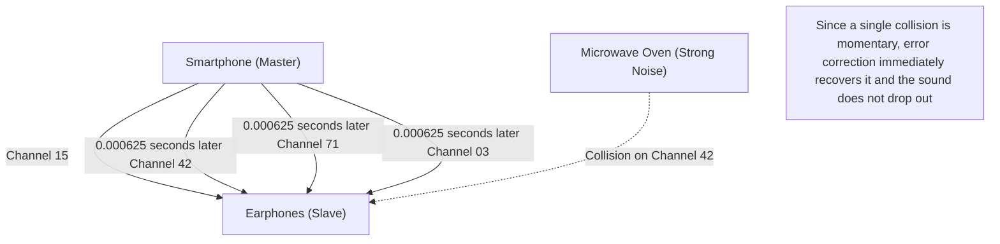

## 1. Freedom from Cables

Earphones, mice, keyboards, smartwatches, car navigation systems. Many of the digital devices around us today no longer have cables, but are connected by an invisible, magical line called "Bluetooth".

If Wi-Fi is the "internet's main artery" that sends large amounts of data far away at high speed, Bluetooth is like the "capillaries" that easily connect nearby devices with low power consumption. However, in environments like urban areas or crowded trains where countless Bluetooth devices are transmitting, why do your smartphone and earphones deliver only your own sound without "interference"?

Hidden there is an astonishing communication technology that skillfully utilizes the physical properties of radio waves.

## 2. The "Fierce Battlefield" of the 2.4GHz Band

The radio waves used by Bluetooth for communication are electromagnetic waves with a frequency called the "**2.4GHz (gigahertz) band**".
This 2.4GHz band is open as an "ISM band (Industry, Science, Medical band)" that anyone around the world can use freely without a license.

Because of this, while it is extremely convenient to use, it has become a tremendous "fierce battlefield".
Things using the same 2.4GHz band include Wi-Fi (wireless LAN), cordless phones, proprietary dongles for wireless mice, and even **microwave ovens**. The microwaves radiated by a microwave oven to heat the moisture in food are also actually in the 2.4GHz band (this is why Wi-Fi and Bluetooth are interrupted when using a microwave oven).

In a space where so many radio waves fly wildly, how does Bluetooth ensure the security and stability of its communication? The answer is "**Frequency Hopping**".

## 3. "Frequency Hopping (FHSS)" to Prevent Interference

Bluetooth divides the width of the 2.4GHz band (specifically from 2.402GHz to 2.480GHz) into **79 fine channels** of 1MHz each.

If communication were fixed to only one channel (for example, 2.410GHz), the moment another strong Wi-Fi signal or microwave oven noise overlapped there by chance, the communication would be drowned out.

Therefore, Bluetooth communicates while rapidly switching (hopping) the channel it uses at a furious speed of **1600 times per second**. This is called "Frequency Hopping Spread Spectrum (FHSS)".

It is easy to understand if you compare it to the keys of a piano (79 channels).
It sends messages like Morse code while randomly hitting the keys 1600 times a second, like "Do, Mi, Sol, La, Do, Fa...".
Even if the noise of a microwave oven strongly smashes the "Mi" key, only the data at the timing of "Mi" (1/1600th of a second) is corrupted, and the vast majority of data sent on other channels arrives intact. Because the tiny amount of corrupted data is instantaneously restored by error correction through digital processing, our ears do not feel that the "sound dropped out".

### Adaptive Frequency Hopping (AFH)

Furthermore, starting with Bluetooth v1.2, a technology called "AFH (Adaptive Frequency Hopping)" was introduced.
This is a clever mechanism that learns which channels are constantly being used by Wi-Fi and judged as "noisy", removes them from the list, and hops only on the "clean channels" with little noise. Thanks to this, modern Bluetooth has achieved incredible stability.

## 4. Pairing: The Secret Dance of Master and Slave

When we buy a new Bluetooth device, we always perform "pairing" first.
From a physical perspective, this pairing is a "ritual to secretly share the hopping order (pattern) between the two devices".

In Bluetooth communication, there is always a master-slave relationship.
* **Master**: The side that controls the communication, such as a smartphone or computer
* **Slave**: The side that is controlled, such as earphones or a mouse

Once pairing is complete, the master device tells the slave its own "clock" and "unique ID (Bluetooth address)".
Bluetooth puts this "master's ID" and "current time of the master's clock" into a complex calculation formula (algorithm) to calculate the channel number (1 to 79) to jump to next.

Because the master and slave share the same ID and clock, they can completely synchronize their timing to switch channels in 1/1600th of a second increments, like "next is channel 42", "then 71", without consulting each other.
Other unrelated smartphones and earphones are hopping in completely different, random patterns because they have different IDs and clocks. That is exactly why they never interfere with each other even on a crowded train.

## 5. History of the Invention: A Hollywood Actress and Torpedoes

The roots of this extremely advanced technology of "frequency hopping" surprisingly trace back to World War II.

The inventors are Hedy Lamarr, a Hollywood actress praised at the time as having "the most beautiful face in the world", and the composer George Antheil.
To prevent Allied torpedoes from having their trajectories thrown off by enemy radio jamming, she got a hint from the mechanism of automated piano players (rolls) and came up with the idea that "if we change the communicating frequencies one after another according to an encrypted pattern, the enemy will not be able to hit it with jamming waves".

This patent was too far ahead of its time and was not adopted by the military back then, but it later developed as military communication technology during the Cold War, and was then diverted to civilian use to become the foundational technology for current Bluetooth and Wi-Fi.

## 6. The IoT Revolution by BLE (Bluetooth Low Energy)

Bluetooth has continued to evolve for many years, but the introduction of "**BLE (Bluetooth Low Energy)**" in Bluetooth 4.0 in 2010 became the biggest turning point.

Conventional Bluetooth (Classic) was suitable for high-quality music playback, but its weakness was rapid battery consumption. BLE is a communication standard redesigned to specialize in "sending a tiny amount of data, with extremely little power, in just an instant".

Thanks to BLE, the communication of IoT (Internet of Things) devices, such as the heart rate data of a smartwatch, the measurement results of a thermometer, and the location information of a lost item tracker (like an AirTag), can now operate for "months to years on a single button battery".

Bluetooth has finished its role as a mere "wireless cable", and is currently quietly but surely continuing to evolve as an infrastructure to digitally weave together physical space, such as measuring spatial distances (high-precision location information) or forming mesh networks to control lighting in an entire building.
