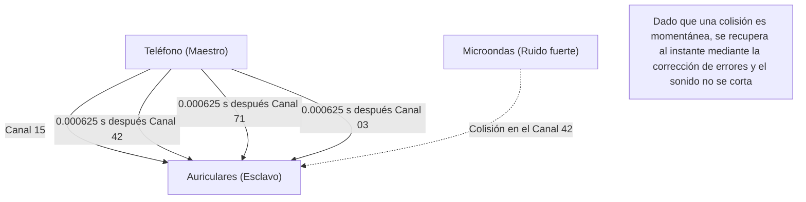

## 1. Liberación de los cables

Auriculares, ratones, teclados, relojes inteligentes, sistemas de navegación GPS. Muchos de los dispositivos digitales a nuestro alrededor ya no tienen cables y están conectados por un cable invisible mágico llamado "Bluetooth".

Si el Wi-Fi es la "arteria principal de Internet" que envía grandes cantidades de datos a largas distancias a alta velocidad, el Bluetooth es como los "vasos capilares" que conectan fácilmente los dispositivos cercanos con bajo consumo de energía. Sin embargo, en entornos donde innumerables dispositivos Bluetooth se cruzan, como en áreas urbanas o trenes abarrotados, ¿por qué nuestro teléfono y auriculares no sufren de "interferencias" y logran entregarnos solo nuestro sonido?

Allí se esconde una asombrosa tecnología de comunicación que utiliza hábilmente las propiedades físicas de las ondas de radio.

## 2. El "campo de batalla" de la banda de 2,4 GHz

Las ondas de radio que utiliza el Bluetooth para comunicarse son ondas electromagnéticas con una frecuencia llamada "**banda de 2,4 GHz (gigahercios)**".
Esta banda de 2,4 GHz está abierta como una "banda ISM (Banda industrial, científica y médica)" que cualquiera en el mundo puede usar libremente sin tener una licencia.

Por lo tanto, aunque es muy conveniente, también se ha convertido en un feroz "campo de batalla".
Entre los dispositivos que utilizan la misma banda de 2,4 GHz se incluyen el Wi-Fi (LAN inalámbrica), teléfonos inalámbricos, los dongles propios de ratones inalámbricos y hasta los **hornos microondas**. Las microondas que emite un horno microondas para calentar el agua de los alimentos también se encuentran en la banda de 2,4 GHz (esta es la razón por la que el Wi-Fi o el Bluetooth se interrumpen cuando se usa un horno microondas).

En un espacio donde vuelan tantas ondas de radio, ¿cómo asegura el Bluetooth la seguridad y estabilidad de la comunicación? La respuesta es el "**salto de frecuencia (Frequency Hopping)**".

## 3. "Salto de frecuencia (FHSS)" para prevenir interferencias

El Bluetooth divide el ancho de la banda de 2,4 GHz (exactamente de 2,402 GHz a 2,480 GHz) en **79 canales pequeños** de 1 MHz cada uno.

Si la comunicación se mantuviera fija en un solo canal (por ejemplo, 2,410 GHz), en el momento en que casualmente se superpusieran fuertes ondas de radio de otro Wi-Fi o el ruido de un microondas, la comunicación se ahogaría.

Por eso, el Bluetooth se comunica cambiando rápidamente de canal (saltando) a la asombrosa velocidad de **1600 veces por segundo**. A esto se le llama "espectro ensanchado por salto de frecuencia (FHSS)".

Será más fácil de entender si lo comparamos con las teclas de un piano (79 canales).
Se envía el mensaje como si fuera código Morse, golpeando las teclas al azar 1600 veces por segundo, como "Do, Mi, Sol, La, Do, Fa...".
Incluso si el ruido del microondas aplasta fuertemente la tecla "Mi", solo se corrompen los datos en el momento de "Mi" (1/1600 de segundo), pero la gran mayoría de los datos enviados en otros canales llegan intactos. Dado que la pequeña cantidad de datos corruptos se restaura instantáneamente mediante la corrección de errores de procesamiento digital, nuestros oídos no sienten que "el sonido se cortó".

### Salto de frecuencia adaptativo (AFH)
Además, a partir de Bluetooth v1.2, se introdujo una tecnología llamada "AFH (Adaptive Frequency Hopping)".
Se trata de un mecanismo inteligente que aprende y excluye de la lista los canales que el Wi-Fi y otros dispositivos usan constantemente y que se consideran "ruidosos", y elige saltar solo a los "canales limpios" con poco ruido. Gracias a esto, el Bluetooth moderno ha adquirido una estabilidad increíble.

## 4. Emparejamiento: La danza secreta entre maestro y esclavo

Cuando compramos un nuevo dispositivo Bluetooth, siempre realizamos primero el "emparejamiento".
Este emparejamiento, desde un punto de vista físico, es "un ritual en el que se comparte en secreto el orden de salto (patrón) entre los dos dispositivos".

En la comunicación Bluetooth, siempre existe una relación maestro-esclavo.
* **Maestro (Master)**: El lado que controla la comunicación, como un teléfono o una computadora.
* **Esclavo (Slave)**: El lado controlado, como unos auriculares o un ratón.

Una vez completado el emparejamiento, el dispositivo maestro le enseña al esclavo su "reloj (clock)" y su "ID única (dirección Bluetooth)".
El Bluetooth introduce esta "ID del maestro" y la "hora actual del reloj del maestro" en una compleja fórmula (algoritmo) para calcular el número del siguiente canal (del 1 al 79) al que debe saltar.

Como el maestro y el esclavo comparten la misma ID y reloj, pueden cambiar de canal sincronizando el tiempo perfectamente en unidades de 1/1600 de segundo, diciendo "el siguiente es el canal 42", "y luego el 71", sin tener que consultarlo entre ellos.
Otros teléfonos y auriculares ajenos tienen diferentes IDs y relojes, por lo que saltan en un patrón aleatorio completamente distinto. Por eso, incluso en un tren abarrotado, nunca hay interferencias.

## 5. Historia de la invención: Una actriz de Hollywood y un torpedo

Las raíces de esta tecnología extremadamente avanzada llamada "salto de frecuencia" se remontan sorprendentemente a la Segunda Guerra Mundial.

Sus inventores son la actriz de Hollywood Hedy Lamarr, que en ese momento era llamada "el rostro más bello del mundo", y el compositor George Antheil.
Para evitar que los torpedos de las fuerzas aliadas se desviaran de su trayectoria debido a las interferencias de radio enemigas (jamming), ella se inspiró en el mecanismo de los pianos automáticos (rollos) y tuvo la idea de que "si la frecuencia de comunicación se cambia sucesivamente según un patrón cifrado, el enemigo no podrá aplicar ondas de interferencia".

Aunque esta patente estaba demasiado adelantada a su tiempo y no fue adoptada por el ejército en ese momento, más tarde se desarrolló como tecnología de comunicación militar durante la Guerra Fría, y luego se aplicó al uso civil convirtiéndose en la tecnología base del Bluetooth y el Wi-Fi actuales.

## 6. La revolución del IoT con BLE (Bluetooth Low Energy)

Aunque el Bluetooth ha seguido evolucionando durante muchos años, el mayor punto de inflexión fue la introducción del "**BLE (Bluetooth Low Energy)**" en el Bluetooth 4.0 en 2010.

El Bluetooth tradicional (Classic) era adecuado para la reproducción de música de alta calidad, pero su punto débil era el alto consumo de batería. BLE es un estándar de comunicación rediseñado específicamente para "enviar una cantidad muy pequeña de datos, con muy poca energía, en solo un instante".

Gracias al BLE, las comunicaciones de los dispositivos del IoT (Internet de las cosas), como los datos de frecuencia cardíaca de los relojes inteligentes, los resultados de medición de los termómetros y la información de ubicación de las etiquetas de prevención de pérdidas (como AirTag), ahora pueden funcionar durante "meses o años con una sola pila de botón".

El Bluetooth ha dejado de ser un simple "cable inalámbrico" y actualmente sigue evolucionando de forma silenciosa pero segura como una infraestructura para tejer digitalmente el espacio físico, como medir distancias en el espacio (información de ubicación de alta precisión) o crear redes de malla para controlar la iluminación de todo un edificio.
