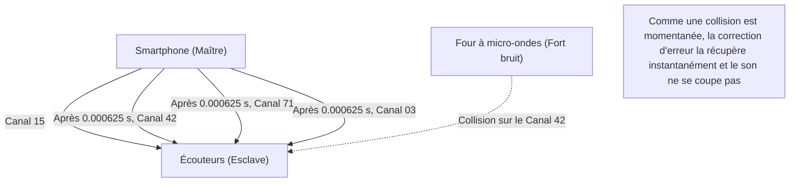

## 1. La libération des câbles

Écouteurs, souris, claviers, montres intelligentes, systèmes de navigation automobile. La plupart des appareils numériques qui nous entourent sont désormais dépourvus de câbles, reliés par une ligne invisible magique appelée « Bluetooth ».

Si le Wi-Fi est l'« artère d'Internet » qui envoie de grandes quantités de données à haute vitesse et sur de longues distances, le Bluetooth est comme un « capillaire » qui relie facilement des appareils à proximité en économisant de l'énergie. Cependant, dans des environnements tels que les zones urbaines ou les trains bondés, où d'innombrables appareils Bluetooth s'entrecroisent, pourquoi votre smartphone et vos écouteurs vous transmettent-ils votre propre son sans « interférence » ?

Derrière cela se cache une technologie de communication étonnante qui exploite habilement les propriétés physiques des ondes radio.

## 2. La bande des 2.4 GHz, une « zone de combat »

Les ondes radio utilisées pour la communication Bluetooth sont des ondes électromagnétiques d'une fréquence appelée « **bande de 2.4 GHz (gigahertz)** ».
Cette bande de 2.4 GHz est ouverte sous le nom de « bande ISM (Industrie, Science, Médical) », et tout le monde peut l'utiliser librement dans le monde entier sans licence.

Par conséquent, bien qu'elle soit très pratique, elle est devenue une « zone de combat » extrêmement disputée.
Parmi les autres appareils utilisant la même bande de 2.4 GHz, on trouve le Wi-Fi (réseau local sans fil), les téléphones sans fil, les dongles propriétaires de souris sans fil et même **les fours à micro-ondes**. Les micro-ondes émises par les fours à micro-ondes pour chauffer l'humidité des aliments se situent également dans la bande des 2.4 GHz (c'est pourquoi le Wi-Fi et le Bluetooth sont interrompus lors de l'utilisation d'un four à micro-ondes).

Comment le Bluetooth assure-t-il la sécurité et la stabilité des communications dans un espace où tant d'ondes radio volent dans tous les sens ? La réponse est le « **saut de fréquence (Frequency Hopping)** ».

## 3. Le « saut de fréquence (FHSS) » pour éviter les interférences

Le Bluetooth divise la largeur de la bande des 2.4 GHz (plus précisément de 2.402 GHz à 2.480 GHz) en **79 petits canaux** de 1 MHz chacun.

Si la communication était fixée sur un seul canal (par exemple 2.410 GHz), à l'instant où une forte onde radio d'un autre Wi-Fi ou le bruit d'un four à micro-ondes se superposerait par hasard, la communication serait étouffée.

Le Bluetooth communique donc en changeant (sautant) de canal à une vitesse effrénée de **1600 fois par seconde**. C'est ce qu'on appelle l'« étalement de spectre par saut de fréquence (FHSS) ».

Il est facile de comprendre cela en le comparant aux touches d'un piano (79 canaux).
Tout en frappant les touches au hasard 1600 fois par seconde, comme « Do, Mi, Sol, La, Do, Fa... », le message est envoyé comme en code Morse.
Même si le bruit du four à micro-ondes frappe violemment la touche « Mi », seules les données de ce moment précis du « Mi » (1/1600 de seconde) sont corrompues ; la majeure partie des données envoyées sur les autres canaux arrivera intacte. Les quelques données corrompues sont instantanément restaurées par une correction d'erreur numérique, de sorte que nos oreilles ne ressentent pas de « coupure de son ».

### Le saut de fréquence adaptatif (AFH)
De plus, la technologie « AFH (Adaptive Frequency Hopping) » a été introduite à partir de la version 1.2 du Bluetooth.
Il s'agit d'un mécanisme intelligent qui apprend et exclut de la liste les canaux jugés « bruyants » car constamment utilisés par le Wi-Fi, etc., et ne choisit de sauter que sur les « canaux propres » avec peu de bruit. Grâce à cela, le Bluetooth moderne a acquis une stabilité incroyable.

## 4. Appairage : la danse secrète du maître et de l'esclave

Lorsque nous achetons un nouvel appareil Bluetooth, nous effectuons toujours un « appairage » en premier.
D'un point de vue physique, cet appairage est un « rituel consistant à partager secrètement entre deux appareils l'ordre (le modèle) des sauts ».

Il y a toujours une relation maître-esclave dans la communication Bluetooth.
* **Maître (Master)** : le côté qui contrôle la communication, comme un smartphone ou un ordinateur.
* **Esclave (Slave)** : le côté contrôlé, comme des écouteurs ou une souris.

Une fois l'appairage terminé, l'appareil maître indique son « horloge » et son « ID unique (adresse Bluetooth) » à l'esclave.
Le Bluetooth intègre cette « ID du maître » et l'« heure actuelle de l'horloge du maître » dans une formule mathématique complexe (algorithme) pour calculer le numéro du canal suivant à sauter (de 1 à 79).

Étant donné que le maître et l'esclave partagent la même ID et la même horloge, ils peuvent changer de canal en synchronisant parfaitement leur chronométrage par incréments de 1/1600 de seconde, en disant « Le prochain est le canal 42 », puis « Le suivant est le 71 », sans se consulter.
D'autres smartphones et écouteurs non liés ont des ID et des horloges différents, ils sautent donc selon des motifs aléatoires complètement distincts. C'est pourquoi il n'y a absolument aucune interférence, même dans un train bondé.

## 5. L'histoire de l'invention : l'actrice d'Hollywood et la torpille

Les racines de cette technologie hautement sophistiquée qu'est le « saut de fréquence » remontent de manière surprenante à la Seconde Guerre mondiale.

Les inventeurs sont Hedy Lamarr, actrice hollywoodienne considérée à l'époque comme « le plus beau visage du monde », et le compositeur George Antheil.
Pour empêcher les torpilles alliées d'être déviées par le brouillage radio ennemi, elle s'est inspirée du mécanisme d'un piano automatique (rouleau) et a eu l'idée suivante : « Si nous changeons la fréquence de communication l'une après l'autre selon un modèle cryptographique, l'ennemi ne pourra pas appliquer de signaux de brouillage. »

Bien que ce brevet ait été trop en avance sur son temps et n'ait pas été adopté par l'armée à l'époque, il s'est ensuite développé en tant que technologie de communication militaire pendant la guerre froide. Plus tard, il a été adapté pour un usage civil et est devenu la technologie fondatrice du Bluetooth et du Wi-Fi actuels.

## 6. La révolution de l'IoT par le BLE (Bluetooth Low Energy)

Le Bluetooth a continué d'évoluer au fil des ans, mais l'introduction du « **BLE (Bluetooth Low Energy)** » dans le Bluetooth 4.0 en 2010 a été un tournant majeur.

Le Bluetooth traditionnel (Classic) convenait à la lecture de musique de haute qualité, mais sa faiblesse était une consommation élevée de la batterie. Le BLE est une norme de communication repensée et spécialisée dans l'« envoi de très petites quantités de données, avec très peu d'énergie, pour un instant seulement ».

Grâce au BLE, les communications des appareils de l'IoT (Internet des objets), telles que les données de fréquence cardiaque des montres intelligentes, les résultats de mesure des thermomètres et les informations de localisation des balises anti-perte (comme l'AirTag), peuvent désormais fonctionner pendant « plusieurs mois à plusieurs années avec une seule pile bouton ».

Le Bluetooth a terminé son rôle de simple « câble sans fil » et continue aujourd'hui d'évoluer de manière silencieuse mais certaine en tant qu'infrastructure permettant de tisser numériquement l'espace réel, par exemple en mesurant des distances spatiales (informations de localisation très précises) ou en formant des réseaux maillés pour contrôler l'éclairage de tout un bâtiment.
