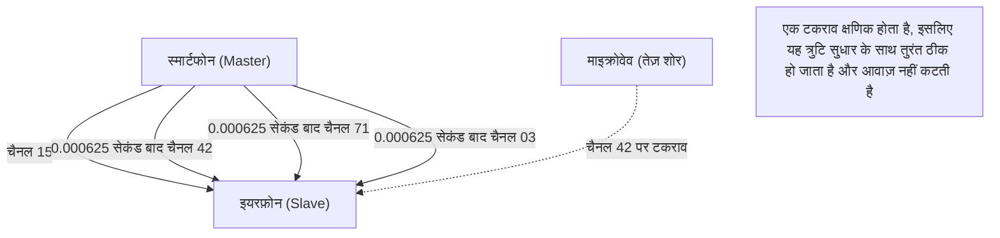

## 1. केबल्स से मुक्ति

इयरफ़ोन, माउस, कीबोर्ड, स्मार्टवॉच और कार नेविगेशन सिस्टम। हमारे आस-पास के कई डिजिटल उपकरण अब केबल से मुक्त हैं और "ब्लूटूथ (Bluetooth)" नामक एक जादुई अदृश्य रेखा से जुड़े हुए हैं।

अगर वाई-फाई "इंटरनेट की मुख्य धमनी" है जो बड़ी मात्रा में डेटा को उच्च गति से दूर तक भेजती है, तो ब्लूटूथ "केशिकाओं" (capillaries) की तरह है जो आस-पास के उपकरणों को कम बिजली की खपत के साथ आसानी से जोड़ता है। लेकिन, शहरी क्षेत्रों या भीड़भाड़ वाली ट्रेनों में जहां अनगिनत ब्लूटूथ डिवाइस काम कर रहे होते हैं, ऐसा क्यों है कि आपका स्मार्टफोन और इयरफ़ोन बिना किसी "हस्तक्षेप" के केवल आपको ही आवाज़ पहुंचाते हैं?

इसके पीछे एक अद्भुत संचार तकनीक छिपी हुई है जो रेडियो तरंगों के भौतिक गुणों का बड़ी चतुराई से उपयोग करती है।

## 2. 2.4GHz बैंड: एक "अत्यधिक प्रतिस्पर्धी क्षेत्र"

ब्लूटूथ संचार के लिए जिन रेडियो तरंगों का उपयोग करता है, वे "**2.4GHz बैंड (गीगाहर्ट्ज बैंड)**" नामक आवृत्ति वाली विद्युत चुम्बकीय तरंगें हैं।
यह 2.4GHz बैंड "ISM बैंड (Industry, Science, Medical band)" के रूप में खुला है, जिसका दुनिया भर में कोई भी व्यक्ति बिना लाइसेंस के स्वतंत्र रूप से उपयोग कर सकता है।

इसलिए, हालांकि यह उपयोग करने में बहुत सुविधाजनक है, यह एक अत्यंत "प्रतिस्पर्धी क्षेत्र" भी बन गया है।
2.4GHz बैंड का उपयोग करने वाले अन्य उपकरणों में वाई-फाई (वायरलेस LAN), कॉर्डलेस फोन, वायरलेस माउस के कस्टम डोंगल, और यहां तक कि **माइक्रोवेव ओवन** भी शामिल हैं। भोजन में पानी को गर्म करने के लिए माइक्रोवेव ओवन द्वारा उत्सर्जित माइक्रोवेव भी वास्तव में 2.4GHz बैंड में ही होते हैं (यही कारण है कि जब आप माइक्रोवेव ओवन का उपयोग करते हैं तो वाई-फाई और ब्लूटूथ कनेक्शन कट सकते हैं)।

ऐसे स्थान पर जहां इतनी सारी रेडियो तरंगें चारों ओर उड़ रही हैं, ब्लूटूथ संचार की सुरक्षा और स्थिरता कैसे सुनिश्चित करता है? इसका उत्तर "**फ्रीक्वेंसी हॉपिंग (Frequency Hopping)**" है।

## 3. हस्तक्षेप को रोकने के लिए "फ्रीक्वेंसी हॉपिंग (FHSS)"

ब्लूटूथ 2.4GHz बैंड (सटीक रूप से, 2.402GHz से 2.480GHz) की चौड़ाई को 1MHz की वेतन वृद्धि में **79 छोटे चैनलों** में विभाजित करता है।

यदि यह केवल एक निश्चित चैनल (उदाहरण के लिए 2.410GHz) पर संचार कर रहा है, तो संचार उस क्षण बाधित हो जाएगा जब कोई अन्य मजबूत वाई-फाई सिग्नल या माइक्रोवेव शोर गलती से उस पर हावी हो जाता है।

इसलिए, ब्लूटूथ **प्रति सेकंड 1600 बार** की तेज़ गति से उपयोग किए जाने वाले चैनलों को तेज़ी से स्विच (हॉपिंग) करके संचार करता है। इसे "फ्रीक्वेंसी हॉपिंग स्प्रेड स्पेक्ट्रम (FHSS)" कहा जाता है।

इसे पियानो के कीबोर्ड (79 चैनल) की तुलना करके समझना आसान होगा।
यह एक मोर्स कोड की तरह संदेश भेज रहा है, जहां यह प्रति सेकंड 1600 बार यादृच्छिक रूप से कुंजियों को "डो-मी-सो-ला-डो-फा..." की तरह दबाता है।
भले ही माइक्रोवेव का शोर "मी" कुंजी को जोर से कुचलता है, केवल "मी" (1/1600 सेकंड) के समय का डेटा नष्ट होता है, और अन्य चैनलों पर भेजा गया अधिकांश डेटा बरकरार रहता है। दूषित हुए थोड़े से डेटा को डिजिटल प्रोसेसिंग के माध्यम से त्रुटि सुधार द्वारा तुरंत बहाल किया जाता है, इसलिए हमारे कानों को "ध्वनि कट गई" ऐसा महसूस नहीं होता है।

### एडेप्टिव फ्रीक्वेंसी हॉपिंग (AFH)
इसके अलावा, ब्लूटूथ v1.2 से "AFH (Adaptive Frequency Hopping)" नामक तकनीक पेश की गई थी।
यह एक स्मार्ट तंत्र है जो यह सीखता है कि वाई-फाई आदि द्वारा लगातार किन चैनलों का उपयोग किया जा रहा है और उन्हें "काफी शोर" माना जाता है, उन्हें सूची से हटा देता है, और हॉप करने के लिए केवल "स्वच्छ चैनल" चुनता है जिनमें कम शोर होता है। नतीजतन, आधुनिक ब्लूटूथ ने अविश्वसनीय स्थिरता प्राप्त की है।

## 4. पेयरिंग: मास्टर और स्लेव का गुप्त नृत्य

जब हम एक नया ब्लूटूथ डिवाइस खरीदते हैं, तो सबसे पहले हम हमेशा "पेयरिंग" करते हैं।
भौतिक दृष्टिकोण से, यह पेयरिंग "दो उपकरणों के बीच हॉपिंग के क्रम (पैटर्न) को गुप्त रूप से साझा करने की रस्म" है।

ब्लूटूथ संचार में हमेशा एक मास्टर-स्लेव संबंध मौजूद होता है।
* **मास्टर (Master)**: स्मार्टफोन या कंप्यूटर जैसे उपकरण, जो संचार को नियंत्रित करते हैं
* **स्लेव (Slave)**: इयरफ़ोन या माउस जैसे उपकरण, जिन्हें नियंत्रित किया जाता है

एक बार पेयरिंग पूरी हो जाने पर, मास्टर डिवाइस स्लेव को अपना "घड़ी (क्लॉक)" और "अद्वितीय आईडी (ब्लूटूथ एड्रेस)" बताता है।
ब्लूटूथ इस "मास्टर की आईडी" और "मास्टर की घड़ी के वर्तमान समय" को एक जटिल सूत्र (एल्गोरिदम) में डालता है और उस चैनल की संख्या (1-79) की गणना करता है जिस पर उसे अगला कूदना चाहिए।

चूंकि मास्टर और स्लेव समान आईडी और घड़ी साझा करते हैं, वे आपस में बिना बात किए 1/1600 सेकंड के सटीक समय के साथ चैनलों को बदल सकते हैं, जैसे "अगला चैनल 42 है" और "उसके बाद 71"।
अन्य असंबद्ध स्मार्टफोन और इयरफ़ोन में अलग-अलग आईडी और घड़ियां होती हैं, इसलिए वे पूरी तरह से अलग यादृच्छिक पैटर्न में हॉपिंग कर रहे होते हैं। यही कारण है कि भीड़भाड़ वाली ट्रेनों में भी कभी कोई हस्तक्षेप नहीं होता है।

## 5. आविष्कार का इतिहास: हॉलीवुड अभिनेत्री और टारपीडो

आश्चर्यजनक रूप से, इस अत्यधिक उन्नत तकनीक "फ्रीक्वेंसी हॉपिंग" की जड़ें द्वितीय विश्व युद्ध से जुड़ी हैं।

इसके आविष्कारक हॉलीवुड अभिनेत्री हेडी लैमर (Hedy Lamarr), जिन्हें उस समय "दुनिया का सबसे खूबसूरत चेहरा" कहा जाता था, और संगीतकार जॉर्ज एंथील थे।
मित्र देशों के टारपीडो को दुश्मन के रेडियो हस्तक्षेप (जैमिंग) द्वारा मार्ग से भटकने से रोकने के लिए, उन्होंने एक स्वचालित पियानो प्लेयर (रोल) के तंत्र से प्रेरणा ली। उन्हें यह विचार आया कि "यदि संचार आवृत्ति को एक एन्क्रिप्टेड पैटर्न के अनुसार लगातार बदला जाता है, तो दुश्मन हस्तक्षेप करने वाली रेडियो तरंगें नहीं भेज पाएगा।"

हालाँकि यह पेटेंट उस समय से बहुत आगे था और सेना द्वारा इसे नहीं अपनाया गया था, लेकिन बाद में शीत युद्ध के दौरान इसे सैन्य संचार तकनीक के रूप में विकसित किया गया था। इसे अंततः नागरिक उपयोग के लिए अनुकूलित किया गया और यह आधुनिक ब्लूटूथ और वाई-फाई की मूलभूत तकनीक बन गया।

## 6. BLE (Bluetooth Low Energy) द्वारा IoT क्रांति

ब्लूटूथ कई वर्षों से विकसित हो रहा है, लेकिन 2010 में ब्लूटूथ 4.0 में पेश किया गया "**BLE (Bluetooth Low Energy)**" सबसे बड़ा टर्निंग पॉइंट था।

पारंपरिक ब्लूटूथ (क्लासिक) उच्च गुणवत्ता वाले संगीत प्लेबैक के लिए उपयुक्त था, लेकिन इसकी उच्च बैटरी खपत एक कमजोरी थी। BLE एक संचार मानक है जिसे विशेष रूप से "अत्यंत कम शक्ति के साथ और केवल एक पल के लिए बहुत कम मात्रा में डेटा भेजने" के लिए फिर से डिज़ाइन किया गया है।

स्मार्टवॉच के हृदय गति डेटा, थर्मामीटर के माप परिणाम, और एंटी-लॉस टैग (जैसे AirTag) के स्थान की जानकारी जैसे IoT ([इंटरनेट ऑफ थिंग्स](/hi/p/technology-iot/)) उपकरणों का संचार अब BLE की बदौलत "एक बटन बैटरी पर महीनों से लेकर वर्षों तक" चल सकता है।

ब्लूटूथ ने केवल एक "वायरलेस केबल" होने की अपनी भूमिका को पूरा कर लिया है, और अब यह भौतिक स्थानों को डिजिटल रूप से एक साथ जोड़ने के लिए एक बुनियादी ढांचे के रूप में चुपचाप लेकिन निश्चित रूप से विकसित हो रहा है। इसका उपयोग अब दूरियों को मापने (उच्च-परिशुद्धता स्थान की जानकारी) और पूरी इमारत की रोशनी को नियंत्रित करने के लिए मेश नेटवर्क बनाने के लिए किया जाता है।
