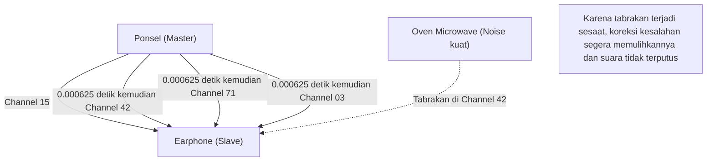

## 1. Pembebasan dari Kabel

Earphone, mouse, keyboard, smartwatch, navigasi mobil. Sebagian besar perangkat digital di sekitar kita saat ini sudah tidak menggunakan kabel, melainkan terhubung melalui jalur ajaib tak terlihat yang disebut "Bluetooth".

Jika Wi-Fi ibarat "pembuluh nadi utama internet" yang dapat mentransmisikan data dalam jumlah besar dengan kecepatan tinggi dan jarak jauh, maka Bluetooth seperti "pembuluh kapiler" yang menghubungkan perangkat-perangkat di dekat kita dengan mudah dan hemat daya. Namun, di lingkungan tempat perangkat Bluetooth yang tak terhitung jumlahnya beterbangan seperti di kawasan perkotaan atau di dalam kereta yang penuh sesak, mengapa ponsel dan earphone kita bisa menghantarkan suara yang hanya ditujukan kepada kita tanpa terjadi "interferensi"?

Di situlah tersembunyi teknologi komunikasi luar biasa yang dengan terampil memanfaatkan sifat fisik gelombang radio.

## 2. Medan Perang Sengit di Pita 2.4GHz

Gelombang radio yang digunakan Bluetooth untuk komunikasi adalah gelombang elektromagnetik dengan frekuensi yang disebut **pita 2.4GHz (Gigahertz)**.
Pita 2.4GHz ini terbuka sebagai "Pita ISM (Industry, Science, Medical)" yang dapat digunakan secara bebas oleh siapa saja di seluruh dunia tanpa perlu lisensi.

Oleh karena itu, meskipun sangat nyaman digunakan, pita ini juga menjadi "medan perang sengit" yang luar biasa.
Perangkat yang menggunakan pita 2.4GHz yang sama antara lain Wi-Fi (LAN nirkabel), telepon tanpa kabel (cordless phone), dongle khusus untuk mouse nirkabel, bahkan **oven microwave**. Gelombang mikro (microwave) yang dipancarkan oleh oven microwave untuk memanaskan kandungan air pada makanan nyatanya juga berada di pita 2.4GHz (inilah sebabnya koneksi Wi-Fi atau Bluetooth bisa terputus saat oven microwave sedang digunakan).

Di ruang tempat begitu banyak gelombang radio saling bersilangan, bagaimana Bluetooth memastikan keamanan dan stabilitas komunikasi? Jawabannya adalah **Lompatan Frekuensi (Frequency Hopping)**.

## 3. "Lompatan Frekuensi (FHSS)" untuk Mencegah Interferensi

Bluetooth membagi lebar pita 2.4GHz (tepatnya dari 2.402GHz hingga 2.480GHz) menjadi **79 saluran kecil** yang masing-masing berjarak 1MHz.

Jika komunikasi hanya terpaku pada satu saluran saja (misalnya 2.410GHz), komunikasi tersebut akan lenyap seketika bila kebetulan tertimpa oleh gelombang radio kuat dari Wi-Fi lain atau noise dari oven microwave.

Oleh karena itu, Bluetooth melakukan komunikasi sambil beralih (melompat) saluran yang digunakan secara terus-menerus dengan kecepatan luar biasa tinggi, yaitu **1600 kali per detik**. Ini disebut "Lompatan Frekuensi Spread Spectrum (FHSS)".

Ini akan mudah dipahami jika diibaratkan seperti tuts piano (79 saluran).
Pesan dikirim layaknya kode Morse sembari menekan tuts secara acak sebanyak 1600 kali dalam satu detik, seperti "Do-Mi-Sol-La-Do-Fa...".
Bahkan jika noise dari oven microwave menekan keras tuts "Mi" hingga hancur, hanya data pada waktu "Mi" (1/1600 detik) yang rusak, sedangkan sebagian besar data yang dikirim di saluran lain akan tiba tanpa masalah. Sedikit data yang rusak tersebut langsung dipulihkan melalui koreksi kesalahan (error correction) menggunakan pemrosesan digital, sehingga telinga kita tidak merasakan adanya "suara yang terputus".

### Lompatan Frekuensi Adaptif (AFH)
Lebih jauh lagi, sejak Bluetooth v1.2, sebuah teknologi yang disebut "AFH (Adaptive Frequency Hopping)" mulai diperkenalkan.
Ini merupakan mekanisme cerdas yang mempelajari saluran mana yang terus digunakan oleh Wi-Fi dan dinilai "banyak noise", kemudian mengeluarkannya dari daftar pilihan, dan hanya memilih "saluran bersih" yang minim noise untuk melompat. Berkat teknologi ini, Bluetooth modern telah meraih tingkat stabilitas yang luar biasa.

## 4. Pairing: Tarian Rahasia antara Master dan Slave

Ketika kita membeli perangkat Bluetooth baru, hal pertama yang pasti kita lakukan adalah "pairing" (pemasangan).
Dari sudut pandang fisik, pairing ini adalah "ritual berbagi urutan (pola) melompat secara rahasia antara kedua perangkat".

Dalam komunikasi Bluetooth, selalu ada hubungan tuan dan hamba (master dan slave).
* **Master**: Pihak yang mengendalikan komunikasi, seperti ponsel pintar atau komputer
* **Slave**: Pihak yang dikendalikan, seperti earphone atau mouse

Ketika pairing selesai, perangkat master memberi tahu slave tentang "jam (clock)" miliknya dan "ID unik (Alamat Bluetooth)".
Bluetooth memasukkan "ID master" dan "waktu saat ini pada jam master" ini ke dalam rumus perhitungan rumit (algoritma) untuk menghitung nomor saluran (1-79) mana yang harus dituju selanjutnya.

Karena master dan slave membagikan ID dan jam yang sama, mereka dapat beralih saluran dengan mensinkronkan waktu secara sempurna setiap 1/1600 detik, seperti "selanjutnya saluran 42", lalu "selanjutnya 71", tanpa harus berunding satu sama lain.
Ponsel dan earphone lain yang tidak saling terkait memiliki ID dan jam yang berbeda, sehingga mereka melompat dengan pola acak yang sama sekali berbeda. Itulah sebabnya tidak akan pernah ada interferensi bahkan di dalam kereta yang padat sekalipun.

## 5. Sejarah Penemuan: Aktris Hollywood dan Torpedo

Asal usul teknologi "Lompatan Frekuensi" yang sangat canggih ini ternyata secara mengejutkan dapat ditelusuri kembali ke masa Perang Dunia II.

Penemunya adalah aktris Hollywood Hedy Lamarr, yang saat itu disebut-sebut memiliki "wajah tercantik di dunia", bersama dengan komposer George Antheil.
Untuk mencegah torpedo pasukan Sekutu keluar dari jalurnya akibat gangguan sinyal radio (jamming) dari musuh, dia mendapat ide dari mekanisme piano otomatis (roll) dan berpikir, "Jika kita terus mengubah frekuensi komunikasi secara berurutan menyesuaikan dengan pola rahasia, musuh tidak akan dapat mengenai kita dengan gelombang radio pengganggu."

Paten ini pada saat itu dianggap terlalu maju untuk zamannya sehingga tidak diadopsi oleh militer, tetapi paten ini kemudian berkembang sebagai teknologi komunikasi militer selama Perang Dingin, dan pada akhirnya dialihkan untuk penggunaan sipil dan menjadi teknologi dasar bagi Bluetooth dan Wi-Fi saat ini.

## 6. Revolusi IoT berkat BLE (Bluetooth Low Energy)

Bluetooth telah terus berevolusi selama bertahun-tahun, namun pengenalan **BLE (Bluetooth Low Energy)** pada Bluetooth 4.0 tahun 2010 menjadi titik balik terbesarnya.

Bluetooth konvensional (Classic) cocok untuk pemutaran musik berkualitas tinggi, tetapi kelemahannya adalah baterai yang cepat habis. BLE merupakan standar komunikasi yang dirancang ulang secara khusus untuk "mengirimkan data dalam jumlah sangat kecil, dengan daya yang sangat sedikit, dan hanya dalam sekejap."

Komunikasi untuk perangkat IoT (Internet of Things), seperti data detak jantung pada smartwatch, hasil pengukuran dari termometer, dan informasi lokasi dari tag pelacak (seperti AirTag), kini dapat beroperasi selama "berbulan-bulan hingga bertahun-tahun hanya dengan satu baterai kancing" berkat BLE.

Bluetooth telah melampaui perannya yang hanya sekadar "kabel nirkabel", dan saat ini terus berkembang secara diam-diam namun pasti sebagai infrastruktur yang merajut dunia nyata secara digital, seperti untuk mengukur jarak ruang (informasi lokasi berpresisi tinggi) atau membangun jaringan mesh untuk mengendalikan pencahayaan di seluruh gedung.
