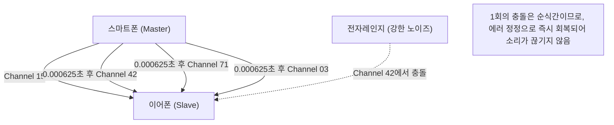

## 1. 케이블로부터의 해방

이어폰, 마우스, 키보드, 스마트워치, 내비게이션. 우리 주변에 있는 디지털 기기의 대부분은 이제 케이블 없이 '블루투스(Bluetooth)'라는 마법의 보이지 않는 선으로 연결되어 있습니다.

Wi-Fi가 대량의 데이터를 빠른 속도로 멀리까지 날려 보내는 '인터넷의 대동맥'이라면, 블루투스는 바로 근처에 있는 기기끼리 적은 전력으로 간편하게 연결하는 '모세혈관'과 같은 존재입니다. 하지만 도심이나 만원 전철 안 등, 무수한 블루투스 기기가 난무하는 환경에서 왜 내 스마트폰과 이어폰은 '혼선' 없이 나만의 소리를 전달해 주는 것일까요?

거기에는 전파의 물리적 성질을 교묘하게 이용한 놀라운 통신 기술이 숨겨져 있습니다.

## 2. 2.4GHz 대역이라는 '격전지'

블루투스가 통신에 사용하는 전파는 「 **2.4GHz 대역(기가헤르츠 대역)** 」이라고 불리는 주파수의 전자기파입니다.
이 2.4GHz 대역은 면허가 없어도 전 세계 누구나 자유롭게 사용할 수 있는 'ISM 대역(Industry, Science, Medical band)'으로 개방되어 있습니다.

그렇기 때문에 매우 사용하기 편리한 반면, 엄청난 '격전지'가 되어 있습니다.
같은 2.4GHz 대역을 사용하는 기기에는 Wi-Fi(무선 LAN), 무선 전화기, 무선 마우스의 전용 동글, 심지어 **전자레인지** 까지도 포함됩니다. 전자레인지가 식품의 수분을 데우기 위해 방출하는 마이크로파도 사실 2.4GHz 대역입니다(전자레인지를 사용할 때 Wi-Fi나 블루투스가 끊기는 것은 이 때문입니다).

이렇게 수많은 전파가 어지럽게 날아다니는 공간에서 블루투스는 어떻게 통신의 안전과 안정성을 확보하고 있는 것일까요? 그 해답이 「 **주파수 호핑(Frequency Hopping)** 」입니다.

## 3. 혼선을 막는 '주파수 호핑(FHSS)'

블루투스는 2.4GHz 대역(정확히는 2.402GHz에서 2.480GHz)의 폭을 1MHz씩 **79개의 세밀한 채널** 로 분할하고 있습니다.

만약 1개의 채널(예를 들어 2.410GHz)에만 고정하여 통신을 한다면, 거기에 우연히 다른 Wi-Fi의 강한 전파나 전자레인지의 노이즈가 겹치는 순간 통신은 지워져 버립니다.

그래서 블루투스는 **1초에 1600번** 이라는 맹렬한 속도로, 사용할 채널을 계속해서 전환(호핑)하며 통신을 수행합니다. 이를 '주파수 호핑 대역 확산(FHSS)'이라고 부릅니다.

피아노 건반(79개의 채널)에 비유하면 이해하기 쉬울 것입니다.
"도·미·솔·라·도·파…" 하며 1초에 1600번이나 건반을 무작위로 두드리면서 메시지를 모스 부호처럼 보내고 있는 것입니다.
설령 전자레인지의 노이즈가 '미' 건반을 강하게 내리친다고 해도, '미'의 타이밍(1/1600초)의 데이터가 깨질 뿐, 다른 채널에서 보내지는 대부분의 데이터는 무사히 도착합니다. 깨진 약간의 데이터는 디지털 처리로 인한 에러 정정을 통해 순식간에 복원되기 때문에 우리의 귀에는 '소리가 끊겼다'고 느껴지지 않는 것입니다.

### 적응형 주파수 호핑 (AFH)
게다가 블루투스 v1.2부터는 'AFH(Adaptive Frequency Hopping)'라는 기술이 도입되었습니다.
이것은 Wi-Fi 등이 항상 사용하고 있어서 '노이즈가 많다'고 판단한 채널을 학습하여 목록에서 제외하고, 노이즈가 적은 '깨끗한 채널'만 골라 호핑하는 똑똑한 시스템입니다. 이로 인해 현대의 블루투스는 믿을 수 없을 정도의 안정성을 확보하게 되었습니다.

## 4. 페어링: 마스터와 슬레이브의 비밀스러운 춤

우리가 새로운 블루투스 기기를 샀을 때, 가장 먼저 반드시 '페어링'을 수행합니다.
이 페어링이란 물리적인 관점에서 보면 '호핑하는 순서(패턴)를 두 기기 간에 비밀리에 공유하는 의식'입니다.

블루투스 통신에는 반드시 주종 관계가 존재합니다.
* **마스터(Master)**: 스마트폰이나 PC 등, 통신을 제어하는 측
* **슬레이브(Slave)**: 이어폰이나 마우스 등, 제어받는 측

페어링이 완료되면 마스터 기기는 자신의 '시계(클록)'와 '고유 ID(블루투스 주소)'를 슬레이브에게 알려줍니다.
블루투스는 이 '마스터의 ID'와 '마스터 시계의 현재 시각'을 복잡한 계산식(알고리즘)에 넣어, 다음으로 넘어가야 할 채널 번호(1~79)를 산출합니다.

마스터와 슬레이브는 같은 ID와 시계를 공유하고 있기 때문에 서로 상의할 필요 없이 "다음은 채널 42", "그 다음은 71"이라며 1/1600초 단위로 완벽하게 타이밍을 맞춰 채널을 전환할 수 있는 것입니다.
다른 무관한 스마트폰이나 이어폰은 다른 ID와 시계를 가지고 있기 때문에 전혀 다른 무작위 패턴으로 호핑하고 있습니다. 그렇기 때문에 만원 전철 안에서도 절대 혼선되지 않는 것입니다.

## 5. 발명의 역사: 할리우드 여배우와 어뢰

이토록 고도화된 '주파수 호핑'이라는 기술의 뿌리는 의외로 제2차 세계 대전 중으로 거슬러 올라갑니다.

발명가는 당시 '세계에서 가장 아름다운 얼굴'로 칭송받던 할리우드 여배우 헤디 라마(Hedy Lamarr)와 작곡가 조지 앤타일입니다.
그녀는 연합군의 어뢰가 적의 무선 방해(재밍)로 인해 궤도를 벗어나는 것을 막기 위해 피아노의 자동 연주 장치(롤) 구조에서 힌트를 얻어, "통신하는 주파수를 암호 패턴에 맞춰 차례로 바꾸면 적은 방해 전파를 맞출 수 없다"라는 아이디어를 떠올렸습니다.

이 특허는 당시에는 시대를 너무 앞서가 군에 채택되지 않았지만, 훗날 냉전 시대에 군사 통신 기술로 발전했고, 그것이 민간으로 전용되어 현재의 블루투스나 Wi-Fi의 기반 기술이 된 것입니다.

## 6. BLE (Bluetooth Low Energy) 로 인한 IoT 혁명

블루투스는 오랫동안 진화를 거듭해 왔지만, 2010년의 블루투스 4.0에서 도입된 「 **BLE (Bluetooth Low Energy)** 」가 최대의 전환점이 되었습니다.

기존의 블루투스(Classic)는 고음질 음악 재생 등에 적합했지만, 배터리 소모가 심한 것이 단점이었습니다. BLE는 "아주 적은 데이터를, 극히 적은 전력으로, 순식간에 보낸다"는 것에 특화되어 재설계된 통신 규격입니다.

스마트워치의 심박수 데이터, 체온계의 측정 결과, 분실 방지 태그(AirTag 등)의 위치 정보 등, IoT(사물 인터넷) 기기의 통신은 BLE 덕분에 '버튼 전지 1개로 수개월~수년'이나 가동할 수 있게 되었습니다.

블루투스는 단순한 '무선 케이블'의 역할을 끝내고, 현재는 공간의 거리를 측정하거나(고정밀 위치 정보), 메시 네트워크를 구성하여 빌딩 전체의 조명을 제어하는 등, 현실 공간을 디지털로 엮어내기 위한 인프라로서 조용하지만 확실하게 진화를 계속하고 있습니다.
