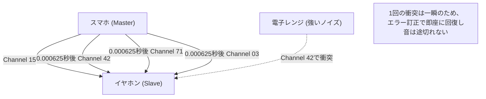

## 1. ケーブルからの解放

イヤホン、マウス、キーボード、スマートウォッチ、カーナビ。私たちの身の回りにあるデジタル機器の多くは、今やケーブルを持たず、「Bluetooth（ブルートゥース）」という魔法の見えない線で繋がっています。

Wi-Fiが大量のデータを高速で遠くまで飛ばす「インターネットの大動脈」だとしたら、Bluetoothはすぐ近くにある機器同士を省電力で手軽に繋ぐ「毛細血管」のような存在です。しかし、都市部や満員電車の中など、無数のBluetoothデバイスが飛び交う環境で、なぜ自分のスマホとイヤホンは「混信」せずに自分だけの音を届けてくれるのでしょうか。

そこには、電波の物理的性質を巧みに利用した驚くべき通信技術が隠されています。

## 2. 2.4GHz帯という「激戦区」

Bluetoothが通信に使用している電波は「**2.4GHz帯（ギガヘルツ帯）**」と呼ばれる周波数の電磁波です。
この2.4GHz帯は、免許を持たなくても世界中で誰でも自由に使える「ISMバンド（Industry, Science, Medical band）」として開放されています。

そのため、非常に使い勝手が良い反面、凄まじい「激戦区」となっています。
同じ2.4GHz帯を使っているものには、Wi-Fi（無線LAN）、コードレス電話、ワイヤレスマウスの独自ドングル、さらには**電子レンジ**までもが含まれます。電子レンジが食品の水分を温めるために放射するマイクロ波も、実は2.4GHz帯なのです（電子レンジを使っているとWi-FiやBluetoothが途切れるのはこのためです）。

これほど多くの電波が乱れ飛ぶ空間で、Bluetoothはどうやって通信の安全と安定性を確保しているのでしょうか。その答えが「**周波数ホッピング（Frequency Hopping）**」です。

## 3. 混信を防ぐ「周波数ホッピング（FHSS）」

Bluetoothは、2.4GHz帯（正確には2.402GHzから2.480GHz）の幅を、1MHzずつ **79個の細かなチャンネル**に分割しています。

もし1つのチャンネル（例えば 2.410GHz）だけに固定して通信を行っていると、そこに偶然別のWi-Fiの強い電波や電子レンジのノイズが重なった瞬間、通信はかき消されてしまいます。

そこでBluetoothは、**1秒間に1600回**という猛烈なスピードで、使うチャンネルをコロコロと切り替え（ホッピング）ながら通信を行います。これを「周波数ホッピング・スペクトラム拡散（FHSS）」と呼びます。

ピアノの鍵盤（79個のチャンネル）に例えると分かりやすいでしょう。
「ド・ミ・ソ・ラ・ド・ファ…」と、1秒間に1600回も鍵盤をランダムに叩きながらメッセージをモールス信号のように送っているのです。
たとえ電子レンジのノイズが「ミ」の鍵盤を強く叩き潰したとしても、「ミ」のタイミング（1/1600秒）のデータが壊れるだけで、他のチャンネルで送られる大部分のデータは無傷で届きます。壊れたわずかなデータは、デジタル処理によるエラー訂正で瞬時に復元されるため、私たちの耳には「音が途切れた」とは感じられないのです。

### 適応型周波数ホッピング (AFH)
さらにBluetooth v1.2からは「AFH（Adaptive Frequency Hopping）」という技術が導入されました。
これは、Wi-Fiなどが常に使っていて「ノイズが多い」と判断したチャンネルを学習してリストから除外し、ノイズが少ない「綺麗なチャンネル」だけを選んでホッピングする賢い仕組みです。これにより、現代のBluetoothは信じられないほどの安定性を獲得しました。

## 4. ペアリング：マスターとスレーブの秘密のダンス

私たちが新しいBluetooth機器を買ったとき、最初に必ず「ペアリング」を行います。
このペアリングとは、物理的な視点で見ると「ホッピングする順番（パターン）を2台の間で秘密裏に共有する儀式」です。

Bluetoothの通信には、必ず主従関係が存在します。
* **マスター（Master）**：スマホやパソコンなど、通信を制御する側
* **スレーブ（Slave）**：イヤホンやマウスなど、制御される側

ペアリングが完了すると、マスターデバイスは自分の「時計（クロック）」と「固有のID（Bluetoothアドレス）」をスレーブに教えます。
Bluetoothは、この「マスターのID」と「マスターの時計の現在時刻」を複雑な計算式（アルゴリズム）に入れ、次に飛ぶべきチャンネルの番号（1〜79）を算出します。

マスターとスレーブは同じIDと時計を共有しているため、互いに相談することなく「次はチャンネル42」「その次は71」と、1/1600秒単位で完全にタイミングを合わせてチャンネルを切り替えることができるのです。
他の無関係なスマホやイヤホンは、違うIDと時計を持っているため、全く違うデタラメなパターンでホッピングしています。だからこそ、満員電車の中でも絶対に混信しないのです。

## 5. 発明の歴史：ハリウッド女優と魚雷

この極めて高度な「周波数ホッピング」という技術のルーツは、意外なことに第二次世界大戦中にまで遡ります。

発明者は、当時「世界で最も美しい顔」と称されたハリウッド女優のヘディ・ラマー（Hedy Lamarr）と、作曲家のジョージ・アンタイルです。
彼女は、連合軍の魚雷が敵の無線妨害（ジャミング）によって軌道を狂わされるのを防ぐため、ピアノの自動演奏装置（ロール）の仕組みからヒントを得て、「通信する周波数を暗号パターンに合わせて次々と変えれば、敵は妨害電波を当てられない」というアイデアを思いつきました。

この特許は当時は時代を先取りしすぎており軍に採用されませんでしたが、後に冷戦下で軍事通信技術として発展し、それが民間転用されて現在のBluetoothやWi-Fiの基盤技術となったのです。

## 6. BLE (Bluetooth Low Energy) によるIoT革命

Bluetoothは長年進化を続けてきましたが、2010年のBluetooth 4.0で導入された「**BLE (Bluetooth Low Energy)**」が最大のターニングポイントとなりました。

従来のBluetooth（Classic）は、高音質の音楽再生などに適していましたが、バッテリー消費が激しいのが弱点でした。BLEは、「ごくわずかなデータを、極めて少ない電力で、一瞬だけ送る」ことに特化して再設計された通信規格です。

スマートウォッチの心拍数データ、体温計の測定結果、紛失防止タグ（AirTagなど）の[位置情報](/p/technology-gps/)など、IoT（[モノのインターネット](/p/technology-iot/)）機器の通信は、BLEのおかげで「ボタン電池1個で数ヶ月〜数年」も稼働できるようになりました。

Bluetoothは単なる「無線ケーブル」の役割を終え、現在では空間の距離を測ったり（高精度な[位置情報](/p/technology-gps/)）、メッシュネットワークを組んでビル全体の照明を制御したりと、現実空間をデジタルで編み上げるためのインフラとして、静かに、しかし確実に進化を続けています。