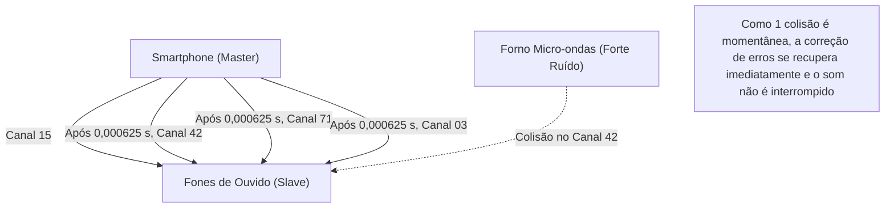

## 1. A Libertação dos Cabos

Fones de ouvido, mouses, teclados, smartwatches, sistemas de navegação automotiva. Muitos dos dispositivos digitais ao nosso redor agora não possuem cabos e estão conectados por uma linha mágica invisível chamada "Bluetooth".

Se o Wi-Fi é a "artéria da internet" que transmite grandes quantidades de dados em alta velocidade para longe, o Bluetooth é como um "capilar" que conecta facilmente e com baixo consumo de energia os dispositivos próximos. Mas em ambientes onde inúmeros dispositivos Bluetooth voam, como em áreas urbanas ou trens lotados, por que o seu smartphone e os seus fones de ouvido não sofrem "interferência" e transmitem apenas o seu som?

Existe uma tecnologia de comunicação incrível escondida ali que utiliza habilmente as propriedades físicas das ondas de rádio.

## 2. A "Zona de Batalha" da Banda de 2,4 GHz

As ondas de rádio que o Bluetooth usa para comunicação são ondas eletromagnéticas de frequência chamadas "**banda de 2,4 GHz (Gigahertz)**".
Essa banda de 2,4 GHz é aberta como "Banda ISM (Industrial, Científica e Médica)", a qual qualquer pessoa no mundo pode usar livremente sem licença.

Por isso, embora seja muito conveniente, tornou-se uma tremenda "zona de batalha".
As coisas que usam a mesma banda de 2,4 GHz incluem Wi-Fi (LAN sem fio), telefones sem fio, dongles proprietários de mouses sem fio e até **fornos micro-ondas**. As micro-ondas emitidas pelos fornos micro-ondas para aquecer a umidade dos alimentos também estão na banda de 2,4 GHz (é por isso que o Wi-Fi e o Bluetooth podem ser interrompidos ao usar o forno micro-ondas).

Com tantas ondas de rádio voando desordenadamente no espaço, como o Bluetooth garante a segurança e a estabilidade da comunicação? A resposta é o "**salto de frequência (Frequency Hopping)**".

## 3. Prevenindo Interferências com "Salto de Frequência (FHSS)"

O Bluetooth divide a largura da banda de 2,4 GHz (mais precisamente de 2,402 GHz a 2,480 GHz) em **79 pequenos canais** de 1 MHz cada.

Se a comunicação fosse fixada em apenas um canal (por exemplo, 2,410 GHz), no momento em que uma forte onda de rádio de outro Wi-Fi ou o ruído de um forno micro-ondas se sobrepusessem acidentalmente, a comunicação seria abafada.

Portanto, o Bluetooth se comunica enquanto muda (salta) os canais de uso em uma velocidade vertiginosa de **1600 vezes por segundo**. Isso é chamado de "Espectro de Dispersão por Salto de Frequência (FHSS)".

É fácil de entender se você comparar às teclas de um piano (79 canais).
As mensagens são enviadas como um código Morse, batendo aleatoriamente nas teclas 1600 vezes por segundo como "Dó, Mi, Sol, Lá, Dó, Fá...".
Mesmo que o ruído do forno micro-ondas atinja fortemente a tecla "Mi", apenas os dados no momento de "Mi" (1/1600 de segundo) serão destruídos, e a maior parte dos dados enviados nos outros canais chegará ilesa. A pequena quantidade de dados corrompidos é restaurada instantaneamente pela correção de erros através de processamento digital, de forma que nossos ouvidos não percebem que o "som foi interrompido".

### Salto de Frequência Adaptativo (AFH)
Além disso, a partir do Bluetooth v1.2, foi introduzida uma tecnologia chamada "AFH (Adaptive Frequency Hopping)".
Este é um mecanismo inteligente que aprende quais canais são constantemente usados pelo Wi-Fi, etc., os classifica como "barulhentos" e os exclui da lista, escolhendo apenas "canais limpos" com pouco ruído para o salto. Como resultado, o Bluetooth moderno alcançou uma estabilidade incrível.

## 4. Pareamento: A Dança Secreta do Master e do Slave

Quando compramos um novo dispositivo Bluetooth, sempre fazemos o "pareamento" primeiro.
O pareamento, de um ponto de vista físico, é "um ritual onde a ordem (padrão) de salto é compartilhada secretamente entre os dois dispositivos".

A comunicação Bluetooth sempre possui uma relação mestre-escravo.
* **Master (Mestre)**: O lado que controla a comunicação, como um smartphone ou PC
* **Slave (Escravo)**: O lado que é controlado, como fones de ouvido ou mouse

Quando o pareamento é concluído, o dispositivo Master informa ao Slave o seu "relógio (clock)" e "ID exclusivo (Endereço Bluetooth)".
O Bluetooth coloca este "ID do Master" e "hora atual do relógio do Master" em uma fórmula de cálculo complexa (algoritmo) para calcular o próximo número de canal a saltar (1 a 79).

Como o Master e o Slave compartilham o mesmo ID e relógio, eles podem alternar de canal com temporização perfeita em unidades de 1/1600 de segundo, como "O próximo é o canal 42" e "O próximo depois desse é o 71", sem precisarem consultar um ao outro.
Outros smartphones e fones de ouvido não relacionados possuem IDs e relógios diferentes, portanto saltam em padrões aleatórios completamente diferentes. É por isso que não há absolutamente nenhuma interferência mesmo em um trem lotado.

## 5. História da Invenção: Uma Atriz de Hollywood e Torpedos

As raízes dessa tecnologia de "salto de frequência" extremamente avançada remontam surpreendentemente à Segunda Guerra Mundial.

Os inventores foram a atriz de Hollywood Hedy Lamarr, chamada de "o rosto mais bonito do mundo" na época, e o compositor George Antheil.
Para evitar que os torpedos aliados fossem desviados do curso pelo bloqueio de rádio inimigo (jamming), ela se inspirou no mecanismo de pianos de reprodução automática (rolos) e teve a ideia: "Se as frequências de comunicação forem alteradas uma após a outra de acordo com um padrão de criptografia, o inimigo não conseguirá atingi-las com ondas de interferência".

Na época, essa patente estava muito à frente do seu tempo e não foi adotada pelos militares, mas depois se desenvolveu como uma tecnologia de comunicação militar durante a Guerra Fria e foi transferida para uso civil para se tornar a tecnologia fundamental para o Bluetooth e o Wi-Fi de hoje.

## 6. A Revolução da IoT pelo BLE (Bluetooth Low Energy)

O Bluetooth continuou a evoluir ao longo dos anos, mas o "**BLE (Bluetooth Low Energy)**" introduzido no Bluetooth 4.0 em 2010 foi o maior ponto de virada.

O Bluetooth tradicional (Classic) era adequado para reprodução de música de alta qualidade, etc., mas a sua fraqueza era o alto consumo de bateria. O BLE é um padrão de comunicação redesenhado especificamente para "enviar uma quantidade muito pequena de dados em um instante, com energia extremamente baixa".

Graças ao BLE, a comunicação para dispositivos IoT (Internet das Coisas), como dados de frequência cardíaca de smartwatches, resultados de medição de termômetros e informações de localização de tags antiperda (como AirTags), agora podem operar por "meses a anos com uma única bateria de célula tipo moeda".

O Bluetooth deixou de ser apenas um "cabo sem fio" e agora é usado para medir a distância no espaço (informações de localização de alta precisão) e formar redes em malha para controlar a iluminação de um edifício inteiro. Ele continua a evoluir silenciosamente, mas com firmeza, como uma infraestrutura para tecer digitalmente o mundo real.
