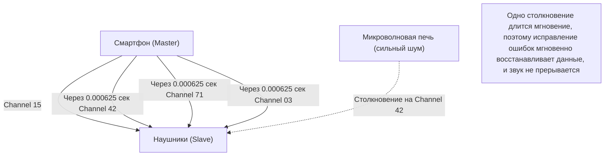

## 1. Освобождение от кабелей

Наушники, мыши, клавиатуры, умные часы, автомобильные навигаторы. Многие цифровые устройства вокруг нас теперь не имеют кабелей, они соединены невидимой волшебной нитью под названием "Bluetooth".

Если Wi-Fi — это "интернет-артерия", передающая огромные объемы данных на большие расстояния с высокой скоростью, то Bluetooth — это скорее "капилляр", легко и энергоэффективно соединяющий устройства, находящиеся в непосредственной близости. Но в таких местах, как города или переполненные поезда, где летают бесчисленные устройства Bluetooth, почему ваш смартфон и наушники передают звук без "перекрестных помех"?

За этим кроется удивительная технология связи, которая умело использует физические свойства радиоволн.

## 2. Поле битвы в диапазоне 2.4GHz

Радиоволны, используемые Bluetooth для связи, представляют собой электромагнитные волны с частотой, называемой диапазоном **2.4GHz (гигагерц)**.
Этот диапазон 2.4GHz открыт во всем мире как диапазон ISM (Industry, Science, Medical band), которым любой может пользоваться свободно, без лицензии.

Поэтому, будучи очень удобным, он стал невероятным "полем битвы".
К устройствам, использующим тот же диапазон 2.4GHz, относятся Wi-Fi (беспроводная локальная сеть), беспроводные телефоны, собственные адаптеры беспроводных мышей и даже **микроволновые печи**. Микроволны, излучаемые микроволновыми печами для нагрева влаги в пище, на самом деле также находятся в диапазоне 2.4GHz (именно поэтому Wi-Fi и Bluetooth отключаются, когда вы используете микроволновую печь).

Как Bluetooth обеспечивает безопасность и стабильность связи в пространстве, где летает так много радиоволн? Ответ — это **скачкообразная перестройка частоты (Frequency Hopping)**.

## 3. "Скачкообразная перестройка частоты (FHSS)" для предотвращения помех

Bluetooth делит ширину диапазона 2.4GHz (точнее, от 2.402GHz до 2.480GHz) на **79 узких каналов** по 1MHz.

Если бы для связи использовался только один фиксированный канал (например, 2.410GHz), в тот момент, когда сильные радиоволны другого Wi-Fi или шум от микроволновой печи случайно наложились бы на него, связь была бы потеряна.

Поэтому Bluetooth осуществляет связь, переключая (прыгая) используемые каналы с невероятной скоростью **1600 раз в секунду**. Это называется "Спектр, расширенный скачкообразной перестройкой частоты (FHSS)".

Это легко понять, если сравнить каналы с клавишами фортепиано (79 каналов).
Словно ударяя по клавишам случайным образом 1600 раз в секунду: "До, Ми, Соль, Ля, До, Фа...", он посылает сообщения, подобные азбуке Морзе.
Даже если шум микроволновой печи сильно "разобьет" клавишу "Ми", повредятся лишь данные в момент "Ми" (1/1600 секунды), а подавляющее большинство данных, переданных по другим каналам, дойдет невредимыми. Немногие поврежденные данные мгновенно восстанавливаются с помощью цифрового исправления ошибок, поэтому наши уши не чувствуют, что "звук прервался".

### Адаптивная скачкообразная перестройка частоты (AFH)
Кроме того, начиная с Bluetooth v1.2, была внедрена технология "AFH (Adaptive Frequency Hopping)".
Это умный механизм, который изучает и исключает из списка каналы, определяемые как "зашумленные", которые постоянно используются Wi-Fi и т. д., и выбирает для прыжков только "чистые каналы" с низким уровнем шума. Благодаря этому современный Bluetooth приобрел невероятную стабильность.

## 4. Сопряжение: тайный танец между мастером и ведомым

Когда мы покупаем новое устройство Bluetooth, мы всегда сначала выполняем "сопряжение" (Pairing).
С физической точки зрения это сопряжение представляет собой "ритуал тайного обмена порядком (паттерном) прыжков между двумя устройствами".

В связи Bluetooth всегда существует иерархия.
* **Мастер (Master)**: сторона, управляющая связью, например, смартфон или ПК.
* **Ведомый (Slave)**: управляемая сторона, например, наушники или мышь.

После завершения сопряжения главное устройство сообщает ведомому свои "часы" и "уникальный ID (Bluetooth-адрес)".
Bluetooth вставляет этот "ID мастера" и "текущее время часов мастера" в сложную формулу (алгоритм) для расчета номера канала (от 1 до 79), на который следует перейти следующим.

Поскольку мастер и ведомый имеют общие ID и часы, они могут идеально синхронизировать переключение каналов с шагом 1/1600 секунды, не консультируясь друг с другом, например: "Следующий канал 42", "Затем 71".
Другие не связанные смартфоны и наушники имеют разные ID и часы, поэтому они прыгают по совершенно разным, случайным паттернам. Именно поэтому никогда не возникает помех даже в переполненном поезде.

## 5. История изобретения: голливудская актриса и торпеда

Корни этой чрезвычайно сложной технологии "скачкообразной перестройки частоты", как ни удивительно, уходят во времена Второй мировой войны.

Изобретателями являются Хеди Ламарр (Hedy Lamarr), голливудская актриса, которую в то время называли "самым красивым лицом в мире", и композитор Джордж Антейл.
Чтобы предотвратить отклонение от курса торпед союзников из-за вражеских радиопомех (глушения), она черпала вдохновение в механизме автоматического фортепиано (валике) и придумала идею: "Если менять частоту связи одну за другой в соответствии с зашифрованным паттерном, враг не сможет нацелить глушащие радиоволны".

В то время этот патент слишком опередил свое время и не был принят на вооружение военными, но позже он был развит как технология военной связи во время холодной войны, а затем адаптирован для гражданского использования, став базовой технологией для современных Bluetooth и Wi-Fi.

## 6. Революция IoT благодаря BLE (Bluetooth Low Energy)

Bluetooth продолжал развиваться на протяжении многих лет, но "BLE (Bluetooth Low Energy)", представленный в Bluetooth 4.0 в 2010 году, стал главным поворотным моментом.

Традиционный Bluetooth (Classic) подходил для высококачественного воспроизведения музыки и т.д., но его слабым местом было высокое энергопотребление. BLE — это стандарт связи, переработанный для передачи "очень небольшого количества данных с крайне низким энергопотреблением и только на одно мгновение".

Благодаря BLE устройства IoT (Интернета вещей), такие как датчики частоты сердечных сокращений на умных часах, результаты измерений на термометрах и информация о местоположении на метках защиты от потери (например, AirTag), теперь могут "работать от нескольких месяцев до нескольких лет на одной батарейке таблеточного типа".

Завершив свою роль простого "беспроводного кабеля", Bluetooth сейчас продолжает тихо, но неуклонно развиваться как инфраструктура для цифрового сплетения физических пространств — измерения расстояний (высокоточное определение местоположения) или создания ячеистых сетей (mesh-сетей) для управления освещением во всем здании.
