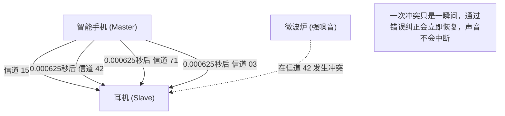

## 1. 摆脱线缆的束缚

耳机、鼠标、键盘、智能手表、车载导航。我们身边的大多数数字设备，如今都不再带有线缆，而是通过一条名为“蓝牙（Bluetooth）”的隐形魔法线连接着。

如果说 Wi-Fi 能够将大量数据高速传输到远方，是“互联网的大动脉”，那么蓝牙则是以低功耗轻松连接近距离设备，宛如“毛细血管”般的存在。然而，在城市中心或拥挤的电车中等无数蓝牙设备信号交错的环境下，为什么自己的智能手机和耳机能够不受“干扰”，只将属于你的声音传递给你呢？

这其中，隐藏着巧妙利用电波物理特性的惊人通信技术。

## 2. 2.4GHz 频段这个“激战区”

蓝牙通信使用的电波是频率被称为“ **2.4GHz 频段（千兆赫兹频段）** ”的电磁波。
这个 2.4GHz 频段作为“ISM 频段（工业、科学、医疗频段）”开放，任何人无需许可证即可在世界各地自由使用。

因此，虽然它非常方便易用，但另一方面也成为了激烈的“激战区”。
使用相同 2.4GHz 频段的设备包括 Wi-Fi（无线局域网）、无绳电话、无线鼠标的专用接收器，甚至连 **微波炉** 也包含在内。微波炉为了加热食物水分而辐射的微波，实际上也是 2.4GHz 频段（这就是为什么在使用微波炉时 Wi-Fi 或蓝牙会断开连接的原因）。

在如此多电波乱飞的空间里，蓝牙是如何确保通信的安全和稳定性的呢？答案就是“ **跳频（Frequency Hopping）** ”。

## 3. 防止干扰的“跳频（FHSS）”

蓝牙将 2.4GHz 频段（准确地说是 2.402GHz 到 2.480GHz）的带宽，以 1MHz 为单位分割成了 **79 个细小的信道** 。

如果只固定在一个信道（例如 2.410GHz）进行通信，那么在偶然与另一个 Wi-Fi 的强电波或微波炉的噪音重叠的瞬间，通信就会被淹没。

因此，蓝牙以 **每秒 1600 次** 的惊人速度，在不断切换（跳跃）所用信道的同时进行通信。这被称为“跳频扩频（FHSS）”。

用钢琴的琴键（79 个信道）来比喻就很容易理解了。
就像是以每秒 1600 次的速度随机敲击“Do・Mi・Sol・La・Do・Fa…”琴键，同时像摩斯密码一样发送信息。
即使微波炉的噪音重重地砸碎了“Mi”的琴键，也只是“Mi”的时机（1/1600 秒）的数据被破坏，通过其他信道发送的大部分数据都能完好无损地送达。由于损坏的少量数据可以通过数字处理的纠错功能瞬间恢复，因此我们的耳朵并不会感觉到“声音中断了”。

### 自适应跳频 (AFH)
此外，从蓝牙 v1.2 开始，引入了称为“AFH（Adaptive Frequency Hopping，自适应跳频）”的技术。
这是一种聪明的机制，它会学习并从列表中剔除 Wi-Fi 等经常使用且被判定为“噪音多”的信道，只选择噪音少的“干净信道”进行跳频。由此，现代的蓝牙获得了令人难以置信的稳定性。

## 4. 配对：主设备与从设备的秘密之舞

当我们购买了新的蓝牙设备时，首先一定会进行“配对”。
从物理角度来看，这个配对就是“两台设备之间秘密共享跳频顺序（模式）的仪式”。

蓝牙通信中，必然存在主从关系。
* **主设备（Master）** ：智能手机或电脑等，控制通信的一方
* **从设备（Slave）** ：耳机或鼠标等，被控制的一方

配对完成后，主设备会将其“时钟（Clock）”和“唯一 ID（蓝牙地址）”告知从设备。
蓝牙将这个“主设备的 ID”和“主设备时钟的当前时间”代入复杂的计算公式（算法）中，计算出下一个要跳转的信道编号（1〜79）。

由于主设备和从设备共享相同的 ID 和时钟，因此无需相互协商，就能以 1/1600 秒为单位完全同步地切换信道，比如“接下来是信道 42”、“然后是 71”。
其他无关的智能手机或耳机，因为拥有不同的 ID 和时钟，所以会以完全不同且随机的模式进行跳频。正因为如此，即使在拥挤的电车中也绝对不会发生干扰。

## 5. 发明历史：好莱坞女星与鱼雷

这项极其高级的“跳频”技术的起源，出人意料地可以追溯到第二次世界大战期间。

发明者是当时被誉为“世界上最美丽的脸庞”的好莱坞女星海蒂·拉玛（Hedy Lamarr）和作曲家乔治·安太尔（George Antheil）。
为了防止盟军的鱼雷因敌方的无线电干扰（Jamming）而偏离轨道，她从自动演奏钢琴（纸卷）的机制中获得灵感，想出了“如果按照密码模式不断改变通信频率，敌人就无法用干扰电波击中”的绝妙主意。

这项专利在当时因为过于超前而未能被军方采用，但后来在冷战期间作为军事通信技术得到了发展，并被转为民用，成为了现在蓝牙和 Wi-Fi 的基础技术。

## 6. BLE (Bluetooth Low Energy) 带来的 IoT 革命

蓝牙多年来一直在不断进化，而在 2010 年的蓝牙 4.0 中引入的“ **BLE (Bluetooth Low Energy)** ”成为了最大的转折点。

传统的蓝牙（Classic）适合高音质的音乐播放等，但缺点是电池消耗大。BLE 是一种经过重新设计、专为“以极低的功耗，在瞬间发送极少量数据”而打造的通信标准。

智能手表的心率数据、体温计的测量结果、防丢标签（如 AirTag）的位置信息等，物联网（IoT）设备的通信多亏了 BLE，现在只需“一颗纽扣电池就能运行数月到数年”。

蓝牙已经完成了其作为单纯“无线线缆”的角色，现在它不仅可以测量空间距离（高精度位置信息），还能构建网状网络来控制整栋建筑的照明，作为用数字编织现实空间的基础设施，它正在静静地、却又真真切切地不断进化着。
