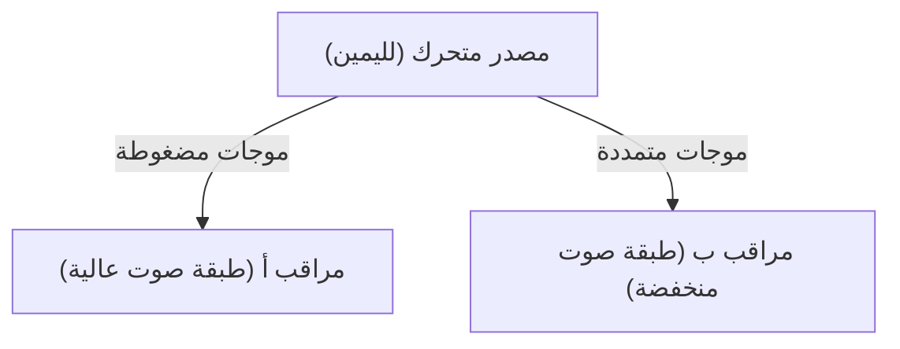

## 1. لغز صفارة إنذار سيارة الإسعاف
عندما تقترب سيارة الإسعاف، يبدو صوت صفارة الإنذار عاليًا، وعندما تمر وتبتعد، يبدو الصوت فجأة منخفضًا. هذا هو المثال الأكثر شيوعًا على "تأثير دوبلر".

## 2. لماذا يتغير الصوت؟
الصوت عبارة عن موجات في الهواء (موجات طولية). عندما يقترب مصدر الصوت، "تنضغط" الموجات في اتجاه الحركة ويصبح الطول الموجي أقصر (يصبح الصوت أعلى)، وعندما يبتعد، "تتمدد" الموجات ويصبح الطول الموجي أطول (يصبح الصوت أدنى).

$$
f' = f \left( \frac{V \pm v_o}{V \mp v_s} \right)
$$

## 3. تأثير دوبلر في الضوء (الانزياح نحو الأحمر)
يحدث تأثير دوبلر للضوء أيضًا. الضوء المنبعث من النجوم المبتعدة يزداد طوله الموجي ويبدو "مائلًا للاحمرار" (الانزياح نحو الأحمر).

## 4. اكتشاف تمدد الكون
اكتشف إدوين هابل أن المجرات الأبعد لها انزياح نحو الأحمر أكبر (أي أنها تبتعد بشكل أسرع)، ووجد دليلًا قويًا على نظرية الانفجار العظيم بأن "الكون يتمدد".

## جزء التحقق التقني الإضافي 1

## جزء التحقق التقني الإضافي 2

## جزء التحقق التقني الإضافي 3

## جزء التحقق التقني الإضافي 4

## جزء التحقق التقني الإضافي 5

## جزء التحقق التقني الإضافي 6

## جزء التحقق التقني الإضافي 7

## جزء التحقق التقني الإضافي 8

## جزء التحقق التقني الإضافي 9

## جزء التحقق التقني الإضافي 10

## جزء التحقق التقني الإضافي 11

## جزء التحقق التقني الإضافي 12

## جزء التحقق التقني الإضافي 13

## جزء التحقق التقني الإضافي 14

