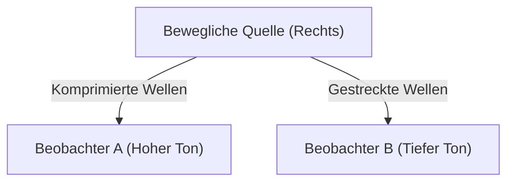

## 1. Das Rätsel der Krankenwagensirene
Wenn sich ein Krankenwagen nähert, klingt der Ton der Sirene höher, und wenn er vorbeifährt und sich entfernt, klingt der Ton plötzlich tiefer. Dies ist das bekannteste Beispiel für den „Doppler-Effekt“.

## 2. Warum ändert sich der Ton?
Schall ist eine Welle in der Luft (Longitudinalwelle). Wenn sich die Schallquelle nähert, wird die Welle in Ausbreitungsrichtung „komprimiert“ und die Wellenlänge wird kürzer (der Ton wird höher); wenn sie sich entfernt, wird die Welle „gestreckt“ und die Wellenlänge wird länger (der Ton wird tiefer).

$$
f' = f \left( \frac{V \pm v_o}{V \mp v_s} \right)
$$

## 3. Der Doppler-Effekt des Lichts (Rotverschiebung)
Der Doppler-Effekt tritt auch bei Licht auf. Das Licht, das von Sternen ausgesendet wird, die sich von uns entfernen, hat eine gestreckte Wellenlänge und erscheint „rötlicher“ (Rotverschiebung).

## 4. Die Entdeckung der Ausdehnung des Universums
Edwin Hubble entdeckte, dass die Rotverschiebung umso größer ist (d. h. sie entfernen sich umso schneller), je weiter eine Galaxie entfernt ist, und fand damit einen starken Beweis für die Urknalltheorie, die besagt, dass „das Universum sich ausdehnt“.

## Zusätzlicher Technik-Validierungsteil 1

## Zusätzlicher Technik-Validierungsteil 2

## Zusätzlicher Technik-Validierungsteil 3

## Zusätzlicher Technik-Validierungsteil 4

## Zusätzlicher Technik-Validierungsteil 5

## Zusätzlicher Technik-Validierungsteil 6

## Zusätzlicher Technik-Validierungsteil 7

## Zusätzlicher Technik-Validierungsteil 8

## Zusätzlicher Technik-Validierungsteil 9

## Zusätzlicher Technik-Validierungsteil 10

## Zusätzlicher Technik-Validierungsteil 11

## Zusätzlicher Technik-Validierungsteil 12

## Zusätzlicher Technik-Validierungsteil 13

## Zusätzlicher Technik-Validierungsteil 14

