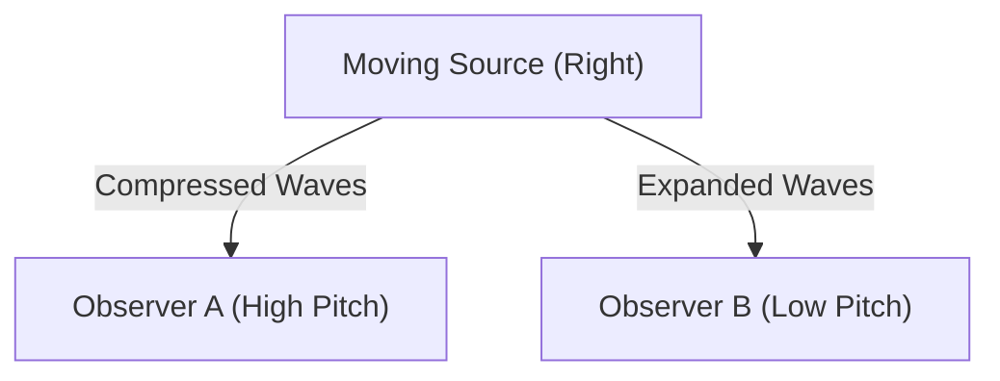

## 1. The Mystery of the Ambulance Siren
When an ambulance is approaching, the sound of its siren is heard high, and when it passes by and moves away, the sound is suddenly heard low. This is the most familiar example of the "Doppler effect".

## 2. Why Does the Sound Change?
Sound is a wave of air (longitudinal wave). When a sound source approaches, the waves are "compressed" in the direction of travel, shortening the wavelength (becoming a high pitch), and when it moves away, the waves are "stretched", lengthening the wavelength (becoming a low pitch).

$$
f' = f \left( \frac{V \pm v_o}{V \mp v_s} \right)
$$

## 3. The Doppler Effect of Light (Redshift)
The Doppler effect also occurs with light. The light emitted from a receding star has its wavelength stretched, making it look "reddish" (redshift).

## 4. The Discovery of the Expansion of the Universe
Edwin Hubble discovered that the farther away a galaxy is, the greater its redshift (= the faster it is moving away), finding powerful evidence for the Big Bang theory that "the universe is expanding."

