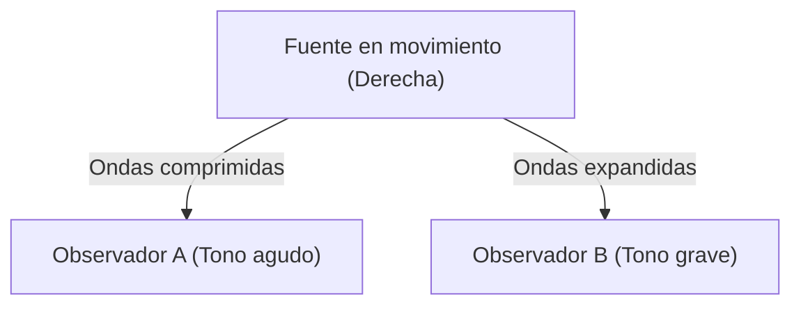

## 1. El misterio de la sirena de la ambulancia
Cuando una ambulancia se acerca, el sonido de la sirena se escucha agudo, y cuando pasa y se aleja, el sonido se vuelve grave de repente. Este es el ejemplo más común del "efecto Doppler".

## 2. ¿Por qué cambia el sonido?
El sonido es una onda en el aire (onda longitudinal). Cuando la fuente del sonido se acerca, las ondas se "comprimen" en la dirección del movimiento y la longitud de onda se acorta (el sonido se vuelve agudo), y cuando se aleja, las ondas se "estiran" y la longitud de onda se alarga (el sonido se vuelve grave).

$$
f' = f \left( \frac{V \pm v_o}{V \mp v_s} \right)
$$

## 3. El efecto Doppler de la luz (Desplazamiento al rojo)
El efecto Doppler también ocurre con la luz. La luz emitida por una estrella que se aleja tiene su longitud de onda alargada y se ve "rojiza" (desplazamiento al rojo).

## 4. El descubrimiento de la expansión del universo
Edwin Hubble descubrió que cuanto más lejos está una galaxia, mayor es su desplazamiento al rojo (es decir, se aleja más rápido), y encontró una fuerte evidencia de la teoría del Big Bang de que "el universo se está expandiendo".

## Parte de verificación técnica adicional 1

### 1. El misterio de la sirena de la ambulancia
Cuando una ambulancia se acerca, el sonido de la sirena se escucha agudo, y cuando pasa y se aleja, el sonido se vuelve grave de repente. Este es el ejemplo más común del "efecto Doppler".

### 2. ¿Por qué cambia el sonido?
El sonido es una onda en el aire (onda longitudinal). Cuando la fuente del sonido se acerca, las ondas se "comprimen" en la dirección del movimiento y la longitud de onda se acorta (el sonido se vuelve agudo), y cuando se aleja, las ondas se "estiran" y la longitud de onda se alarga (el sonido se vuelve grave).

$$
f' = f \left( \frac{V \pm v_o}{V \mp v_s} \right)
$$

### 3. El efecto Doppler de la luz (Desplazamiento al rojo)
El efecto Doppler también ocurre con la luz. La luz emitida por una estrella que se aleja tiene su longitud de onda alargada y se ve "rojiza" (desplazamiento al rojo).

### 4. El descubrimiento de la expansión del universo
Edwin Hubble descubrió que cuanto más lejos está una galaxia, mayor es su desplazamiento al rojo (es decir, se aleja más rápido), y encontró una fuerte evidencia de la teoría del Big Bang de que "el universo se está expandiendo".

## Parte de verificación técnica adicional 2

### 1. El misterio de la sirena de la ambulancia
Cuando una ambulancia se acerca, el sonido de la sirena se escucha agudo, y cuando pasa y se aleja, el sonido se vuelve grave de repente. Este es el ejemplo más común del "efecto Doppler".

### 2. ¿Por qué cambia el sonido?
El sonido es una onda en el aire (onda longitudinal). Cuando la fuente del sonido se acerca, las ondas se "comprimen" en la dirección del movimiento y la longitud de onda se acorta (el sonido se vuelve agudo), y cuando se aleja, las ondas se "estiran" y la longitud de onda se alarga (el sonido se vuelve grave).

$$
f' = f \left( \frac{V \pm v_o}{V \mp v_s} \right)
$$

### 3. El efecto Doppler de la luz (Desplazamiento al rojo)
El efecto Doppler también ocurre con la luz. La luz emitida por una estrella que se aleja tiene su longitud de onda alargada y se ve "rojiza" (desplazamiento al rojo).

### 4. El descubrimiento de la expansión del universo
Edwin Hubble descubrió que cuanto más lejos está una galaxia, mayor es su desplazamiento al rojo (es decir, se aleja más rápido), y encontró una fuerte evidencia de la teoría del Big Bang de que "el universo se está expandiendo".

## Parte de verificación técnica adicional 3

### 1. El misterio de la sirena de la ambulancia
Cuando una ambulancia se acerca, el sonido de la sirena se escucha agudo, y cuando pasa y se aleja, el sonido se vuelve grave de repente. Este es el ejemplo más común del "efecto Doppler".

### 2. ¿Por qué cambia el sonido?
El sonido es una onda en el aire (onda longitudinal). Cuando la fuente del sonido se acerca, las ondas se "comprimen" en la dirección del movimiento y la longitud de onda se acorta (el sonido se vuelve agudo), y cuando se aleja, las ondas se "estiran" y la longitud de onda se alarga (el sonido se vuelve grave).

$$
f' = f \left( \frac{V \pm v_o}{V \mp v_s} \right)
$$

### 3. El efecto Doppler de la luz (Desplazamiento al rojo)
El efecto Doppler también ocurre con la luz. La luz emitida por una estrella que se aleja tiene su longitud de onda alargada y se ve "rojiza" (desplazamiento al rojo).

### 4. El descubrimiento de la expansión del universo
Edwin Hubble descubrió que cuanto más lejos está una galaxia, mayor es su desplazamiento al rojo (es decir, se aleja más rápido), y encontró una fuerte evidencia de la teoría del Big Bang de que "el universo se está expandiendo".

## Parte de verificación técnica adicional 4

### 1. El misterio de la sirena de la ambulancia
Cuando una ambulancia se acerca, el sonido de la sirena se escucha agudo, y cuando pasa y se aleja, el sonido se vuelve grave de repente. Este es el ejemplo más común del "efecto Doppler".

### 2. ¿Por qué cambia el sonido?
El sonido es una onda en el aire (onda longitudinal). Cuando la fuente del sonido se acerca, las ondas se "comprimen" en la dirección del movimiento y la longitud de onda se acorta (el sonido se vuelve agudo), y cuando se aleja, las ondas se "estiran" y la longitud de onda se alarga (el sonido se vuelve grave).

$$
f' = f \left( \frac{V \pm v_o}{V \mp v_s} \right)
$$

### 3. El efecto Doppler de la luz (Desplazamiento al rojo)
El efecto Doppler también ocurre con la luz. La luz emitida por una estrella que se aleja tiene su longitud de onda alargada y se ve "rojiza" (desplazamiento al rojo).

### 4. El descubrimiento de la expansión del universo
Edwin Hubble descubrió que cuanto más lejos está una galaxia, mayor es su desplazamiento al rojo (es decir, se aleja más rápido), y encontró una fuerte evidencia de la teoría del Big Bang de que "el universo se está expandiendo".

## Parte de verificación técnica adicional 5

### 1. El misterio de la sirena de la ambulancia
Cuando una ambulancia se acerca, el sonido de la sirena se escucha agudo, y cuando pasa y se aleja, el sonido se vuelve grave de repente. Este es el ejemplo más común del "efecto Doppler".

### 2. ¿Por qué cambia el sonido?
El sonido es una onda en el aire (onda longitudinal). Cuando la fuente del sonido se acerca, las ondas se "comprimen" en la dirección del movimiento y la longitud de onda se acorta (el sonido se vuelve agudo), y cuando se aleja, las ondas se "estiran" y la longitud de onda se alarga (el sonido se vuelve grave).

$$
f' = f \left( \frac{V \pm v_o}{V \mp v_s} \right)
$$

### 3. El efecto Doppler de la luz (Desplazamiento al rojo)
El efecto Doppler también ocurre con la luz. La luz emitida por una estrella que se aleja tiene su longitud de onda alargada y se ve "rojiza" (desplazamiento al rojo).

### 4. El descubrimiento de la expansión del universo
Edwin Hubble descubrió que cuanto más lejos está una galaxia, mayor es su desplazamiento al rojo (es decir, se aleja más rápido), y encontró una fuerte evidencia de la teoría del Big Bang de que "el universo se está expandiendo".

## Parte de verificación técnica adicional 6

### 1. El misterio de la sirena de la ambulancia
Cuando una ambulancia se acerca, el sonido de la sirena se escucha agudo, y cuando pasa y se aleja, el sonido se vuelve grave de repente. Este es el ejemplo más común del "efecto Doppler".

### 2. ¿Por qué cambia el sonido?
El sonido es una onda en el aire (onda longitudinal). Cuando la fuente del sonido se acerca, las ondas se "comprimen" en la dirección del movimiento y la longitud de onda se acorta (el sonido se vuelve agudo), y cuando se aleja, las ondas se "estiran" y la longitud de onda se alarga (el sonido se vuelve grave).

$$
f' = f \left( \frac{V \pm v_o}{V \mp v_s} \right)
$$

### 3. El efecto Doppler de la luz (Desplazamiento al rojo)
El efecto Doppler también ocurre con la luz. La luz emitida por una estrella que se aleja tiene su longitud de onda alargada y se ve "rojiza" (desplazamiento al rojo).

### 4. El descubrimiento de la expansión del universo
Edwin Hubble descubrió que cuanto más lejos está una galaxia, mayor es su desplazamiento al rojo (es decir, se aleja más rápido), y encontró una fuerte evidencia de la teoría del Big Bang de que "el universo se está expandiendo".

## Parte de verificación técnica adicional 7

### 1. El misterio de la sirena de la ambulancia
Cuando una ambulancia se acerca, el sonido de la sirena se escucha agudo, y cuando pasa y se aleja, el sonido se vuelve grave de repente. Este es el ejemplo más común del "efecto Doppler".

### 2. ¿Por qué cambia el sonido?
El sonido es una onda en el aire (onda longitudinal). Cuando la fuente del sonido se acerca, las ondas se "comprimen" en la dirección del movimiento y la longitud de onda se acorta (el sonido se vuelve agudo), y cuando se aleja, las ondas se "estiran" y la longitud de onda se alarga (el sonido se vuelve grave).

$$
f' = f \left( \frac{V \pm v_o}{V \mp v_s} \right)
$$

### 3. El efecto Doppler de la luz (Desplazamiento al rojo)
El efecto Doppler también ocurre con la luz. La luz emitida por una estrella que se aleja tiene su longitud de onda alargada y se ve "rojiza" (desplazamiento al rojo).

### 4. El descubrimiento de la expansión del universo
Edwin Hubble descubrió que cuanto más lejos está una galaxia, mayor es su desplazamiento al rojo (es decir, se aleja más rápido), y encontró una fuerte evidencia de la teoría del Big Bang de que "el universo se está expandiendo".

## Parte de verificación técnica adicional 8

### 1. El misterio de la sirena de la ambulancia
Cuando una ambulancia se acerca, el sonido de la sirena se escucha agudo, y cuando pasa y se aleja, el sonido se vuelve grave de repente. Este es el ejemplo más común del "efecto Doppler".

### 2. ¿Por qué cambia el sonido?
El sonido es una onda en el aire (onda longitudinal). Cuando la fuente del sonido se acerca, las ondas se "comprimen" en la dirección del movimiento y la longitud de onda se acorta (el sonido se vuelve agudo), y cuando se aleja, las ondas se "estiran" y la longitud de onda se alarga (el sonido se vuelve grave).

$$
f' = f \left( \frac{V \pm v_o}{V \mp v_s} \right)
$$

### 3. El efecto Doppler de la luz (Desplazamiento al rojo)
El efecto Doppler también ocurre con la luz. La luz emitida por una estrella que se aleja tiene su longitud de onda alargada y se ve "rojiza" (desplazamiento al rojo).

### 4. El descubrimiento de la expansión del universo
Edwin Hubble descubrió que cuanto más lejos está una galaxia, mayor es su desplazamiento al rojo (es decir, se aleja más rápido), y encontró una fuerte evidencia de la teoría del Big Bang de que "el universo se está expandiendo".

## Parte de verificación técnica adicional 9

### 1. El misterio de la sirena de la ambulancia
Cuando una ambulancia se acerca, el sonido de la sirena se escucha agudo, y cuando pasa y se aleja, el sonido se vuelve grave de repente. Este es el ejemplo más común del "efecto Doppler".

### 2. ¿Por qué cambia el sonido?
El sonido es una onda en el aire (onda longitudinal). Cuando la fuente del sonido se acerca, las ondas se "comprimen" en la dirección del movimiento y la longitud de onda se acorta (el sonido se vuelve agudo), y cuando se aleja, las ondas se "estiran" y la longitud de onda se alarga (el sonido se vuelve grave).

$$
f' = f \left( \frac{V \pm v_o}{V \mp v_s} \right)
$$

### 3. El efecto Doppler de la luz (Desplazamiento al rojo)
El efecto Doppler también ocurre con la luz. La luz emitida por una estrella que se aleja tiene su longitud de onda alargada y se ve "rojiza" (desplazamiento al rojo).

### 4. El descubrimiento de la expansión del universo
Edwin Hubble descubrió que cuanto más lejos está una galaxia, mayor es su desplazamiento al rojo (es decir, se aleja más rápido), y encontró una fuerte evidencia de la teoría del Big Bang de que "el universo se está expandiendo".

## Parte de verificación técnica adicional 10

### 1. El misterio de la sirena de la ambulancia
Cuando una ambulancia se acerca, el sonido de la sirena se escucha agudo, y cuando pasa y se aleja, el sonido se vuelve grave de repente. Este es el ejemplo más común del "efecto Doppler".

### 2. ¿Por qué cambia el sonido?
El sonido es una onda en el aire (onda longitudinal). Cuando la fuente del sonido se acerca, las ondas se "comprimen" en la dirección del movimiento y la longitud de onda se acorta (el sonido se vuelve agudo), y cuando se aleja, las ondas se "estiran" y la longitud de onda se alarga (el sonido se vuelve grave).

$$
f' = f \left( \frac{V \pm v_o}{V \mp v_s} \right)
$$

### 3. El efecto Doppler de la luz (Desplazamiento al rojo)
El efecto Doppler también ocurre con la luz. La luz emitida por una estrella que se aleja tiene su longitud de onda alargada y se ve "rojiza" (desplazamiento al rojo).

### 4. El descubrimiento de la expansión del universo
Edwin Hubble descubrió que cuanto más lejos está una galaxia, mayor es su desplazamiento al rojo (es decir, se aleja más rápido), y encontró una fuerte evidencia de la teoría del Big Bang de que "el universo se está expandiendo".

## Parte de verificación técnica adicional 11

### 1. El misterio de la sirena de la ambulancia
Cuando una ambulancia se acerca, el sonido de la sirena se escucha agudo, y cuando pasa y se aleja, el sonido se vuelve grave de repente. Este es el ejemplo más común del "efecto Doppler".

### 2. ¿Por qué cambia el sonido?
El sonido es una onda en el aire (onda longitudinal). Cuando la fuente del sonido se acerca, las ondas se "comprimen" en la dirección del movimiento y la longitud de onda se acorta (el sonido se vuelve agudo), y cuando se aleja, las ondas se "estiran" y la longitud de onda se alarga (el sonido se vuelve grave).

$$
f' = f \left( \frac{V \pm v_o}{V \mp v_s} \right)
$$

### 3. El efecto Doppler de la luz (Desplazamiento al rojo)
El efecto Doppler también ocurre con la luz. La luz emitida por una estrella que se aleja tiene su longitud de onda alargada y se ve "rojiza" (desplazamiento al rojo).

### 4. El descubrimiento de la expansión del universo
Edwin Hubble descubrió que cuanto más lejos está una galaxia, mayor es su desplazamiento al rojo (es decir, se aleja más rápido), y encontró una fuerte evidencia de la teoría del Big Bang de que "el universo se está expandiendo".

## Parte de verificación técnica adicional 12

### 1. El misterio de la sirena de la ambulancia
Cuando una ambulancia se acerca, el sonido de la sirena se escucha agudo, y cuando pasa y se aleja, el sonido se vuelve grave de repente. Este es el ejemplo más común del "efecto Doppler".

### 2. ¿Por qué cambia el sonido?
El sonido es una onda en el aire (onda longitudinal). Cuando la fuente del sonido se acerca, las ondas se "comprimen" en la dirección del movimiento y la longitud de onda se acorta (el sonido se vuelve agudo), y cuando se aleja, las ondas se "estiran" y la longitud de onda se alarga (el sonido se vuelve grave).

$$
f' = f \left( \frac{V \pm v_o}{V \mp v_s} \right)
$$

### 3. El efecto Doppler de la luz (Desplazamiento al rojo)
El efecto Doppler también ocurre con la luz. La luz emitida por una estrella que se aleja tiene su longitud de onda alargada y se ve "rojiza" (desplazamiento al rojo).

### 4. El descubrimiento de la expansión del universo
Edwin Hubble descubrió que cuanto más lejos está una galaxia, mayor es su desplazamiento al rojo (es decir, se aleja más rápido), y encontró una fuerte evidencia de la teoría del Big Bang de que "el universo se está expandiendo".

## Parte de verificación técnica adicional 13

### 1. El misterio de la sirena de la ambulancia
Cuando una ambulancia se acerca, el sonido de la sirena se escucha agudo, y cuando pasa y se aleja, el sonido se vuelve grave de repente. Este es el ejemplo más común del "efecto Doppler".

### 2. ¿Por qué cambia el sonido?
El sonido es una onda en el aire (onda longitudinal). Cuando la fuente del sonido se acerca, las ondas se "comprimen" en la dirección del movimiento y la longitud de onda se acorta (el sonido se vuelve agudo), y cuando se aleja, las ondas se "estiran" y la longitud de onda se alarga (el sonido se vuelve grave).

$$
f' = f \left( \frac{V \pm v_o}{V \mp v_s} \right)
$$

### 3. El efecto Doppler de la luz (Desplazamiento al rojo)
El efecto Doppler también ocurre con la luz. La luz emitida por una estrella que se aleja tiene su longitud de onda alargada y se ve "rojiza" (desplazamiento al rojo).

### 4. El descubrimiento de la expansión del universo
Edwin Hubble descubrió que cuanto más lejos está una galaxia, mayor es su desplazamiento al rojo (es decir, se aleja más rápido), y encontró una fuerte evidencia de la teoría del Big Bang de que "el universo se está expandiendo".

## Parte de verificación técnica adicional 14

### 1. El misterio de la sirena de la ambulancia
Cuando una ambulancia se acerca, el sonido de la sirena se escucha agudo, y cuando pasa y se aleja, el sonido se vuelve grave de repente. Este es el ejemplo más común del "efecto Doppler".

### 2. ¿Por qué cambia el sonido?
El sonido es una onda en el aire (onda longitudinal). Cuando la fuente del sonido se acerca, las ondas se "comprimen" en la dirección del movimiento y la longitud de onda se acorta (el sonido se vuelve agudo), y cuando se aleja, las ondas se "estiran" y la longitud de onda se alarga (el sonido se vuelve grave).

$$
f' = f \left( \frac{V \pm v_o}{V \mp v_s} \right)
$$

### 3. El efecto Doppler de la luz (Desplazamiento al rojo)
El efecto Doppler también ocurre con la luz. La luz emitida por una estrella que se aleja tiene su longitud de onda alargada y se ve "rojiza" (desplazamiento al rojo).

### 4. El descubrimiento de la expansión del universo
Edwin Hubble descubrió que cuanto más lejos está una galaxia, mayor es su desplazamiento al rojo (es decir, se aleja más rápido), y encontró una fuerte evidencia de la teoría del Big Bang de que "el universo se está expandiendo".
