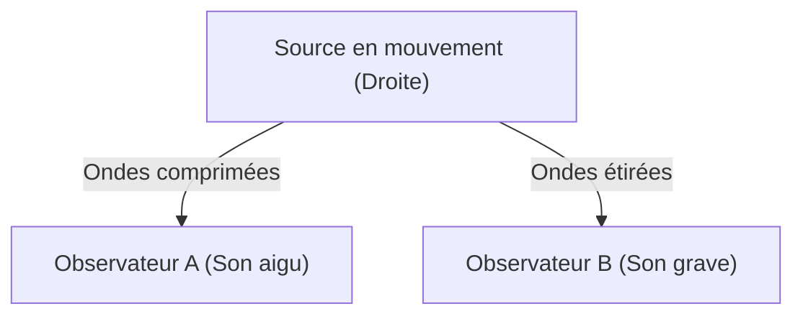

## 1. Le mystère de la sirène d'ambulance
Lorsqu'une ambulance s'approche, le son de sa sirène est perçu comme aigu, et lorsqu'elle passe et s'éloigne, le son devient soudainement plus grave. C'est l'exemple le plus courant de l'« effet Doppler ».

## 2. Pourquoi le son change-t-il ?
Le son est une onde dans l'air (onde longitudinale). Lorsque la source sonore s'approche, les ondes sont « comprimées » dans la direction de propagation et la longueur d'onde devient plus courte (le son devient aigu). Lorsqu'elle s'éloigne, les ondes sont « étirées » et la longueur d'onde s'allonge (le son devient grave).

$$
f' = f \left( \frac{V \pm v_o}{V \mp v_s} \right)
$$

## 3. L'effet Doppler de la lumière (Décalage vers le rouge)
L'effet Doppler se produit également avec la lumière. La lumière émise par une étoile qui s'éloigne voit sa longueur d'onde s'étirer et apparaît plus « rouge » (décalage vers le rouge).

## 4. La découverte de l'expansion de l'univers
Edwin Hubble a découvert que plus une galaxie est éloignée, plus son décalage vers le rouge est important (= elle s'éloigne plus vite), trouvant ainsi une preuve solide de la théorie du Big Bang selon laquelle « l'univers est en expansion ».

## Partie supplémentaire de vérification technique 1

### 1. Le mystère de la sirène d'ambulance
Lorsqu'une ambulance s'approche, le son de sa sirène est perçu comme aigu, et lorsqu'elle passe et s'éloigne, le son devient soudainement plus grave. C'est l'exemple le plus courant de l'« effet Doppler ».

### 2. Pourquoi le son change-t-il ?
Le son est une onde dans l'air (onde longitudinale). Lorsque la source sonore s'approche, les ondes sont « comprimées » dans la direction de propagation et la longueur d'onde devient plus courte (le son devient aigu). Lorsqu'elle s'éloigne, les ondes sont « étirées » et la longueur d'onde s'allonge (le son devient grave).

$$
f' = f \left( \frac{V \pm v_o}{V \mp v_s} \right)
$$

### 3. L'effet Doppler de la lumière (Décalage vers le rouge)
L'effet Doppler se produit également avec la lumière. La lumière émise par une étoile qui s'éloigne voit sa longueur d'onde s'étirer et apparaît plus « rouge » (décalage vers le rouge).

### 4. La découverte de l'expansion de l'univers
Edwin Hubble a découvert que plus une galaxie est éloignée, plus son décalage vers le rouge est important (= elle s'éloigne plus vite), trouvant ainsi une preuve solide de la théorie du Big Bang selon laquelle « l'univers est en expansion ».

## Partie supplémentaire de vérification technique 2

### 1. Le mystère de la sirène d'ambulance
Lorsqu'une ambulance s'approche, le son de sa sirène est perçu comme aigu, et lorsqu'elle passe et s'éloigne, le son devient soudainement plus grave. C'est l'exemple le plus courant de l'« effet Doppler ».

### 2. Pourquoi le son change-t-il ?
Le son est une onde dans l'air (onde longitudinale). Lorsque la source sonore s'approche, les ondes sont « comprimées » dans la direction de propagation et la longueur d'onde devient plus courte (le son devient aigu). Lorsqu'elle s'éloigne, les ondes sont « étirées » et la longueur d'onde s'allonge (le son devient grave).

$$
f' = f \left( \frac{V \pm v_o}{V \mp v_s} \right)
$$

### 3. L'effet Doppler de la lumière (Décalage vers le rouge)
L'effet Doppler se produit également avec la lumière. La lumière émise par une étoile qui s'éloigne voit sa longueur d'onde s'étirer et apparaît plus « rouge » (décalage vers le rouge).

### 4. La découverte de l'expansion de l'univers
Edwin Hubble a découvert que plus une galaxie est éloignée, plus son décalage vers le rouge est important (= elle s'éloigne plus vite), trouvant ainsi une preuve solide de la théorie du Big Bang selon laquelle « l'univers est en expansion ».

## Partie supplémentaire de vérification technique 3

### 1. Le mystère de la sirène d'ambulance
Lorsqu'une ambulance s'approche, le son de sa sirène est perçu comme aigu, et lorsqu'elle passe et s'éloigne, le son devient soudainement plus grave. C'est l'exemple le plus courant de l'« effet Doppler ».

### 2. Pourquoi le son change-t-il ?
Le son est une onde dans l'air (onde longitudinale). Lorsque la source sonore s'approche, les ondes sont « comprimées » dans la direction de propagation et la longueur d'onde devient plus courte (le son devient aigu). Lorsqu'elle s'éloigne, les ondes sont « étirées » et la longueur d'onde s'allonge (le son devient grave).

$$
f' = f \left( \frac{V \pm v_o}{V \mp v_s} \right)
$$

### 3. L'effet Doppler de la lumière (Décalage vers le rouge)
L'effet Doppler se produit également avec la lumière. La lumière émise par une étoile qui s'éloigne voit sa longueur d'onde s'étirer et apparaît plus « rouge » (décalage vers le rouge).

### 4. La découverte de l'expansion de l'univers
Edwin Hubble a découvert que plus une galaxie est éloignée, plus son décalage vers le rouge est important (= elle s'éloigne plus vite), trouvant ainsi une preuve solide de la théorie du Big Bang selon laquelle « l'univers est en expansion ».

## Partie supplémentaire de vérification technique 4

### 1. Le mystère de la sirène d'ambulance
Lorsqu'une ambulance s'approche, le son de sa sirène est perçu comme aigu, et lorsqu'elle passe et s'éloigne, le son devient soudainement plus grave. C'est l'exemple le plus courant de l'« effet Doppler ».

### 2. Pourquoi le son change-t-il ?
Le son est une onde dans l'air (onde longitudinale). Lorsque la source sonore s'approche, les ondes sont « comprimées » dans la direction de propagation et la longueur d'onde devient plus courte (le son devient aigu). Lorsqu'elle s'éloigne, les ondes sont « étirées » et la longueur d'onde s'allonge (le son devient grave).

$$
f' = f \left( \frac{V \pm v_o}{V \mp v_s} \right)
$$

### 3. L'effet Doppler de la lumière (Décalage vers le rouge)
L'effet Doppler se produit également avec la lumière. La lumière émise par une étoile qui s'éloigne voit sa longueur d'onde s'étirer et apparaît plus « rouge » (décalage vers le rouge).

### 4. La découverte de l'expansion de l'univers
Edwin Hubble a découvert que plus une galaxie est éloignée, plus son décalage vers le rouge est important (= elle s'éloigne plus vite), trouvant ainsi une preuve solide de la théorie du Big Bang selon laquelle « l'univers est en expansion ».

## Partie supplémentaire de vérification technique 5

### 1. Le mystère de la sirène d'ambulance
Lorsqu'une ambulance s'approche, le son de sa sirène est perçu comme aigu, et lorsqu'elle passe et s'éloigne, le son devient soudainement plus grave. C'est l'exemple le plus courant de l'« effet Doppler ».

### 2. Pourquoi le son change-t-il ?
Le son est une onde dans l'air (onde longitudinale). Lorsque la source sonore s'approche, les ondes sont « comprimées » dans la direction de propagation et la longueur d'onde devient plus courte (le son devient aigu). Lorsqu'elle s'éloigne, les ondes sont « étirées » et la longueur d'onde s'allonge (le son devient grave).

$$
f' = f \left( \frac{V \pm v_o}{V \mp v_s} \right)
$$

### 3. L'effet Doppler de la lumière (Décalage vers le rouge)
L'effet Doppler se produit également avec la lumière. La lumière émise par une étoile qui s'éloigne voit sa longueur d'onde s'étirer et apparaît plus « rouge » (décalage vers le rouge).

### 4. La découverte de l'expansion de l'univers
Edwin Hubble a découvert que plus une galaxie est éloignée, plus son décalage vers le rouge est important (= elle s'éloigne plus vite), trouvant ainsi une preuve solide de la théorie du Big Bang selon laquelle « l'univers est en expansion ».

## Partie supplémentaire de vérification technique 6

### 1. Le mystère de la sirène d'ambulance
Lorsqu'une ambulance s'approche, le son de sa sirène est perçu comme aigu, et lorsqu'elle passe et s'éloigne, le son devient soudainement plus grave. C'est l'exemple le plus courant de l'« effet Doppler ».

### 2. Pourquoi le son change-t-il ?
Le son est une onde dans l'air (onde longitudinale). Lorsque la source sonore s'approche, les ondes sont « comprimées » dans la direction de propagation et la longueur d'onde devient plus courte (le son devient aigu). Lorsqu'elle s'éloigne, les ondes sont « étirées » et la longueur d'onde s'allonge (le son devient grave).

$$
f' = f \left( \frac{V \pm v_o}{V \mp v_s} \right)
$$

### 3. L'effet Doppler de la lumière (Décalage vers le rouge)
L'effet Doppler se produit également avec la lumière. La lumière émise par une étoile qui s'éloigne voit sa longueur d'onde s'étirer et apparaît plus « rouge » (décalage vers le rouge).

### 4. La découverte de l'expansion de l'univers
Edwin Hubble a découvert que plus une galaxie est éloignée, plus son décalage vers le rouge est important (= elle s'éloigne plus vite), trouvant ainsi une preuve solide de la théorie du Big Bang selon laquelle « l'univers est en expansion ».

## Partie supplémentaire de vérification technique 7

### 1. Le mystère de la sirène d'ambulance
Lorsqu'une ambulance s'approche, le son de sa sirène est perçu comme aigu, et lorsqu'elle passe et s'éloigne, le son devient soudainement plus grave. C'est l'exemple le plus courant de l'« effet Doppler ».

### 2. Pourquoi le son change-t-il ?
Le son est une onde dans l'air (onde longitudinale). Lorsque la source sonore s'approche, les ondes sont « comprimées » dans la direction de propagation et la longueur d'onde devient plus courte (le son devient aigu). Lorsqu'elle s'éloigne, les ondes sont « étirées » et la longueur d'onde s'allonge (le son devient grave).

$$
f' = f \left( \frac{V \pm v_o}{V \mp v_s} \right)
$$

### 3. L'effet Doppler de la lumière (Décalage vers le rouge)
L'effet Doppler se produit également avec la lumière. La lumière émise par une étoile qui s'éloigne voit sa longueur d'onde s'étirer et apparaît plus « rouge » (décalage vers le rouge).

### 4. La découverte de l'expansion de l'univers
Edwin Hubble a découvert que plus une galaxie est éloignée, plus son décalage vers le rouge est important (= elle s'éloigne plus vite), trouvant ainsi une preuve solide de la théorie du Big Bang selon laquelle « l'univers est en expansion ».

## Partie supplémentaire de vérification technique 8

### 1. Le mystère de la sirène d'ambulance
Lorsqu'une ambulance s'approche, le son de sa sirène est perçu comme aigu, et lorsqu'elle passe et s'éloigne, le son devient soudainement plus grave. C'est l'exemple le plus courant de l'« effet Doppler ».

### 2. Pourquoi le son change-t-il ?
Le son est une onde dans l'air (onde longitudinale). Lorsque la source sonore s'approche, les ondes sont « comprimées » dans la direction de propagation et la longueur d'onde devient plus courte (le son devient aigu). Lorsqu'elle s'éloigne, les ondes sont « étirées » et la longueur d'onde s'allonge (le son devient grave).

$$
f' = f \left( \frac{V \pm v_o}{V \mp v_s} \right)
$$

### 3. L'effet Doppler de la lumière (Décalage vers le rouge)
L'effet Doppler se produit également avec la lumière. La lumière émise par une étoile qui s'éloigne voit sa longueur d'onde s'étirer et apparaît plus « rouge » (décalage vers le rouge).

### 4. La découverte de l'expansion de l'univers
Edwin Hubble a découvert que plus une galaxie est éloignée, plus son décalage vers le rouge est important (= elle s'éloigne plus vite), trouvant ainsi une preuve solide de la théorie du Big Bang selon laquelle « l'univers est en expansion ».

## Partie supplémentaire de vérification technique 9

### 1. Le mystère de la sirène d'ambulance
Lorsqu'une ambulance s'approche, le son de sa sirène est perçu comme aigu, et lorsqu'elle passe et s'éloigne, le son devient soudainement plus grave. C'est l'exemple le plus courant de l'« effet Doppler ».

### 2. Pourquoi le son change-t-il ?
Le son est une onde dans l'air (onde longitudinale). Lorsque la source sonore s'approche, les ondes sont « comprimées » dans la direction de propagation et la longueur d'onde devient plus courte (le son devient aigu). Lorsqu'elle s'éloigne, les ondes sont « étirées » et la longueur d'onde s'allonge (le son devient grave).

$$
f' = f \left( \frac{V \pm v_o}{V \mp v_s} \right)
$$

### 3. L'effet Doppler de la lumière (Décalage vers le rouge)
L'effet Doppler se produit également avec la lumière. La lumière émise par une étoile qui s'éloigne voit sa longueur d'onde s'étirer et apparaît plus « rouge » (décalage vers le rouge).

### 4. La découverte de l'expansion de l'univers
Edwin Hubble a découvert que plus une galaxie est éloignée, plus son décalage vers le rouge est important (= elle s'éloigne plus vite), trouvant ainsi une preuve solide de la théorie du Big Bang selon laquelle « l'univers est en expansion ».

## Partie supplémentaire de vérification technique 10

### 1. Le mystère de la sirène d'ambulance
Lorsqu'une ambulance s'approche, le son de sa sirène est perçu comme aigu, et lorsqu'elle passe et s'éloigne, le son devient soudainement plus grave. C'est l'exemple le plus courant de l'« effet Doppler ».

### 2. Pourquoi le son change-t-il ?
Le son est une onde dans l'air (onde longitudinale). Lorsque la source sonore s'approche, les ondes sont « comprimées » dans la direction de propagation et la longueur d'onde devient plus courte (le son devient aigu). Lorsqu'elle s'éloigne, les ondes sont « étirées » et la longueur d'onde s'allonge (le son devient grave).

$$
f' = f \left( \frac{V \pm v_o}{V \mp v_s} \right)
$$

### 3. L'effet Doppler de la lumière (Décalage vers le rouge)
L'effet Doppler se produit également avec la lumière. La lumière émise par une étoile qui s'éloigne voit sa longueur d'onde s'étirer et apparaît plus « rouge » (décalage vers le rouge).

### 4. La découverte de l'expansion de l'univers
Edwin Hubble a découvert que plus une galaxie est éloignée, plus son décalage vers le rouge est important (= elle s'éloigne plus vite), trouvant ainsi une preuve solide de la théorie du Big Bang selon laquelle « l'univers est en expansion ».

## Partie supplémentaire de vérification technique 11

### 1. Le mystère de la sirène d'ambulance
Lorsqu'une ambulance s'approche, le son de sa sirène est perçu comme aigu, et lorsqu'elle passe et s'éloigne, le son devient soudainement plus grave. C'est l'exemple le plus courant de l'« effet Doppler ».

### 2. Pourquoi le son change-t-il ?
Le son est une onde dans l'air (onde longitudinale). Lorsque la source sonore s'approche, les ondes sont « comprimées » dans la direction de propagation et la longueur d'onde devient plus courte (le son devient aigu). Lorsqu'elle s'éloigne, les ondes sont « étirées » et la longueur d'onde s'allonge (le son devient grave).

$$
f' = f \left( \frac{V \pm v_o}{V \mp v_s} \right)
$$

### 3. L'effet Doppler de la lumière (Décalage vers le rouge)
L'effet Doppler se produit également avec la lumière. La lumière émise par une étoile qui s'éloigne voit sa longueur d'onde s'étirer et apparaît plus « rouge » (décalage vers le rouge).

### 4. La découverte de l'expansion de l'univers
Edwin Hubble a découvert que plus une galaxie est éloignée, plus son décalage vers le rouge est important (= elle s'éloigne plus vite), trouvant ainsi une preuve solide de la théorie du Big Bang selon laquelle « l'univers est en expansion ».

## Partie supplémentaire de vérification technique 12

### 1. Le mystère de la sirène d'ambulance
Lorsqu'une ambulance s'approche, le son de sa sirène est perçu comme aigu, et lorsqu'elle passe et s'éloigne, le son devient soudainement plus grave. C'est l'exemple le plus courant de l'« effet Doppler ».

### 2. Pourquoi le son change-t-il ?
Le son est une onde dans l'air (onde longitudinale). Lorsque la source sonore s'approche, les ondes sont « comprimées » dans la direction de propagation et la longueur d'onde devient plus courte (le son devient aigu). Lorsqu'elle s'éloigne, les ondes sont « étirées » et la longueur d'onde s'allonge (le son devient grave).

$$
f' = f \left( \frac{V \pm v_o}{V \mp v_s} \right)
$$

### 3. L'effet Doppler de la lumière (Décalage vers le rouge)
L'effet Doppler se produit également avec la lumière. La lumière émise par une étoile qui s'éloigne voit sa longueur d'onde s'étirer et apparaît plus « rouge » (décalage vers le rouge).

### 4. La découverte de l'expansion de l'univers
Edwin Hubble a découvert que plus une galaxie est éloignée, plus son décalage vers le rouge est important (= elle s'éloigne plus vite), trouvant ainsi une preuve solide de la théorie du Big Bang selon laquelle « l'univers est en expansion ».

## Partie supplémentaire de vérification technique 13

### 1. Le mystère de la sirène d'ambulance
Lorsqu'une ambulance s'approche, le son de sa sirène est perçu comme aigu, et lorsqu'elle passe et s'éloigne, le son devient soudainement plus grave. C'est l'exemple le plus courant de l'« effet Doppler ».

### 2. Pourquoi le son change-t-il ?
Le son est une onde dans l'air (onde longitudinale). Lorsque la source sonore s'approche, les ondes sont « comprimées » dans la direction de propagation et la longueur d'onde devient plus courte (le son devient aigu). Lorsqu'elle s'éloigne, les ondes sont « étirées » et la longueur d'onde s'allonge (le son devient grave).

$$
f' = f \left( \frac{V \pm v_o}{V \mp v_s} \right)
$$

### 3. L'effet Doppler de la lumière (Décalage vers le rouge)
L'effet Doppler se produit également avec la lumière. La lumière émise par une étoile qui s'éloigne voit sa longueur d'onde s'étirer et apparaît plus « rouge » (décalage vers le rouge).

### 4. La découverte de l'expansion de l'univers
Edwin Hubble a découvert que plus une galaxie est éloignée, plus son décalage vers le rouge est important (= elle s'éloigne plus vite), trouvant ainsi une preuve solide de la théorie du Big Bang selon laquelle « l'univers est en expansion ».

## Partie supplémentaire de vérification technique 14

### 1. Le mystère de la sirène d'ambulance
Lorsqu'une ambulance s'approche, le son de sa sirène est perçu comme aigu, et lorsqu'elle passe et s'éloigne, le son devient soudainement plus grave. C'est l'exemple le plus courant de l'« effet Doppler ».

### 2. Pourquoi le son change-t-il ?
Le son est une onde dans l'air (onde longitudinale). Lorsque la source sonore s'approche, les ondes sont « comprimées » dans la direction de propagation et la longueur d'onde devient plus courte (le son devient aigu). Lorsqu'elle s'éloigne, les ondes sont « étirées » et la longueur d'onde s'allonge (le son devient grave).

$$
f' = f \left( \frac{V \pm v_o}{V \mp v_s} \right)
$$

### 3. L'effet Doppler de la lumière (Décalage vers le rouge)
L'effet Doppler se produit également avec la lumière. La lumière émise par une étoile qui s'éloigne voit sa longueur d'onde s'étirer et apparaît plus « rouge » (décalage vers le rouge).

### 4. La découverte de l'expansion de l'univers
Edwin Hubble a découvert que plus une galaxie est éloignée, plus son décalage vers le rouge est important (= elle s'éloigne plus vite), trouvant ainsi une preuve solide de la théorie du Big Bang selon laquelle « l'univers est en expansion ».
