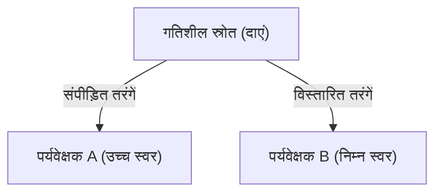

## 1. एम्बुलेंस के सायरन का रहस्य
जब कोई एम्बुलेंस पास आती है तो उसके सायरन की आवाज़ तेज़ (अधिक तीक्ष्ण) सुनाई देती है, और जब वह गुज़र कर दूर जाती है तो आवाज़ अचानक धीमी (कम तीक्ष्ण) हो जाती है। यह "डॉपलर प्रभाव" का सबसे जाना-पहचाना उदाहरण है।

## 2. आवाज़ क्यों बदलती है?
ध्वनि हवा में एक तरंग (अनुदैर्ध्य तरंग) है। जब ध्वनि का स्रोत पास आता है, तो तरंगें आगे की दिशा में "संपीड़ित" हो जाती हैं जिससे तरंग दैर्ध्य छोटी हो जाती है (आवाज़ तीक्ष्ण/ऊंची हो जाती है), और जब यह दूर जाता है, तो तरंगें "फैल" जाती हैं जिससे तरंग दैर्ध्य लंबी हो जाती है (आवाज़ धीमी/नीची हो जाती है)।

$$
f' = f \left( \frac{V \pm v_o}{V \mp v_s} \right)
$$

## 3. प्रकाश का डॉपलर प्रभाव (रेडशिफ्ट)
डॉपलर प्रभाव प्रकाश के साथ भी होता है। दूर जा रहे तारों से निकलने वाले प्रकाश की तरंग दैर्ध्य बढ़ जाती है और यह "लाल रंग" का दिखाई देता है (रेडशिफ्ट)।

## 4. ब्रह्मांड के विस्तार की खोज
एडविन हबल ने खोजा कि आकाशगंगा जितनी दूर होती है, उसका रेडशिफ्ट उतना ही अधिक होता है (यानी वह उतनी ही तेज़ी से दूर जा रही है), और इस प्रकार "ब्रह्मांड का विस्तार हो रहा है", बिग बैंग थ्योरी का यह मजबूत प्रमाण पाया।

## अतिरिक्त तकनीकी सत्यापन भाग 1

## अतिरिक्त तकनीकी सत्यापन भाग 2

## अतिरिक्त तकनीकी सत्यापन भाग 3

## अतिरिक्त तकनीकी सत्यापन भाग 4

## अतिरिक्त तकनीकी सत्यापन भाग 5

## अतिरिक्त तकनीकी सत्यापन भाग 6

## अतिरिक्त तकनीकी सत्यापन भाग 7

## अतिरिक्त तकनीकी सत्यापन भाग 8

## अतिरिक्त तकनीकी सत्यापन भाग 9

## अतिरिक्त तकनीकी सत्यापन भाग 10

## अतिरिक्त तकनीकी सत्यापन भाग 11

## अतिरिक्त तकनीकी सत्यापन भाग 12

## अतिरिक्त तकनीकी सत्यापन भाग 13

## अतिरिक्त तकनीकी सत्यापन भाग 14

