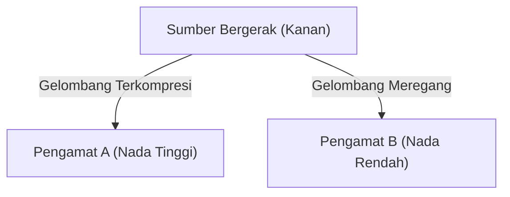

## 1. Misteri Sirene Ambulans
Saat ambulans mendekat, suara sirenenya terdengar lebih tinggi, dan saat lewat lalu menjauh, suaranya tiba-tiba terdengar lebih rendah. Ini adalah contoh paling umum dari "Efek Doppler".

## 2. Mengapa Suara Berubah?
Suara adalah gelombang udara (gelombang rapatan-renggangan). Saat sumber suara mendekat, gelombang "terkompresi" ke arah rambatan sehingga panjang gelombang menjadi lebih pendek (suara menjadi tinggi), dan saat menjauh, gelombang "meregang" sehingga panjang gelombang menjadi lebih panjang (suara menjadi rendah).

$$
f' = f \left( \frac{V \pm v_o}{V \mp v_s} \right)
$$

## 3. Efek Doppler pada Cahaya (Pergeseran Merah)
Efek Doppler juga terjadi pada cahaya. Cahaya yang dipancarkan dari bintang yang menjauh panjang gelombangnya bertambah sehingga tampak "kemerahan" (pergeseran merah).

## 4. Penemuan Ekspansi Alam Semesta
Edwin Hubble menemukan bahwa semakin jauh sebuah galaksi, semakin besar pergeseran merahnya (= semakin cepat menjauh), dan ini menjadi bukti kuat untuk teori Big Bang bahwa "alam semesta sedang mengembang".

## Bagian Verifikasi Teknis Tambahan 1

### 1. Misteri Sirene Ambulans
Saat ambulans mendekat, suara sirenenya terdengar lebih tinggi, dan saat lewat lalu menjauh, suaranya tiba-tiba terdengar lebih rendah. Ini adalah contoh paling umum dari "Efek Doppler".

### 2. Mengapa Suara Berubah?
Suara adalah gelombang udara (gelombang rapatan-renggangan). Saat sumber suara mendekat, gelombang "terkompresi" ke arah rambatan sehingga panjang gelombang menjadi lebih pendek (suara menjadi tinggi), dan saat menjauh, gelombang "meregang" sehingga panjang gelombang menjadi lebih panjang (suara menjadi rendah).

$$
f' = f \left( \frac{V \pm v_o}{V \mp v_s} \right)
$$

### 3. Efek Doppler pada Cahaya (Pergeseran Merah)
Efek Doppler juga terjadi pada cahaya. Cahaya yang dipancarkan dari bintang yang menjauh panjang gelombangnya bertambah sehingga tampak "kemerahan" (pergeseran merah).

### 4. Penemuan Ekspansi Alam Semesta
Edwin Hubble menemukan bahwa semakin jauh sebuah galaksi, semakin besar pergeseran merahnya (= semakin cepat menjauh), dan ini menjadi bukti kuat untuk teori Big Bang bahwa "alam semesta sedang mengembang".

## Bagian Verifikasi Teknis Tambahan 2

### 1. Misteri Sirene Ambulans
Saat ambulans mendekat, suara sirenenya terdengar lebih tinggi, dan saat lewat lalu menjauh, suaranya tiba-tiba terdengar lebih rendah. Ini adalah contoh paling umum dari "Efek Doppler".

### 2. Mengapa Suara Berubah?
Suara adalah gelombang udara (gelombang rapatan-renggangan). Saat sumber suara mendekat, gelombang "terkompresi" ke arah rambatan sehingga panjang gelombang menjadi lebih pendek (suara menjadi tinggi), dan saat menjauh, gelombang "meregang" sehingga panjang gelombang menjadi lebih panjang (suara menjadi rendah).

$$
f' = f \left( \frac{V \pm v_o}{V \mp v_s} \right)
$$

### 3. Efek Doppler pada Cahaya (Pergeseran Merah)
Efek Doppler juga terjadi pada cahaya. Cahaya yang dipancarkan dari bintang yang menjauh panjang gelombangnya bertambah sehingga tampak "kemerahan" (pergeseran merah).

### 4. Penemuan Ekspansi Alam Semesta
Edwin Hubble menemukan bahwa semakin jauh sebuah galaksi, semakin besar pergeseran merahnya (= semakin cepat menjauh), dan ini menjadi bukti kuat untuk teori Big Bang bahwa "alam semesta sedang mengembang".

## Bagian Verifikasi Teknis Tambahan 3

### 1. Misteri Sirene Ambulans
Saat ambulans mendekat, suara sirenenya terdengar lebih tinggi, dan saat lewat lalu menjauh, suaranya tiba-tiba terdengar lebih rendah. Ini adalah contoh paling umum dari "Efek Doppler".

### 2. Mengapa Suara Berubah?
Suara adalah gelombang udara (gelombang rapatan-renggangan). Saat sumber suara mendekat, gelombang "terkompresi" ke arah rambatan sehingga panjang gelombang menjadi lebih pendek (suara menjadi tinggi), dan saat menjauh, gelombang "meregang" sehingga panjang gelombang menjadi lebih panjang (suara menjadi rendah).

$$
f' = f \left( \frac{V \pm v_o}{V \mp v_s} \right)
$$

### 3. Efek Doppler pada Cahaya (Pergeseran Merah)
Efek Doppler juga terjadi pada cahaya. Cahaya yang dipancarkan dari bintang yang menjauh panjang gelombangnya bertambah sehingga tampak "kemerahan" (pergeseran merah).

### 4. Penemuan Ekspansi Alam Semesta
Edwin Hubble menemukan bahwa semakin jauh sebuah galaksi, semakin besar pergeseran merahnya (= semakin cepat menjauh), dan ini menjadi bukti kuat untuk teori Big Bang bahwa "alam semesta sedang mengembang".

## Bagian Verifikasi Teknis Tambahan 4

### 1. Misteri Sirene Ambulans
Saat ambulans mendekat, suara sirenenya terdengar lebih tinggi, dan saat lewat lalu menjauh, suaranya tiba-tiba terdengar lebih rendah. Ini adalah contoh paling umum dari "Efek Doppler".

### 2. Mengapa Suara Berubah?
Suara adalah gelombang udara (gelombang rapatan-renggangan). Saat sumber suara mendekat, gelombang "terkompresi" ke arah rambatan sehingga panjang gelombang menjadi lebih pendek (suara menjadi tinggi), dan saat menjauh, gelombang "meregang" sehingga panjang gelombang menjadi lebih panjang (suara menjadi rendah).

$$
f' = f \left( \frac{V \pm v_o}{V \mp v_s} \right)
$$

### 3. Efek Doppler pada Cahaya (Pergeseran Merah)
Efek Doppler juga terjadi pada cahaya. Cahaya yang dipancarkan dari bintang yang menjauh panjang gelombangnya bertambah sehingga tampak "kemerahan" (pergeseran merah).

### 4. Penemuan Ekspansi Alam Semesta
Edwin Hubble menemukan bahwa semakin jauh sebuah galaksi, semakin besar pergeseran merahnya (= semakin cepat menjauh), dan ini menjadi bukti kuat untuk teori Big Bang bahwa "alam semesta sedang mengembang".

## Bagian Verifikasi Teknis Tambahan 5

### 1. Misteri Sirene Ambulans
Saat ambulans mendekat, suara sirenenya terdengar lebih tinggi, dan saat lewat lalu menjauh, suaranya tiba-tiba terdengar lebih rendah. Ini adalah contoh paling umum dari "Efek Doppler".

### 2. Mengapa Suara Berubah?
Suara adalah gelombang udara (gelombang rapatan-renggangan). Saat sumber suara mendekat, gelombang "terkompresi" ke arah rambatan sehingga panjang gelombang menjadi lebih pendek (suara menjadi tinggi), dan saat menjauh, gelombang "meregang" sehingga panjang gelombang menjadi lebih panjang (suara menjadi rendah).

$$
f' = f \left( \frac{V \pm v_o}{V \mp v_s} \right)
$$

### 3. Efek Doppler pada Cahaya (Pergeseran Merah)
Efek Doppler juga terjadi pada cahaya. Cahaya yang dipancarkan dari bintang yang menjauh panjang gelombangnya bertambah sehingga tampak "kemerahan" (pergeseran merah).

### 4. Penemuan Ekspansi Alam Semesta
Edwin Hubble menemukan bahwa semakin jauh sebuah galaksi, semakin besar pergeseran merahnya (= semakin cepat menjauh), dan ini menjadi bukti kuat untuk teori Big Bang bahwa "alam semesta sedang mengembang".

## Bagian Verifikasi Teknis Tambahan 6

### 1. Misteri Sirene Ambulans
Saat ambulans mendekat, suara sirenenya terdengar lebih tinggi, dan saat lewat lalu menjauh, suaranya tiba-tiba terdengar lebih rendah. Ini adalah contoh paling umum dari "Efek Doppler".

### 2. Mengapa Suara Berubah?
Suara adalah gelombang udara (gelombang rapatan-renggangan). Saat sumber suara mendekat, gelombang "terkompresi" ke arah rambatan sehingga panjang gelombang menjadi lebih pendek (suara menjadi tinggi), dan saat menjauh, gelombang "meregang" sehingga panjang gelombang menjadi lebih panjang (suara menjadi rendah).

$$
f' = f \left( \frac{V \pm v_o}{V \mp v_s} \right)
$$

### 3. Efek Doppler pada Cahaya (Pergeseran Merah)
Efek Doppler juga terjadi pada cahaya. Cahaya yang dipancarkan dari bintang yang menjauh panjang gelombangnya bertambah sehingga tampak "kemerahan" (pergeseran merah).

### 4. Penemuan Ekspansi Alam Semesta
Edwin Hubble menemukan bahwa semakin jauh sebuah galaksi, semakin besar pergeseran merahnya (= semakin cepat menjauh), dan ini menjadi bukti kuat untuk teori Big Bang bahwa "alam semesta sedang mengembang".

## Bagian Verifikasi Teknis Tambahan 7

### 1. Misteri Sirene Ambulans
Saat ambulans mendekat, suara sirenenya terdengar lebih tinggi, dan saat lewat lalu menjauh, suaranya tiba-tiba terdengar lebih rendah. Ini adalah contoh paling umum dari "Efek Doppler".

### 2. Mengapa Suara Berubah?
Suara adalah gelombang udara (gelombang rapatan-renggangan). Saat sumber suara mendekat, gelombang "terkompresi" ke arah rambatan sehingga panjang gelombang menjadi lebih pendek (suara menjadi tinggi), dan saat menjauh, gelombang "meregang" sehingga panjang gelombang menjadi lebih panjang (suara menjadi rendah).

$$
f' = f \left( \frac{V \pm v_o}{V \mp v_s} \right)
$$

### 3. Efek Doppler pada Cahaya (Pergeseran Merah)
Efek Doppler juga terjadi pada cahaya. Cahaya yang dipancarkan dari bintang yang menjauh panjang gelombangnya bertambah sehingga tampak "kemerahan" (pergeseran merah).

### 4. Penemuan Ekspansi Alam Semesta
Edwin Hubble menemukan bahwa semakin jauh sebuah galaksi, semakin besar pergeseran merahnya (= semakin cepat menjauh), dan ini menjadi bukti kuat untuk teori Big Bang bahwa "alam semesta sedang mengembang".

## Bagian Verifikasi Teknis Tambahan 8

### 1. Misteri Sirene Ambulans
Saat ambulans mendekat, suara sirenenya terdengar lebih tinggi, dan saat lewat lalu menjauh, suaranya tiba-tiba terdengar lebih rendah. Ini adalah contoh paling umum dari "Efek Doppler".

### 2. Mengapa Suara Berubah?
Suara adalah gelombang udara (gelombang rapatan-renggangan). Saat sumber suara mendekat, gelombang "terkompresi" ke arah rambatan sehingga panjang gelombang menjadi lebih pendek (suara menjadi tinggi), dan saat menjauh, gelombang "meregang" sehingga panjang gelombang menjadi lebih panjang (suara menjadi rendah).

$$
f' = f \left( \frac{V \pm v_o}{V \mp v_s} \right)
$$

### 3. Efek Doppler pada Cahaya (Pergeseran Merah)
Efek Doppler juga terjadi pada cahaya. Cahaya yang dipancarkan dari bintang yang menjauh panjang gelombangnya bertambah sehingga tampak "kemerahan" (pergeseran merah).

### 4. Penemuan Ekspansi Alam Semesta
Edwin Hubble menemukan bahwa semakin jauh sebuah galaksi, semakin besar pergeseran merahnya (= semakin cepat menjauh), dan ini menjadi bukti kuat untuk teori Big Bang bahwa "alam semesta sedang mengembang".

## Bagian Verifikasi Teknis Tambahan 9

### 1. Misteri Sirene Ambulans
Saat ambulans mendekat, suara sirenenya terdengar lebih tinggi, dan saat lewat lalu menjauh, suaranya tiba-tiba terdengar lebih rendah. Ini adalah contoh paling umum dari "Efek Doppler".

### 2. Mengapa Suara Berubah?
Suara adalah gelombang udara (gelombang rapatan-renggangan). Saat sumber suara mendekat, gelombang "terkompresi" ke arah rambatan sehingga panjang gelombang menjadi lebih pendek (suara menjadi tinggi), dan saat menjauh, gelombang "meregang" sehingga panjang gelombang menjadi lebih panjang (suara menjadi rendah).

$$
f' = f \left( \frac{V \pm v_o}{V \mp v_s} \right)
$$

### 3. Efek Doppler pada Cahaya (Pergeseran Merah)
Efek Doppler juga terjadi pada cahaya. Cahaya yang dipancarkan dari bintang yang menjauh panjang gelombangnya bertambah sehingga tampak "kemerahan" (pergeseran merah).

### 4. Penemuan Ekspansi Alam Semesta
Edwin Hubble menemukan bahwa semakin jauh sebuah galaksi, semakin besar pergeseran merahnya (= semakin cepat menjauh), dan ini menjadi bukti kuat untuk teori Big Bang bahwa "alam semesta sedang mengembang".

## Bagian Verifikasi Teknis Tambahan 10

### 1. Misteri Sirene Ambulans
Saat ambulans mendekat, suara sirenenya terdengar lebih tinggi, dan saat lewat lalu menjauh, suaranya tiba-tiba terdengar lebih rendah. Ini adalah contoh paling umum dari "Efek Doppler".

### 2. Mengapa Suara Berubah?
Suara adalah gelombang udara (gelombang rapatan-renggangan). Saat sumber suara mendekat, gelombang "terkompresi" ke arah rambatan sehingga panjang gelombang menjadi lebih pendek (suara menjadi tinggi), dan saat menjauh, gelombang "meregang" sehingga panjang gelombang menjadi lebih panjang (suara menjadi rendah).

$$
f' = f \left( \frac{V \pm v_o}{V \mp v_s} \right)
$$

### 3. Efek Doppler pada Cahaya (Pergeseran Merah)
Efek Doppler juga terjadi pada cahaya. Cahaya yang dipancarkan dari bintang yang menjauh panjang gelombangnya bertambah sehingga tampak "kemerahan" (pergeseran merah).

### 4. Penemuan Ekspansi Alam Semesta
Edwin Hubble menemukan bahwa semakin jauh sebuah galaksi, semakin besar pergeseran merahnya (= semakin cepat menjauh), dan ini menjadi bukti kuat untuk teori Big Bang bahwa "alam semesta sedang mengembang".

## Bagian Verifikasi Teknis Tambahan 11

### 1. Misteri Sirene Ambulans
Saat ambulans mendekat, suara sirenenya terdengar lebih tinggi, dan saat lewat lalu menjauh, suaranya tiba-tiba terdengar lebih rendah. Ini adalah contoh paling umum dari "Efek Doppler".

### 2. Mengapa Suara Berubah?
Suara adalah gelombang udara (gelombang rapatan-renggangan). Saat sumber suara mendekat, gelombang "terkompresi" ke arah rambatan sehingga panjang gelombang menjadi lebih pendek (suara menjadi tinggi), dan saat menjauh, gelombang "meregang" sehingga panjang gelombang menjadi lebih panjang (suara menjadi rendah).

$$
f' = f \left( \frac{V \pm v_o}{V \mp v_s} \right)
$$

### 3. Efek Doppler pada Cahaya (Pergeseran Merah)
Efek Doppler juga terjadi pada cahaya. Cahaya yang dipancarkan dari bintang yang menjauh panjang gelombangnya bertambah sehingga tampak "kemerahan" (pergeseran merah).

### 4. Penemuan Ekspansi Alam Semesta
Edwin Hubble menemukan bahwa semakin jauh sebuah galaksi, semakin besar pergeseran merahnya (= semakin cepat menjauh), dan ini menjadi bukti kuat untuk teori Big Bang bahwa "alam semesta sedang mengembang".

## Bagian Verifikasi Teknis Tambahan 12

### 1. Misteri Sirene Ambulans
Saat ambulans mendekat, suara sirenenya terdengar lebih tinggi, dan saat lewat lalu menjauh, suaranya tiba-tiba terdengar lebih rendah. Ini adalah contoh paling umum dari "Efek Doppler".

### 2. Mengapa Suara Berubah?
Suara adalah gelombang udara (gelombang rapatan-renggangan). Saat sumber suara mendekat, gelombang "terkompresi" ke arah rambatan sehingga panjang gelombang menjadi lebih pendek (suara menjadi tinggi), dan saat menjauh, gelombang "meregang" sehingga panjang gelombang menjadi lebih panjang (suara menjadi rendah).

$$
f' = f \left( \frac{V \pm v_o}{V \mp v_s} \right)
$$

### 3. Efek Doppler pada Cahaya (Pergeseran Merah)
Efek Doppler juga terjadi pada cahaya. Cahaya yang dipancarkan dari bintang yang menjauh panjang gelombangnya bertambah sehingga tampak "kemerahan" (pergeseran merah).

### 4. Penemuan Ekspansi Alam Semesta
Edwin Hubble menemukan bahwa semakin jauh sebuah galaksi, semakin besar pergeseran merahnya (= semakin cepat menjauh), dan ini menjadi bukti kuat untuk teori Big Bang bahwa "alam semesta sedang mengembang".

## Bagian Verifikasi Teknis Tambahan 13

### 1. Misteri Sirene Ambulans
Saat ambulans mendekat, suara sirenenya terdengar lebih tinggi, dan saat lewat lalu menjauh, suaranya tiba-tiba terdengar lebih rendah. Ini adalah contoh paling umum dari "Efek Doppler".

### 2. Mengapa Suara Berubah?
Suara adalah gelombang udara (gelombang rapatan-renggangan). Saat sumber suara mendekat, gelombang "terkompresi" ke arah rambatan sehingga panjang gelombang menjadi lebih pendek (suara menjadi tinggi), dan saat menjauh, gelombang "meregang" sehingga panjang gelombang menjadi lebih panjang (suara menjadi rendah).

$$
f' = f \left( \frac{V \pm v_o}{V \mp v_s} \right)
$$

### 3. Efek Doppler pada Cahaya (Pergeseran Merah)
Efek Doppler juga terjadi pada cahaya. Cahaya yang dipancarkan dari bintang yang menjauh panjang gelombangnya bertambah sehingga tampak "kemerahan" (pergeseran merah).

### 4. Penemuan Ekspansi Alam Semesta
Edwin Hubble menemukan bahwa semakin jauh sebuah galaksi, semakin besar pergeseran merahnya (= semakin cepat menjauh), dan ini menjadi bukti kuat untuk teori Big Bang bahwa "alam semesta sedang mengembang".

## Bagian Verifikasi Teknis Tambahan 14

### 1. Misteri Sirene Ambulans
Saat ambulans mendekat, suara sirenenya terdengar lebih tinggi, dan saat lewat lalu menjauh, suaranya tiba-tiba terdengar lebih rendah. Ini adalah contoh paling umum dari "Efek Doppler".

### 2. Mengapa Suara Berubah?
Suara adalah gelombang udara (gelombang rapatan-renggangan). Saat sumber suara mendekat, gelombang "terkompresi" ke arah rambatan sehingga panjang gelombang menjadi lebih pendek (suara menjadi tinggi), dan saat menjauh, gelombang "meregang" sehingga panjang gelombang menjadi lebih panjang (suara menjadi rendah).

$$
f' = f \left( \frac{V \pm v_o}{V \mp v_s} \right)
$$

### 3. Efek Doppler pada Cahaya (Pergeseran Merah)
Efek Doppler juga terjadi pada cahaya. Cahaya yang dipancarkan dari bintang yang menjauh panjang gelombangnya bertambah sehingga tampak "kemerahan" (pergeseran merah).

### 4. Penemuan Ekspansi Alam Semesta
Edwin Hubble menemukan bahwa semakin jauh sebuah galaksi, semakin besar pergeseran merahnya (= semakin cepat menjauh), dan ini menjadi bukti kuat untuk teori Big Bang bahwa "alam semesta sedang mengembang".
