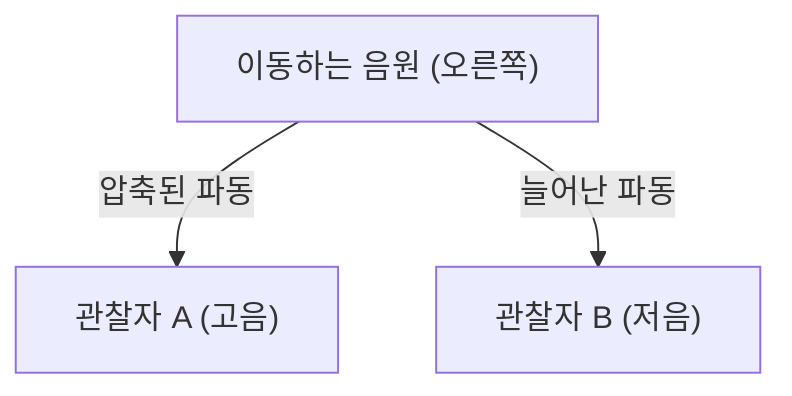

## 1. 구급차 사이렌의 수수께끼
구급차가 가까워질 때는 사이렌 소리가 높게 들리고, 지나쳐서 멀어질 때는 소리가 갑자기 낮게 들립니다. 이것이 '도플러 효과'의 가장 친숙한 예입니다.

## 2. 왜 소리가 변하는가?
소리는 공기의 파동(종파)입니다. 음원이 가까워지면 파동이 진행 방향으로 '압축'되어 파장이 짧아지고(고음이 됨), 멀어지면 파동이 '늘어나' 파장이 길어집니다(저음이 됨).

$$
f' = f \left( \frac{V \pm v_o}{V \mp v_s} \right)
$$

## 3. 빛의 도플러 효과(적색편이)
도플러 효과는 빛에서도 일어납니다. 멀어지는 별에서 방출된 빛은 파장이 늘어나 '붉게' 보입니다(적색편이).

## 4. 우주 팽창의 발견
에드윈 허블은 멀리 있는 은하일수록 적색편이가 크다는(＝빠르게 멀어지고 있다는) 것을 발견하고, "우주가 팽창하고 있다"는 빅뱅 이론의 강력한 증거를 찾아냈습니다.

## 추가 기술 검증 파트 1

### 3. 빛의 도플러 효과(적색편이)
도플러 효과는 빛에서도 일어납니다. 멀어지는 별에서 방출된 빛은 파장이 늘어나 '붉게' 보입니다(적색편이).

## 추가 기술 검증 파트 2

### 3. 빛의 도플러 효과(적색편이)
도플러 효과는 빛에서도 일어납니다. 멀어지는 별에서 방출된 빛은 파장이 늘어나 '붉게' 보입니다(적색편이).

## 추가 기술 검증 파트 3

### 3. 빛의 도플러 효과(적색편이)
도플러 효과는 빛에서도 일어납니다. 멀어지는 별에서 방출된 빛은 파장이 늘어나 '붉게' 보입니다(적색편이).

## 추가 기술 검증 파트 4

### 3. 빛의 도플러 효과(적색편이)
도플러 효과는 빛에서도 일어납니다. 멀어지는 별에서 방출된 빛은 파장이 늘어나 '붉게' 보입니다(적색편이).

## 추가 기술 검증 파트 5

### 3. 빛의 도플러 효과(적색편이)
도플러 효과는 빛에서도 일어납니다. 멀어지는 별에서 방출된 빛은 파장이 늘어나 '붉게' 보입니다(적색편이).

## 추가 기술 검증 파트 6

### 3. 빛의 도플러 효과(적색편이)
도플러 효과는 빛에서도 일어납니다. 멀어지는 별에서 방출된 빛은 파장이 늘어나 '붉게' 보입니다(적색편이).

## 추가 기술 검증 파트 7

### 3. 빛의 도플러 효과(적색편이)
도플러 효과는 빛에서도 일어납니다. 멀어지는 별에서 방출된 빛은 파장이 늘어나 '붉게' 보입니다(적색편이).

## 추가 기술 검증 파트 8

### 3. 빛의 도플러 효과(적색편이)
도플러 효과는 빛에서도 일어납니다. 멀어지는 별에서 방출된 빛은 파장이 늘어나 '붉게' 보입니다(적색편이).

## 추가 기술 검증 파트 9

### 3. 빛의 도플러 효과(적색편이)
도플러 효과는 빛에서도 일어납니다. 멀어지는 별에서 방출된 빛은 파장이 늘어나 '붉게' 보입니다(적색편이).

## 추가 기술 검증 파트 10

### 3. 빛의 도플러 효과(적색편이)
도플러 효과는 빛에서도 일어납니다. 멀어지는 별에서 방출된 빛은 파장이 늘어나 '붉게' 보입니다(적색편이).

## 추가 기술 검증 파트 11

### 3. 빛의 도플러 효과(적색편이)
도플러 효과는 빛에서도 일어납니다. 멀어지는 별에서 방출된 빛은 파장이 늘어나 '붉게' 보입니다(적색편이).

## 추가 기술 검증 파트 12

### 3. 빛의 도플러 효과(적색편이)
도플러 효과는 빛에서도 일어납니다. 멀어지는 별에서 방출된 빛은 파장이 늘어나 '붉게' 보입니다(적색편이).

## 추가 기술 검증 파트 13

### 3. 빛의 도플러 효과(적색편이)
도플러 효과는 빛에서도 일어납니다. 멀어지는 별에서 방출된 빛은 파장이 늘어나 '붉게' 보입니다(적색편이).

## 추가 기술 검증 파트 14

### 3. 빛의 도플러 효과(적색편이)
도플러 효과는 빛에서도 일어납니다. 멀어지는 별에서 방출된 빛은 파장이 늘어나 '붉게' 보입니다(적색편이).

