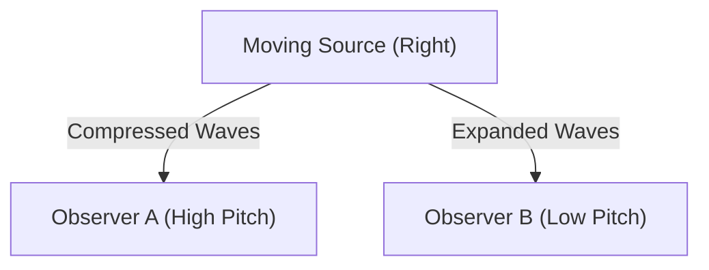

## 1. 救急車のサイレンの謎
救急車が近づいてくるときはサイレンの音が高く聞こえ、通り過ぎて遠ざかるときは音が急に低く聞こえます。これが「ドップラー効果」の最も身近な例です。

## 2. なぜ音が変わるのか？
音は空気の波（疎密波）です。音源が近づくと、波が進行方向に「圧縮」されて波長が短くなり（高音になる）、遠ざかると波が「引き伸ばされて」波長が長くなります（低音になる）。

$$
f' = f \left( \frac{V \pm v_o}{V \mp v_s} \right)
$$

## 3. 光のドップラー効果（赤方偏移）
ドップラー効果は光にも起こります。遠ざかる星から発せられた光は、波長が伸びて「赤っぽく」見えます（赤方偏移）。

## 4. 宇宙の膨張の発見
エドウィン・ハッブルは、遠くの銀河ほど赤方偏移が大きい（＝速く遠ざかっている）ことを発見し、「宇宙が膨張している」というビッグバン理論の強力な証拠を見つけました。

## 追加技術検証パート 1

### 1. 救急車のサイレンの謎
救急車が近づいてくるときはサイレンの音が高く聞こえ、通り過ぎて遠ざかるときは音が急に低く聞こえます。これが「ドップラー効果」の最も身近な例です。

### 2. なぜ音が変わるのか？
音は空気の波（疎密波）です。音源が近づくと、波が進行方向に「圧縮」されて波長が短くなり（高音になる）、遠ざかると波が「引き伸ばされて」波長が長くなります（低音になる）。

$$
f' = f \left( \frac{V \pm v_o}{V \mp v_s} \right)
$$

### 3. 光のドップラー効果（赤方偏移）
ドップラー効果は光にも起こります。遠ざかる星から発せられた光は、波長が伸びて「赤っぽく」見えます（赤方偏移）。

### 4. 宇宙の膨張の発見
エドウィン・ハッブルは、遠くの銀河ほど赤方偏移が大きい（＝速く遠ざかっている）ことを発見し、「宇宙が膨張している」というビッグバン理論の強力な証拠を見つけました。

## 追加技術検証パート 2

### 1. 救急車のサイレンの謎
救急車が近づいてくるときはサイレンの音が高く聞こえ、通り過ぎて遠ざかるときは音が急に低く聞こえます。これが「ドップラー効果」の最も身近な例です。

### 2. なぜ音が変わるのか？
音は空気の波（疎密波）です。音源が近づくと、波が進行方向に「圧縮」されて波長が短くなり（高音になる）、遠ざかると波が「引き伸ばされて」波長が長くなります（低音になる）。

$$
f' = f \left( \frac{V \pm v_o}{V \mp v_s} \right)
$$

### 3. 光のドップラー効果（赤方偏移）
ドップラー効果は光にも起こります。遠ざかる星から発せられた光は、波長が伸びて「赤っぽく」見えます（赤方偏移）。

### 4. 宇宙の膨張の発見
エドウィン・ハッブルは、遠くの銀河ほど赤方偏移が大きい（＝速く遠ざかっている）ことを発見し、「宇宙が膨張している」というビッグバン理論の強力な証拠を見つけました。

## 追加技術検証パート 3

### 1. 救急車のサイレンの謎
救急車が近づいてくるときはサイレンの音が高く聞こえ、通り過ぎて遠ざかるときは音が急に低く聞こえます。これが「ドップラー効果」の最も身近な例です。

### 2. なぜ音が変わるのか？
音は空気の波（疎密波）です。音源が近づくと、波が進行方向に「圧縮」されて波長が短くなり（高音になる）、遠ざかると波が「引き伸ばされて」波長が長くなります（低音になる）。

$$
f' = f \left( \frac{V \pm v_o}{V \mp v_s} \right)
$$

### 3. 光のドップラー効果（赤方偏移）
ドップラー効果は光にも起こります。遠ざかる星から発せられた光は、波長が伸びて「赤っぽく」見えます（赤方偏移）。

### 4. 宇宙の膨張の発見
エドウィン・ハッブルは、遠くの銀河ほど赤方偏移が大きい（＝速く遠ざかっている）ことを発見し、「宇宙が膨張している」というビッグバン理論の強力な証拠を見つけました。

## 追加技術検証パート 4

### 1. 救急車のサイレンの謎
救急車が近づいてくるときはサイレンの音が高く聞こえ、通り過ぎて遠ざかるときは音が急に低く聞こえます。これが「ドップラー効果」の最も身近な例です。

### 2. なぜ音が変わるのか？
音は空気の波（疎密波）です。音源が近づくと、波が進行方向に「圧縮」されて波長が短くなり（高音になる）、遠ざかると波が「引き伸ばされて」波長が長くなります（低音になる）。

$$
f' = f \left( \frac{V \pm v_o}{V \mp v_s} \right)
$$

### 3. 光のドップラー効果（赤方偏移）
ドップラー効果は光にも起こります。遠ざかる星から発せられた光は、波長が伸びて「赤っぽく」見えます（赤方偏移）。

### 4. 宇宙の膨張の発見
エドウィン・ハッブルは、遠くの銀河ほど赤方偏移が大きい（＝速く遠ざかっている）ことを発見し、「宇宙が膨張している」というビッグバン理論の強力な証拠を見つけました。

## 追加技術検証パート 5

### 1. 救急車のサイレンの謎
救急車が近づいてくるときはサイレンの音が高く聞こえ、通り過ぎて遠ざかるときは音が急に低く聞こえます。これが「ドップラー効果」の最も身近な例です。

### 2. なぜ音が変わるのか？
音は空気の波（疎密波）です。音源が近づくと、波が進行方向に「圧縮」されて波長が短くなり（高音になる）、遠ざかると波が「引き伸ばされて」波長が長くなります（低音になる）。

$$
f' = f \left( \frac{V \pm v_o}{V \mp v_s} \right)
$$

### 3. 光のドップラー効果（赤方偏移）
ドップラー効果は光にも起こります。遠ざかる星から発せられた光は、波長が伸びて「赤っぽく」見えます（赤方偏移）。

### 4. 宇宙の膨張の発見
エドウィン・ハッブルは、遠くの銀河ほど赤方偏移が大きい（＝速く遠ざかっている）ことを発見し、「宇宙が膨張している」というビッグバン理論の強力な証拠を見つけました。

## 追加技術検証パート 6

### 1. 救急車のサイレンの謎
救急車が近づいてくるときはサイレンの音が高く聞こえ、通り過ぎて遠ざかるときは音が急に低く聞こえます。これが「ドップラー効果」の最も身近な例です。

### 2. なぜ音が変わるのか？
音は空気の波（疎密波）です。音源が近づくと、波が進行方向に「圧縮」されて波長が短くなり（高音になる）、遠ざかると波が「引き伸ばされて」波長が長くなります（低音になる）。

$$
f' = f \left( \frac{V \pm v_o}{V \mp v_s} \right)
$$

### 3. 光のドップラー効果（赤方偏移）
ドップラー効果は光にも起こります。遠ざかる星から発せられた光は、波長が伸びて「赤っぽく」見えます（赤方偏移）。

### 4. 宇宙の膨張の発見
エドウィン・ハッブルは、遠くの銀河ほど赤方偏移が大きい（＝速く遠ざかっている）ことを発見し、「宇宙が膨張している」というビッグバン理論の強力な証拠を見つけました。

## 追加技術検証パート 7

### 1. 救急車のサイレンの謎
救急車が近づいてくるときはサイレンの音が高く聞こえ、通り過ぎて遠ざかるときは音が急に低く聞こえます。これが「ドップラー効果」の最も身近な例です。

### 2. なぜ音が変わるのか？
音は空気の波（疎密波）です。音源が近づくと、波が進行方向に「圧縮」されて波長が短くなり（高音になる）、遠ざかると波が「引き伸ばされて」波長が長くなります（低音になる）。

$$
f' = f \left( \frac{V \pm v_o}{V \mp v_s} \right)
$$

### 3. 光のドップラー効果（赤方偏移）
ドップラー効果は光にも起こります。遠ざかる星から発せられた光は、波長が伸びて「赤っぽく」見えます（赤方偏移）。

### 4. 宇宙の膨張の発見
エドウィン・ハッブルは、遠くの銀河ほど赤方偏移が大きい（＝速く遠ざかっている）ことを発見し、「宇宙が膨張している」というビッグバン理論の強力な証拠を見つけました。

## 追加技術検証パート 8

### 1. 救急車のサイレンの謎
救急車が近づいてくるときはサイレンの音が高く聞こえ、通り過ぎて遠ざかるときは音が急に低く聞こえます。これが「ドップラー効果」の最も身近な例です。

### 2. なぜ音が変わるのか？
音は空気の波（疎密波）です。音源が近づくと、波が進行方向に「圧縮」されて波長が短くなり（高音になる）、遠ざかると波が「引き伸ばされて」波長が長くなります（低音になる）。

$$
f' = f \left( \frac{V \pm v_o}{V \mp v_s} \right)
$$

### 3. 光のドップラー効果（赤方偏移）
ドップラー効果は光にも起こります。遠ざかる星から発せられた光は、波長が伸びて「赤っぽく」見えます（赤方偏移）。

### 4. 宇宙の膨張の発見
エドウィン・ハッブルは、遠くの銀河ほど赤方偏移が大きい（＝速く遠ざかっている）ことを発見し、「宇宙が膨張している」というビッグバン理論の強力な証拠を見つけました。

## 追加技術検証パート 9

### 1. 救急車のサイレンの謎
救急車が近づいてくるときはサイレンの音が高く聞こえ、通り過ぎて遠ざかるときは音が急に低く聞こえます。これが「ドップラー効果」の最も身近な例です。

### 2. なぜ音が変わるのか？
音は空気の波（疎密波）です。音源が近づくと、波が進行方向に「圧縮」されて波長が短くなり（高音になる）、遠ざかると波が「引き伸ばされて」波長が長くなります（低音になる）。

$$
f' = f \left( \frac{V \pm v_o}{V \mp v_s} \right)
$$

### 3. 光のドップラー効果（赤方偏移）
ドップラー効果は光にも起こります。遠ざかる星から発せられた光は、波長が伸びて「赤っぽく」見えます（赤方偏移）。

### 4. 宇宙の膨張の発見
エドウィン・ハッブルは、遠くの銀河ほど赤方偏移が大きい（＝速く遠ざかっている）ことを発見し、「宇宙が膨張している」というビッグバン理論の強力な証拠を見つけました。

## 追加技術検証パート 10

### 1. 救急車のサイレンの謎
救急車が近づいてくるときはサイレンの音が高く聞こえ、通り過ぎて遠ざかるときは音が急に低く聞こえます。これが「ドップラー効果」の最も身近な例です。

### 2. なぜ音が変わるのか？
音は空気の波（疎密波）です。音源が近づくと、波が進行方向に「圧縮」されて波長が短くなり（高音になる）、遠ざかると波が「引き伸ばされて」波長が長くなります（低音になる）。

$$
f' = f \left( \frac{V \pm v_o}{V \mp v_s} \right)
$$

### 3. 光のドップラー効果（赤方偏移）
ドップラー効果は光にも起こります。遠ざかる星から発せられた光は、波長が伸びて「赤っぽく」見えます（赤方偏移）。

### 4. 宇宙の膨張の発見
エドウィン・ハッブルは、遠くの銀河ほど赤方偏移が大きい（＝速く遠ざかっている）ことを発見し、「宇宙が膨張している」というビッグバン理論の強力な証拠を見つけました。

## 追加技術検証パート 11

### 1. 救急車のサイレンの謎
救急車が近づいてくるときはサイレンの音が高く聞こえ、通り過ぎて遠ざかるときは音が急に低く聞こえます。これが「ドップラー効果」の最も身近な例です。

### 2. なぜ音が変わるのか？
音は空気の波（疎密波）です。音源が近づくと、波が進行方向に「圧縮」されて波長が短くなり（高音になる）、遠ざかると波が「引き伸ばされて」波長が長くなります（低音になる）。

$$
f' = f \left( \frac{V \pm v_o}{V \mp v_s} \right)
$$

### 3. 光のドップラー効果（赤方偏移）
ドップラー効果は光にも起こります。遠ざかる星から発せられた光は、波長が伸びて「赤っぽく」見えます（赤方偏移）。

### 4. 宇宙の膨張の発見
エドウィン・ハッブルは、遠くの銀河ほど赤方偏移が大きい（＝速く遠ざかっている）ことを発見し、「宇宙が膨張している」というビッグバン理論の強力な証拠を見つけました。

## 追加技術検証パート 12

### 1. 救急車のサイレンの謎
救急車が近づいてくるときはサイレンの音が高く聞こえ、通り過ぎて遠ざかるときは音が急に低く聞こえます。これが「ドップラー効果」の最も身近な例です。

### 2. なぜ音が変わるのか？
音は空気の波（疎密波）です。音源が近づくと、波が進行方向に「圧縮」されて波長が短くなり（高音になる）、遠ざかると波が「引き伸ばされて」波長が長くなります（低音になる）。

$$
f' = f \left( \frac{V \pm v_o}{V \mp v_s} \right)
$$

### 3. 光のドップラー効果（赤方偏移）
ドップラー効果は光にも起こります。遠ざかる星から発せられた光は、波長が伸びて「赤っぽく」見えます（赤方偏移）。

### 4. 宇宙の膨張の発見
エドウィン・ハッブルは、遠くの銀河ほど赤方偏移が大きい（＝速く遠ざかっている）ことを発見し、「宇宙が膨張している」というビッグバン理論の強力な証拠を見つけました。

## 追加技術検証パート 13

### 1. 救急車のサイレンの謎
救急車が近づいてくるときはサイレンの音が高く聞こえ、通り過ぎて遠ざかるときは音が急に低く聞こえます。これが「ドップラー効果」の最も身近な例です。

### 2. なぜ音が変わるのか？
音は空気の波（疎密波）です。音源が近づくと、波が進行方向に「圧縮」されて波長が短くなり（高音になる）、遠ざかると波が「引き伸ばされて」波長が長くなります（低音になる）。

$$
f' = f \left( \frac{V \pm v_o}{V \mp v_s} \right)
$$

### 3. 光のドップラー効果（赤方偏移）
ドップラー効果は光にも起こります。遠ざかる星から発せられた光は、波長が伸びて「赤っぽく」見えます（赤方偏移）。

### 4. 宇宙の膨張の発見
エドウィン・ハッブルは、遠くの銀河ほど赤方偏移が大きい（＝速く遠ざかっている）ことを発見し、「宇宙が膨張している」というビッグバン理論の強力な証拠を見つけました。

## 追加技術検証パート 14

### 1. 救急車のサイレンの謎
救急車が近づいてくるときはサイレンの音が高く聞こえ、通り過ぎて遠ざかるときは音が急に低く聞こえます。これが「ドップラー効果」の最も身近な例です。

### 2. なぜ音が変わるのか？
音は空気の波（疎密波）です。音源が近づくと、波が進行方向に「圧縮」されて波長が短くなり（高音になる）、遠ざかると波が「引き伸ばされて」波長が長くなります（低音になる）。

$$
f' = f \left( \frac{V \pm v_o}{V \mp v_s} \right)
$$

### 3. 光のドップラー効果（赤方偏移）
ドップラー効果は光にも起こります。遠ざかる星から発せられた光は、波長が伸びて「赤っぽく」見えます（赤方偏移）。

### 4. 宇宙の膨張の発見
エドウィン・ハッブルは、遠くの銀河ほど赤方偏移が大きい（＝速く遠ざかっている）ことを発見し、「宇宙が膨張している」というビッグバン理論の強力な証拠を見つけました。
