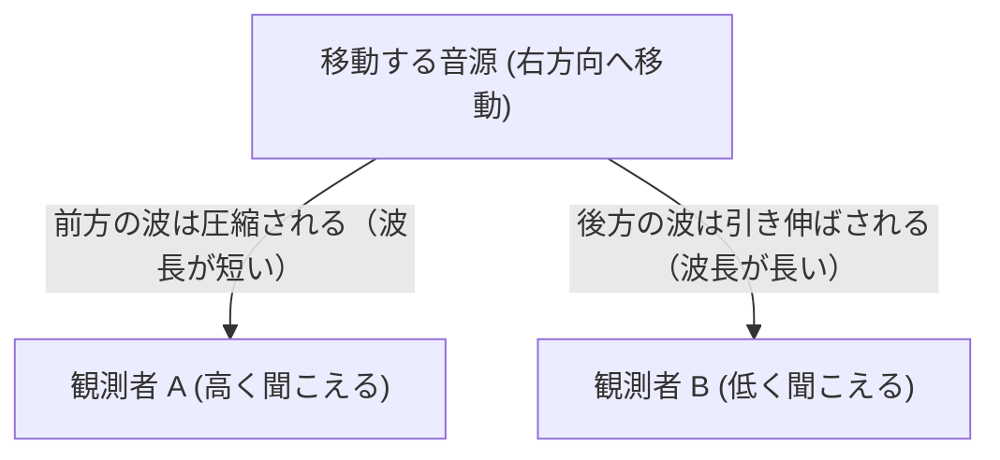

## 1. 救急車のサイレンの謎：私たちが日常的に体験するドップラー効果

道を歩いているとき、遠くからサイレンを鳴らした救急車が近づいてくるとします。その時、サイレンの音は普段より高く聞こえ、目の前を通り過ぎた瞬間に急激に低く聞こえるという経験は、誰もが一度はしたことがあるでしょう。「ピーポーピーポー」という音が、通り過ぎた途端に「ピーポーピーポー↓」と変化するあの現象です。

これが、物理学において「ドップラー効果（Doppler Effect）」と呼ばれる非常に重要かつ興味深い現象の最も身近な例です。ドップラー効果とは、波（音波や光波など）の発生源（音源や光源）と観測者との相対的な速度によって、波の周波数が異なって観測される現象のことを指します。1842年、オーストリアの物理学者クリスチャン・ドップラーによって初めて提唱されました。

一見すると単なる「音の変化」に過ぎないように思えるドップラー効果ですが、実はこの法則を応用することで、気象観測、医療機器、さらには宇宙全体の構造や歴史までもが解き明かされてきました。本記事では、このドップラー効果がなぜ起こるのかという基本的なメカニズムから、現代科学における驚くべき応用例までを詳細に解説します。

## 2. なぜ音が変わるのか？波の性質から読み解くメカニズム

音は、空気などの媒質を伝わる「縦波（疎密波）」です。音源が振動することで周囲の空気が圧縮されたり膨張したりを繰り返し、それが波となって私たちの耳の鼓膜を振動させることで「音」として認識されます。

では、なぜ音源が動くと音の高さが変わるのでしょうか？
音の高さ（ピッチ）は、1秒間に耳に届く波の数、すなわち「周波数」によって決まります。周波数が高い（波の数が多い）ほど高音に、周波数が低い（波の数が少ない）ほど低音に聞こえます。

**音源が近づく場合**
音源が観測者に向かって移動しながら音を出していると、音源自身が前に進みながら次の波を作り出すことになります。そのため、音源の前方では波と波の間隔（波長）が「圧縮」された状態になります。波長が短くなるということは、観測者に届く波の密度が高くなり、1秒間に受け取る波の数（周波数）が増えることを意味します。結果として、音が通常よりも高く聞こえるのです。

**音源が遠ざかる場合**
逆に、音源が観測者から遠ざかりながら音を出すと、音源は後ろに取り残されるように次の波を作ります。これにより、音源の後方では波と波の間隔が「引き伸ばされた」状態になります。波長が長くなると、観測者に届く波の密度が低くなり、周波数が減少します。結果として、音は通常よりも低く聞こえます。

この現象を視覚的に表現すると、以下のようになります。

## 3. 数式で見るドップラー効果

ドップラー効果は、高校物理でも必ず学ぶ重要なテーマです。現象を定量的に理解するために、基本的な数式を見てみましょう。

観測者が聞く音の振動数（周波数）を $f'$、音源が発する本来の振動数を $f$、音の伝わる速さ（音速）を $V$、観測者の動く速さを $v_o$、音源の動く速さを $v_s$ とすると、以下の公式で表されます。

$$
f' = f \left( \frac{V \pm v_o}{V \mp v_s} \right)
$$

この式の意味を少し噛み砕いてみましょう。
- 分子 $(V \pm v_o)$ は、**観測者が動くことによる影響**を示しています。観測者が音源に向かって動く場合は「＋」、遠ざかる場合は「−」になります。自分が音に向かって突進すれば、より多くの波を短時間で受けるため音が高くなる、というイメージです。
- 分母 $(V \mp v_s)$ は、**音源が動くことによる影響**を示しています。音源が観測者に向かって近づく場合は「−」、遠ざかる場合は「＋」になります。分母が小さくなれば全体の値 $f'$ は大きくなる（音が高くなる）ので、音源が近づくと音が高くなるという現象と一致します。

このように、数式を読み解くことで、ドップラー効果が「音速・音源の速度・観測者の速度」という3つの要素の相互関係によって生じることがはっきりと理解できます。

## 4. 光のドップラー効果：赤方偏移と青方偏移

ドップラー効果は、音波だけでなく「光（電磁波）」でも同じように発生します。ただし、光速は非常に速いため（秒速約30万キロメートル）、日常の生活スピードで光のドップラー効果を感じることはまずありません。しかし、宇宙のような途方もないスケールや速度を扱う世界では、これが決定的な役割を果たします。

光にも波長があり、人間の目には波長の違いが「色」として認識されます。可視光の中で波長が長いものは赤色に、波長が短いものは青色（または紫色）に見えます。

- **赤方偏移（Redshift）**：光源が観測者から遠ざかっている場合、光の波長が引き伸ばされます。これにより、本来の光よりもスペクトルが赤い方（波長が長い方）へずれて観測されます。
- **青方偏移（Blueshift）**：光源が観測者に近づいている場合、光の波長が圧縮され、スペクトルが青い方（波長が短い方）へずれて観測されます。

この「光の色が変化する現象」を利用することで、天文学者たちは遠くの星や銀河が地球に対して近づいているのか、それとも遠ざかっているのか、そしてその速度はどのくらいかを正確に測定することができるのです。

## 5. 医療や社会で活躍するドップラー効果

ドップラー効果は、決して遠い宇宙だけの話ではありません。私たちの現代社会の様々な分野で、欠かせない技術として応用されています。

### ドップラー・レーダー（気象観測・速度違反取締り）
気象庁などが雨雲の動きを観測するために使用しているのが「気象ドップラー・レーダー」です。電波を雨粒に向けて発射し、跳ね返ってきた電波（反射波）の周波数の変化（ドップラー効果）を測定します。これにより、雨雲の中の雨粒が近づいているのか遠ざかっているのか、つまり風の動きを立体的に把握し、竜巻や突風の予測に役立てています。
また、警察が速度違反を取り締まるための「スピードガン」や、野球の球速を測る装置も、全く同じ原理で動いています。

### ドップラー超音波検査（エコー検査）
医療現場では、超音波（人間には聞こえない高い周波数の音）を利用したドップラー検査が日常的に行われています。体内に超音波を当て、血管内を流れる赤血球から跳ね返ってくる音波のドップラー効果を解析します。これにより、血流の速さや方向をリアルタイムで画像化でき、心臓の弁の異常や血管の詰まりなどを、体をメスで切ることなく安全に診断することができます。

## 6. 宇宙の膨張の発見：エドウィン・ハッブルとビッグバン理論

ドップラー効果の応用例として最も偉大な発見の1つが、「宇宙が膨張している」という事実の証明です。

1920年代、アメリカの天文学者エドウィン・ハッブルは、様々な銀河からの光を観測していました。そこで彼は驚くべき事実に気づきます。観測したほぼすべての銀河の光が「赤方偏移」を起こしていたのです。これは、ほぼすべての銀河が地球から遠ざかっていることを意味します。

さらにハッブルは、地球から遠く離れている銀河ほど、赤方偏移の度合いが大きい（＝より速いスピードで遠ざかっている）ことを発見しました。これを「ハッブル・ルメートルの法則」と呼びます。
「あらゆるものが互いに遠ざかっている」というこの現象は、宇宙空間そのものが風船のように膨張していると考えなければ説明がつきません。

この発見は、宇宙には始まりがあり、過去に遡ると宇宙は1つの極めて高温・高密度の点だったはずだとする「ビッグバン理論」の強力な証拠となりました。救急車のサイレンから始まったドップラー効果の探求が、最終的に宇宙の誕生の謎を解き明かす鍵となったのです。

## 7. おわりに：身近な現象から宇宙の真理へ

私たちが道を歩いていて何気なく耳にする救急車のサイレン。その音の高さの変化には、宇宙の果てで起きている銀河の動きや、生命を救う医療技術、さらには目に見えない風の動きを捉える技術まで、驚くほど幅広い科学の真理が隠されています。

「ドップラー効果」は、一見複雑な物理学が、いかに私たちの日常と密接に関わり、そして壮大な宇宙のロマンへと繋がっているかを教えてくれる最高の入り口です。次回、サイレンの音が通り過ぎて低く変化するのを耳にしたときは、ぜひその音の波がどのように圧縮され、引き伸ばされているのかを想像し、さらには宇宙の彼方で赤く輝きながら遠ざかる銀河の姿にまで思いを馳せてみてください。
