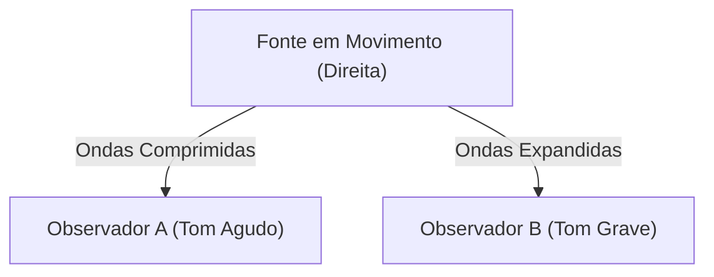

## 1. O Mistério da Sirene da Ambulância
Quando uma ambulância se aproxima, o som da sua sirene parece mais agudo, e quando passa e se afasta, o som de repente parece mais grave. Este é o exemplo mais familiar do "Efeito Doppler".

## 2. Por Que o Som Muda?
O som é uma onda no ar (onda longitudinal). Quando a fonte sonora se aproxima, as ondas são "comprimidas" na direção do movimento, encurtando o comprimento de onda (tornando-se um som agudo), e quando se afasta, as ondas são "esticadas", alongando o comprimento de onda (tornando-se um som grave).

$$
f' = f \left( \frac{V \pm v_o}{V \mp v_s} \right)
$$

## 3. Efeito Doppler da Luz (Desvio para o Vermelho)
O efeito Doppler também ocorre com a luz. A luz emitida por uma estrela que se afasta tem seu comprimento de onda alongado e parece "avermelhada" (desvio para o vermelho).

## 4. A Descoberta da Expansão do Universo
Edwin Hubble descobriu que quanto mais distante está uma galáxia, maior é o seu desvio para o vermelho (= mais rápido ela está se afastando), encontrando fortes evidências para a teoria do Big Bang de que "o universo está se expandindo".

## Parte de Verificação Técnica Adicional 1

### 1. O Mistério da Sirene da Ambulância
Quando uma ambulância se aproxima, o som da sua sirene parece mais agudo, e quando passa e se afasta, o som de repente parece mais grave. Este é o exemplo mais familiar do "Efeito Doppler".

### 2. Por Que o Som Muda?
O som é uma onda no ar (onda longitudinal). Quando a fonte sonora se aproxima, as ondas são "comprimidas" na direção do movimento, encurtando o comprimento de onda (tornando-se um som agudo), e quando se afasta, as ondas são "esticadas", alongando o comprimento de onda (tornando-se um som grave).

$$
f' = f \left( \frac{V \pm v_o}{V \mp v_s} \right)
$$

### 3. Efeito Doppler da Luz (Desvio para o Vermelho)
O efeito Doppler também ocorre com a luz. A luz emitida por uma estrela que se afasta tem seu comprimento de onda alongado e parece "avermelhada" (desvio para o vermelho).

### 4. A Descoberta da Expansão do Universo
Edwin Hubble descobriu que quanto mais distante está uma galáxia, maior é o seu desvio para o vermelho (= mais rápido ela está se afastando), encontrando fortes evidências para a teoria do Big Bang de que "o universo está se expandindo".

## Parte de Verificação Técnica Adicional 2

### 1. O Mistério da Sirene da Ambulância
Quando uma ambulância se aproxima, o som da sua sirene parece mais agudo, e quando passa e se afasta, o som de repente parece mais grave. Este é o exemplo mais familiar do "Efeito Doppler".

### 2. Por Que o Som Muda?
O som é uma onda no ar (onda longitudinal). Quando a fonte sonora se aproxima, as ondas são "comprimidas" na direção do movimento, encurtando o comprimento de onda (tornando-se um som agudo), e quando se afasta, as ondas são "esticadas", alongando o comprimento de onda (tornando-se um som grave).

$$
f' = f \left( \frac{V \pm v_o}{V \mp v_s} \right)
$$

### 3. Efeito Doppler da Luz (Desvio para o Vermelho)
O efeito Doppler também ocorre com a luz. A luz emitida por uma estrela que se afasta tem seu comprimento de onda alongado e parece "avermelhada" (desvio para o vermelho).

### 4. A Descoberta da Expansão do Universo
Edwin Hubble descobriu que quanto mais distante está uma galáxia, maior é o seu desvio para o vermelho (= mais rápido ela está se afastando), encontrando fortes evidências para a teoria do Big Bang de que "o universo está se expandindo".

## Parte de Verificação Técnica Adicional 3

### 1. O Mistério da Sirene da Ambulância
Quando uma ambulância se aproxima, o som da sua sirene parece mais agudo, e quando passa e se afasta, o som de repente parece mais grave. Este é o exemplo mais familiar do "Efeito Doppler".

### 2. Por Que o Som Muda?
O som é uma onda no ar (onda longitudinal). Quando a fonte sonora se aproxima, as ondas são "comprimidas" na direção do movimento, encurtando o comprimento de onda (tornando-se um som agudo), e quando se afasta, as ondas são "esticadas", alongando o comprimento de onda (tornando-se um som grave).

$$
f' = f \left( \frac{V \pm v_o}{V \mp v_s} \right)
$$

### 3. Efeito Doppler da Luz (Desvio para o Vermelho)
O efeito Doppler também ocorre com a luz. A luz emitida por uma estrela que se afasta tem seu comprimento de onda alongado e parece "avermelhada" (desvio para o vermelho).

### 4. A Descoberta da Expansão do Universo
Edwin Hubble descobriu que quanto mais distante está uma galáxia, maior é o seu desvio para o vermelho (= mais rápido ela está se afastando), encontrando fortes evidências para a teoria do Big Bang de que "o universo está se expandindo".

## Parte de Verificação Técnica Adicional 4

### 1. O Mistério da Sirene da Ambulância
Quando uma ambulância se aproxima, o som da sua sirene parece mais agudo, e quando passa e se afasta, o som de repente parece mais grave. Este é o exemplo mais familiar do "Efeito Doppler".

### 2. Por Que o Som Muda?
O som é uma onda no ar (onda longitudinal). Quando a fonte sonora se aproxima, as ondas são "comprimidas" na direção do movimento, encurtando o comprimento de onda (tornando-se um som agudo), e quando se afasta, as ondas são "esticadas", alongando o comprimento de onda (tornando-se um som grave).

$$
f' = f \left( \frac{V \pm v_o}{V \mp v_s} \right)
$$

### 3. Efeito Doppler da Luz (Desvio para o Vermelho)
O efeito Doppler também ocorre com a luz. A luz emitida por uma estrela que se afasta tem seu comprimento de onda alongado e parece "avermelhada" (desvio para o vermelho).

### 4. A Descoberta da Expansão do Universo
Edwin Hubble descobriu que quanto mais distante está uma galáxia, maior é o seu desvio para o vermelho (= mais rápido ela está se afastando), encontrando fortes evidências para a teoria do Big Bang de que "o universo está se expandindo".

## Parte de Verificação Técnica Adicional 5

### 1. O Mistério da Sirene da Ambulância
Quando uma ambulância se aproxima, o som da sua sirene parece mais agudo, e quando passa e se afasta, o som de repente parece mais grave. Este é o exemplo mais familiar do "Efeito Doppler".

### 2. Por Que o Som Muda?
O som é uma onda no ar (onda longitudinal). Quando a fonte sonora se aproxima, as ondas são "comprimidas" na direção do movimento, encurtando o comprimento de onda (tornando-se um som agudo), e quando se afasta, as ondas são "esticadas", alongando o comprimento de onda (tornando-se um som grave).

$$
f' = f \left( \frac{V \pm v_o}{V \mp v_s} \right)
$$

### 3. Efeito Doppler da Luz (Desvio para o Vermelho)
O efeito Doppler também ocorre com a luz. A luz emitida por uma estrela que se afasta tem seu comprimento de onda alongado e parece "avermelhada" (desvio para o vermelho).

### 4. A Descoberta da Expansão do Universo
Edwin Hubble descobriu que quanto mais distante está uma galáxia, maior é o seu desvio para o vermelho (= mais rápido ela está se afastando), encontrando fortes evidências para a teoria do Big Bang de que "o universo está se expandindo".

## Parte de Verificação Técnica Adicional 6

### 1. O Mistério da Sirene da Ambulância
Quando uma ambulância se aproxima, o som da sua sirene parece mais agudo, e quando passa e se afasta, o som de repente parece mais grave. Este é o exemplo mais familiar do "Efeito Doppler".

### 2. Por Que o Som Muda?
O som é uma onda no ar (onda longitudinal). Quando a fonte sonora se aproxima, as ondas são "comprimidas" na direção do movimento, encurtando o comprimento de onda (tornando-se um som agudo), e quando se afasta, as ondas são "esticadas", alongando o comprimento de onda (tornando-se um som grave).

$$
f' = f \left( \frac{V \pm v_o}{V \mp v_s} \right)
$$

### 3. Efeito Doppler da Luz (Desvio para o Vermelho)
O efeito Doppler também ocorre com a luz. A luz emitida por uma estrela que se afasta tem seu comprimento de onda alongado e parece "avermelhada" (desvio para o vermelho).

### 4. A Descoberta da Expansão do Universo
Edwin Hubble descobriu que quanto mais distante está uma galáxia, maior é o seu desvio para o vermelho (= mais rápido ela está se afastando), encontrando fortes evidências para a teoria do Big Bang de que "o universo está se expandindo".

## Parte de Verificação Técnica Adicional 7

### 1. O Mistério da Sirene da Ambulância
Quando uma ambulância se aproxima, o som da sua sirene parece mais agudo, e quando passa e se afasta, o som de repente parece mais grave. Este é o exemplo mais familiar do "Efeito Doppler".

### 2. Por Que o Som Muda?
O som é uma onda no ar (onda longitudinal). Quando a fonte sonora se aproxima, as ondas são "comprimidas" na direção do movimento, encurtando o comprimento de onda (tornando-se um som agudo), e quando se afasta, as ondas são "esticadas", alongando o comprimento de onda (tornando-se um som grave).

$$
f' = f \left( \frac{V \pm v_o}{V \mp v_s} \right)
$$

### 3. Efeito Doppler da Luz (Desvio para o Vermelho)
O efeito Doppler também ocorre com a luz. A luz emitida por uma estrela que se afasta tem seu comprimento de onda alongado e parece "avermelhada" (desvio para o vermelho).

### 4. A Descoberta da Expansão do Universo
Edwin Hubble descobriu que quanto mais distante está uma galáxia, maior é o seu desvio para o vermelho (= mais rápido ela está se afastando), encontrando fortes evidências para a teoria do Big Bang de que "o universo está se expandindo".

## Parte de Verificação Técnica Adicional 8

### 1. O Mistério da Sirene da Ambulância
Quando uma ambulância se aproxima, o som da sua sirene parece mais agudo, e quando passa e se afasta, o som de repente parece mais grave. Este é o exemplo mais familiar do "Efeito Doppler".

### 2. Por Que o Som Muda?
O som é uma onda no ar (onda longitudinal). Quando a fonte sonora se aproxima, as ondas são "comprimidas" na direção do movimento, encurtando o comprimento de onda (tornando-se um som agudo), e quando se afasta, as ondas são "esticadas", alongando o comprimento de onda (tornando-se um som grave).

$$
f' = f \left( \frac{V \pm v_o}{V \mp v_s} \right)
$$

### 3. Efeito Doppler da Luz (Desvio para o Vermelho)
O efeito Doppler também ocorre com a luz. A luz emitida por uma estrela que se afasta tem seu comprimento de onda alongado e parece "avermelhada" (desvio para o vermelho).

### 4. A Descoberta da Expansão do Universo
Edwin Hubble descobriu que quanto mais distante está uma galáxia, maior é o seu desvio para o vermelho (= mais rápido ela está se afastando), encontrando fortes evidências para a teoria do Big Bang de que "o universo está se expandindo".

## Parte de Verificação Técnica Adicional 9

### 1. O Mistério da Sirene da Ambulância
Quando uma ambulância se aproxima, o som da sua sirene parece mais agudo, e quando passa e se afasta, o som de repente parece mais grave. Este é o exemplo mais familiar do "Efeito Doppler".

### 2. Por Que o Som Muda?
O som é uma onda no ar (onda longitudinal). Quando a fonte sonora se aproxima, as ondas são "comprimidas" na direção do movimento, encurtando o comprimento de onda (tornando-se um som agudo), e quando se afasta, as ondas são "esticadas", alongando o comprimento de onda (tornando-se um som grave).

$$
f' = f \left( \frac{V \pm v_o}{V \mp v_s} \right)
$$

### 3. Efeito Doppler da Luz (Desvio para o Vermelho)
O efeito Doppler também ocorre com a luz. A luz emitida por uma estrela que se afasta tem seu comprimento de onda alongado e parece "avermelhada" (desvio para o vermelho).

### 4. A Descoberta da Expansão do Universo
Edwin Hubble descobriu que quanto mais distante está uma galáxia, maior é o seu desvio para o vermelho (= mais rápido ela está se afastando), encontrando fortes evidências para a teoria do Big Bang de que "o universo está se expandindo".

## Parte de Verificação Técnica Adicional 10

### 1. O Mistério da Sirene da Ambulância
Quando uma ambulância se aproxima, o som da sua sirene parece mais agudo, e quando passa e se afasta, o som de repente parece mais grave. Este é o exemplo mais familiar do "Efeito Doppler".

### 2. Por Que o Som Muda?
O som é uma onda no ar (onda longitudinal). Quando a fonte sonora se aproxima, as ondas são "comprimidas" na direção do movimento, encurtando o comprimento de onda (tornando-se um som agudo), e quando se afasta, as ondas são "esticadas", alongando o comprimento de onda (tornando-se um som grave).

$$
f' = f \left( \frac{V \pm v_o}{V \mp v_s} \right)
$$

### 3. Efeito Doppler da Luz (Desvio para o Vermelho)
O efeito Doppler também ocorre com a luz. A luz emitida por uma estrela que se afasta tem seu comprimento de onda alongado e parece "avermelhada" (desvio para o vermelho).

### 4. A Descoberta da Expansão do Universo
Edwin Hubble descobriu que quanto mais distante está uma galáxia, maior é o seu desvio para o vermelho (= mais rápido ela está se afastando), encontrando fortes evidências para a teoria do Big Bang de que "o universo está se expandindo".

## Parte de Verificação Técnica Adicional 11

### 1. O Mistério da Sirene da Ambulância
Quando uma ambulância se aproxima, o som da sua sirene parece mais agudo, e quando passa e se afasta, o som de repente parece mais grave. Este é o exemplo mais familiar do "Efeito Doppler".

### 2. Por Que o Som Muda?
O som é uma onda no ar (onda longitudinal). Quando a fonte sonora se aproxima, as ondas são "comprimidas" na direção do movimento, encurtando o comprimento de onda (tornando-se um som agudo), e quando se afasta, as ondas são "esticadas", alongando o comprimento de onda (tornando-se um som grave).

$$
f' = f \left( \frac{V \pm v_o}{V \mp v_s} \right)
$$

### 3. Efeito Doppler da Luz (Desvio para o Vermelho)
O efeito Doppler também ocorre com a luz. A luz emitida por uma estrela que se afasta tem seu comprimento de onda alongado e parece "avermelhada" (desvio para o vermelho).

### 4. A Descoberta da Expansão do Universo
Edwin Hubble descobriu que quanto mais distante está uma galáxia, maior é o seu desvio para o vermelho (= mais rápido ela está se afastando), encontrando fortes evidências para a teoria do Big Bang de que "o universo está se expandindo".

## Parte de Verificação Técnica Adicional 12

### 1. O Mistério da Sirene da Ambulância
Quando uma ambulância se aproxima, o som da sua sirene parece mais agudo, e quando passa e se afasta, o som de repente parece mais grave. Este é o exemplo mais familiar do "Efeito Doppler".

### 2. Por Que o Som Muda?
O som é uma onda no ar (onda longitudinal). Quando a fonte sonora se aproxima, as ondas são "comprimidas" na direção do movimento, encurtando o comprimento de onda (tornando-se um som agudo), e quando se afasta, as ondas são "esticadas", alongando o comprimento de onda (tornando-se um som grave).

$$
f' = f \left( \frac{V \pm v_o}{V \mp v_s} \right)
$$

### 3. Efeito Doppler da Luz (Desvio para o Vermelho)
O efeito Doppler também ocorre com a luz. A luz emitida por uma estrela que se afasta tem seu comprimento de onda alongado e parece "avermelhada" (desvio para o vermelho).

### 4. A Descoberta da Expansão do Universo
Edwin Hubble descobriu que quanto mais distante está uma galáxia, maior é o seu desvio para o vermelho (= mais rápido ela está se afastando), encontrando fortes evidências para a teoria do Big Bang de que "o universo está se expandindo".

## Parte de Verificação Técnica Adicional 13

### 1. O Mistério da Sirene da Ambulância
Quando uma ambulância se aproxima, o som da sua sirene parece mais agudo, e quando passa e se afasta, o som de repente parece mais grave. Este é o exemplo mais familiar do "Efeito Doppler".

### 2. Por Que o Som Muda?
O som é uma onda no ar (onda longitudinal). Quando a fonte sonora se aproxima, as ondas são "comprimidas" na direção do movimento, encurtando o comprimento de onda (tornando-se um som agudo), e quando se afasta, as ondas são "esticadas", alongando o comprimento de onda (tornando-se um som grave).

$$
f' = f \left( \frac{V \pm v_o}{V \mp v_s} \right)
$$

### 3. Efeito Doppler da Luz (Desvio para o Vermelho)
O efeito Doppler também ocorre com a luz. A luz emitida por uma estrela que se afasta tem seu comprimento de onda alongado e parece "avermelhada" (desvio para o vermelho).

### 4. A Descoberta da Expansão do Universo
Edwin Hubble descobriu que quanto mais distante está uma galáxia, maior é o seu desvio para o vermelho (= mais rápido ela está se afastando), encontrando fortes evidências para a teoria do Big Bang de que "o universo está se expandindo".

## Parte de Verificação Técnica Adicional 14

### 1. O Mistério da Sirene da Ambulância
Quando uma ambulância se aproxima, o som da sua sirene parece mais agudo, e quando passa e se afasta, o som de repente parece mais grave. Este é o exemplo mais familiar do "Efeito Doppler".

### 2. Por Que o Som Muda?
O som é uma onda no ar (onda longitudinal). Quando a fonte sonora se aproxima, as ondas são "comprimidas" na direção do movimento, encurtando o comprimento de onda (tornando-se um som agudo), e quando se afasta, as ondas são "esticadas", alongando o comprimento de onda (tornando-se um som grave).

$$
f' = f \left( \frac{V \pm v_o}{V \mp v_s} \right)
$$

### 3. Efeito Doppler da Luz (Desvio para o Vermelho)
O efeito Doppler também ocorre com a luz. A luz emitida por uma estrela que se afasta tem seu comprimento de onda alongado e parece "avermelhada" (desvio para o vermelho).

### 4. A Descoberta da Expansão do Universo
Edwin Hubble descobriu que quanto mais distante está uma galáxia, maior é o seu desvio para o vermelho (= mais rápido ela está se afastando), encontrando fortes evidências para a teoria do Big Bang de que "o universo está se expandindo".
