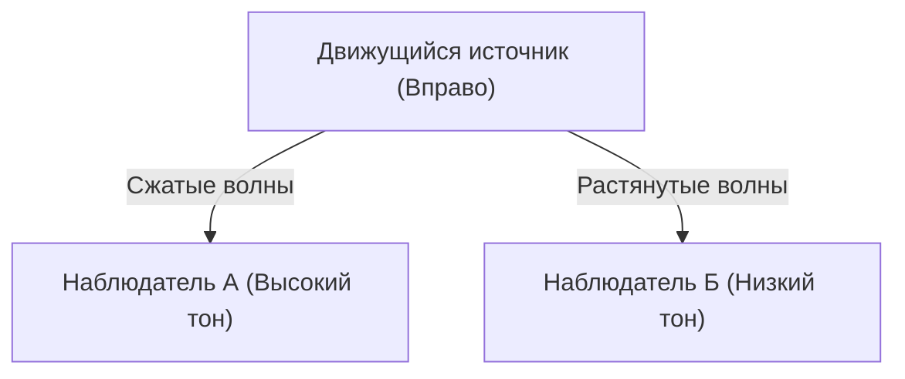

## 1. Загадка сирены скорой помощи
Когда скорая помощь приближается, звук ее сирены кажется высоким, а когда проезжает мимо и удаляется — звук резко становится низким. Это самый знакомый пример «эффекта Доплера».

## 2. Почему меняется звук?
Звук — это волна в воздухе (продольная волна). Когда источник звука приближается, волны «сжимаются» в направлении движения, их длина укорачивается (звук становится высоким), а когда он удаляется, волны «растягиваются», и их длина увеличивается (звук становится низким).

$$
f' = f \left( \frac{V \pm v_o}{V \mp v_s} \right)
$$

## 3. Эффект Доплера для света (Красное смещение)
Эффект Доплера также возникает и для света. Свет, испускаемый удаляющейся звездой, растягивается в длине волны и выглядит «красноватым» (красное смещение).

## 4. Открытие расширения Вселенной
Эдвин Хаббл обнаружил, что чем дальше находится галактика, тем больше ее красное смещение (＝ тем быстрее она удаляется), и нашел убедительное доказательство теории Большого взрыва о том, что «Вселенная расширяется».

## Дополнительная часть технической проверки 1

## Дополнительная часть технической проверки 2

## Дополнительная часть технической проверки 3

## Дополнительная часть технической проверки 4

## Дополнительная часть технической проверки 5

## Дополнительная часть технической проверки 6

## Дополнительная часть технической проверки 7

## Дополнительная часть технической проверки 8

## Дополнительная часть технической проверки 9

## Дополнительная часть технической проверки 10

## Дополнительная часть технической проверки 11

## Дополнительная часть технической проверки 12

## Дополнительная часть технической проверки 13

## Дополнительная часть технической проверки 14

