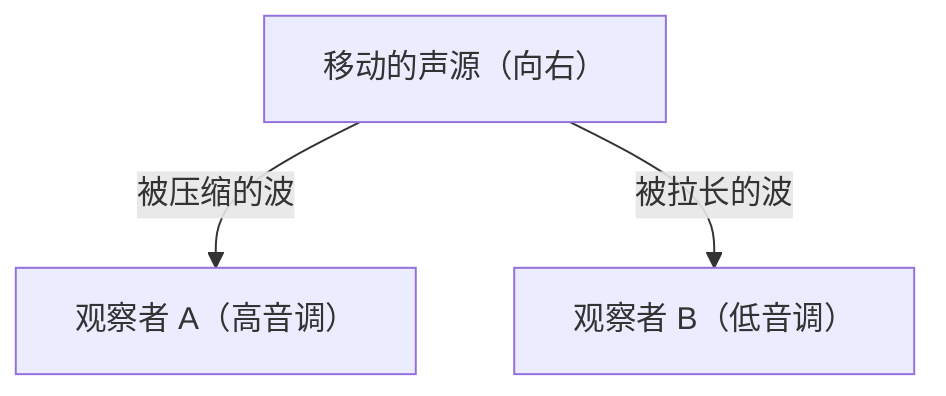

## 1. 救护车警报声之谜
当救护车靠近时，警报声听起来很高，而当它经过并远去时，声音会突然变低。这是“多普勒效应”最常见的例子。

## 2. 为什么声音会改变？
声音是空气的波（疏密波）。当声源靠近时，波在传播方向上被“压缩”导致波长变短（音调变高），而当声源远去时，波被“拉长”导致波长变长（音调变低）。

$$
f' = f \left( \frac{V \pm v_o}{V \mp v_s} \right)
$$

## 3. 光的多普勒效应（红移）
多普勒效应也会发生在光上。从远去的恒星发出的光，波长会变长，看起来“偏红”（红移）。

## 4. 宇宙膨胀的发现
埃德温·哈勃发现，越远的星系红移越大（=远去的速度越快），从而找到了“宇宙正在膨胀”这一大爆炸理论的有力证据。

## 附加技术验证部分 1

### 1. 救护车警报声之谜
当救护车靠近时，警报声听起来很高，而当它经过并远去时，声音会突然变低。这是“多普勒效应”最常见的例子。

### 2. 为什么声音会改变？
声音是空气的波（疏密波）。当声源靠近时，波在传播方向上被“压缩”导致波长变短（音调变高），而当声源远去时，波被“拉长”导致波长变长（音调变低）。

$$
f' = f \left( \frac{V \pm v_o}{V \mp v_s} \right)
$$

### 3. 光的多普勒效应（红移）
多普勒效应也会发生在光上。从远去的恒星发出的光，波长会变长，看起来“偏红”（红移）。

### 4. 宇宙膨胀的发现
埃德温·哈勃发现，越远的星系红移越大（=远去的速度越快），从而找到了“宇宙正在膨胀”这一大爆炸理论的有力证据。

## 附加技术验证部分 2

### 1. 救护车警报声之谜
当救护车靠近时，警报声听起来很高，而当它经过并远去时，声音会突然变低。这是“多普勒效应”最常见的例子。

### 2. 为什么声音会改变？
声音是空气的波（疏密波）。当声源靠近时，波在传播方向上被“压缩”导致波长变短（音调变高），而当声源远去时，波被“拉长”导致波长变长（音调变低）。

$$
f' = f \left( \frac{V \pm v_o}{V \mp v_s} \right)
$$

### 3. 光的多普勒效应（红移）
多普勒效应也会发生在光上。从远去的恒星发出的光，波长会变长，看起来“偏红”（红移）。

### 4. 宇宙膨胀的发现
埃德温·哈勃发现，越远的星系红移越大（=远去的速度越快），从而找到了“宇宙正在膨胀”这一大爆炸理论的有力证据。

## 附加技术验证部分 3

### 1. 救护车警报声之谜
当救护车靠近时，警报声听起来很高，而当它经过并远去时，声音会突然变低。这是“多普勒效应”最常见的例子。

### 2. 为什么声音会改变？
声音是空气的波（疏密波）。当声源靠近时，波在传播方向上被“压缩”导致波长变短（音调变高），而当声源远去时，波被“拉长”导致波长变长（音调变低）。

$$
f' = f \left( \frac{V \pm v_o}{V \mp v_s} \right)
$$

### 3. 光的多普勒效应（红移）
多普勒效应也会发生在光上。从远去的恒星发出的光，波长会变长，看起来“偏红”（红移）。

### 4. 宇宙膨胀的发现
埃德温·哈勃发现，越远的星系红移越大（=远去的速度越快），从而找到了“宇宙正在膨胀”这一大爆炸理论的有力证据。

## 附加技术验证部分 4

### 1. 救护车警报声之谜
当救护车靠近时，警报声听起来很高，而当它经过并远去时，声音会突然变低。这是“多普勒效应”最常见的例子。

### 2. 为什么声音会改变？
声音是空气的波（疏密波）。当声源靠近时，波在传播方向上被“压缩”导致波长变短（音调变高），而当声源远去时，波被“拉长”导致波长变长（音调变低）。

$$
f' = f \left( \frac{V \pm v_o}{V \mp v_s} \right)
$$

### 3. 光的多普勒效应（红移）
多普勒效应也会发生在光上。从远去的恒星发出的光，波长会变长，看起来“偏红”（红移）。

### 4. 宇宙膨胀的发现
埃德温·哈勃发现，越远的星系红移越大（=远去的速度越快），从而找到了“宇宙正在膨胀”这一大爆炸理论的有力证据。

## 附加技术验证部分 5

### 1. 救护车警报声之谜
当救护车靠近时，警报声听起来很高，而当它经过并远去时，声音会突然变低。这是“多普勒效应”最常见的例子。

### 2. 为什么声音会改变？
声音是空气的波（疏密波）。当声源靠近时，波在传播方向上被“压缩”导致波长变短（音调变高），而当声源远去时，波被“拉长”导致波长变长（音调变低）。

$$
f' = f \left( \frac{V \pm v_o}{V \mp v_s} \right)
$$

### 3. 光的多普勒效应（红移）
多普勒效应也会发生在光上。从远去的恒星发出的光，波长会变长，看起来“偏红”（红移）。

### 4. 宇宙膨胀的发现
埃德温·哈勃发现，越远的星系红移越大（=远去的速度越快），从而找到了“宇宙正在膨胀”这一大爆炸理论的有力证据。

## 附加技术验证部分 6

### 1. 救护车警报声之谜
当救护车靠近时，警报声听起来很高，而当它经过并远去时，声音会突然变低。这是“多普勒效应”最常见的例子。

### 2. 为什么声音会改变？
声音是空气的波（疏密波）。当声源靠近时，波在传播方向上被“压缩”导致波长变短（音调变高），而当声源远去时，波被“拉长”导致波长变长（音调变低）。

$$
f' = f \left( \frac{V \pm v_o}{V \mp v_s} \right)
$$

### 3. 光的多普勒效应（红移）
多普勒效应也会发生在光上。从远去的恒星发出的光，波长会变长，看起来“偏红”（红移）。

### 4. 宇宙膨胀的发现
埃德温·哈勃发现，越远的星系红移越大（=远去的速度越快），从而找到了“宇宙正在膨胀”这一大爆炸理论的有力证据。

## 附加技术验证部分 7

### 1. 救护车警报声之谜
当救护车靠近时，警报声听起来很高，而当它经过并远去时，声音会突然变低。这是“多普勒效应”最常见的例子。

### 2. 为什么声音会改变？
声音是空气的波（疏密波）。当声源靠近时，波在传播方向上被“压缩”导致波长变短（音调变高），而当声源远去时，波被“拉长”导致波长变长（音调变低）。

$$
f' = f \left( \frac{V \pm v_o}{V \mp v_s} \right)
$$

### 3. 光的多普勒效应（红移）
多普勒效应也会发生在光上。从远去的恒星发出的光，波长会变长，看起来“偏红”（红移）。

### 4. 宇宙膨胀的发现
埃德温·哈勃发现，越远的星系红移越大（=远去的速度越快），从而找到了“宇宙正在膨胀”这一大爆炸理论的有力证据。

## 附加技术验证部分 8

### 1. 救护车警报声之谜
当救护车靠近时，警报声听起来很高，而当它经过并远去时，声音会突然变低。这是“多普勒效应”最常见的例子。

### 2. 为什么声音会改变？
声音是空气的波（疏密波）。当声源靠近时，波在传播方向上被“压缩”导致波长变短（音调变高），而当声源远去时，波被“拉长”导致波长变长（音调变低）。

$$
f' = f \left( \frac{V \pm v_o}{V \mp v_s} \right)
$$

### 3. 光的多普勒效应（红移）
多普勒效应也会发生在光上。从远去的恒星发出的光，波长会变长，看起来“偏红”（红移）。

### 4. 宇宙膨胀的发现
埃德温·哈勃发现，越远的星系红移越大（=远去的速度越快），从而找到了“宇宙正在膨胀”这一大爆炸理论的有力证据。

## 附加技术验证部分 9

### 1. 救护车警报声之谜
当救护车靠近时，警报声听起来很高，而当它经过并远去时，声音会突然变低。这是“多普勒效应”最常见的例子。

### 2. 为什么声音会改变？
声音是空气的波（疏密波）。当声源靠近时，波在传播方向上被“压缩”导致波长变短（音调变高），而当声源远去时，波被“拉长”导致波长变长（音调变低）。

$$
f' = f \left( \frac{V \pm v_o}{V \mp v_s} \right)
$$

### 3. 光的多普勒效应（红移）
多普勒效应也会发生在光上。从远去的恒星发出的光，波长会变长，看起来“偏红”（红移）。

### 4. 宇宙膨胀的发现
埃德温·哈勃发现，越远的星系红移越大（=远去的速度越快），从而找到了“宇宙正在膨胀”这一大爆炸理论的有力证据。

## 附加技术验证部分 10

### 1. 救护车警报声之谜
当救护车靠近时，警报声听起来很高，而当它经过并远去时，声音会突然变低。这是“多普勒效应”最常见的例子。

### 2. 为什么声音会改变？
声音是空气的波（疏密波）。当声源靠近时，波在传播方向上被“压缩”导致波长变短（音调变高），而当声源远去时，波被“拉长”导致波长变长（音调变低）。

$$
f' = f \left( \frac{V \pm v_o}{V \mp v_s} \right)
$$

### 3. 光的多普勒效应（红移）
多普勒效应也会发生在光上。从远去的恒星发出的光，波长会变长，看起来“偏红”（红移）。

### 4. 宇宙膨胀的发现
埃德温·哈勃发现，越远的星系红移越大（=远去的速度越快），从而找到了“宇宙正在膨胀”这一大爆炸理论的有力证据。

## 附加技术验证部分 11

### 1. 救护车警报声之谜
当救护车靠近时，警报声听起来很高，而当它经过并远去时，声音会突然变低。这是“多普勒效应”最常见的例子。

### 2. 为什么声音会改变？
声音是空气的波（疏密波）。当声源靠近时，波在传播方向上被“压缩”导致波长变短（音调变高），而当声源远去时，波被“拉长”导致波长变长（音调变低）。

$$
f' = f \left( \frac{V \pm v_o}{V \mp v_s} \right)
$$

### 3. 光的多普勒效应（红移）
多普勒效应也会发生在光上。从远去的恒星发出的光，波长会变长，看起来“偏红”（红移）。

### 4. 宇宙膨胀的发现
埃德温·哈勃发现，越远的星系红移越大（=远去的速度越快），从而找到了“宇宙正在膨胀”这一大爆炸理论的有力证据。

## 附加技术验证部分 12

### 1. 救护车警报声之谜
当救护车靠近时，警报声听起来很高，而当它经过并远去时，声音会突然变低。这是“多普勒效应”最常见的例子。

### 2. 为什么声音会改变？
声音是空气的波（疏密波）。当声源靠近时，波在传播方向上被“压缩”导致波长变短（音调变高），而当声源远去时，波被“拉长”导致波长变长（音调变低）。

$$
f' = f \left( \frac{V \pm v_o}{V \mp v_s} \right)
$$

### 3. 光的多普勒效应（红移）
多普勒效应也会发生在光上。从远去的恒星发出的光，波长会变长，看起来“偏红”（红移）。

### 4. 宇宙膨胀的发现
埃德温·哈勃发现，越远的星系红移越大（=远去的速度越快），从而找到了“宇宙正在膨胀”这一大爆炸理论的有力证据。

## 附加技术验证部分 13

### 1. 救护车警报声之谜
当救护车靠近时，警报声听起来很高，而当它经过并远去时，声音会突然变低。这是“多普勒效应”最常见的例子。

### 2. 为什么声音会改变？
声音是空气的波（疏密波）。当声源靠近时，波在传播方向上被“压缩”导致波长变短（音调变高），而当声源远去时，波被“拉长”导致波长变长（音调变低）。

$$
f' = f \left( \frac{V \pm v_o}{V \mp v_s} \right)
$$

### 3. 光的多普勒效应（红移）
多普勒效应也会发生在光上。从远去的恒星发出的光，波长会变长，看起来“偏红”（红移）。

### 4. 宇宙膨胀的发现
埃德温·哈勃发现，越远的星系红移越大（=远去的速度越快），从而找到了“宇宙正在膨胀”这一大爆炸理论的有力证据。

## 附加技术验证部分 14

### 1. 救护车警报声之谜
当救护车靠近时，警报声听起来很高，而当它经过并远去时，声音会突然变低。这是“多普勒效应”最常见的例子。

### 2. 为什么声音会改变？
声音是空气的波（疏密波）。当声源靠近时，波在传播方向上被“压缩”导致波长变短（音调变高），而当声源远去时，波被“拉长”导致波长变长（音调变低）。

$$
f' = f \left( \frac{V \pm v_o}{V \mp v_s} \right)
$$

### 3. 光的多普勒效应（红移）
多普勒效应也会发生在光上。从远去的恒星发出的光，波长会变长，看起来“偏红”（红移）。

### 4. 宇宙膨胀的发现
埃德温·哈勃发现，越远的星系红移越大（=远去的速度越快），从而找到了“宇宙正在膨胀”这一大爆炸理论的有力证据。
