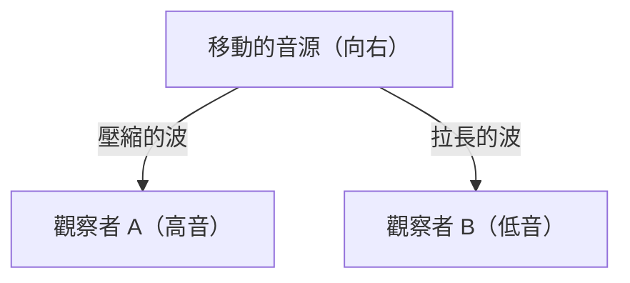

## 1. 救護車警笛之謎
當救護車靠近時，警笛的聲音聽起來會變高，而經過後遠離時，聲音會突然變低。這就是「都卜勒效應」最常見的例子。

## 2. 為什麼聲音會改變？
聲音是空氣中的波（疏密波）。當音源靠近時，波在行進方向上會被「壓縮」使得波長變短（變成高音），而遠離時，波會被「拉長」使得波長變長（變成低音）。

$$
f' = f \left( \frac{V \pm v_o}{V \mp v_s} \right)
$$

## 3. 光的都卜勒效應（紅移）
都卜勒效應也會發生在光上。遠離的恆星所發出的光，其波長會變長而看起來「偏紅」（紅移）。

## 4. 宇宙膨脹的發現
愛德溫·哈伯發現，距離越遠的星系紅移越大（＝遠離的速度越快），並找到了支持「宇宙正在膨脹」的大爆炸理論的強力證據。

## 額外技術驗證部分 1

### 1. 救護車警笛之謎
當救護車靠近時，警笛的聲音聽起來會變高，而經過後遠離時，聲音會突然變低。這就是「都卜勒效應」最常見的例子。

### 2. 為什麼聲音會改變？
聲音是空氣中的波（疏密波）。當音源靠近時，波在行進方向上會被「壓縮」使得波長變短（變成高音），而遠離時，波會被「拉長」使得波長變長（變成低音）。

$$
f' = f \left( \frac{V \pm v_o}{V \mp v_s} \right)
$$

### 3. 光的都卜勒效應（紅移）
都卜勒效應也會發生在光上。遠離的恆星所發出的光，其波長會變長而看起來「偏紅」（紅移）。

### 4. 宇宙膨脹的發現
愛德溫·哈伯發現，距離越遠的星系紅移越大（＝遠離的速度越快），並找到了支持「宇宙正在膨脹」的大爆炸理論的強力證據。

## 額外技術驗證部分 2

### 1. 救護車警笛之謎
當救護車靠近時，警笛的聲音聽起來會變高，而經過後遠離時，聲音會突然變低。這就是「都卜勒效應」最常見的例子。

### 2. 為什麼聲音會改變？
聲音是空氣中的波（疏密波）。當音源靠近時，波在行進方向上會被「壓縮」使得波長變短（變成高音），而遠離時，波會被「拉長」使得波長變長（變成低音）。

$$
f' = f \left( \frac{V \pm v_o}{V \mp v_s} \right)
$$

### 3. 光的都卜勒效應（紅移）
都卜勒效應也會發生在光上。遠離的恆星所發出的光，其波長會變長而看起來「偏紅」（紅移）。

### 4. 宇宙膨脹的發現
愛德溫·哈伯發現，距離越遠的星系紅移越大（＝遠離的速度越快），並找到了支持「宇宙正在膨脹」的大爆炸理論的強力證據。

## 額外技術驗證部分 3

### 1. 救護車警笛之謎
當救護車靠近時，警笛的聲音聽起來會變高，而經過後遠離時，聲音會突然變低。這就是「都卜勒效應」最常見的例子。

### 2. 為什麼聲音會改變？
聲音是空氣中的波（疏密波）。當音源靠近時，波在行進方向上會被「壓縮」使得波長變短（變成高音），而遠離時，波會被「拉長」使得波長變長（變成低音）。

$$
f' = f \left( \frac{V \pm v_o}{V \mp v_s} \right)
$$

### 3. 光的都卜勒效應（紅移）
都卜勒效應也會發生在光上。遠離的恆星所發出的光，其波長會變長而看起來「偏紅」（紅移）。

### 4. 宇宙膨脹的發現
愛德溫·哈伯發現，距離越遠的星系紅移越大（＝遠離的速度越快），並找到了支持「宇宙正在膨脹」的大爆炸理論的強力證據。

## 額外技術驗證部分 4

### 1. 救護車警笛之謎
當救護車靠近時，警笛的聲音聽起來會變高，而經過後遠離時，聲音會突然變低。這就是「都卜勒效應」最常見的例子。

### 2. 為什麼聲音會改變？
聲音是空氣中的波（疏密波）。當音源靠近時，波在行進方向上會被「壓縮」使得波長變短（變成高音），而遠離時，波會被「拉長」使得波長變長（變成低音）。

$$
f' = f \left( \frac{V \pm v_o}{V \mp v_s} \right)
$$

### 3. 光的都卜勒效應（紅移）
都卜勒效應也會發生在光上。遠離的恆星所發出的光，其波長會變長而看起來「偏紅」（紅移）。

### 4. 宇宙膨脹的發現
愛德溫·哈伯發現，距離越遠的星系紅移越大（＝遠離的速度越快），並找到了支持「宇宙正在膨脹」的大爆炸理論的強力證據。

## 額外技術驗證部分 5

### 1. 救護車警笛之謎
當救護車靠近時，警笛的聲音聽起來會變高，而經過後遠離時，聲音會突然變低。這就是「都卜勒效應」最常見的例子。

### 2. 為什麼聲音會改變？
聲音是空氣中的波（疏密波）。當音源靠近時，波在行進方向上會被「壓縮」使得波長變短（變成高音），而遠離時，波會被「拉長」使得波長變長（變成低音）。

$$
f' = f \left( \frac{V \pm v_o}{V \mp v_s} \right)
$$

### 3. 光的都卜勒效應（紅移）
都卜勒效應也會發生在光上。遠離的恆星所發出的光，其波長會變長而看起來「偏紅」（紅移）。

### 4. 宇宙膨脹的發現
愛德溫·哈伯發現，距離越遠的星系紅移越大（＝遠離的速度越快），並找到了支持「宇宙正在膨脹」的大爆炸理論的強力證據。

## 額外技術驗證部分 6

### 1. 救護車警笛之謎
當救護車靠近時，警笛的聲音聽起來會變高，而經過後遠離時，聲音會突然變低。這就是「都卜勒效應」最常見的例子。

### 2. 為什麼聲音會改變？
聲音是空氣中的波（疏密波）。當音源靠近時，波在行進方向上會被「壓縮」使得波長變短（變成高音），而遠離時，波會被「拉長」使得波長變長（變成低音）。

$$
f' = f \left( \frac{V \pm v_o}{V \mp v_s} \right)
$$

### 3. 光的都卜勒效應（紅移）
都卜勒效應也會發生在光上。遠離的恆星所發出的光，其波長會變長而看起來「偏紅」（紅移）。

### 4. 宇宙膨脹的發現
愛德溫·哈伯發現，距離越遠的星系紅移越大（＝遠離的速度越快），並找到了支持「宇宙正在膨脹」的大爆炸理論的強力證據。

## 額外技術驗證部分 7

### 1. 救護車警笛之謎
當救護車靠近時，警笛的聲音聽起來會變高，而經過後遠離時，聲音會突然變低。這就是「都卜勒效應」最常見的例子。

### 2. 為什麼聲音會改變？
聲音是空氣中的波（疏密波）。當音源靠近時，波在行進方向上會被「壓縮」使得波長變短（變成高音），而遠離時，波會被「拉長」使得波長變長（變成低音）。

$$
f' = f \left( \frac{V \pm v_o}{V \mp v_s} \right)
$$

### 3. 光的都卜勒效應（紅移）
都卜勒效應也會發生在光上。遠離的恆星所發出的光，其波長會變長而看起來「偏紅」（紅移）。

### 4. 宇宙膨脹的發現
愛德溫·哈伯發現，距離越遠的星系紅移越大（＝遠離的速度越快），並找到了支持「宇宙正在膨脹」的大爆炸理論的強力證據。

## 額外技術驗證部分 8

### 1. 救護車警笛之謎
當救護車靠近時，警笛的聲音聽起來會變高，而經過後遠離時，聲音會突然變低。這就是「都卜勒效應」最常見的例子。

### 2. 為什麼聲音會改變？
聲音是空氣中的波（疏密波）。當音源靠近時，波在行進方向上會被「壓縮」使得波長變短（變成高音），而遠離時，波會被「拉長」使得波長變長（變成低音）。

$$
f' = f \left( \frac{V \pm v_o}{V \mp v_s} \right)
$$

### 3. 光的都卜勒效應（紅移）
都卜勒效應也會發生在光上。遠離的恆星所發出的光，其波長會變長而看起來「偏紅」（紅移）。

### 4. 宇宙膨脹的發現
愛德溫·哈伯發現，距離越遠的星系紅移越大（＝遠離的速度越快），並找到了支持「宇宙正在膨脹」的大爆炸理論的強力證據。

## 額外技術驗證部分 9

### 1. 救護車警笛之謎
當救護車靠近時，警笛的聲音聽起來會變高，而經過後遠離時，聲音會突然變低。這就是「都卜勒效應」最常見的例子。

### 2. 為什麼聲音會改變？
聲音是空氣中的波（疏密波）。當音源靠近時，波在行進方向上會被「壓縮」使得波長變短（變成高音），而遠離時，波會被「拉長」使得波長變長（變成低音）。

$$
f' = f \left( \frac{V \pm v_o}{V \mp v_s} \right)
$$

### 3. 光的都卜勒效應（紅移）
都卜勒效應也會發生在光上。遠離的恆星所發出的光，其波長會變長而看起來「偏紅」（紅移）。

### 4. 宇宙膨脹的發現
愛德溫·哈伯發現，距離越遠的星系紅移越大（＝遠離的速度越快），並找到了支持「宇宙正在膨脹」的大爆炸理論的強力證據。

## 額外技術驗證部分 10

### 1. 救護車警笛之謎
當救護車靠近時，警笛的聲音聽起來會變高，而經過後遠離時，聲音會突然變低。這就是「都卜勒效應」最常見的例子。

### 2. 為什麼聲音會改變？
聲音是空氣中的波（疏密波）。當音源靠近時，波在行進方向上會被「壓縮」使得波長變短（變成高音），而遠離時，波會被「拉長」使得波長變長（變成低音）。

$$
f' = f \left( \frac{V \pm v_o}{V \mp v_s} \right)
$$

### 3. 光的都卜勒效應（紅移）
都卜勒效應也會發生在光上。遠離的恆星所發出的光，其波長會變長而看起來「偏紅」（紅移）。

### 4. 宇宙膨脹的發現
愛德溫·哈伯發現，距離越遠的星系紅移越大（＝遠離的速度越快），並找到了支持「宇宙正在膨脹」的大爆炸理論的強力證據。

## 額外技術驗證部分 11

### 1. 救護車警笛之謎
當救護車靠近時，警笛的聲音聽起來會變高，而經過後遠離時，聲音會突然變低。這就是「都卜勒效應」最常見的例子。

### 2. 為什麼聲音會改變？
聲音是空氣中的波（疏密波）。當音源靠近時，波在行進方向上會被「壓縮」使得波長變短（變成高音），而遠離時，波會被「拉長」使得波長變長（變成低音）。

$$
f' = f \left( \frac{V \pm v_o}{V \mp v_s} \right)
$$

### 3. 光的都卜勒效應（紅移）
都卜勒效應也會發生在光上。遠離的恆星所發出的光，其波長會變長而看起來「偏紅」（紅移）。

### 4. 宇宙膨脹的發現
愛德溫·哈伯發現，距離越遠的星系紅移越大（＝遠離的速度越快），並找到了支持「宇宙正在膨脹」的大爆炸理論的強力證據。

## 額外技術驗證部分 12

### 1. 救護車警笛之謎
當救護車靠近時，警笛的聲音聽起來會變高，而經過後遠離時，聲音會突然變低。這就是「都卜勒效應」最常見的例子。

### 2. 為什麼聲音會改變？
聲音是空氣中的波（疏密波）。當音源靠近時，波在行進方向上會被「壓縮」使得波長變短（變成高音），而遠離時，波會被「拉長」使得波長變長（變成低音）。

$$
f' = f \left( \frac{V \pm v_o}{V \mp v_s} \right)
$$

### 3. 光的都卜勒效應（紅移）
都卜勒效應也會發生在光上。遠離的恆星所發出的光，其波長會變長而看起來「偏紅」（紅移）。

### 4. 宇宙膨脹的發現
愛德溫·哈伯發現，距離越遠的星系紅移越大（＝遠離的速度越快），並找到了支持「宇宙正在膨脹」的大爆炸理論的強力證據。

## 額外技術驗證部分 13

### 1. 救護車警笛之謎
當救護車靠近時，警笛的聲音聽起來會變高，而經過後遠離時，聲音會突然變低。這就是「都卜勒效應」最常見的例子。

### 2. 為什麼聲音會改變？
聲音是空氣中的波（疏密波）。當音源靠近時，波在行進方向上會被「壓縮」使得波長變短（變成高音），而遠離時，波會被「拉長」使得波長變長（變成低音）。

$$
f' = f \left( \frac{V \pm v_o}{V \mp v_s} \right)
$$

### 3. 光的都卜勒效應（紅移）
都卜勒效應也會發生在光上。遠離的恆星所發出的光，其波長會變長而看起來「偏紅」（紅移）。

### 4. 宇宙膨脹的發現
愛德溫·哈伯發現，距離越遠的星系紅移越大（＝遠離的速度越快），並找到了支持「宇宙正在膨脹」的大爆炸理論的強力證據。

## 額外技術驗證部分 14

### 1. 救護車警笛之謎
當救護車靠近時，警笛的聲音聽起來會變高，而經過後遠離時，聲音會突然變低。這就是「都卜勒效應」最常見的例子。

### 2. 為什麼聲音會改變？
聲音是空氣中的波（疏密波）。當音源靠近時，波在行進方向上會被「壓縮」使得波長變短（變成高音），而遠離時，波會被「拉長」使得波長變長（變成低音）。

$$
f' = f \left( \frac{V \pm v_o}{V \mp v_s} \right)
$$

### 3. 光的都卜勒效應（紅移）
都卜勒效應也會發生在光上。遠離的恆星所發出的光，其波長會變長而看起來「偏紅」（紅移）。

### 4. 宇宙膨脹的發現
愛德溫·哈伯發現，距離越遠的星系紅移越大（＝遠離的速度越快），並找到了支持「宇宙正在膨脹」的大爆炸理論的強力證據。
