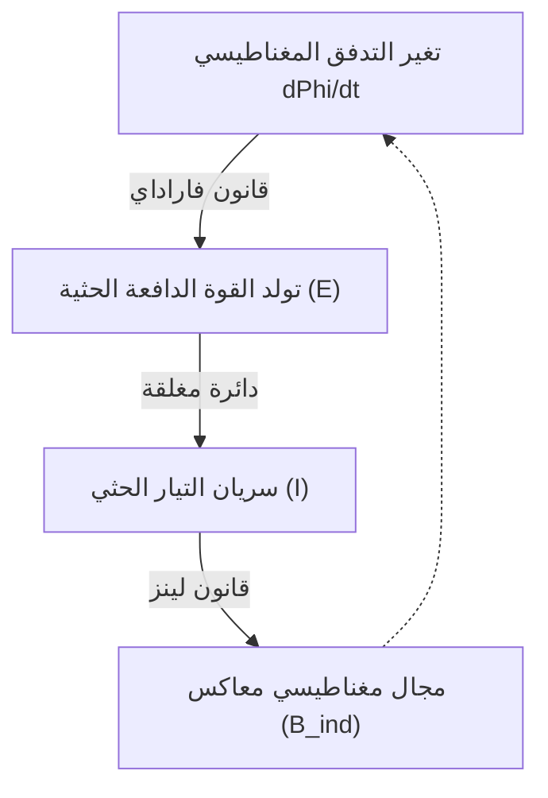

# الفيزياء: مبادئ الحث الكهرومغناطيسي والمحركات الكهربائية - من فاراداي إلى السيارات الكهربائية

لا يمكن للمدنية الصناعية الحديثة أن تستمر دون كهرباء. فمن الهواتف الذكية بين أيدينا، إلى خطوط الإنتاج الآلية في المصانع الكبرى، وصولاً إلى السيارات الكهربائية (EV) التي تجوب شوارع المدن بهدوء فائق، تعد الطاقة الكهربائية عصب الحياة المعاصرة. ولكن كيف تتولد هذه الكهرباء، وكيف تتحول بكفاءة مذهلة إلى حركة دورانية ميكانيكية؟

يكمن الجواب في ظاهرة **الحث الكهرومغناطيسي (Electromagnetic Induction)** التي اكتشفها العالم مايكل فاراداي في القرن التاسع عشر. لقد غير هذا الاكتشاف مجرى التاريخ البشري، وأرسى القواعد الأساسية للهندسة الكهربائية. يستعرض هذا المقال المبادئ الفيزيائية للحث الكهرومغناطيسي، وهندسة عمل المحركات، وتطبيقاتها المتقدمة في الجيل الجديد من السيارات الكهربائية.

## 1. ما هو الحث الكهرومغناطيسي؟ إشراقة فاراداي التاريخية

في عام 1831، أجرى الفيزيائي والكيميائي البريطاني **مايكل فاراداي** تجربة حاسمة غيرت مسار التكنولوجيا. فقبل أحد عشر عاماً، أثبت هانز كريستيان أورستد أن التيار الكهربائي يولد مجالاً مغناطيسياً حوله. وتساءل فاراداي بحدس علمي فذ: *إذا كانت الكهرباء تولد المغناطيسية، فهل تستطيع حركة المغناطيس توليد الكهرباء؟*

وبعد مئات التجارب، أثبت فاراداي أن تحريك مغناطيس دائم داخل ملف سلكي مغلق يولد تلقائياً تياراً كهربائياً يتدفق في السلك دون الحاجة لأي بطارية كيميائية. وسُميت هذه الظاهرة **الحث الكهرومغناطيسي**.

### قانون فاراداي وقانون لينز

لفهم الحث الكهرومغناطيسي، لا بد من الإلمام بثلاثة مفاهيم رئيسية:
- **التدفق المغناطيسي ($\Phi_B$)**: حاصل ضرب شدة المجال المغناطيسي $\mathbf{B}$ في المساحة العمودية التي يخترقها. وهو يمثل عدد خطوط المجال المغناطيسي التي تعبر حلقة السلك.
- **القوة الدافعة الكهربائية الحثية (EMF, $\mathcal{E}$)**: فرق الجهد الكهربائي المتولد عبر طرفي الملف نتيجة لتغير التدفق المغناطيسي.
- **التيار الحثي**: التيار الكهربائي المتدفق في الدائرة المغلقة بتأثير القوة الدافعة الحثية.

يُصاغ قانون فاراداي في معادلة تفاضلية بليغة:

$$ \mathcal{E} = -\frac{d\Phi_B}{dt} $$

تنص هذه المعادلة على أن القوة الدافعة الكهربائية الحثية المتولدة في دائرة مغلقة تتناسب طردياً مع المعدل الزمني لتغير التدفق المغناطيسي عبر تلك الدائرة.

أما **إشارة السالب ($-$)** في المعادلة فتمثل **قانون لينز (Lenz's Law)** الذي صاغه الفيزيائي هاينريش لينز عام 1834، وهو التعبير الأسمى عن قانون حفظ الطاقة في الكهرومغناطيسية: *يكون اتجاه التيار الحثي المتولد دائماً بحيث يقاوم مجاله المغناطيسي التغير في التدفق المغناطيسي الأصلي الذي تسبب في نشوئه.*

فعند تقريب القطب الشمالي لمغناطيس نحو ملف، يولد الملف تياراً حثياً ينشئ قطباً شمالياً مماثلاً ليدفعه بعيداً؛ وعند سحب المغناطيس للخارج، يولد الملف قطباً جنوبياً ليجذبه للخلف. فالطبيعة تقاوم التغير المفاجئ في حالتها الكهرومغناطيسية.

## 2. توليد الحركة الميكانيكية: كيف يعمل المحرك الكهربائي؟

يمثل الحث الكهرومغناطيسي الأساس النظري لـ **المولد الكهربائي (Generator)** الذي يحول الطاقة الحركية إلى كهرباء. والعملية المعاكسة تماماً—أي تحويل الطاقة الكهربائية إلى حركة دورانية—هي وظيفة **المحرك الكهربائي (Motor)**. فالمولد والمحرك يشتركان في نفس القواعد الفيزيائية.

### قوة لورنتز وقاعدة اليد اليسرى لفليمنغ

تنبع قوة دوران المحرك من **قوة لورنتز** المؤثرة على الشحنات المتحركة في مجال مغناطيسي:

$$ \mathbf{F} = q(\mathbf{E} + \mathbf{v} \times \mathbf{B}) $$

وعند مرور تيار كهربائي $I$ في سلك طوله $L$ داخل مجال مغناطيسي $\mathbf{B}$، تكون القوة الميكانيكية الناتجة $\mathbf{F} = I (\mathbf{L} \times \mathbf{B})$. ويُحدد اتجاه هذه القوة عبر **قاعدة اليد اليسرى لفليمنغ**:
- **السبابة**: تشير لاتجاه المجال المغناطيسي ($\mathbf{B}$، من الشمال للجنوب).
- **الوسطى**: تشير لاتجاه سريان التيار الكهربائي ($I$).
- **الإبهام**: يشير لاتجاه القوة الميكانيكية الحركية الناتجة ($\mathbf{F}$).

يوضع ملف سلكي بين قطبي مغناطيس. وعند إمرار التيار، يتأثر أحد جانبي الملف بقوة لأعلى والجانب الآخر بقوة لأسفل. ويولد هذا الزوج من القوى عزم دوران (Torque) يدفع الجزء الدوار (Rotor) للدوران المستمر.

### أبرز أنواع المحركات الكهربائية

1. **محرك التيار المستمر ذو الفرش (Brushed DC)**: يستخدم عاكساً ميكانيكياً وفرشاً كربونية لعكس اتجاه التيار كل نصف دورة. وهو بسيط التصميم، لكن احتكاك الفرش يؤدي للتآكل والشرر وتلف المكونات سريعاً.
2. **محرك التيار المستمر عديم الفرش (BLDC)**: يستبدل الفرش الميكانيكية بعواكس إلكترونية تعتمد على أشباه الموصلات. تُثبت مغانط النيوديميوم الدائمة على العضو الدوار، بينما تُشغل ملفات العضو الثابت إلكترونياً. وتتجاوز كفاءته 90% مع انعدام الحاجة للصيانة، مما يجعله المحرك المفضل في الطائرات المسيرة والسيارات الكهربائية.
3. **محرك الحث ثلاثي الأطوار (AC Induction Motor)**: ابتكره العالم [نيكولا تسلا](/p/biography-nikola-tesla/) عام 1887. يُغذى العضو الثابت بتيار متردد متعدد الأطوار لإنشاء مجال مغناطيسي دوار. ويقطع هذا المجال قضبان العضو الدوار (القفص السنجابي)، مولداً تيارات دوامية ضخمة بفضل **قانون فاراداي للتحريض**. وتؤدي هذه التيارات إلى دوران المحرك دون الحاجة لأي مغانط أرضية نادرة.

## 3. الثورة في عالم السيارات الكهربائية (EV)

تشهد صناعة السيارات أكبر تحول تقني منذ أكثر من قرن، متمثلاً في الانتقال من محركات الاحتراق الداخلي (ICE) إلى الدفع الكهربائي الكامل.

### تفوق المحرك الكهربائي على محرك البنزين

- **عزم دوران فوري عند سرعة صفر (Instantaneous Torque)**: يحتاج محرك البنزين لآلاف الدورات للوصول لأقصى عزم، بينما يمنحك المحرك الكهربائي 100% من عزمه الأقصى فور الضغط على دواسة السرعة (0 RPM)، مانحاً تسارعاً خاطفاً وخالياً من التأخير.
- **كفاءة طاقة استثنائية**: لا تتجاوز الكفاءة الحرارية لمحركات البنزين 30–40%، حيث يتحول أغلب الوقود إلى حرارة مهدورة. أما محركات السيارات الكهربائية فتحول أكثر من 90–95% من طاقة البطارية مباشرة لحركة العجلات.
- **هدوء تام وانعدام الاهتزازات**: لعدم وجود انفجارات داخلية أو بساتم متحركة، تعمل المحركات بسلاسة وصمت مطبق.

### تطور محركات شركة تسلا

استلهمت شركة تسلا اسمها من رائد التيار المتردد [نيكولا تسلا](/p/biography-nikola-tesla/). واستخدمت الطرازات الأولى مثل Roadster و Model S **محركات الحث المتردد (AC Induction)** متفادية الاعتماد على المواد النادرة.

ولكن في سيارات مثل Model 3 و Model Y، اعتمدت تسلا **المحركات التزامنية ذات المغناطيس الدائم والممانعة المتغيرة (PM-SynRM)**، والتي تدمج مغانط النيوديميوم مع فراغات هندسية في قلب الحديد، لتحقيق أعلى كفاءة ممكنة في شوارع المدن والسرعات العالية على الطرق السريعة.

### الكبح المتجدد (Regenerative Braking): قانون فاراداي في أبهى صوره

أبرز ابتكارات السيارات الكهربائية هي منظومة **الكبح المتجدد**. وهنا يتجلى قانون فاراداي مجدداً.

فعندما يرفع السائق قدمه عن دواسة السرعة أو يضغط على المكابح، يعكس النظام الإلكتروني دور المحرك: يتوقف ضخ التيار من البطارية، وتقوم عجلات السيارة بتدوير المحرك بالقوة. وفي تلك اللحظة: **يتحول المحرك فورياً إلى مولد كهربائي!**

تدير العجلات الملفات داخل المجال المغناطيسي، فتتولد وفق قانون فاراداي تيارات ذات جهد عالٍ تشحن البطارية مباشرة. وفي الوقت نفسه، وفق قانون لينز، يولد هذا الحث قوة كهرومغناطيسية معاكسة تبطئ حركة السيارة بسلاسة وأمان. ويستعيد النظام أكثر من 70% من طاقة الكبح التي كانت تتبدد قديماً كحرارة مهدرة من فحمات الفرامل.

## 4. مستقبل المحركات الكهربائية: الموصلية الفائقة والابتكار الأخضر

بعد ما يقرب من مئتي عام على تجربة فاراداي، يستمر تطور المحركات الكهربائية بقفزات نوعية:
- **المحركات فائقة التوصيل**: باستخدام ملفات من مواد فائقة التوصيل تنعدم مقاومتها الكهربائية ($R = 0$)، تتلاشى الخسائر الحرارية وترتفع كثافة القدرة بنحو أربعة أضعاف مع وزن شديد الخفة، وهو المفتاح لتحقيق الطيران التجاري الكهربائي الخالي من الانبعاثات.
- **محركات خالية من العناصر النادرة**: لتجنب احتكار سلاسل إمداد النيوديميوم، تركز الأبحاث على محركات التزامن ذات العضو الدوار الملفوف (WRSM) ومركبات نيتريد الحديد المغناطيسية ($Fe_{16}N_2$).

## 5. الخاتمة: العالم الذي حركته ملفات فاراداي

إن كل جانب من جوانب الحياة الرقمية والصناعية المعاصرة—من خوادم الإنترنت السحابية إلى السيارات الكهربائية الصامتة—يدين بالفضل لتلك التجربة البسيطة التي أجراها مايكل فاراداي على طاولة مختبره عام 1831.

إن القانون الذي ربط بين تغير المجال المغناطيسي وتوليد الكهرباء يبرهن على القوة الملهمة للفيزياء الأساسية في إعادة رسم ملامح الحضارة الإنسانية. ومع انطلاق العالم نحو طاقة نظيفة ومستدامة، سيبقى الرقص المتناغم بين الإلكترونات والمجالات المغناطيسية نبض التقدم الإنساني إلى الأبد.
