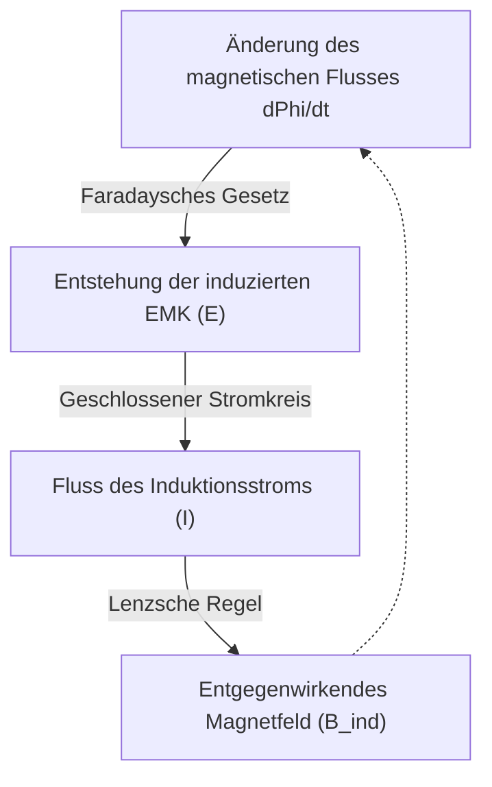

# Physik: Elektromagnetische Induktion und Elektromotoren - Von Faraday zu modernen Elektrofahrzeugen

Die moderne Industriegesellschaft ist ohne elektrische Energie undenkbar. Ob im Smartphone, in vollautomatisierten Produktionsanlagen oder in modernen Elektrofahrzeugen (EVs) – Elektrizität bewegt unsere Zivilisation. Doch wie entsteht dieser Strom und nach welchen physikalischen Gesetzen wird elektrische Energie mit atemberaubender Effizienz in mechanische Drehkraft verwandelt?

Die Antwort darauf liegt in der **elektromagnetischen Induktion**, einem physikalischen Phänomen, das Michael Faraday im 19. Jahrhundert entdeckte und das den Grundstein unserer elektrifizierten Welt legte. Dieser Artikel liefert eine fundierte Analyse der Gesetzmäßigkeiten der Induktion, der Funktionsweise moderner Motoren und der Antriebstechnik in Elektrofahrzeugen.

## 1. Was ist elektromagnetische Induktion? Faradays Entdeckung

Im Jahr 1831 vollbrachte der britische Naturforscher **Michael Faraday** eine wissenschaftliche Pioniertat. Elf Jahre zuvor hatte Hans Christian Ørsted nachgewiesen, dass elektrischer Strom ein Magnetfeld hervorruft. Faraday schlussfolgerte mit bestechender Logik: *Wenn Strom Magnetismus erzeugen kann, muss auch Magnetismus in der Lage sein, elektrischen Strom zu erzeugen.*

Durch Experimente bewies Faraday: Bewegt man einen Permanentmagneten relativ zu einer Drahtspule, entsteht in den Windungen eine elektrische Spannung, ganz ohne galvanische Batterie. Dieses Phänomen nennt man **elektromagnetische Induktion**.

### Das Faradaysche Induktionsgesetz und die Lenzsche Regel

Für das Verständnis der Induktion sind drei physikalische Größen zentral:
- **Magnetischer Fluss ($\Phi_B$)**: Das Flächenintegral der senkrechten magnetischen Flussdichte $\mathbf{B}$ durch eine gegebene Fläche. Anschaulich beschreibt er die Anzahl der magnetischen Feldlinien, die eine Leiterschleife durchsetzen.
- **Induzierte elektromagnetische Kraft (EMK, $\mathcal{E}$)**: Die an den Enden der Spule entstehende elektrische Spannung bei zeitlicher Änderung des magnetischen Flusses.
- **Induktionsstrom**: Der bei geschlossenem Stromkreis fließende Strom.

Das Faradaysche Gesetz lautet in differentieller Schreibweise:

$$ \mathcal{E} = -\frac{d\Phi_B}{dt} $$

Das bedeutet: Je schneller sich der magnetische Fluss durch die Leiterschleife mit der Zeit ändert, desto höher ist die erzeugte Induktionsspannung.

Das **Minuszeichen ($-$)** ist von herausragender physikalischer Bedeutung: Es drückt die 1834 von Heinrich Lenz formulierte **Lenzsche Regel** aus. Sie ist das elektromagnetische Pendant zum universellen Energieerhaltungssatz: *Der Induktionsstrom ist stets so gerichtet, dass sein eigenes Magnetfeld der Ursache seiner Entstehung – der Flussänderung – entgegenwirkt.*

Schiebt man den Nordpol eines Magneten in eine Spule, bildet diese an der Stirnseite einen Nordpol aus, der die Bewegung bremst. Zieht man den Magneten heraus, entsteht ein Südpol, der den Magneten festhalten will. Die Natur widersetzt sich stets der ihr aufgezwungenen Zustandsänderung.

## 2. Mechanische Antriebskraft: Wie der Elektromotor funktioniert

Die elektromagnetische Induktion ist das Kernprinzip des **Generators**, der kinetische Energie in elektrische Energie wandelt. Die Umkehrung dieses Prozesses – die Verwandlung elektrischer Energie in mechanische Rotationsarbeit – leistet der **Elektromotor**. Beide Maschinen besitzen prinzipiell denselben physikalischen Aufbau.

### Lorentzkraft und die Dreifingerregel der linken Hand

Die Kraft, die einen Motor antreibt, ist die **Lorentzkraft**, die auf bewegte elektrische Ladungen in einem Magnetfeld wirkt:

$$ \mathbf{F} = q(\mathbf{E} + \mathbf{v} \times \mathbf{B}) $$

Für einen stromdurchflossenen geraden Leiter der Länge $L$ mit dem Strom $I$ im Magnetfeld $\mathbf{B}$ gilt $\mathbf{F} = I (\mathbf{L} \times \mathbf{B})$. Die Richtung dieser Kraft ermittelt man über die **Linke-Hand-Regel (Fleming's Left-Hand Rule)**:
- **Zeigefinger**: Richtung des Magnetfeldes ($\mathbf{B}$, Nord nach Süd)
- **Mittelfinger**: Richtung des Stroms ($I$)
- **Daumen**: Richtung der resultierenden mechanischen Kraft ($\mathbf{F}$)

In einem Motor befindet sich eine drehbare Spule zwischen Magnetpolen. Fließt Strom durch die Spule, erfährt eine Seite eine Kraft nach oben, die gegenüberliegende Seite eine Kraft nach unten. Dieses Kräftepaar erzeugt ein Drehmoment (Torque), welches den Rotor in permanente Drehung versetzt.

### Die wichtigsten Motorkonzepte im Überblick

1. **Gleichstrommotor mit Bürsten (Brushed DC)**: Nutzt mechanische Schleifkohlen und einen Kommutator, um die Stromrichtung alle halbe Umdrehung umzupolen. Er ist leicht anzusteuern, leidet jedoch unter mechanischem Bürstenverschleiß und Bürstenfeuer.
2. **Bürstenloser Gleichstrommotor (BLDC)**: Ersetzt mechanische Kontakte durch elektronische Halbleiter-Wechselrichter. Auf dem Rotor sitzen kräftige Neodym-Permanentmagnete, während die Spulen des Stators elektronisch getaktet werden. Mit Wirkungsgraden über 90 % und Wartungsfreiheit ist der BLDC-Motor in Robotern, Drohnen und modernen Elektroautos weit verbreitet.
3. **Drehstrom-Asynchronmotor (AC Induction Motor)**: 1887 von [Nikola Tesla](/p/biography-nikola-tesla/) erfunden. Der Stator wird mit mehrphasigem Wechselstrom beaufschlagt, wodurch ein rotierendes Magnetfeld entsteht. Dieses Schnittfeld induziert über **elektromagnetische Induktion** Wirbelströme in den Leiterstäben des Kurzschlussläufers. Die Wechselwirkung dieser Ströme mit dem Drehfeld treibt den Motor an – völlig bürstenlos und ohne seltene Erden.

## 3. Die Revolution im Elektroauto (EV)

Die Automobilindustrie erlebt den größten Wandel seit über einem Jahrhundert: die Abkehr vom Verbrennungsmotor zugunsten rein elektrischer Antriebe.

### Vorteile des Elektromotors gegenüber dem Verbrennungsmotor

Im Vergleich zu Otto- oder Dieselmotoren bietet der Elektroantrieb überragende physikalische Vorteile:
- **Sofortiges maximales Drehmoment ab 0 U/min**: Während Verbrennungsmotoren erst bei höheren Drehzahlen ihr volles Drehmoment entfalten, stellt der Elektromotor sein maximales Drehmoment sofort ab der ersten Umdrehung bereit – für eine unvergleichlich lineare Beschleunigung.
- **Überlegener Wirkungsgrad**: Verbrennungsmotoren erreichen thermische Wirkungsgrade von lediglich 30–40 %, während der Großteil der Energie als Abwärme verpufft. Moderne Elektroantriebe wandeln über 90–95 % der Batterieenergie direkt in Vortrieb um.
- **Ruhiger Lauf ohne Vibrationen**: Da keine hin- und hergehenden Kolben oder Explosionen existieren, arbeitet der Elektroantrieb nahezu geräusch- und vibrationsfrei.

### Die Ingenieursgeschichte von Tesla: Induktion versus Permanentmagnete

Tesla ehrt mit seinem Firmennamen den Erfinder des Wechselstrommotors, [Nikola Tesla](/p/biography-nikola-tesla/). Frühe Modelle wie der originale Roadster oder das Model S nutzten dreiphasige **Asynchron-Induktionsmotoren** ohne teure Permanentmagnete.

Um Reichweite und Effizienz noch weiter zu steigern, setzt Tesla in Fahrzeugen wie dem Model 3 auf **Permanentmagnet-unterstützte Synchron-Reluktanzmotoren (PM-SynRM)**. Dieses Konzept kombiniert Neodym-Magnete mit geometrischen Reluktanzpfaden im Läuferblech und erzielt sowohl im Stadtverkehr als auch bei Autobahnfahrt Spitzenwirkungsgrade.

### Die Kunst der Rekuperation: Faradays Gesetz im Bremsbetrieb

Zu den wichtigsten Effizienzmerkmalen eines Elektroautos gehört das **regenerative Bremsen (Rekuperation)**.

Nimmt der Fahrer den Fuß vom Fahrpedal oder tritt auf die Bremse, kehrt die Leistungselektronik den Energiefluss um: Der Motor bezieht keinen Strom mehr aus der Batterie, sondern wird durch die rollenden Räder angetrieben. In diesem Moment **verwandelt sich der Motor schlagartig in einen Generator!**

Die Drehung der Räder bewegt die Spulen im Magnetfeld und erzeugt gemäß dem Faradayschen Induktionsgesetz Hochspannungsstrom, der in die Batterie zurückgespeist wird. Gleichzeitig bremst die nach der Lenzschen Regel entstehende elektromagnetische Gegenkraft das Fahrzeug sanft ab. Bis zu 70 % der Bremsenergie, die bei konventionellen Fahrzeugen an den Bremsscheiben als Hitze verloren ginge, wird so zurückgewonnen.

## 4. Zukunftsperspektiven: Supraleitung und ressourcenschonende Antriebe

Auch fast zweihundert Jahre nach Faradays Entdeckung schreitet die Entwicklung von Elektromotoren rasant voran:

- **Supraleitende Motoren**: Durch den Einsatz von Hochtemperatursupraleitern (HTS) entfällt der elektrische Leitungswiderstand vollständig ($R = 0$). Ohne ohmsche Erwärmung erreichen diese Motoren die vierfache Leistungsdichte bei drastisch reduziertem Gewicht – der Schlüssel für die zukünftige emissionsfreie Luftfahrt (Elektroflugzeuge und eVTOLs).
- **Motoren ohne Seltene Erden**: Zur Vermeidung von Rohstoffabhängigkeiten forschen Ingenieure weltweit an fremderregten Synchronmaschinen (WRSM) und neuen magnetischen Eisen-Stickstoff-Verbindungen ($Fe_{16}N_2$).

## 5. Fazit: Eine von Faradays Spule bewegte Welt

Von weltweiten Datenleitungen über industrielle Roboter bis hin zu den lautlosen Elektrofahrzeugen auf unseren Straßen – die Grundlagen unserer modernen Technik wurzeln in jenem Laborexperiment, das Michael Faraday 1831 mit einer einfachen Spule und einem Magneten durchführte.

Das Prinzip, dass die zeitliche Änderung magnetischer Felder elektrische Spannung hervorbringt, führt uns die faszinierende Macht der Grundlagenphysik vor Augen. Auf dem Weg in ein Zeitalter nachhaltiger Mobilität bleibt das Wechselspiel zwischen Elektronen und Magnetfeldern der verlässliche Motor des menschlichen Fortschritts.
