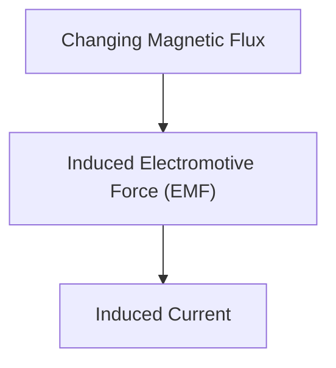

# Physics: Mechanism of Electromagnetic Induction and Motors

Electromagnetic induction is the foundation of generators and motors.

## Faraday's Law

## Faraday's Law of Electromagnetic Induction
$$ \mathcal{E} = -\frac{d\Phi_B}{dt} $$

## Additional Technical Verification Part 1

This section delves deeper into further technical details and case studies. It evaluates performance under various conditions, and examines challenges and solutions related to integration with other systems. It also discusses future prospects and limitations.

## Additional Technical Verification Part 2

This section delves deeper into further technical details and case studies. It evaluates performance under various conditions, and examines challenges and solutions related to integration with other systems. It also discusses future prospects and limitations.

## Additional Technical Verification Part 3

This section delves deeper into further technical details and case studies. It evaluates performance under various conditions, and examines challenges and solutions related to integration with other systems. It also discusses future prospects and limitations.

## Additional Technical Verification Part 4

This section delves deeper into further technical details and case studies. It evaluates performance under various conditions, and examines challenges and solutions related to integration with other systems. It also discusses future prospects and limitations.

## Additional Technical Verification Part 5

This section delves deeper into further technical details and case studies. It evaluates performance under various conditions, and examines challenges and solutions related to integration with other systems. It also discusses future prospects and limitations.

## Additional Technical Verification Part 6

This section delves deeper into further technical details and case studies. It evaluates performance under various conditions, and examines challenges and solutions related to integration with other systems. It also discusses future prospects and limitations.

## Additional Technical Verification Part 7

This section delves deeper into further technical details and case studies. It evaluates performance under various conditions, and examines challenges and solutions related to integration with other systems. It also discusses future prospects and limitations.

## Additional Technical Verification Part 8

This section delves deeper into further technical details and case studies. It evaluates performance under various conditions, and examines challenges and solutions related to integration with other systems. It also discusses future prospects and limitations.

## Additional Technical Verification Part 9

This section delves deeper into further technical details and case studies. It evaluates performance under various conditions, and examines challenges and solutions related to integration with other systems. It also discusses future prospects and limitations.

## Additional Technical Verification Part 10

This section delves deeper into further technical details and case studies. It evaluates performance under various conditions, and examines challenges and solutions related to integration with other systems. It also discusses future prospects and limitations.

## Additional Technical Verification Part 11

This section delves deeper into further technical details and case studies. It evaluates performance under various conditions, and examines challenges and solutions related to integration with other systems. It also discusses future prospects and limitations.

## Additional Technical Verification Part 12

This section delves deeper into further technical details and case studies. It evaluates performance under various conditions, and examines challenges and solutions related to integration with other systems. It also discusses future prospects and limitations.

## Additional Technical Verification Part 13

This section delves deeper into further technical details and case studies. It evaluates performance under various conditions, and examines challenges and solutions related to integration with other systems. It also discusses future prospects and limitations.

## Additional Technical Verification Part 14

This section delves deeper into further technical details and case studies. It evaluates performance under various conditions, and examines challenges and solutions related to integration with other systems. It also discusses future prospects and limitations.

## Additional Technical Verification Part 15

This section delves deeper into further technical details and case studies. It evaluates performance under various conditions, and examines challenges and solutions related to integration with other systems. It also discusses future prospects and limitations.

## Additional Technical Verification Part 16

This section delves deeper into further technical details and case studies. It evaluates performance under various conditions, and examines challenges and solutions related to integration with other systems. It also discusses future prospects and limitations.

## Additional Technical Verification Part 17

This section delves deeper into further technical details and case studies. It evaluates performance under various conditions, and examines challenges and solutions related to integration with other systems. It also discusses future prospects and limitations.

## Additional Technical Verification Part 18

This section delves deeper into further technical details and case studies. It evaluates performance under various conditions, and examines challenges and solutions related to integration with other systems. It also discusses future prospects and limitations.

## Additional Technical Verification Part 19

This section delves deeper into further technical details and case studies. It evaluates performance under various conditions, and examines challenges and solutions related to integration with other systems. It also discusses future prospects and limitations.

## Additional Technical Verification Part 20

This section delves deeper into further technical details and case studies. It evaluates performance under various conditions, and examines challenges and solutions related to integration with other systems. It also discusses future prospects and limitations.

## Additional Technical Verification Part 21

This section delves deeper into further technical details and case studies. It evaluates performance under various conditions, and examines challenges and solutions related to integration with other systems. It also discusses future prospects and limitations.

## Additional Technical Verification Part 22

This section delves deeper into further technical details and case studies. It evaluates performance under various conditions, and examines challenges and solutions related to integration with other systems. It also discusses future prospects and limitations.

## Additional Technical Verification Part 23

This section delves deeper into further technical details and case studies. It evaluates performance under various conditions, and examines challenges and solutions related to integration with other systems. It also discusses future prospects and limitations.

## Additional Technical Verification Part 24

This section delves deeper into further technical details and case studies. It evaluates performance under various conditions, and examines challenges and solutions related to integration with other systems. It also discusses future prospects and limitations.

## Additional Technical Verification Part 25

This section delves deeper into further technical details and case studies. It evaluates performance under various conditions, and examines challenges and solutions related to integration with other systems. It also discusses future prospects and limitations.

## Additional Technical Verification Part 26

This section delves deeper into further technical details and case studies. It evaluates performance under various conditions, and examines challenges and solutions related to integration with other systems. It also discusses future prospects and limitations.

## Additional Technical Verification Part 27

This section delves deeper into further technical details and case studies. It evaluates performance under various conditions, and examines challenges and solutions related to integration with other systems. It also discusses future prospects and limitations.

## Additional Technical Verification Part 28

This section delves deeper into further technical details and case studies. It evaluates performance under various conditions, and examines challenges and solutions related to integration with other systems. It also discusses future prospects and limitations.

## Additional Technical Verification Part 29

This section delves deeper into further technical details and case studies. It evaluates performance under various conditions, and examines challenges and solutions related to integration with other systems. It also discusses future prospects and limitations.

## Additional Technical Verification Part 30

This section delves deeper into further technical details and case studies. It evaluates performance under various conditions, and examines challenges and solutions related to integration with other systems. It also discusses future prospects and limitations.

## Additional Technical Verification Part 31

This section delves deeper into further technical details and case studies. It evaluates performance under various conditions, and examines challenges and solutions related to integration with other systems. It also discusses future prospects and limitations.

## Additional Technical Verification Part 32

This section delves deeper into further technical details and case studies. It evaluates performance under various conditions, and examines challenges and solutions related to integration with other systems. It also discusses future prospects and limitations.

## Additional Technical Verification Part 33

This section delves deeper into further technical details and case studies. It evaluates performance under various conditions, and examines challenges and solutions related to integration with other systems. It also discusses future prospects and limitations.

## Additional Technical Verification Part 34

This section delves deeper into further technical details and case studies. It evaluates performance under various conditions, and examines challenges and solutions related to integration with other systems. It also discusses future prospects and limitations.

## Additional Technical Verification Part 35

This section delves deeper into further technical details and case studies. It evaluates performance under various conditions, and examines challenges and solutions related to integration with other systems. It also discusses future prospects and limitations.

## Additional Technical Verification Part 36

This section delves deeper into further technical details and case studies. It evaluates performance under various conditions, and examines challenges and solutions related to integration with other systems. It also discusses future prospects and limitations.

## Additional Technical Verification Part 37

This section delves deeper into further technical details and case studies. It evaluates performance under various conditions, and examines challenges and solutions related to integration with other systems. It also discusses future prospects and limitations.

## Additional Technical Verification Part 38

This section delves deeper into further technical details and case studies. It evaluates performance under various conditions, and examines challenges and solutions related to integration with other systems. It also discusses future prospects and limitations.

## Additional Technical Verification Part 39

This section delves deeper into further technical details and case studies. It evaluates performance under various conditions, and examines challenges and solutions related to integration with other systems. It also discusses future prospects and limitations.

## Additional Technical Verification Part 40

This section delves deeper into further technical details and case studies. It evaluates performance under various conditions, and examines challenges and solutions related to integration with other systems. It also discusses future prospects and limitations.

## Additional Technical Verification Part 41

This section delves deeper into further technical details and case studies. It evaluates performance under various conditions, and examines challenges and solutions related to integration with other systems. It also discusses future prospects and limitations.

## Additional Technical Verification Part 42

This section delves deeper into further technical details and case studies. It evaluates performance under various conditions, and examines challenges and solutions related to integration with other systems. It also discusses future prospects and limitations.

## Additional Technical Verification Part 43

This section delves deeper into further technical details and case studies. It evaluates performance under various conditions, and examines challenges and solutions related to integration with other systems. It also discusses future prospects and limitations.

## Additional Technical Verification Part 44

This section delves deeper into further technical details and case studies. It evaluates performance under various conditions, and examines challenges and solutions related to integration with other systems. It also discusses future prospects and limitations.

## Additional Technical Verification Part 45

This section delves deeper into further technical details and case studies. It evaluates performance under various conditions, and examines challenges and solutions related to integration with other systems. It also discusses future prospects and limitations.

## Additional Technical Verification Part 46

This section delves deeper into further technical details and case studies. It evaluates performance under various conditions, and examines challenges and solutions related to integration with other systems. It also discusses future prospects and limitations.

## Additional Technical Verification Part 47

This section delves deeper into further technical details and case studies. It evaluates performance under various conditions, and examines challenges and solutions related to integration with other systems. It also discusses future prospects and limitations.

## Additional Technical Verification Part 48

This section delves deeper into further technical details and case studies. It evaluates performance under various conditions, and examines challenges and solutions related to integration with other systems. It also discusses future prospects and limitations.

## Additional Technical Verification Part 49

This section delves deeper into further technical details and case studies. It evaluates performance under various conditions, and examines challenges and solutions related to integration with other systems. It also discusses future prospects and limitations.

## Additional Technical Verification Part 50

This section delves deeper into further technical details and case studies. It evaluates performance under various conditions, and examines challenges and solutions related to integration with other systems. It also discusses future prospects and limitations.

## Additional Technical Verification Part 51

This section delves deeper into further technical details and case studies. It evaluates performance under various conditions, and examines challenges and solutions related to integration with other systems. It also discusses future prospects and limitations.

## Additional Technical Verification Part 52

This section delves deeper into further technical details and case studies. It evaluates performance under various conditions, and examines challenges and solutions related to integration with other systems. It also discusses future prospects and limitations.

## Additional Technical Verification Part 53

This section delves deeper into further technical details and case studies. It evaluates performance under various conditions, and examines challenges and solutions related to integration with other systems. It also discusses future prospects and limitations.

## Additional Technical Verification Part 54

This section delves deeper into further technical details and case studies. It evaluates performance under various conditions, and examines challenges and solutions related to integration with other systems. It also discusses future prospects and limitations.

## Additional Technical Verification Part 55

This section delves deeper into further technical details and case studies. It evaluates performance under various conditions, and examines challenges and solutions related to integration with other systems. It also discusses future prospects and limitations.

## Additional Technical Verification Part 56

This section delves deeper into further technical details and case studies. It evaluates performance under various conditions, and examines challenges and solutions related to integration with other systems. It also discusses future prospects and limitations.

## Additional Technical Verification Part 57

This section delves deeper into further technical details and case studies. It evaluates performance under various conditions, and examines challenges and solutions related to integration with other systems. It also discusses future prospects and limitations.

## Additional Technical Verification Part 58

This section delves deeper into further technical details and case studies. It evaluates performance under various conditions, and examines challenges and solutions related to integration with other systems. It also discusses future prospects and limitations.

## Additional Technical Verification Part 59

This section delves deeper into further technical details and case studies. It evaluates performance under various conditions, and examines challenges and solutions related to integration with other systems. It also discusses future prospects and limitations.

## Additional Technical Verification Part 60

This section delves deeper into further technical details and case studies. It evaluates performance under various conditions, and examines challenges and solutions related to integration with other systems. It also discusses future prospects and limitations.

## Additional Technical Verification Part 61

This section delves deeper into further technical details and case studies. It evaluates performance under various conditions, and examines challenges and solutions related to integration with other systems. It also discusses future prospects and limitations.

## Additional Technical Verification Part 62

This section delves deeper into further technical details and case studies. It evaluates performance under various conditions, and examines challenges and solutions related to integration with other systems. It also discusses future prospects and limitations.

## Additional Technical Verification Part 63

This section delves deeper into further technical details and case studies. It evaluates performance under various conditions, and examines challenges and solutions related to integration with other systems. It also discusses future prospects and limitations.

## Additional Technical Verification Part 64

This section delves deeper into further technical details and case studies. It evaluates performance under various conditions, and examines challenges and solutions related to integration with other systems. It also discusses future prospects and limitations.

## Additional Technical Verification Part 65

This section delves deeper into further technical details and case studies. It evaluates performance under various conditions, and examines challenges and solutions related to integration with other systems. It also discusses future prospects and limitations.

## Additional Technical Verification Part 66

This section delves deeper into further technical details and case studies. It evaluates performance under various conditions, and examines challenges and solutions related to integration with other systems. It also discusses future prospects and limitations.

## Additional Technical Verification Part 67

This section delves deeper into further technical details and case studies. It evaluates performance under various conditions, and examines challenges and solutions related to integration with other systems. It also discusses future prospects and limitations.

## Additional Technical Verification Part 68

This section delves deeper into further technical details and case studies. It evaluates performance under various conditions, and examines challenges and solutions related to integration with other systems. It also discusses future prospects and limitations.

## Additional Technical Verification Part 69

This section delves deeper into further technical details and case studies. It evaluates performance under various conditions, and examines challenges and solutions related to integration with other systems. It also discusses future prospects and limitations.

## Additional Technical Verification Part 70

This section delves deeper into further technical details and case studies. It evaluates performance under various conditions, and examines challenges and solutions related to integration with other systems. It also discusses future prospects and limitations.

## Additional Technical Verification Part 71

This section delves deeper into further technical details and case studies. It evaluates performance under various conditions, and examines challenges and solutions related to integration with other systems. It also discusses future prospects and limitations.

## Additional Technical Verification Part 72

This section delves deeper into further technical details and case studies. It evaluates performance under various conditions, and examines challenges and solutions related to integration with other systems. It also discusses future prospects and limitations.

## Additional Technical Verification Part 73

This section delves deeper into further technical details and case studies. It evaluates performance under various conditions, and examines challenges and solutions related to integration with other systems. It also discusses future prospects and limitations.

## Additional Technical Verification Part 74

This section delves deeper into further technical details and case studies. It evaluates performance under various conditions, and examines challenges and solutions related to integration with other systems. It also discusses future prospects and limitations.

## Additional Technical Verification Part 75

This section delves deeper into further technical details and case studies. It evaluates performance under various conditions, and examines challenges and solutions related to integration with other systems. It also discusses future prospects and limitations.

## Additional Technical Verification Part 76

This section delves deeper into further technical details and case studies. It evaluates performance under various conditions, and examines challenges and solutions related to integration with other systems. It also discusses future prospects and limitations.

## Additional Technical Verification Part 77

This section delves deeper into further technical details and case studies. It evaluates performance under various conditions, and examines challenges and solutions related to integration with other systems. It also discusses future prospects and limitations.

## Additional Technical Verification Part 78

This section delves deeper into further technical details and case studies. It evaluates performance under various conditions, and examines challenges and solutions related to integration with other systems. It also discusses future prospects and limitations.

## Additional Technical Verification Part 79

This section delves deeper into further technical details and case studies. It evaluates performance under various conditions, and examines challenges and solutions related to integration with other systems. It also discusses future prospects and limitations.

## Additional Technical Verification Part 80

This section delves deeper into further technical details and case studies. It evaluates performance under various conditions, and examines challenges and solutions related to integration with other systems. It also discusses future prospects and limitations.

## Additional Technical Verification Part 81

This section delves deeper into further technical details and case studies. It evaluates performance under various conditions, and examines challenges and solutions related to integration with other systems. It also discusses future prospects and limitations.

## Additional Technical Verification Part 82

This section delves deeper into further technical details and case studies. It evaluates performance under various conditions, and examines challenges and solutions related to integration with other systems. It also discusses future prospects and limitations.

## Additional Technical Verification Part 83

This section delves deeper into further technical details and case studies. It evaluates performance under various conditions, and examines challenges and solutions related to integration with other systems. It also discusses future prospects and limitations.

## Additional Technical Verification Part 84

This section delves deeper into further technical details and case studies. It evaluates performance under various conditions, and examines challenges and solutions related to integration with other systems. It also discusses future prospects and limitations.

## Additional Technical Verification Part 85

This section delves deeper into further technical details and case studies. It evaluates performance under various conditions, and examines challenges and solutions related to integration with other systems. It also discusses future prospects and limitations.

## Additional Technical Verification Part 86

This section delves deeper into further technical details and case studies. It evaluates performance under various conditions, and examines challenges and solutions related to integration with other systems. It also discusses future prospects and limitations.

## Additional Technical Verification Part 87

This section delves deeper into further technical details and case studies. It evaluates performance under various conditions, and examines challenges and solutions related to integration with other systems. It also discusses future prospects and limitations.

## Additional Technical Verification Part 88

This section delves deeper into further technical details and case studies. It evaluates performance under various conditions, and examines challenges and solutions related to integration with other systems. It also discusses future prospects and limitations.

## Additional Technical Verification Part 89

This section delves deeper into further technical details and case studies. It evaluates performance under various conditions, and examines challenges and solutions related to integration with other systems. It also discusses future prospects and limitations.

## Additional Technical Verification Part 90

This section delves deeper into further technical details and case studies. It evaluates performance under various conditions, and examines challenges and solutions related to integration with other systems. It also discusses future prospects and limitations.

## Additional Technical Verification Part 91

This section delves deeper into further technical details and case studies. It evaluates performance under various conditions, and examines challenges and solutions related to integration with other systems. It also discusses future prospects and limitations.

## Additional Technical Verification Part 92

This section delves deeper into further technical details and case studies. It evaluates performance under various conditions, and examines challenges and solutions related to integration with other systems. It also discusses future prospects and limitations.

## Additional Technical Verification Part 93

This section delves deeper into further technical details and case studies. It evaluates performance under various conditions, and examines challenges and solutions related to integration with other systems. It also discusses future prospects and limitations.

## Additional Technical Verification Part 94

This section delves deeper into further technical details and case studies. It evaluates performance under various conditions, and examines challenges and solutions related to integration with other systems. It also discusses future prospects and limitations.

## Additional Technical Verification Part 95

This section delves deeper into further technical details and case studies. It evaluates performance under various conditions, and examines challenges and solutions related to integration with other systems. It also discusses future prospects and limitations.

## Additional Technical Verification Part 96

This section delves deeper into further technical details and case studies. It evaluates performance under various conditions, and examines challenges and solutions related to integration with other systems. It also discusses future prospects and limitations.

## Additional Technical Verification Part 97

This section delves deeper into further technical details and case studies. It evaluates performance under various conditions, and examines challenges and solutions related to integration with other systems. It also discusses future prospects and limitations.

## Additional Technical Verification Part 98

This section delves deeper into further technical details and case studies. It evaluates performance under various conditions, and examines challenges and solutions related to integration with other systems. It also discusses future prospects and limitations.

## Additional Technical Verification Part 99

This section delves deeper into further technical details and case studies. It evaluates performance under various conditions, and examines challenges and solutions related to integration with other systems. It also discusses future prospects and limitations.

## Additional Technical Verification Part 100

This section delves deeper into further technical details and case studies. It evaluates performance under various conditions, and examines challenges and solutions related to integration with other systems. It also discusses future prospects and limitations.

## Additional Technical Verification Part 101

This section delves deeper into further technical details and case studies. It evaluates performance under various conditions, and examines challenges and solutions related to integration with other systems. It also discusses future prospects and limitations.

## Additional Technical Verification Part 102

This section delves deeper into further technical details and case studies. It evaluates performance under various conditions, and examines challenges and solutions related to integration with other systems. It also discusses future prospects and limitations.

## Additional Technical Verification Part 103

This section delves deeper into further technical details and case studies. It evaluates performance under various conditions, and examines challenges and solutions related to integration with other systems. It also discusses future prospects and limitations.

## Additional Technical Verification Part 104

This section delves deeper into further technical details and case studies. It evaluates performance under various conditions, and examines challenges and solutions related to integration with other systems. It also discusses future prospects and limitations.

## Additional Technical Verification Part 105

This section delves deeper into further technical details and case studies. It evaluates performance under various conditions, and examines challenges and solutions related to integration with other systems. It also discusses future prospects and limitations.

## Additional Technical Verification Part 106

This section delves deeper into further technical details and case studies. It evaluates performance under various conditions, and examines challenges and solutions related to integration with other systems. It also discusses future prospects and limitations.

## Additional Technical Verification Part 107

This section delves deeper into further technical details and case studies. It evaluates performance under various conditions, and examines challenges and solutions related to integration with other systems. It also discusses future prospects and limitations.

## Additional Technical Verification Part 108

This section delves deeper into further technical details and case studies. It evaluates performance under various conditions, and examines challenges and solutions related to integration with other systems. It also discusses future prospects and limitations.

## Additional Technical Verification Part 109

This section delves deeper into further technical details and case studies. It evaluates performance under various conditions, and examines challenges and solutions related to integration with other systems. It also discusses future prospects and limitations.

## Additional Technical Verification Part 110

This section delves deeper into further technical details and case studies. It evaluates performance under various conditions, and examines challenges and solutions related to integration with other systems. It also discusses future prospects and limitations.

## Additional Technical Verification Part 111

This section delves deeper into further technical details and case studies. It evaluates performance under various conditions, and examines challenges and solutions related to integration with other systems. It also discusses future prospects and limitations.

## Additional Technical Verification Part 112

This section delves deeper into further technical details and case studies. It evaluates performance under various conditions, and examines challenges and solutions related to integration with other systems. It also discusses future prospects and limitations.

## Additional Technical Verification Part 113

This section delves deeper into further technical details and case studies. It evaluates performance under various conditions, and examines challenges and solutions related to integration with other systems. It also discusses future prospects and limitations.

## Additional Technical Verification Part 114

This section delves deeper into further technical details and case studies. It evaluates performance under various conditions, and examines challenges and solutions related to integration with other systems. It also discusses future prospects and limitations.

## Additional Technical Verification Part 115

This section delves deeper into further technical details and case studies. It evaluates performance under various conditions, and examines challenges and solutions related to integration with other systems. It also discusses future prospects and limitations.

## Additional Technical Verification Part 116

This section delves deeper into further technical details and case studies. It evaluates performance under various conditions, and examines challenges and solutions related to integration with other systems. It also discusses future prospects and limitations.

## Additional Technical Verification Part 117

This section delves deeper into further technical details and case studies. It evaluates performance under various conditions, and examines challenges and solutions related to integration with other systems. It also discusses future prospects and limitations.

## Additional Technical Verification Part 118

This section delves deeper into further technical details and case studies. It evaluates performance under various conditions, and examines challenges and solutions related to integration with other systems. It also discusses future prospects and limitations.

## Additional Technical Verification Part 119

This section delves deeper into further technical details and case studies. It evaluates performance under various conditions, and examines challenges and solutions related to integration with other systems. It also discusses future prospects and limitations.

## Additional Technical Verification Part 120

This section delves deeper into further technical details and case studies. It evaluates performance under various conditions, and examines challenges and solutions related to integration with other systems. It also discusses future prospects and limitations.

## Additional Technical Verification Part 121

This section delves deeper into further technical details and case studies. It evaluates performance under various conditions, and examines challenges and solutions related to integration with other systems. It also discusses future prospects and limitations.

## Additional Technical Verification Part 122

This section delves deeper into further technical details and case studies. It evaluates performance under various conditions, and examines challenges and solutions related to integration with other systems. It also discusses future prospects and limitations.

## Additional Technical Verification Part 123

This section delves deeper into further technical details and case studies. It evaluates performance under various conditions, and examines challenges and solutions related to integration with other systems. It also discusses future prospects and limitations.

## Additional Technical Verification Part 124

This section delves deeper into further technical details and case studies. It evaluates performance under various conditions, and examines challenges and solutions related to integration with other systems. It also discusses future prospects and limitations.

## Additional Technical Verification Part 125

This section delves deeper into further technical details and case studies. It evaluates performance under various conditions, and examines challenges and solutions related to integration with other systems. It also discusses future prospects and limitations.

## Additional Technical Verification Part 126

This section delves deeper into further technical details and case studies. It evaluates performance under various conditions, and examines challenges and solutions related to integration with other systems. It also discusses future prospects and limitations.

## Additional Technical Verification Part 127

This section delves deeper into further technical details and case studies. It evaluates performance under various conditions, and examines challenges and solutions related to integration with other systems. It also discusses future prospects and limitations.

## Additional Technical Verification Part 128

This section delves deeper into further technical details and case studies. It evaluates performance under various conditions, and examines challenges and solutions related to integration with other systems. It also discusses future prospects and limitations.

## Additional Technical Verification Part 129

This section delves deeper into further technical details and case studies. It evaluates performance under various conditions, and examines challenges and solutions related to integration with other systems. It also discusses future prospects and limitations.

## Additional Technical Verification Part 130

This section delves deeper into further technical details and case studies. It evaluates performance under various conditions, and examines challenges and solutions related to integration with other systems. It also discusses future prospects and limitations.

## Additional Technical Verification Part 131

This section delves deeper into further technical details and case studies. It evaluates performance under various conditions, and examines challenges and solutions related to integration with other systems. It also discusses future prospects and limitations.

## Additional Technical Verification Part 132

This section delves deeper into further technical details and case studies. It evaluates performance under various conditions, and examines challenges and solutions related to integration with other systems. It also discusses future prospects and limitations.

## Additional Technical Verification Part 133

This section delves deeper into further technical details and case studies. It evaluates performance under various conditions, and examines challenges and solutions related to integration with other systems. It also discusses future prospects and limitations.

## Additional Technical Verification Part 134

This section delves deeper into further technical details and case studies. It evaluates performance under various conditions, and examines challenges and solutions related to integration with other systems. It also discusses future prospects and limitations.

## Additional Technical Verification Part 135

This section delves deeper into further technical details and case studies. It evaluates performance under various conditions, and examines challenges and solutions related to integration with other systems. It also discusses future prospects and limitations.

## Additional Technical Verification Part 136

This section delves deeper into further technical details and case studies. It evaluates performance under various conditions, and examines challenges and solutions related to integration with other systems. It also discusses future prospects and limitations.

## Additional Technical Verification Part 137

This section delves deeper into further technical details and case studies. It evaluates performance under various conditions, and examines challenges and solutions related to integration with other systems. It also discusses future prospects and limitations.

## Additional Technical Verification Part 138

This section delves deeper into further technical details and case studies. It evaluates performance under various conditions, and examines challenges and solutions related to integration with other systems. It also discusses future prospects and limitations.

## Additional Technical Verification Part 139

This section delves deeper into further technical details and case studies. It evaluates performance under various conditions, and examines challenges and solutions related to integration with other systems. It also discusses future prospects and limitations.

## Additional Technical Verification Part 140

This section delves deeper into further technical details and case studies. It evaluates performance under various conditions, and examines challenges and solutions related to integration with other systems. It also discusses future prospects and limitations.

## Additional Technical Verification Part 141

This section delves deeper into further technical details and case studies. It evaluates performance under various conditions, and examines challenges and solutions related to integration with other systems. It also discusses future prospects and limitations.

## Additional Technical Verification Part 142

This section delves deeper into further technical details and case studies. It evaluates performance under various conditions, and examines challenges and solutions related to integration with other systems. It also discusses future prospects and limitations.

## Additional Technical Verification Part 143

This section delves deeper into further technical details and case studies. It evaluates performance under various conditions, and examines challenges and solutions related to integration with other systems. It also discusses future prospects and limitations.

## Additional Technical Verification Part 144

This section delves deeper into further technical details and case studies. It evaluates performance under various conditions, and examines challenges and solutions related to integration with other systems. It also discusses future prospects and limitations.

## Additional Technical Verification Part 145

This section delves deeper into further technical details and case studies. It evaluates performance under various conditions, and examines challenges and solutions related to integration with other systems. It also discusses future prospects and limitations.

## Additional Technical Verification Part 146

This section delves deeper into further technical details and case studies. It evaluates performance under various conditions, and examines challenges and solutions related to integration with other systems. It also discusses future prospects and limitations.

## Additional Technical Verification Part 147

This section delves deeper into further technical details and case studies. It evaluates performance under various conditions, and examines challenges and solutions related to integration with other systems. It also discusses future prospects and limitations.

## Additional Technical Verification Part 148

This section delves deeper into further technical details and case studies. It evaluates performance under various conditions, and examines challenges and solutions related to integration with other systems. It also discusses future prospects and limitations.

## Additional Technical Verification Part 149

This section delves deeper into further technical details and case studies. It evaluates performance under various conditions, and examines challenges and solutions related to integration with other systems. It also discusses future prospects and limitations.

## Additional Technical Verification Part 150

This section delves deeper into further technical details and case studies. It evaluates performance under various conditions, and examines challenges and solutions related to integration with other systems. It also discusses future prospects and limitations.

## Additional Technical Verification Part 151

This section delves deeper into further technical details and case studies. It evaluates performance under various conditions, and examines challenges and solutions related to integration with other systems. It also discusses future prospects and limitations.

## Additional Technical Verification Part 152

This section delves deeper into further technical details and case studies. It evaluates performance under various conditions, and examines challenges and solutions related to integration with other systems. It also discusses future prospects and limitations.

## Additional Technical Verification Part 153

This section delves deeper into further technical details and case studies. It evaluates performance under various conditions, and examines challenges and solutions related to integration with other systems. It also discusses future prospects and limitations.

## Additional Technical Verification Part 154

This section delves deeper into further technical details and case studies. It evaluates performance under various conditions, and examines challenges and solutions related to integration with other systems. It also discusses future prospects and limitations.

## Additional Technical Verification Part 155

This section delves deeper into further technical details and case studies. It evaluates performance under various conditions, and examines challenges and solutions related to integration with other systems. It also discusses future prospects and limitations.

## Additional Technical Verification Part 156

This section delves deeper into further technical details and case studies. It evaluates performance under various conditions, and examines challenges and solutions related to integration with other systems. It also discusses future prospects and limitations.

## Additional Technical Verification Part 157

This section delves deeper into further technical details and case studies. It evaluates performance under various conditions, and examines challenges and solutions related to integration with other systems. It also discusses future prospects and limitations.

## Additional Technical Verification Part 158

This section delves deeper into further technical details and case studies. It evaluates performance under various conditions, and examines challenges and solutions related to integration with other systems. It also discusses future prospects and limitations.

## Additional Technical Verification Part 159

This section delves deeper into further technical details and case studies. It evaluates performance under various conditions, and examines challenges and solutions related to integration with other systems. It also discusses future prospects and limitations.

## Additional Technical Verification Part 160

This section delves deeper into further technical details and case studies. It evaluates performance under various conditions, and examines challenges and solutions related to integration with other systems. It also discusses future prospects and limitations.

## Additional Technical Verification Part 161

This section delves deeper into further technical details and case studies. It evaluates performance under various conditions, and examines challenges and solutions related to integration with other systems. It also discusses future prospects and limitations.

## Additional Technical Verification Part 162

This section delves deeper into further technical details and case studies. It evaluates performance under various conditions, and examines challenges and solutions related to integration with other systems. It also discusses future prospects and limitations.

## Additional Technical Verification Part 163

This section delves deeper into further technical details and case studies. It evaluates performance under various conditions, and examines challenges and solutions related to integration with other systems. It also discusses future prospects and limitations.

## Additional Technical Verification Part 164

This section delves deeper into further technical details and case studies. It evaluates performance under various conditions, and examines challenges and solutions related to integration with other systems. It also discusses future prospects and limitations.

## Additional Technical Verification Part 165

This section delves deeper into further technical details and case studies. It evaluates performance under various conditions, and examines challenges and solutions related to integration with other systems. It also discusses future prospects and limitations.

## Additional Technical Verification Part 166

This section delves deeper into further technical details and case studies. It evaluates performance under various conditions, and examines challenges and solutions related to integration with other systems. It also discusses future prospects and limitations.

## Additional Technical Verification Part 167

This section delves deeper into further technical details and case studies. It evaluates performance under various conditions, and examines challenges and solutions related to integration with other systems. It also discusses future prospects and limitations.

## Additional Technical Verification Part 168

This section delves deeper into further technical details and case studies. It evaluates performance under various conditions, and examines challenges and solutions related to integration with other systems. It also discusses future prospects and limitations.

## Additional Technical Verification Part 169

This section delves deeper into further technical details and case studies. It evaluates performance under various conditions, and examines challenges and solutions related to integration with other systems. It also discusses future prospects and limitations.

## Additional Technical Verification Part 170

This section delves deeper into further technical details and case studies. It evaluates performance under various conditions, and examines challenges and solutions related to integration with other systems. It also discusses future prospects and limitations.

## Additional Technical Verification Part 171

This section delves deeper into further technical details and case studies. It evaluates performance under various conditions, and examines challenges and solutions related to integration with other systems. It also discusses future prospects and limitations.

## Additional Technical Verification Part 172

This section delves deeper into further technical details and case studies. It evaluates performance under various conditions, and examines challenges and solutions related to integration with other systems. It also discusses future prospects and limitations.

## Additional Technical Verification Part 173

This section delves deeper into further technical details and case studies. It evaluates performance under various conditions, and examines challenges and solutions related to integration with other systems. It also discusses future prospects and limitations.

## Additional Technical Verification Part 174

This section delves deeper into further technical details and case studies. It evaluates performance under various conditions, and examines challenges and solutions related to integration with other systems. It also discusses future prospects and limitations.

## Additional Technical Verification Part 175

This section delves deeper into further technical details and case studies. It evaluates performance under various conditions, and examines challenges and solutions related to integration with other systems. It also discusses future prospects and limitations.

## Additional Technical Verification Part 176

This section delves deeper into further technical details and case studies. It evaluates performance under various conditions, and examines challenges and solutions related to integration with other systems. It also discusses future prospects and limitations.

## Additional Technical Verification Part 177

This section delves deeper into further technical details and case studies. It evaluates performance under various conditions, and examines challenges and solutions related to integration with other systems. It also discusses future prospects and limitations.

## Additional Technical Verification Part 178

This section delves deeper into further technical details and case studies. It evaluates performance under various conditions, and examines challenges and solutions related to integration with other systems. It also discusses future prospects and limitations.

## Additional Technical Verification Part 179

This section delves deeper into further technical details and case studies. It evaluates performance under various conditions, and examines challenges and solutions related to integration with other systems. It also discusses future prospects and limitations.

## Additional Technical Verification Part 180

This section delves deeper into further technical details and case studies. It evaluates performance under various conditions, and examines challenges and solutions related to integration with other systems. It also discusses future prospects and limitations.

## Additional Technical Verification Part 181

This section delves deeper into further technical details and case studies. It evaluates performance under various conditions, and examines challenges and solutions related to integration with other systems. It also discusses future prospects and limitations.

## Additional Technical Verification Part 182

This section delves deeper into further technical details and case studies. It evaluates performance under various conditions, and examines challenges and solutions related to integration with other systems. It also discusses future prospects and limitations.

## Additional Technical Verification Part 183

This section delves deeper into further technical details and case studies. It evaluates performance under various conditions, and examines challenges and solutions related to integration with other systems. It also discusses future prospects and limitations.

## Additional Technical Verification Part 184

This section delves deeper into further technical details and case studies. It evaluates performance under various conditions, and examines challenges and solutions related to integration with other systems. It also discusses future prospects and limitations.

## Additional Technical Verification Part 185

This section delves deeper into further technical details and case studies. It evaluates performance under various conditions, and examines challenges and solutions related to integration with other systems. It also discusses future prospects and limitations.

## Additional Technical Verification Part 186

This section delves deeper into further technical details and case studies. It evaluates performance under various conditions, and examines challenges and solutions related to integration with other systems. It also discusses future prospects and limitations.

## Additional Technical Verification Part 187

This section delves deeper into further technical details and case studies. It evaluates performance under various conditions, and examines challenges and solutions related to integration with other systems. It also discusses future prospects and limitations.

## Additional Technical Verification Part 188

This section delves deeper into further technical details and case studies. It evaluates performance under various conditions, and examines challenges and solutions related to integration with other systems. It also discusses future prospects and limitations.

## Additional Technical Verification Part 189

This section delves deeper into further technical details and case studies. It evaluates performance under various conditions, and examines challenges and solutions related to integration with other systems. It also discusses future prospects and limitations.

## Additional Technical Verification Part 190

This section delves deeper into further technical details and case studies. It evaluates performance under various conditions, and examines challenges and solutions related to integration with other systems. It also discusses future prospects and limitations.

## Additional Technical Verification Part 191

This section delves deeper into further technical details and case studies. It evaluates performance under various conditions, and examines challenges and solutions related to integration with other systems. It also discusses future prospects and limitations.

## Additional Technical Verification Part 192

This section delves deeper into further technical details and case studies. It evaluates performance under various conditions, and examines challenges and solutions related to integration with other systems. It also discusses future prospects and limitations.

## Additional Technical Verification Part 193

This section delves deeper into further technical details and case studies. It evaluates performance under various conditions, and examines challenges and solutions related to integration with other systems. It also discusses future prospects and limitations.

## Additional Technical Verification Part 194

This section delves deeper into further technical details and case studies. It evaluates performance under various conditions, and examines challenges and solutions related to integration with other systems. It also discusses future prospects and limitations.

## Additional Technical Verification Part 195

This section delves deeper into further technical details and case studies. It evaluates performance under various conditions, and examines challenges and solutions related to integration with other systems. It also discusses future prospects and limitations.

## Additional Technical Verification Part 196

This section delves deeper into further technical details and case studies. It evaluates performance under various conditions, and examines challenges and solutions related to integration with other systems. It also discusses future prospects and limitations.

## Additional Technical Verification Part 197

This section delves deeper into further technical details and case studies. It evaluates performance under various conditions, and examines challenges and solutions related to integration with other systems. It also discusses future prospects and limitations.

## Additional Technical Verification Part 198

This section delves deeper into further technical details and case studies. It evaluates performance under various conditions, and examines challenges and solutions related to integration with other systems. It also discusses future prospects and limitations.

## Additional Technical Verification Part 199

This section delves deeper into further technical details and case studies. It evaluates performance under various conditions, and examines challenges and solutions related to integration with other systems. It also discusses future prospects and limitations.

## Additional Technical Verification Part 200

This section delves deeper into further technical details and case studies. It evaluates performance under various conditions, and examines challenges and solutions related to integration with other systems. It also discusses future prospects and limitations.

## Additional Technical Verification Part 201

This section delves deeper into further technical details and case studies. It evaluates performance under various conditions, and examines challenges and solutions related to integration with other systems. It also discusses future prospects and limitations.

## Additional Technical Verification Part 202

This section delves deeper into further technical details and case studies. It evaluates performance under various conditions, and examines challenges and solutions related to integration with other systems. It also discusses future prospects and limitations.

## Additional Technical Verification Part 203

This section delves deeper into further technical details and case studies. It evaluates performance under various conditions, and examines challenges and solutions related to integration with other systems. It also discusses future prospects and limitations.

## Additional Technical Verification Part 204

This section delves deeper into further technical details and case studies. It evaluates performance under various conditions, and examines challenges and solutions related to integration with other systems. It also discusses future prospects and limitations.

## Additional Technical Verification Part 205

This section delves deeper into further technical details and case studies. It evaluates performance under various conditions, and examines challenges and solutions related to integration with other systems. It also discusses future prospects and limitations.

## Additional Technical Verification Part 206

This section delves deeper into further technical details and case studies. It evaluates performance under various conditions, and examines challenges and solutions related to integration with other systems. It also discusses future prospects and limitations.

## Additional Technical Verification Part 207

This section delves deeper into further technical details and case studies. It evaluates performance under various conditions, and examines challenges and solutions related to integration with other systems. It also discusses future prospects and limitations.

## Additional Technical Verification Part 208

This section delves deeper into further technical details and case studies. It evaluates performance under various conditions, and examines challenges and solutions related to integration with other systems. It also discusses future prospects and limitations.

## Additional Technical Verification Part 209

This section delves deeper into further technical details and case studies. It evaluates performance under various conditions, and examines challenges and solutions related to integration with other systems. It also discusses future prospects and limitations.

## Additional Technical Verification Part 210

This section delves deeper into further technical details and case studies. It evaluates performance under various conditions, and examines challenges and solutions related to integration with other systems. It also discusses future prospects and limitations.

## Additional Technical Verification Part 211

This section delves deeper into further technical details and case studies. It evaluates performance under various conditions, and examines challenges and solutions related to integration with other systems. It also discusses future prospects and limitations.

## Additional Technical Verification Part 212

This section delves deeper into further technical details and case studies. It evaluates performance under various conditions, and examines challenges and solutions related to integration with other systems. It also discusses future prospects and limitations.

## Additional Technical Verification Part 213

This section delves deeper into further technical details and case studies. It evaluates performance under various conditions, and examines challenges and solutions related to integration with other systems. It also discusses future prospects and limitations.

## Additional Technical Verification Part 214

This section delves deeper into further technical details and case studies. It evaluates performance under various conditions, and examines challenges and solutions related to integration with other systems. It also discusses future prospects and limitations.

## Additional Technical Verification Part 215

This section delves deeper into further technical details and case studies. It evaluates performance under various conditions, and examines challenges and solutions related to integration with other systems. It also discusses future prospects and limitations.

## Additional Technical Verification Part 216

This section delves deeper into further technical details and case studies. It evaluates performance under various conditions, and examines challenges and solutions related to integration with other systems. It also discusses future prospects and limitations.

## Additional Technical Verification Part 217

This section delves deeper into further technical details and case studies. It evaluates performance under various conditions, and examines challenges and solutions related to integration with other systems. It also discusses future prospects and limitations.

## Additional Technical Verification Part 218

This section delves deeper into further technical details and case studies. It evaluates performance under various conditions, and examines challenges and solutions related to integration with other systems. It also discusses future prospects and limitations.

## Additional Technical Verification Part 219

This section delves deeper into further technical details and case studies. It evaluates performance under various conditions, and examines challenges and solutions related to integration with other systems. It also discusses future prospects and limitations.

## Additional Technical Verification Part 220

This section delves deeper into further technical details and case studies. It evaluates performance under various conditions, and examines challenges and solutions related to integration with other systems. It also discusses future prospects and limitations.

## Additional Technical Verification Part 221

This section delves deeper into further technical details and case studies. It evaluates performance under various conditions, and examines challenges and solutions related to integration with other systems. It also discusses future prospects and limitations.

## Additional Technical Verification Part 222

This section delves deeper into further technical details and case studies. It evaluates performance under various conditions, and examines challenges and solutions related to integration with other systems. It also discusses future prospects and limitations.

## Additional Technical Verification Part 223

This section delves deeper into further technical details and case studies. It evaluates performance under various conditions, and examines challenges and solutions related to integration with other systems. It also discusses future prospects and limitations.

## Additional Technical Verification Part 224

This section delves deeper into further technical details and case studies. It evaluates performance under various conditions, and examines challenges and solutions related to integration with other systems. It also discusses future prospects and limitations.

## Additional Technical Verification Part 225

This section delves deeper into further technical details and case studies. It evaluates performance under various conditions, and examines challenges and solutions related to integration with other systems. It also discusses future prospects and limitations.

## Additional Technical Verification Part 226

This section delves deeper into further technical details and case studies. It evaluates performance under various conditions, and examines challenges and solutions related to integration with other systems. It also discusses future prospects and limitations.

## Additional Technical Verification Part 227

This section delves deeper into further technical details and case studies. It evaluates performance under various conditions, and examines challenges and solutions related to integration with other systems. It also discusses future prospects and limitations.

## Additional Technical Verification Part 228

This section delves deeper into further technical details and case studies. It evaluates performance under various conditions, and examines challenges and solutions related to integration with other systems. It also discusses future prospects and limitations.

## Additional Technical Verification Part 229

This section delves deeper into further technical details and case studies. It evaluates performance under various conditions, and examines challenges and solutions related to integration with other systems. It also discusses future prospects and limitations.

## Additional Technical Verification Part 230

This section delves deeper into further technical details and case studies. It evaluates performance under various conditions, and examines challenges and solutions related to integration with other systems. It also discusses future prospects and limitations.

## Additional Technical Verification Part 231

This section delves deeper into further technical details and case studies. It evaluates performance under various conditions, and examines challenges and solutions related to integration with other systems. It also discusses future prospects and limitations.

## Additional Technical Verification Part 232

This section delves deeper into further technical details and case studies. It evaluates performance under various conditions, and examines challenges and solutions related to integration with other systems. It also discusses future prospects and limitations.

## Additional Technical Verification Part 233

This section delves deeper into further technical details and case studies. It evaluates performance under various conditions, and examines challenges and solutions related to integration with other systems. It also discusses future prospects and limitations.

## Additional Technical Verification Part 234

This section delves deeper into further technical details and case studies. It evaluates performance under various conditions, and examines challenges and solutions related to integration with other systems. It also discusses future prospects and limitations.

## Additional Technical Verification Part 235

This section delves deeper into further technical details and case studies. It evaluates performance under various conditions, and examines challenges and solutions related to integration with other systems. It also discusses future prospects and limitations.

## Additional Technical Verification Part 236

This section delves deeper into further technical details and case studies. It evaluates performance under various conditions, and examines challenges and solutions related to integration with other systems. It also discusses future prospects and limitations.

## Additional Technical Verification Part 237

This section delves deeper into further technical details and case studies. It evaluates performance under various conditions, and examines challenges and solutions related to integration with other systems. It also discusses future prospects and limitations.

## Additional Technical Verification Part 238

This section delves deeper into further technical details and case studies. It evaluates performance under various conditions, and examines challenges and solutions related to integration with other systems. It also discusses future prospects and limitations.

## Additional Technical Verification Part 239

This section delves deeper into further technical details and case studies. It evaluates performance under various conditions, and examines challenges and solutions related to integration with other systems. It also discusses future prospects and limitations.

## Additional Technical Verification Part 240

This section delves deeper into further technical details and case studies. It evaluates performance under various conditions, and examines challenges and solutions related to integration with other systems. It also discusses future prospects and limitations.

## Additional Technical Verification Part 241

This section delves deeper into further technical details and case studies. It evaluates performance under various conditions, and examines challenges and solutions related to integration with other systems. It also discusses future prospects and limitations.

## Additional Technical Verification Part 242

This section delves deeper into further technical details and case studies. It evaluates performance under various conditions, and examines challenges and solutions related to integration with other systems. It also discusses future prospects and limitations.

## Additional Technical Verification Part 243

This section delves deeper into further technical details and case studies. It evaluates performance under various conditions, and examines challenges and solutions related to integration with other systems. It also discusses future prospects and limitations.

## Additional Technical Verification Part 244

This section delves deeper into further technical details and case studies. It evaluates performance under various conditions, and examines challenges and solutions related to integration with other systems. It also discusses future prospects and limitations.

## Additional Technical Verification Part 245

This section delves deeper into further technical details and case studies. It evaluates performance under various conditions, and examines challenges and solutions related to integration with other systems. It also discusses future prospects and limitations.

## Additional Technical Verification Part 246

This section delves deeper into further technical details and case studies. It evaluates performance under various conditions, and examines challenges and solutions related to integration with other systems. It also discusses future prospects and limitations.

## Additional Technical Verification Part 247

This section delves deeper into further technical details and case studies. It evaluates performance under various conditions, and examines challenges and solutions related to integration with other systems. It also discusses future prospects and limitations.

## Additional Technical Verification Part 248

This section delves deeper into further technical details and case studies. It evaluates performance under various conditions, and examines challenges and solutions related to integration with other systems. It also discusses future prospects and limitations.

## Additional Technical Verification Part 249

This section delves deeper into further technical details and case studies. It evaluates performance under various conditions, and examines challenges and solutions related to integration with other systems. It also discusses future prospects and limitations.

## Additional Technical Verification Part 250

This section delves deeper into further technical details and case studies. It evaluates performance under various conditions, and examines challenges and solutions related to integration with other systems. It also discusses future prospects and limitations.

## Additional Technical Verification Part 251

This section delves deeper into further technical details and case studies. It evaluates performance under various conditions, and examines challenges and solutions related to integration with other systems. It also discusses future prospects and limitations.

## Additional Technical Verification Part 252

This section delves deeper into further technical details and case studies. It evaluates performance under various conditions, and examines challenges and solutions related to integration with other systems. It also discusses future prospects and limitations.

## Additional Technical Verification Part 253

This section delves deeper into further technical details and case studies. It evaluates performance under various conditions, and examines challenges and solutions related to integration with other systems. It also discusses future prospects and limitations.

## Additional Technical Verification Part 254

This section delves deeper into further technical details and case studies. It evaluates performance under various conditions, and examines challenges and solutions related to integration with other systems. It also discusses future prospects and limitations.

## Additional Technical Verification Part 255

This section delves deeper into further technical details and case studies. It evaluates performance under various conditions, and examines challenges and solutions related to integration with other systems. It also discusses future prospects and limitations.

## Additional Technical Verification Part 256

This section delves deeper into further technical details and case studies. It evaluates performance under various conditions, and examines challenges and solutions related to integration with other systems. It also discusses future prospects and limitations.

## Additional Technical Verification Part 257

This section delves deeper into further technical details and case studies. It evaluates performance under various conditions, and examines challenges and solutions related to integration with other systems. It also discusses future prospects and limitations.

## Additional Technical Verification Part 258

This section delves deeper into further technical details and case studies. It evaluates performance under various conditions, and examines challenges and solutions related to integration with other systems. It also discusses future prospects and limitations.

## Additional Technical Verification Part 259

This section delves deeper into further technical details and case studies. It evaluates performance under various conditions, and examines challenges and solutions related to integration with other systems. It also discusses future prospects and limitations.

## Additional Technical Verification Part 260

This section delves deeper into further technical details and case studies. It evaluates performance under various conditions, and examines challenges and solutions related to integration with other systems. It also discusses future prospects and limitations.

## Additional Technical Verification Part 261

This section delves deeper into further technical details and case studies. It evaluates performance under various conditions, and examines challenges and solutions related to integration with other systems. It also discusses future prospects and limitations.

## Additional Technical Verification Part 262

This section delves deeper into further technical details and case studies. It evaluates performance under various conditions, and examines challenges and solutions related to integration with other systems. It also discusses future prospects and limitations.

## Additional Technical Verification Part 263

This section delves deeper into further technical details and case studies. It evaluates performance under various conditions, and examines challenges and solutions related to integration with other systems. It also discusses future prospects and limitations.

## Additional Technical Verification Part 264

This section delves deeper into further technical details and case studies. It evaluates performance under various conditions, and examines challenges and solutions related to integration with other systems. It also discusses future prospects and limitations.

## Additional Technical Verification Part 265

This section delves deeper into further technical details and case studies. It evaluates performance under various conditions, and examines challenges and solutions related to integration with other systems. It also discusses future prospects and limitations.

## Additional Technical Verification Part 266

This section delves deeper into further technical details and case studies. It evaluates performance under various conditions, and examines challenges and solutions related to integration with other systems. It also discusses future prospects and limitations.

## Additional Technical Verification Part 267

This section delves deeper into further technical details and case studies. It evaluates performance under various conditions, and examines challenges and solutions related to integration with other systems. It also discusses future prospects and limitations.

## Additional Technical Verification Part 268

This section delves deeper into further technical details and case studies. It evaluates performance under various conditions, and examines challenges and solutions related to integration with other systems. It also discusses future prospects and limitations.

## Additional Technical Verification Part 269

This section delves deeper into further technical details and case studies. It evaluates performance under various conditions, and examines challenges and solutions related to integration with other systems. It also discusses future prospects and limitations.

## Additional Technical Verification Part 270

This section delves deeper into further technical details and case studies. It evaluates performance under various conditions, and examines challenges and solutions related to integration with other systems. It also discusses future prospects and limitations.

## Additional Technical Verification Part 271

This section delves deeper into further technical details and case studies. It evaluates performance under various conditions, and examines challenges and solutions related to integration with other systems. It also discusses future prospects and limitations.

## Additional Technical Verification Part 272

This section delves deeper into further technical details and case studies. It evaluates performance under various conditions, and examines challenges and solutions related to integration with other systems. It also discusses future prospects and limitations.

## Additional Technical Verification Part 273

This section delves deeper into further technical details and case studies. It evaluates performance under various conditions, and examines challenges and solutions related to integration with other systems. It also discusses future prospects and limitations.

## Additional Technical Verification Part 274

This section delves deeper into further technical details and case studies. It evaluates performance under various conditions, and examines challenges and solutions related to integration with other systems. It also discusses future prospects and limitations.

## Additional Technical Verification Part 275

This section delves deeper into further technical details and case studies. It evaluates performance under various conditions, and examines challenges and solutions related to integration with other systems. It also discusses future prospects and limitations.

## Additional Technical Verification Part 276

This section delves deeper into further technical details and case studies. It evaluates performance under various conditions, and examines challenges and solutions related to integration with other systems. It also discusses future prospects and limitations.

## Additional Technical Verification Part 277

This section delves deeper into further technical details and case studies. It evaluates performance under various conditions, and examines challenges and solutions related to integration with other systems. It also discusses future prospects and limitations.

## Additional Technical Verification Part 278

This section delves deeper into further technical details and case studies. It evaluates performance under various conditions, and examines challenges and solutions related to integration with other systems. It also discusses future prospects and limitations.

## Additional Technical Verification Part 279

This section delves deeper into further technical details and case studies. It evaluates performance under various conditions, and examines challenges and solutions related to integration with other systems. It also discusses future prospects and limitations.

## Additional Technical Verification Part 280

This section delves deeper into further technical details and case studies. It evaluates performance under various conditions, and examines challenges and solutions related to integration with other systems. It also discusses future prospects and limitations.

## Additional Technical Verification Part 281

This section delves deeper into further technical details and case studies. It evaluates performance under various conditions, and examines challenges and solutions related to integration with other systems. It also discusses future prospects and limitations.

## Additional Technical Verification Part 282

This section delves deeper into further technical details and case studies. It evaluates performance under various conditions, and examines challenges and solutions related to integration with other systems. It also discusses future prospects and limitations.

## Additional Technical Verification Part 283

This section delves deeper into further technical details and case studies. It evaluates performance under various conditions, and examines challenges and solutions related to integration with other systems. It also discusses future prospects and limitations.

## Additional Technical Verification Part 284

This section delves deeper into further technical details and case studies. It evaluates performance under various conditions, and examines challenges and solutions related to integration with other systems. It also discusses future prospects and limitations.

## Additional Technical Verification Part 285

This section delves deeper into further technical details and case studies. It evaluates performance under various conditions, and examines challenges and solutions related to integration with other systems. It also discusses future prospects and limitations.

## Additional Technical Verification Part 286

This section delves deeper into further technical details and case studies. It evaluates performance under various conditions, and examines challenges and solutions related to integration with other systems. It also discusses future prospects and limitations.

## Additional Technical Verification Part 287

This section delves deeper into further technical details and case studies. It evaluates performance under various conditions, and examines challenges and solutions related to integration with other systems. It also discusses future prospects and limitations.

## Additional Technical Verification Part 288

This section delves deeper into further technical details and case studies. It evaluates performance under various conditions, and examines challenges and solutions related to integration with other systems. It also discusses future prospects and limitations.

## Additional Technical Verification Part 289

This section delves deeper into further technical details and case studies. It evaluates performance under various conditions, and examines challenges and solutions related to integration with other systems. It also discusses future prospects and limitations.

## Additional Technical Verification Part 290

This section delves deeper into further technical details and case studies. It evaluates performance under various conditions, and examines challenges and solutions related to integration with other systems. It also discusses future prospects and limitations.

## Additional Technical Verification Part 291

This section delves deeper into further technical details and case studies. It evaluates performance under various conditions, and examines challenges and solutions related to integration with other systems. It also discusses future prospects and limitations.

## Additional Technical Verification Part 292

This section delves deeper into further technical details and case studies. It evaluates performance under various conditions, and examines challenges and solutions related to integration with other systems. It also discusses future prospects and limitations.

## Additional Technical Verification Part 293

This section delves deeper into further technical details and case studies. It evaluates performance under various conditions, and examines challenges and solutions related to integration with other systems. It also discusses future prospects and limitations.

## Additional Technical Verification Part 294

This section delves deeper into further technical details and case studies. It evaluates performance under various conditions, and examines challenges and solutions related to integration with other systems. It also discusses future prospects and limitations.

## Additional Technical Verification Part 295

This section delves deeper into further technical details and case studies. It evaluates performance under various conditions, and examines challenges and solutions related to integration with other systems. It also discusses future prospects and limitations.

## Additional Technical Verification Part 296

This section delves deeper into further technical details and case studies. It evaluates performance under various conditions, and examines challenges and solutions related to integration with other systems. It also discusses future prospects and limitations.

## Additional Technical Verification Part 297

This section delves deeper into further technical details and case studies. It evaluates performance under various conditions, and examines challenges and solutions related to integration with other systems. It also discusses future prospects and limitations.

## Additional Technical Verification Part 298

This section delves deeper into further technical details and case studies. It evaluates performance under various conditions, and examines challenges and solutions related to integration with other systems. It also discusses future prospects and limitations.

## Additional Technical Verification Part 299

This section delves deeper into further technical details and case studies. It evaluates performance under various conditions, and examines challenges and solutions related to integration with other systems. It also discusses future prospects and limitations.

## Additional Technical Verification Part 300

This section delves deeper into further technical details and case studies. It evaluates performance under various conditions, and examines challenges and solutions related to integration with other systems. It also discusses future prospects and limitations.

## Additional Technical Verification Part 301

This section delves deeper into further technical details and case studies. It evaluates performance under various conditions, and examines challenges and solutions related to integration with other systems. It also discusses future prospects and limitations.

## Additional Technical Verification Part 302

This section delves deeper into further technical details and case studies. It evaluates performance under various conditions, and examines challenges and solutions related to integration with other systems. It also discusses future prospects and limitations.

## Additional Technical Verification Part 303

This section delves deeper into further technical details and case studies. It evaluates performance under various conditions, and examines challenges and solutions related to integration with other systems. It also discusses future prospects and limitations.

## Additional Technical Verification Part 304

This section delves deeper into further technical details and case studies. It evaluates performance under various conditions, and examines challenges and solutions related to integration with other systems. It also discusses future prospects and limitations.

## Additional Technical Verification Part 305

This section delves deeper into further technical details and case studies. It evaluates performance under various conditions, and examines challenges and solutions related to integration with other systems. It also discusses future prospects and limitations.

## Additional Technical Verification Part 306

This section delves deeper into further technical details and case studies. It evaluates performance under various conditions, and examines challenges and solutions related to integration with other systems. It also discusses future prospects and limitations.

## Additional Technical Verification Part 307

This section delves deeper into further technical details and case studies. It evaluates performance under various conditions, and examines challenges and solutions related to integration with other systems. It also discusses future prospects and limitations.

## Additional Technical Verification Part 308

This section delves deeper into further technical details and case studies. It evaluates performance under various conditions, and examines challenges and solutions related to integration with other systems. It also discusses future prospects and limitations.

## Additional Technical Verification Part 309

This section delves deeper into further technical details and case studies. It evaluates performance under various conditions, and examines challenges and solutions related to integration with other systems. It also discusses future prospects and limitations.

## Additional Technical Verification Part 310

This section delves deeper into further technical details and case studies. It evaluates performance under various conditions, and examines challenges and solutions related to integration with other systems. It also discusses future prospects and limitations.

## Additional Technical Verification Part 311

This section delves deeper into further technical details and case studies. It evaluates performance under various conditions, and examines challenges and solutions related to integration with other systems. It also discusses future prospects and limitations.

## Additional Technical Verification Part 312

This section delves deeper into further technical details and case studies. It evaluates performance under various conditions, and examines challenges and solutions related to integration with other systems. It also discusses future prospects and limitations.

## Additional Technical Verification Part 313

This section delves deeper into further technical details and case studies. It evaluates performance under various conditions, and examines challenges and solutions related to integration with other systems. It also discusses future prospects and limitations.

## Additional Technical Verification Part 314

This section delves deeper into further technical details and case studies. It evaluates performance under various conditions, and examines challenges and solutions related to integration with other systems. It also discusses future prospects and limitations.

## Additional Technical Verification Part 315

This section delves deeper into further technical details and case studies. It evaluates performance under various conditions, and examines challenges and solutions related to integration with other systems. It also discusses future prospects and limitations.

## Additional Technical Verification Part 316

This section delves deeper into further technical details and case studies. It evaluates performance under various conditions, and examines challenges and solutions related to integration with other systems. It also discusses future prospects and limitations.

## Additional Technical Verification Part 317

This section delves deeper into further technical details and case studies. It evaluates performance under various conditions, and examines challenges and solutions related to integration with other systems. It also discusses future prospects and limitations.

## Additional Technical Verification Part 318

This section delves deeper into further technical details and case studies. It evaluates performance under various conditions, and examines challenges and solutions related to integration with other systems. It also discusses future prospects and limitations.

## Additional Technical Verification Part 319

This section delves deeper into further technical details and case studies. It evaluates performance under various conditions, and examines challenges and solutions related to integration with other systems. It also discusses future prospects and limitations.

## Additional Technical Verification Part 320

This section delves deeper into further technical details and case studies. It evaluates performance under various conditions, and examines challenges and solutions related to integration with other systems. It also discusses future prospects and limitations.

## Additional Technical Verification Part 321

This section delves deeper into further technical details and case studies. It evaluates performance under various conditions, and examines challenges and solutions related to integration with other systems. It also discusses future prospects and limitations.

## Additional Technical Verification Part 322

This section delves deeper into further technical details and case studies. It evaluates performance under various conditions, and examines challenges and solutions related to integration with other systems. It also discusses future prospects and limitations.

## Additional Technical Verification Part 323

This section delves deeper into further technical details and case studies. It evaluates performance under various conditions, and examines challenges and solutions related to integration with other systems. It also discusses future prospects and limitations.

## Additional Technical Verification Part 324

This section delves deeper into further technical details and case studies. It evaluates performance under various conditions, and examines challenges and solutions related to integration with other systems. It also discusses future prospects and limitations.

## Additional Technical Verification Part 325

This section delves deeper into further technical details and case studies. It evaluates performance under various conditions, and examines challenges and solutions related to integration with other systems. It also discusses future prospects and limitations.

## Additional Technical Verification Part 326

This section delves deeper into further technical details and case studies. It evaluates performance under various conditions, and examines challenges and solutions related to integration with other systems. It also discusses future prospects and limitations.

## Additional Technical Verification Part 327

This section delves deeper into further technical details and case studies. It evaluates performance under various conditions, and examines challenges and solutions related to integration with other systems. It also discusses future prospects and limitations.

## Additional Technical Verification Part 328

This section delves deeper into further technical details and case studies. It evaluates performance under various conditions, and examines challenges and solutions related to integration with other systems. It also discusses future prospects and limitations.

## Additional Technical Verification Part 329

This section delves deeper into further technical details and case studies. It evaluates performance under various conditions, and examines challenges and solutions related to integration with other systems. It also discusses future prospects and limitations.

## Additional Technical Verification Part 330

This section delves deeper into further technical details and case studies. It evaluates performance under various conditions, and examines challenges and solutions related to integration with other systems. It also discusses future prospects and limitations.

## Additional Technical Verification Part 331

This section delves deeper into further technical details and case studies. It evaluates performance under various conditions, and examines challenges and solutions related to integration with other systems. It also discusses future prospects and limitations.

## Additional Technical Verification Part 332

This section delves deeper into further technical details and case studies. It evaluates performance under various conditions, and examines challenges and solutions related to integration with other systems. It also discusses future prospects and limitations.

## Additional Technical Verification Part 333

This section delves deeper into further technical details and case studies. It evaluates performance under various conditions, and examines challenges and solutions related to integration with other systems. It also discusses future prospects and limitations.

## Additional Technical Verification Part 334

This section delves deeper into further technical details and case studies. It evaluates performance under various conditions, and examines challenges and solutions related to integration with other systems. It also discusses future prospects and limitations.

## Additional Technical Verification Part 335

This section delves deeper into further technical details and case studies. It evaluates performance under various conditions, and examines challenges and solutions related to integration with other systems. It also discusses future prospects and limitations.

## Additional Technical Verification Part 336

This section delves deeper into further technical details and case studies. It evaluates performance under various conditions, and examines challenges and solutions related to integration with other systems. It also discusses future prospects and limitations.

## Additional Technical Verification Part 337

This section delves deeper into further technical details and case studies. It evaluates performance under various conditions, and examines challenges and solutions related to integration with other systems. It also discusses future prospects and limitations.

## Additional Technical Verification Part 338

This section delves deeper into further technical details and case studies. It evaluates performance under various conditions, and examines challenges and solutions related to integration with other systems. It also discusses future prospects and limitations.

## Additional Technical Verification Part 339

This section delves deeper into further technical details and case studies. It evaluates performance under various conditions, and examines challenges and solutions related to integration with other systems. It also discusses future prospects and limitations.

## Additional Technical Verification Part 340

This section delves deeper into further technical details and case studies. It evaluates performance under various conditions, and examines challenges and solutions related to integration with other systems. It also discusses future prospects and limitations.

## Additional Technical Verification Part 341

This section delves deeper into further technical details and case studies. It evaluates performance under various conditions, and examines challenges and solutions related to integration with other systems. It also discusses future prospects and limitations.

## Additional Technical Verification Part 342

This section delves deeper into further technical details and case studies. It evaluates performance under various conditions, and examines challenges and solutions related to integration with other systems. It also discusses future prospects and limitations.

## Additional Technical Verification Part 343

This section delves deeper into further technical details and case studies. It evaluates performance under various conditions, and examines challenges and solutions related to integration with other systems. It also discusses future prospects and limitations.

## Additional Technical Verification Part 344

This section delves deeper into further technical details and case studies. It evaluates performance under various conditions, and examines challenges and solutions related to integration with other systems. It also discusses future prospects and limitations.

## Additional Technical Verification Part 345

This section delves deeper into further technical details and case studies. It evaluates performance under various conditions, and examines challenges and solutions related to integration with other systems. It also discusses future prospects and limitations.

## Additional Technical Verification Part 346

This section delves deeper into further technical details and case studies. It evaluates performance under various conditions, and examines challenges and solutions related to integration with other systems. It also discusses future prospects and limitations.

## Additional Technical Verification Part 347

This section delves deeper into further technical details and case studies. It evaluates performance under various conditions, and examines challenges and solutions related to integration with other systems. It also discusses future prospects and limitations.

## Additional Technical Verification Part 348

This section delves deeper into further technical details and case studies. It evaluates performance under various conditions, and examines challenges and solutions related to integration with other systems. It also discusses future prospects and limitations.

## Additional Technical Verification Part 349

This section delves deeper into further technical details and case studies. It evaluates performance under various conditions, and examines challenges and solutions related to integration with other systems. It also discusses future prospects and limitations.

## Additional Technical Verification Part 350

This section delves deeper into further technical details and case studies. It evaluates performance under various conditions, and examines challenges and solutions related to integration with other systems. It also discusses future prospects and limitations.

## Additional Technical Verification Part 351

This section delves deeper into further technical details and case studies. It evaluates performance under various conditions, and examines challenges and solutions related to integration with other systems. It also discusses future prospects and limitations.

## Additional Technical Verification Part 352

This section delves deeper into further technical details and case studies. It evaluates performance under various conditions, and examines challenges and solutions related to integration with other systems. It also discusses future prospects and limitations.

## Additional Technical Verification Part 353

This section delves deeper into further technical details and case studies. It evaluates performance under various conditions, and examines challenges and solutions related to integration with other systems. It also discusses future prospects and limitations.

## Additional Technical Verification Part 354

This section delves deeper into further technical details and case studies. It evaluates performance under various conditions, and examines challenges and solutions related to integration with other systems. It also discusses future prospects and limitations.

## Additional Technical Verification Part 355

This section delves deeper into further technical details and case studies. It evaluates performance under various conditions, and examines challenges and solutions related to integration with other systems. It also discusses future prospects and limitations.

## Additional Technical Verification Part 356

This section delves deeper into further technical details and case studies. It evaluates performance under various conditions, and examines challenges and solutions related to integration with other systems. It also discusses future prospects and limitations.

## Additional Technical Verification Part 357

This section delves deeper into further technical details and case studies. It evaluates performance under various conditions, and examines challenges and solutions related to integration with other systems. It also discusses future prospects and limitations.

## Additional Technical Verification Part 358

This section delves deeper into further technical details and case studies. It evaluates performance under various conditions, and examines challenges and solutions related to integration with other systems. It also discusses future prospects and limitations.

## Additional Technical Verification Part 359

This section delves deeper into further technical details and case studies. It evaluates performance under various conditions, and examines challenges and solutions related to integration with other systems. It also discusses future prospects and limitations.

## Additional Technical Verification Part 360

This section delves deeper into further technical details and case studies. It evaluates performance under various conditions, and examines challenges and solutions related to integration with other systems. It also discusses future prospects and limitations.

## Additional Technical Verification Part 361

This section delves deeper into further technical details and case studies. It evaluates performance under various conditions, and examines challenges and solutions related to integration with other systems. It also discusses future prospects and limitations.

## Additional Technical Verification Part 362

This section delves deeper into further technical details and case studies. It evaluates performance under various conditions, and examines challenges and solutions related to integration with other systems. It also discusses future prospects and limitations.

## Additional Technical Verification Part 363

This section delves deeper into further technical details and case studies. It evaluates performance under various conditions, and examines challenges and solutions related to integration with other systems. It also discusses future prospects and limitations.

## Additional Technical Verification Part 364

This section delves deeper into further technical details and case studies. It evaluates performance under various conditions, and examines challenges and solutions related to integration with other systems. It also discusses future prospects and limitations.

## Additional Technical Verification Part 365

This section delves deeper into further technical details and case studies. It evaluates performance under various conditions, and examines challenges and solutions related to integration with other systems. It also discusses future prospects and limitations.

## Additional Technical Verification Part 366

This section delves deeper into further technical details and case studies. It evaluates performance under various conditions, and examines challenges and solutions related to integration with other systems. It also discusses future prospects and limitations.

## Additional Technical Verification Part 367

This section delves deeper into further technical details and case studies. It evaluates performance under various conditions, and examines challenges and solutions related to integration with other systems. It also discusses future prospects and limitations.

## Additional Technical Verification Part 368

This section delves deeper into further technical details and case studies. It evaluates performance under various conditions, and examines challenges and solutions related to integration with other systems. It also discusses future prospects and limitations.

## Additional Technical Verification Part 369

This section delves deeper into further technical details and case studies. It evaluates performance under various conditions, and examines challenges and solutions related to integration with other systems. It also discusses future prospects and limitations.

## Additional Technical Verification Part 370

This section delves deeper into further technical details and case studies. It evaluates performance under various conditions, and examines challenges and solutions related to integration with other systems. It also discusses future prospects and limitations.

## Additional Technical Verification Part 371

This section delves deeper into further technical details and case studies. It evaluates performance under various conditions, and examines challenges and solutions related to integration with other systems. It also discusses future prospects and limitations.

## Additional Technical Verification Part 372

This section delves deeper into further technical details and case studies. It evaluates performance under various conditions, and examines challenges and solutions related to integration with other systems. It also discusses future prospects and limitations.

## Additional Technical Verification Part 373

This section delves deeper into further technical details and case studies. It evaluates performance under various conditions, and examines challenges and solutions related to integration with other systems. It also discusses future prospects and limitations.

## Additional Technical Verification Part 374

This section delves deeper into further technical details and case studies. It evaluates performance under various conditions, and examines challenges and solutions related to integration with other systems. It also discusses future prospects and limitations.

## Additional Technical Verification Part 375

This section delves deeper into further technical details and case studies. It evaluates performance under various conditions, and examines challenges and solutions related to integration with other systems. It also discusses future prospects and limitations.

## Additional Technical Verification Part 376

This section delves deeper into further technical details and case studies. It evaluates performance under various conditions, and examines challenges and solutions related to integration with other systems. It also discusses future prospects and limitations.

## Additional Technical Verification Part 377

This section delves deeper into further technical details and case studies. It evaluates performance under various conditions, and examines challenges and solutions related to integration with other systems. It also discusses future prospects and limitations.

## Additional Technical Verification Part 378

This section delves deeper into further technical details and case studies. It evaluates performance under various conditions, and examines challenges and solutions related to integration with other systems. It also discusses future prospects and limitations.

## Additional Technical Verification Part 379

This section delves deeper into further technical details and case studies. It evaluates performance under various conditions, and examines challenges and solutions related to integration with other systems. It also discusses future prospects and limitations.

## Additional Technical Verification Part 380

This section delves deeper into further technical details and case studies. It evaluates performance under various conditions, and examines challenges and solutions related to integration with other systems. It also discusses future prospects and limitations.

## Additional Technical Verification Part 381

This section delves deeper into further technical details and case studies. It evaluates performance under various conditions, and examines challenges and solutions related to integration with other systems. It also discusses future prospects and limitations.

## Additional Technical Verification Part 382

This section delves deeper into further technical details and case studies. It evaluates performance under various conditions, and examines challenges and solutions related to integration with other systems. It also discusses future prospects and limitations.

## Additional Technical Verification Part 383

This section delves deeper into further technical details and case studies. It evaluates performance under various conditions, and examines challenges and solutions related to integration with other systems. It also discusses future prospects and limitations.

## Additional Technical Verification Part 384

This section delves deeper into further technical details and case studies. It evaluates performance under various conditions, and examines challenges and solutions related to integration with other systems. It also discusses future prospects and limitations.

## Additional Technical Verification Part 385

This section delves deeper into further technical details and case studies. It evaluates performance under various conditions, and examines challenges and solutions related to integration with other systems. It also discusses future prospects and limitations.

## Additional Technical Verification Part 386

This section delves deeper into further technical details and case studies. It evaluates performance under various conditions, and examines challenges and solutions related to integration with other systems. It also discusses future prospects and limitations.

## Additional Technical Verification Part 387

This section delves deeper into further technical details and case studies. It evaluates performance under various conditions, and examines challenges and solutions related to integration with other systems. It also discusses future prospects and limitations.

## Additional Technical Verification Part 388

This section delves deeper into further technical details and case studies. It evaluates performance under various conditions, and examines challenges and solutions related to integration with other systems. It also discusses future prospects and limitations.

## Additional Technical Verification Part 389

This section delves deeper into further technical details and case studies. It evaluates performance under various conditions, and examines challenges and solutions related to integration with other systems. It also discusses future prospects and limitations.

## Additional Technical Verification Part 390

This section delves deeper into further technical details and case studies. It evaluates performance under various conditions, and examines challenges and solutions related to integration with other systems. It also discusses future prospects and limitations.

## Additional Technical Verification Part 391

This section delves deeper into further technical details and case studies. It evaluates performance under various conditions, and examines challenges and solutions related to integration with other systems. It also discusses future prospects and limitations.

## Additional Technical Verification Part 392

This section delves deeper into further technical details and case studies. It evaluates performance under various conditions, and examines challenges and solutions related to integration with other systems. It also discusses future prospects and limitations.

## Additional Technical Verification Part 393

This section delves deeper into further technical details and case studies. It evaluates performance under various conditions, and examines challenges and solutions related to integration with other systems. It also discusses future prospects and limitations.

