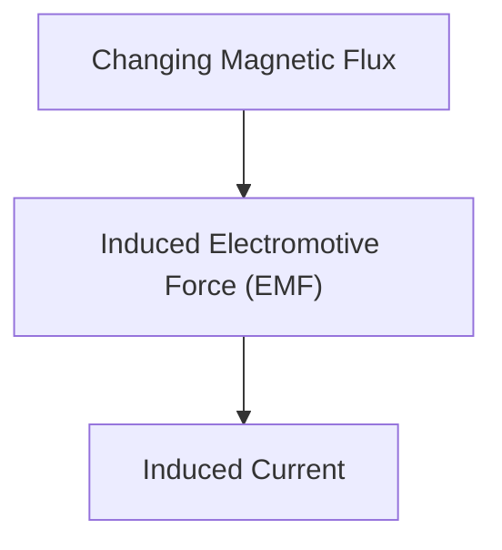

# Physics: Mechanism of Electromagnetic Induction and Motors

Electromagnetic induction is the foundation of generators and motors.

## Faraday's Law

## Faraday's Law of Electromagnetic Induction
$$ \mathcal{E} = -\frac{d\Phi_B}{dt} $$

