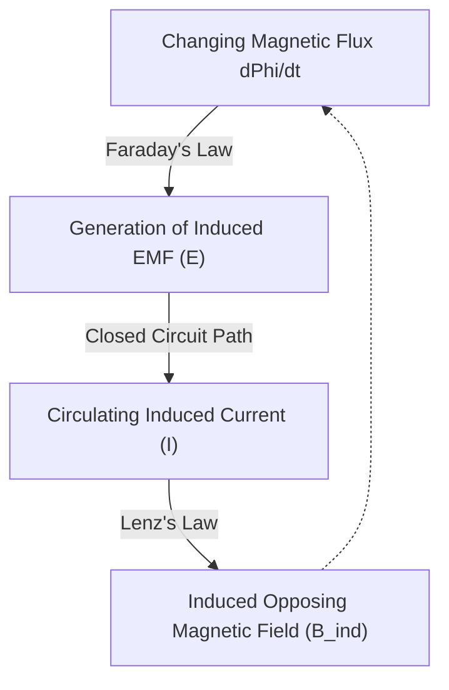

# Physics: Principles of Electromagnetic Induction and Electric Motors - From Faraday to Modern EVs

Modern industrial civilization cannot function without electricity. From the smartphone in your palm to colossal automated assembly lines and the sleek electric vehicles (EVs) cruising metropolitan avenues, electrical energy underpins every facet of contemporary life. Yet behind the seamless flick of a switch or the silent acceleration of an EV lies one of physics' most profound phenomena: **Electromagnetic Induction**.

First discovered in the 19th century by Michael Faraday, electromagnetic induction revolutionized human history, bridging the divide between mechanical work and electrical energy. This article delivers a comprehensive investigation into the physical mechanics of electromagnetic induction, motor design architectures, regenerative braking, and the vanguard of next-generation EV propulsion.

## 1. What is Electromagnetic Induction? Faraday's Masterstroke

In 1831, British scientist **Michael Faraday** conducted a series of laboratory experiments that permanently altered the trajectory of human engineering. Eleven years earlier, Hans Christian Ørsted had demonstrated that an electric current produces a surrounding magnetic field. Faraday reasoned with singular intuition: *if electricity could produce magnetism, could magnetism in motion produce electricity?*

Faraday demonstrated that moving a permanent bar magnet in and out of a conductive coil induced an electric current through the wire without any chemical battery connected. This phenomenon is known as **electromagnetic induction**.

### Faraday's Law and Lenz's Law

Understanding induction requires several foundational electromagnetic concepts:
- **Magnetic Flux ($\Phi_B$)**: The surface integral of the normal component of the magnetic flux density $\mathbf{B}$ passing through an area $A$. Intuitively, it measures the total number of magnetic field lines threading a conductive loop.
- **Induced Electromotive Force (EMF, $\mathcal{E}$)**: The electrical potential difference (voltage) generated across the terminals of a conductor subjected to varying magnetic flux.
- **Induced Current**: The circulating electric current driven through a closed circuit by the induced EMF.

Mathematically, Faraday's Law of Induction is formulated as:

$$ \mathcal{E} = -\frac{d\Phi_B}{dt} $$

This elegant differential relation states that the magnitude of the induced electromotive force in any closed circuit is directly proportional to the time rate of change of magnetic flux through the circuit.

The negative sign ($-$) represents **Lenz's Law**, formulated by physicist Heinrich Lenz in 1834. Lenz's law expresses the conservation of energy in electrodynamics: *the direction of the induced current is always such that its own magnetic field opposes the change in original magnetic flux that produced it.* 

When you push the north pole of a magnet toward a coil, the coil induces a current that generates a north pole at its face to repel the incoming magnet. Conversely, pulling the magnet away induces a current generating a south pole to pull the magnet back. Nature resists the mechanical perturbation.

```mermaid
flowchart TD
    A["Changing Magnetic Flux dPhi/dt"] -->|Faraday's Law| B["Generation of Induced EMF (E)"]
    B -->|Closed Circuit Path| C["Circulating Induced Current (I)"]
    C -->|Lenz's Law| D["Induced Opposing Magnetic Field (B_ind)"]
    D -.-> A
```

## 2. Generating Mechanical Power: The Architecture of Electric Motors

Electromagnetic induction forms the operating principle of the **electrical generator**, which converts mechanical kinetic energy into electrical energy. The inverse device—converting electrical energy into rotational mechanical work—is the **electric motor**. Fundamentally, generators and motors are electromagnetic duals sharing identical core physics.

### Fleming's Left-Hand Rule and the Lorentz Force

When an electric charge moves through an external magnetic field, it experiences a mechanical deflection known as the **Lorentz Force**:

$$ \mathbf{F} = q(\mathbf{E} + \mathbf{v} \times \mathbf{B}) $$

For a macroscopic current-carrying conductor of length $L$ carrying current $I$ within a magnetic field $\mathbf{B}$, the magnetic force simplifies to $\mathbf{F} = I (\mathbf{L} \times \mathbf{B})$. The spatial orientation of this force is memorized through **Fleming's Left-Hand Rule**:
- **Index Finger**: Direction of the Magnetic Field ($\mathbf{B}$, North to South)
- **Middle Finger**: Direction of Current flow ($I$)
- **Thumb**: Direction of resultant Mechanical Force ($\mathbf{F}$) acting on the conductor

In an electric motor, an armature coil is suspended inside a magnetic field. When current flows through the coil, one side experiences an upward force while the opposing side experiences a downward force. This force couple produces a mechanical torque ($\tau$), driving the rotor into continuous rotation.

### Major Motor Topologies: Brushed DC, BLDC, and AC Induction

Modern engineering employs three dominant motor configurations:

1. **Brushed DC Motor**: Utilizes mechanical commutators and carbon brushes to physically flip current direction every half-turn. While cheap and straightforward to control, friction causes mechanical brush wear, sparking, electrical noise, and limited lifespans.
2. **Brushless DC Motor (BLDC)**: Replaces mechanical brushes with solid-state electronic inverters and Hall-effect position sensors. Permanent neodymium magnets reside on the rotor, while the stator windings are sequentially energized by software. BLDC motors provide exceptional efficiency (often $>90\%$), high power density, and zero mechanical brush maintenance, making them omnipresent in consumer electronics, drones, and modern EVs.
3. **AC Induction Motor**: Invented by Nikola Tesla in 1887. The stator is energized by multi-phase alternating current to generate a rotating magnetic stator field. This rotating field cuts across conductive bars on the rotor (squirrel cage), inducing powerful internal eddy currents via Faraday's electromagnetic induction. The interaction between these induced currents and the rotating stator field produces torque. Because it requires zero permanent rare-earth magnets and exhibits remarkable ruggedness, it powers massive industrial machinery.

## 3. Applications in Electric Vehicles (EVs): The Powertrain Revolution

The automotive industry is undergoing its most radical transformation in over a century: migrating from petroleum-burning internal combustion engines (ICE) to electric powertrains driven by electromagnetic induction.

### Superiority of Electric Motors over Internal Combustion Engines

Compared to internal combustion engines, electric traction motors possess decisive mechanical and thermodynamic advantages:
- **Instantaneous Peak Torque at 0 RPM**: Combustion engines must spin up to thousands of RPM to reach peak torque curves. Electric motors deliver 100% of their peak torque immediately at 0 RPM, yielding breathtaking, linear acceleration.
- **Unrivaled Thermal Efficiency**: Combustion engines waste 60–70% of fuel energy as exhaust heat and mechanical friction, achieving thermal efficiencies of only 30–40%. In contrast, high-end EV traction motors convert 90–97% of battery electrical energy directly into wheel traction.
- **Acoustic Serenity and Mechanical Simplicity**: Without thousands of reciprocating pistons, valves, and explosive detonations, electric motors run virtually silent with near-zero vibration.

### Tesla's Engineering Legacy: Induction vs. Permanent Magnets

Tesla, Inc. derived its name from alternating-current pioneer [Nikola Tesla](/p/biography-nikola-tesla/). Early Tesla models—the original Roadster and the Model S/X—utilized pure copper-rotor **AC Induction Motors**, celebrating Tesla's historic brushless induction design that eliminated costly rare-earth magnets.

However, to optimize energy consumption and maximize vehicle range, Tesla and rival automakers transitioned in models like the Model 3 to **Permanent Magnet Synchronous Reluctance Motors (PM-SynRM)**. These hybrid designs integrate neodymium magnets with magnetic reluctance cavities in the rotor, delivering maximal efficiency during stop-and-go urban commutes while maintaining exceptional high-speed power.

### Regenerative Braking: Faraday's Law in Action

The defining innovation of modern EV efficiency is **Regenerative Braking**. When a driver lifts their foot from the accelerator or depresses the brake pedal, the vehicle's control software reverses the inverter: the motor ceases drawing battery power and is instead back-driven by the spinning wheels.

In this mode, **the motor instantly becomes a generator**. Kinetic energy of the moving vehicle forces the rotor through the magnetic field, generating an induced EMF that pumps electrical current back into the lithium-ion battery pack. Simultaneously, according to Lenz's Law, the induced electromagnetic field exerts an opposing counter-torque against the wheels, decelerating the car smoothly. Rather than wasting kinetic energy as brake-pad friction heat, EVs recover up to 70% of braking energy, dramatically extending driving range.

## 4. The Future of Motor Technology: Superconductors and Sustainable Magnets

Nearly two centuries after Faraday's discovery, electric motor engineering continues to leap forward:

- **Superconducting Traction Motors**: By cooling high-temperature superconducting (HTS) wire coils with liquid nitrogen or closed-cycle cryocoolers, electrical resistance vanishes completely ($R = 0$). Superconducting motors eliminate resistive Joule heating entirely, achieving power densities four to five times higher than conventional motors. This breakthrough is critical for zero-emission electric aviation (eVTOL and commercial electric aircraft) where weight is the ultimate constraint.
- **Rare-Earth-Free Sustainable Motors**: To mitigate geopolitical supply chain dependencies on neodymium and dysprosium, researchers are commercializing advanced Wound-Rotor Synchronous Motors (WRSM) and iron-nitride ($Fe_{16}N_2$) magnetic alloys, maximizing sustainability without compromising peak torque.
- **AI-Driven Magnetic Circuit Optimization**: Finite element electromagnetic simulations driven by neural networks optimize rotor flux barriers at sub-millimeter tolerances, squeezing every decimal point of efficiency from the stator core.

## 5. Conclusion: The World Set in Motion by Faraday's Coil

Every facet of contemporary civilization—from the humming server racks of the Internet to the silent, instantaneous acceleration of a modern electric car—originates from that humble desktop experiment conducted by Michael Faraday in 1831.

The fundamental law connecting changing magnetic fields to induced electrical voltages demonstrates the transcendent power of basic physics to reshape human destiny. As we navigate the global transition toward renewable energy and electrified mobility, the dance between electrons and magnetic fields remains the beating heart of technological progress.
