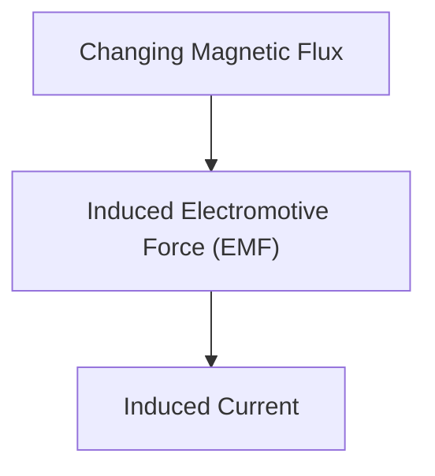

# Física: Inducción electromagnética y el mecanismo del motor

La inducción electromagnética es la base de los generadores y motores.

## Ley de Faraday

## Ley de inducción electromagnética de Faraday
$$ \mathcal{E} = -\frac{d\Phi_B}{dt} $$

## Parte de verificación técnica adicional 1

En esta sección, profundizamos en más detalles técnicos y estudios de casos. Evaluamos el rendimiento bajo diversas condiciones y examinamos los desafíos y soluciones relacionados con la integración con otros sistemas. También consideramos las perspectivas y limitaciones futuras.

