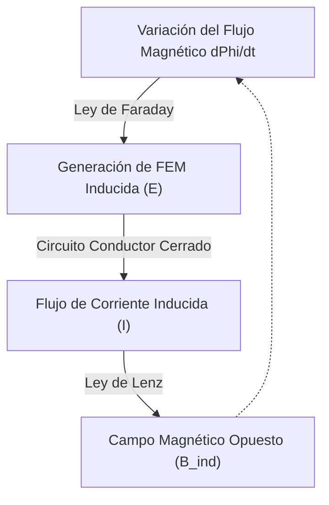

# Física: Principios de la Inducción Electromagnética y Motores - De Faraday a los Vehículos Eléctricos

La civilización moderna no puede concebirse sin electricidad. Desde los teléfonos móviles hasta las cadenas de producción robotizadas y los silenciosos vehículos eléctricos (EV) que recorren nuestras ciudades, la energía eléctrica mueve nuestro mundo. Pero, ¿cómo se genera esa energía y de qué manera se convierte en movimiento rotatorio con una eficiencia asombrosa?

La respuesta reside en la **inducción electromagnética**, un fenómeno descubierto en el siglo XIX por Michael Faraday que transformó para siempre la historia humana y sentó las bases de la ingeniería eléctrica. En este artículo explicamos los fundamentos físicos de la inducción, los principios de funcionamiento de los motores eléctricos y las tecnologías de vanguardia que impulsan los coches eléctricos de nueva generación.

## 1. ¿Qué es la Inducción Electromagnética? El Descubrimiento de Faraday

En 1831, el físico y químico británico **Michael Faraday** realizó un hallazgo histórico. Once años antes, Hans Christian Ørsted había demostrado que una corriente eléctrica crea un campo magnético a su alrededor. Faraday planteó la hipótesis inversa: *si la electricidad produce magnetismo, el movimiento magnético debe ser capaz de producir electricidad.*

Tras rigurosos experimentos, demostró que mover un imán dentro de una bobina conductora genera de forma inmediata una corriente eléctrica en el hilo de cobre, sin necesidad de pilas químicas. Este fenómeno se bautizó como **inducción electromagnética**.

### La Ley de Faraday y la Ley de Lenz

Para comprender la inducción, es preciso familiarizarse con tres conceptos esenciales:
- **Flujo Magnético ($\Phi_B$)**: El producto del campo magnético perpendicular que atraviesa una superficie determinada. Gráficamente, representa la cantidad neta de líneas de fuerza magnética que cruzan el interior de una espira.
- **Fuerza Electromotriz Inducida (FEM, $\mathcal{E}$)**: La diferencia de potencial eléctrico (voltaje) generada en los extremos de un conductor cuando varía el flujo magnético que lo atraviesa.
- **Corriente Inducida**: La corriente eléctrica que fluye a través de un circuito cerrado impulsada por la fuerza electromotriz.

La Ley de Inducción de Faraday se expresa matemáticamente mediante la siguiente ecuación diferencial:

$$ \mathcal{E} = -\frac{d\Phi_B}{dt} $$

Esta fórmula establece que la tensión eléctrica inducida en un circuito cerrado es directamente proporcional a la rapidez con la que cambia el flujo magnético en el tiempo.

El **signo negativo ($-$)** en la fórmula encierra un significado físico crucial: representa la **Ley de Lenz**, formulada por Heinrich Lenz en 1834. La Ley de Lenz es la encarnación del principio de conservación de la energía en el electromagnetismo: *el sentido de la corriente inducida es tal que su propio campo magnético se opone siempre a la variación del flujo magnético que la produjo.*

Si aproximamos el polo norte de un imán a una bobina, esta inducirá una corriente que crea un polo norte enfrentado para repelerlo; si alejamos el imán, la bobina generará un polo sur para retenerlo. La naturaleza ofrece siempre una resistencia inercial al cambio de estado electromagnético.

```mermaid
flowchart TD
    A["Variación del Flujo Magnético dPhi/dt"] -->|Ley de Faraday| B["Generación de FEM Inducida (E)"]
    B -->|Circuito Conductor Cerrado| C["Flujo de Corriente Inducida (I)"]
    C -->|Ley de Lenz| D["Campo Magnético Opuesto (B_ind)"]
    D -.-> A
```

## 2. Generando Fuerza Mecánica: El Funcionamiento del Motor Eléctrico

La inducción electromagnética es el principio que permite a un **generador eléctrico** transformar energía cinética mecánica en electricidad. El proceso inverso, que convierte energía eléctrica en movimiento mecánico rotatorio, es el cometido del **motor eléctrico**. Generadores y motores son máquinas electromagnéticas equivalentes y simétricas.

### La Fuerza de Lorentz y la Regla de la Mano Izquierda

El empuje que hace girar un motor proviene de la **Fuerza de Lorentz**, la fuerza que experimenta una carga eléctrica al desplazarse por un campo magnético:

$$ \mathbf{F} = q(\mathbf{E} + \mathbf{v} \times \mathbf{B}) $$

Para un conductor rectilíneo de longitud $L$ por el que circula una corriente $I$ inmerso en un campo magnético $\mathbf{B}$, la fuerza mecánica resultante es $\mathbf{F} = I (\mathbf{L} \times \mathbf{B})$. El sentido de esta fuerza se determina con la **Regla de la Mano Izquierda de Fleming**:
- **Dedo Índice**: Dirección del Campo Magnético ($\mathbf{B}$, de Norte a Sur).
- **Dedo Corazón**: Dirección de la Corriente ($I$).
- **Dedo Pulgar**: Dirección de la Fuerza Mecánica resultante ($\mathbf{F}$).

En un motor, se sitúa una bobina en el seno de un campo magnético. Al circular corriente, un lateral de la espira experimenta una fuerza ascendente y el lateral opuesto una fuerza descendente. Este par de fuerzas produce un momento de torsión (torque) que hace girar el rotor de forma ininterrumpida.

### Principales Tipos de Motores Eléctricos

1. **Motor de Corriente Continua con Escobillas (Brushed DC)**: Utiliza un conmutador mecánico y escobillas de grafito para invertir el sentido de la corriente cada media vuelta. Aunque su control es elemental, la fricción y el chisporroteo desgastan las escobillas, limitando su vida útil.
2. **Motor Brushless (BLDC / Sin Escobillas)**: Elimina las escobillas mecánicas y utiliza un inversor electrónico para conmutar las fases del estator. El rotor lleva imanes permanentes de neodimio, logrando eficiencias superiores al 90%, cero mantenimiento y altas velocidades, siendo el estándar en drones, robótica y automoción eléctrica.
3. **Motor de Inducción de Corriente Alterna (AC Induction Motor)**: Inventado por [Nikola Tesla](/p/biography-nikola-tesla/) en 1887. Al alimentar el estator con corriente alterna polifásica se crea un campo magnético rotativo. Este campo barre las barras conductoras del rotor en jaula de ardilla, induciendo en ellas intensas corrientes por **inducción electromagnética**. La interacción entre estas corrientes inducidas y el campo giratorio arrastra el rotor. No necesita imanes de tierras raras y destaca por su extraordinaria robustez mecánica.

## 3. La Revolución en los Vehículos Eléctricos (EV)

La industria automotriz global protagoniza la mayor transición de su historia: el reemplazo de los motores de combustión interna (ICE) por sistemas de propulsión eléctrica alimentados por baterías.

### Ventajas del Motor Eléctrico frente al Motor de Combustión

Frente a los motores térmicos de gasolina o diésel, los motores eléctricos ofrecen ventajas físicas insuperables:
- **Par Motor Máximo Instantáneo a 0 RPM**: Mientras un motor de combustión necesita subir a miles de revoluciones para entregar su par óptimo, el motor eléctrico entrega el 100% de su par desde la primera fracción de segundo (0 RPM), proporcionando una aceleración lineal demoledora.
- **Rendimiento Energético Incomparable**: La eficiencia térmica de los motores de gasolina apenas ronda el 30–40% debido a pérdidas por calor en el escape y rozamiento. Los motores eléctricos de tracción superan holgadamente el 90–95% de eficiencia.
- **Silencio y Suavidad Mecánica**: Al prescindir de explosiones internas y pistones alternativos, la marcha es silenciosa y libre de vibraciones mecánicas.

### La Evolución en Tesla: Del Motor de Inducción al Motor Síncrono de Imanes Permanentes

La compañía Tesla rinde homenaje con su nombre al creador del motor de inducción, [Nikola Tesla](/p/biography-nikola-tesla/). Modelos emblemáticos tempranos como el Roadster y el Model S recurrieron a **motores de inducción de corriente alterna**, eludiendo el uso de tierras raras.

No obstante, en vehículos de gran volumen como el Model 3 o Model Y, los ingenieros adoptaron el **Motor Síncrono de Reluctancia Asistido por Imanes Permanentes (PM-SynRM)**. Este motor combina la fuerza de imanes de neodimio de alto rendimiento con cavidades de reluctancia geométrica en el rotor, maximizando la eficiencia en ciclo urbano sin penalizar la velocidad de crucero en autopista.

### Frenado Regenerativo: La Ley de Faraday en Plena Acción

Una de las grandes genialidades del coche eléctrico es el **frenado regenerativo (Regenerative Braking)**.

Cuando el conductor levanta el pie del pedal acelerador o acciona el freno, el vehículo conmuta la electrónica de potencia: la batería deja de alimentar al motor, y la inercia de las ruedas pasa a mover forzadamente el rotor. En ese instante, **el motor se convierte instantáneamente en un generador eléctrico**.

La energía cinética del coche hace girar las bobinas dentro del campo magnético, generando por inducción de Faraday una corriente de alto voltaje que recarga la batería. Al mismo tiempo, por Ley de Lenz, la fuerza contraelectromotriz opone una resistencia al giro de las ruedas, frenando el vehículo con suavidad. Esta tecnología recupera más del 70% de la energía que en un coche convencional se perdería inútilmente en forma de calor y desgaste en las pastillas de freno.

## 4. El Futuro de la Propulsión: Superconductores y Sostenibilidad

Casi doscientos años después del experimento de Faraday, la ingeniería de motores eléctricos continúa avanzando:

- **Motores Superconductores**: Utilizando bobinados de superconductores de alta temperatura (HTS) refrigerados, se suprime por completo la resistencia eléctrica interna ($R = 0$). Sin pérdidas térmicas por efecto Joule, estos motores ofrecen una densidad de potencia cuatro veces superior con un peso muy inferior, siendo la clave tecnológica para la futura aviación comercial eléctrica (aviones eléctricos y eVTOL).
- **Motores Libres de Tierras Raras**: Para evitar la dependencia de las cadenas de suministro de neodimio, laboratorios de todo el mundo desarrollan motores síncronos de rotor bobinado (WRSM) y aleaciones ferromagnéticas de nitruro de hierro ($Fe_{16}N_2$).

## 5. Conclusión: El Mundo Impulsado por la Bobina de Faraday

Toda la tecnología de la que disfrutamos en el siglo XXI —desde las redes de telecomunicaciones globales hasta los vehículos eléctricos que recorren nuestras carreteras— es deudora del modesto experimento que Michael Faraday llevó a cabo en su mesa de trabajo en 1831.

La ley que une la variación de los campos magnéticos con la creación de corriente eléctrica ilustra con majestuosidad el poder transformador de la física fundamental. A medida que avanzamos hacia un planeta libre de combustibles fósiles, la danza invisible entre electrones y campos magnéticos continuará siendo el motor del progreso humano.
