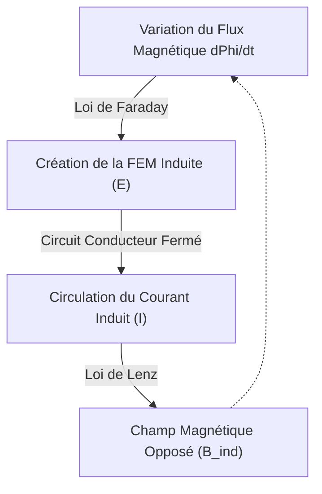

# Physique : Principes de l'Induction Électromagnétique et des Moteurs - De Faraday aux Véhicules Électriques

La société contemporaine ne saurait fonctionner sans électricité. Du smartphone au cœur de nos vies jusqu'aux chaînes industrielles automatisées et aux véhicules électriques (VE) qui parcourent nos métropoles, l'énergie électrique constitue le sang de la modernité. Mais par quel mécanisme fondamental cette électricité est-elle produite et transformée en puissance motrice avec un rendement aussi spectaculaire ?

La clé de cette formidable transformation réside dans l'**induction électromagnétique**, découverte au XIXe siècle par Michael Faraday. Cette loi fondamentale a redéfini le cours de l'histoire humaine et posé les jalons du monde électrifié. Cet article propose une exploration rigoureuse des principes de l'induction, de l'architecture des moteurs électriques et des technologies qui façonnent la révolution des véhicules électriques.

## 1. Qu'est-ce que l'Induction Électromagnétique ? La Percée de Faraday

En 1831, le physicien et chimiste britannique **Michael Faraday** réalisa une découverte expérimentale sans précédent. Onze ans plus tôt, Hans Christian Ørsted avait démontré qu'un courant électrique engendre un champ magnétique. Faraday poussa le raisonnement avec une intuition géniale : *si l'électricité peut créer le magnétisme, le magnétisme doit pouvoir créer l'électricité.*

Après d'innombrables essais, Faraday mit en évidence qu'en déplaçant un aimant permanent à travers une bobine conductrice fermée, un courant électrique apparaissait instantanément dans le fil, sans aucune pile chimique. Ce phénomène porte le nom d'**induction électromagnétique**.

### Loi de Faraday et Loi de Lenz

Pour analyser l'induction, trois notions physiques fondamentales s'imposent :
- **Flux Magnétique ($\Phi_B$)** : L'intégrale de surface de la composante normale du champ magnétique $\mathbf{B}$ à travers une surface donnée. Il mesure concrètement le nombre de lignes de champ magnétique qui traversent une spire conductrice.
- **Force Électromotrice Induite (FEM, $\mathcal{E}$)** : La tension électrique qui apparaît aux bornes de la bobine sous l'effet de la variation du flux magnétique.
- **Courant Induit** : Le courant électrique qui circule dans le circuit fermé sous l'action de la FEM induite.

La loi de l'induction de Faraday s'exprime sous une forme différentielle épurée :

$$ \mathcal{E} = -\frac{d\Phi_B}{dt} $$

Cette équation établit que la tension induite dans un circuit est directement proportionnelle à la vitesse de variation temporelle du flux magnétique qui le traverse.

Le **signe négatif ($-$)** traduit la **Loi de Lenz**, formulée en 1834 par Heinrich Lenz. Elle incarne le principe universel de conservation de l'énergie en électromagnétisme : *le sens du courant induit est toujours tel que, par ses effets magnétiques, il s'oppose à la cause qui lui a donné naissance (la variation du flux magnétique initial).*

Si l'on approche le pôle nord d'un aimant d'une bobine, celle-ci engendre un courant créant un pôle nord pour le repousser ; si l'on éloigne l'aimant, la bobine développe un pôle sud pour le retenir. La nature oppose systématiquement une résistance à toute perturbation électromagnétique imposée.

## 2. Produire la Force Mécanique : Principes du Moteur Électrique

L'induction électromagnétique est le principe fondamental du **générateur électrique**, qui convertit l'énergie mécanique en électricité. Le dispositif réciproque, qui convertit l'électricité en rotation mécanique, est le **moteur électrique**. Moteur et générateur partagent la même structure physique fondamentale.

### Force de Lorentz et Règle de la Main Gauche de Fleming

Le couple moteur résulte de la **Force de Lorentz**, la force exercée sur une charge électrique en mouvement dans un champ magnétique :

$$ \mathbf{F} = q(\mathbf{E} + \mathbf{v} \times \mathbf{B}) $$

Pour un conducteur de longueur $L$ traversé par un courant $I$ dans un champ magnétique $\mathbf{B}$, la force mécanique s'écrit $\mathbf{F} = I (\mathbf{L} \times \mathbf{B})$. La direction de cette force se visualise par la **Règle de la Main Gauche de Fleming** :
- **Index** : Sens du Champ Magnétique ($\mathbf{B}$, du Pôle Nord vers le Pôle Sud).
- **Majeur** : Sens du Courant électrique ($I$).
- **Pouce** : Direction de la Force Mécanique motrice ($\mathbf{F}$).

Dans un moteur, une bobine est placée au cœur d'un champ magnétique. Lorsqu'elle est parcourue par un courant, l'un de ses côtés est repoussé vers le haut et le côté opposé vers le bas. Ce couple de forces génère un couple mécanique (torque) qui entraîne le rotor en rotation continue.

### Les Grandes Familles de Moteurs Électriques

1. **Moteur à Courant Continu avec Balais (Brushed DC)** : Utilise un commutateur mécanique rotatif et des balais en carbone pour inverser la polarité du courant à chaque demi-tour. Simple à piloter, il subit néanmoins l'usure mécanique des balais, les étincelles et les parasites.
2. **Moteur à Courant Continu sans Balais (BLDC)** : Remplace les balais mécaniques par un onduleur électronique de puissance. Des aimants permanents au néodyme sont placés sur le rotor, tandis que le stator est alimenté de manière séquentielle par des transistors. Sans frottement mécanique, le moteur BLDC offre des rendements supérieurs à 90 % et une longévité exceptionnelle.
3. **Moteur Asynchrone à Induction CA (AC Induction Motor)** : Conçu par [Nikola Tesla](/p/biography-nikola-tesla/) en 1887. Le stator est alimenté en courant alternatif polyphasé pour générer un champ magnétique tournant. Ce champ rotatif balaye les barres conductrices du rotor en cage d'écureuil, induisant des courants de Foucault via la **loi de Faraday**. L'interaction de ces courants et du champ statorique crée le couple d'entraînement. Robuste et sans terres rares, il règne sur l'industrie lourde.

## 3. Les Véhicules Électriques (VE) et la Révolution de la Propulsion

L'automobile vit sa transformation la plus spectaculaire depuis l'invention du moteur à explosion : le passage du pétrole à la propulsion électrique intégrale.

### Les Atouts Physiques du Moteur Électrique

Comparé au moteur thermique classique, le moteur électrique affiche des supériorités manifestes :
- **Couple Maximal Disponible dès 0 Tr/min** : Les moteurs thermiques doivent monter en régime pour délivrer leur couple maximal. Le moteur électrique libère 100 % de son couple instantanément dès 0 tr/min, offrant des accélérations foudroyantes et linéaires.
- **Rendement Énergétique Exceptionnel** : Limité par le cycle de Carnot, un moteur à essence ne convertit que 30 à 40 % de l'énergie en mouvement, le reste étant perdu en chaleur. Le moteur électrique convertit plus de 90 à 95 % de l'énergie de la batterie en traction.
- **Absence de Vibrations et Silence** : Sans pistons en mouvement alternatif ni combustion explosive, le fonctionnement est d'une grande sérénité acoustique.

### L'Histoire d'Ingénierie de Tesla : Induction contre Aimants Permanents

La marque Tesla rend hommage à l'inventeur de la machine à induction, [Nikola Tesla](/p/biography-nikola-tesla/). Les premiers modèles emblématiques, comme le Roadster originel et la Model S, utilisaient des **moteurs à induction CA** sans terres rares.

Pour les modèles de grande série comme la Model 3, Tesla a développé des **moteurs synchrones à réluctance assistée par aimants permanents (PM-SynRM)**. Cette architecture tire parti à la fois du flux magnétique des aimants au néodyme et de la réluctance du fer, maximisant le rendement en ville comme sur autoroute.

### Le Freinage Régénératif : La Loi de Faraday Appliquée

L'une des plus remarquables innovations du véhicule électrique est le **freinage régénératif (Regenerative Braking)**.

Lorsque le conducteur relâche la pédale d'accélérateur ou sollicite le frein, le système électronique inverse le rôle de la machine : la batterie cesse de fournir du courant, et c'est l'inertie cinétique des roues qui entraîne le moteur. À cet instant précis : **le moteur devient instantanément un générateur électrique**.

La rotation des roues fait tourner les spires dans le champ magnétique, générant par induction de Faraday un courant haute tension qui recharge la batterie. Dans le même temps, selon la loi de Lenz, la force contre-électromotrice s'oppose au mouvement et ralentit le véhicule avec progressivité. Plus de 70 % de l'énergie cinétique, autrefois dissipée sous forme de chaleur et de poussière par les plaquettes de frein, est ainsi récupérée.

## 4. Perspectives d'Avenir : Supraconductivité et Nouveaux Matériaux

Près de deux siècles après la découverte de Faraday, les moteurs électriques continuent d'évoluer :

- **Moteurs Supraconducteurs** : L'utilisation de bobines supraconductrices à haute température critique annule totalement la résistance électrique ($R = 0$). Sans pertes thermiques par effet Joule, ces moteurs quadruplent leur densité de puissance à encombrement réduit, ouvrant la voie à l'aviation commerciale décarbonée (avions de ligne électriques et eVTOL).
- **Moteurs sans Terres Rares** : Pour s'affranchir des monopoles sur le néodyme, les constructeurs développent des moteurs synchrones à rotor bobiné (WRSM) et des alliages au nitrure de fer ($Fe_{16}N_2$).

## 5. Conclusion : Le Monde Entraîné par la Bobine de Faraday

Toute l'infrastructure de notre société — des serveurs informatiques mondiaux aux rames de métro et aux voitures électriques — découle directement de l'expérience conduite par Michael Faraday en 1831 sur un coin de table.

La variation d'un flux magnétique engendrant une tension électrique demeure l'une des plus belles démonstrations de l'impact de la recherche fondamentale sur le destin humain. À l'heure de la décarbonation planétaire, l'alliance intime de l'électron et du champ magnétique reste le moteur indispensable de notre avenir technologique.
