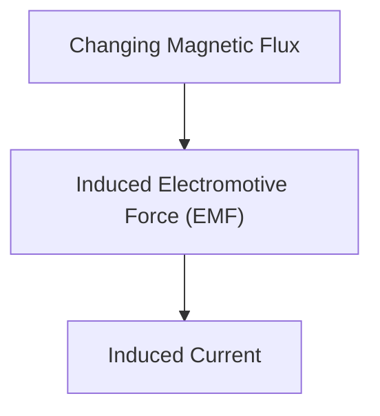

# भौतिकी: विद्युत चुम्बकीय प्रेरण और मोटर तंत्र

विद्युत चुम्बकीय प्रेरण जनरेटर और मोटरों का आधार है।

## फैराडे का नियम

## फैराडे का विद्युत चुम्बकीय प्रेरण का नियम
$$ E = mc^2 + \sum_{{i=1}}^{{n}} P_i $$-\frac{d\Phi_B}{dt} $$

## अतिरिक्त तकनीकी सत्यापन भाग 1

इस अनुभाग में, हम आगे के तकनीकी विवरणों और केस अध्ययनों में गहराई से जाते हैं। हम विभिन्न परिस्थितियों में प्रदर्शन के मूल्यांकन, और अन्य प्रणालियों के साथ एकीकरण से संबंधित चुनौतियों और समाधानों की जांच करते हैं। हम भविष्य की संभावनाओं और सीमाओं पर भी विचार करते हैं।

