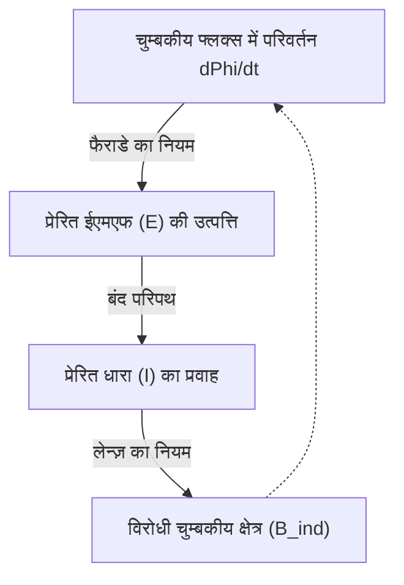

# भौतिकी: विद्युत चुम्बकीय प्रेरण और इलेक्ट्रिक मोटर का सिद्धांत - फैराडे से ईवी तक

आधुनिक औद्योगिक सभ्यता बिजली के बिना एक पल भी नहीं चल सकती। हमारे स्मार्टफोन से लेकर स्वचालित रोबोट और सड़कों पर दौड़ती इलेक्ट्रिक कारों (EVs) तक, बिजली हमारे जीवन का आधार है। लेकिन क्या आप जानते हैं कि यह बिजली कैसे पैदा होती है और इतनी कुशलता से घूमने वाली गति में कैसे बदल जाती है?

इसका उत्तर भौतिकी की उस महान घटना में छिपा है जिसे **विद्युत चुम्बकीय प्रेरण (Electromagnetic Induction)** कहा जाता है। 19वीं सदी में माइकल फैराडे द्वारा खोजी गई इस घटना ने मानव इतिहास की दिशा बदल दी। इस लेख में हम विद्युत चुम्बकीय प्रेरण के मूल नियमों, इलेक्ट्रिक मोटरों की कार्यप्रणाली और इलेक्ट्रिक वाहनों (EVs) की अत्याधुनिक तकनीक को विस्तार से समझेंगे।

## 1. विद्युत चुम्बकीय प्रेरण क्या है? माइकल फैराडे की ऐतिहासिक खोज

1831 में ब्रिटिश भौतिक विज्ञानी और रसायन शास्त्री **माइकल फैराडे** ने एक युगांतरकारी खोज की। इससे ग्यारह वर्ष पूर्व हैंस क्रिश्चियन ऑर्स्टेड ने सिद्ध किया था कि "विद्युत धारा से चुम्बकीय क्षेत्र बनता है"। फैराडे ने सोचा: *यदि बिजली चुम्बकत्व पैदा कर सकती है, तो चुम्बक की गति से भी बिजली बननी चाहिए।*

कई प्रयोगों के बाद फैराडे ने साबित किया कि जब किसी बंद तार की कुंडली (कॉइल) के पास चुम्बक को हिलाया जाता है, तो तार में बिना किसी बैटरी के अपने आप विद्युत धारा बहने लगती है। इसे **विद्युत चुम्बकीय प्रेरण** कहा जाता है।

### फैराडे का नियम और लेन्ज़ का नियम

इस प्रक्रिया को समझने के लिए तीन भौतिक राशियों को जानना आवश्यक है:
- **चुम्बकीय फ्लक्स ($\Phi_B$)**: किसी सतह से लंबवत गुजरने वाली चुम्बकीय क्षेत्र रेखाओं की कुल संख्या।
- **प्रेरित विद्युत वाहक बल (EMF, $\mathcal{E}$)**: फ्लक्स में परिवर्तन होने पर कुंडली के सिरों पर उत्पन्न होने वाला वोल्टेज।
- **प्रेरित धारा (Induced Current)**: प्रेरित ईएमएफ द्वारा बंद परिपथ में बहने वाली धारा।

फैराडे का विद्युत चुम्बकीय प्रेरण का नियम गणितीय रूप से इस प्रकार लिखा जाता है:

$$ \mathcal{E} = -\frac{d\Phi_B}{dt} $$

इसका अर्थ है: कुंडली से गुजरने वाले चुम्बकीय फ्लक्स के बदलने की दर जितनी तेज़ होगी, उत्पन्न वोल्टेज (ईएमएफ) उतना ही अधिक होगा।

यहाँ सबसे महत्वपूर्ण है सूत्र का **ऋण चिह्न ($-$)**, जो **लेन्ज़ का नियम (Lenz's Law)** दर्शाता है। 1834 में हेनरिक लेन्ज़ द्वारा दिया गया यह नियम ऊर्जा संरक्षण का प्रतीक है: *प्रेरित धारा की दिशा हमेशा ऐसी होती है कि वह उसी कारण (फ्लक्स परिवर्तन) का विरोध करती है जिससे वह स्वयं उत्पन्न हुई है।*

यदि आप चुम्बक के उत्तरी ध्रुव को कुंडली की ओर ले जाएंगे, तो कुंडली में ऐसी धारा बहेगी जो सामने उत्तरी ध्रुव बनाकर चुम्बक को पीछे धकेलेगी। प्रकृति बाहरी परिवर्तन का विरोध करती है।

```mermaid
flowchart TD
    A["चुम्बकीय फ्लक्स में परिवर्तन dPhi/dt"] -->|फैराडे का नियम| B["प्रेरित ईएमएफ (E) की उत्पत्ति"]
    B -->|बंद परिपथ| C["प्रेरित धारा (I) का प्रवाह"]
    C -->|लेन्ज़ का नियम| D["विरोधी चुम्बकीय क्षेत्र (B_ind)"]
    D -.-> A
```

## 2. यांत्रिक शक्ति का निर्माण: इलेक्ट्रिक मोटर कैसे काम करती है?

विद्युत चुम्बकीय प्रेरण **जनरेटर (Generator)** का आधार है, जो गति को बिजली में बदलता है। इसका ठीक उल्टा उपकरण **इलेक्ट्रिक मोटर** है, जो बिजली को घूमने वाली यांत्रिक शक्ति में बदलता है।

### लोरेंट्ज़ बल और फ्लेमिंग का बायां हाथ नियम

मोटर के घूमने का कारण **लोरेंट्ज़ बल (Lorentz force)** है, जो चुम्बकीय क्षेत्र में गतिशील आवेश पर लगता है:

$$ \mathbf{F} = q(\mathbf{E} + \mathbf{v} \times \mathbf{B}) $$

चुम्बकीय क्षेत्र $\mathbf{B}$ में $L$ लंबाई के तार में $I$ धारा बहने पर लगने वाला बल $\mathbf{F} = I (\mathbf{L} \times \mathbf{B})$ होता है। इसकी दिशा **फ्लेमिंग के बाएं हाथ के नियम** से ज्ञात होती है:
- **तर्जनी**: चुम्बकीय क्षेत्र की दिशा (N से S)
- **मध्यमा**: विद्युत धारा की दिशा ($I$)
- **अंगूठा**: तार पर लगने वाले बल की दिशा ($\mathbf{F}$)

मोटर में चुम्बकों के बीच एक कॉइल रखी जाती है। धारा बहने पर कॉइल की एक भुजा ऊपर और दूसरी भुजा नीचे की ओर बल अनुभव करती है। यह जोड़ा मिलकर एक घूर्णन बल (Torque) बनाता है जिससे मोटर का रोटर लगातार घूमने लगता है।

### तीन प्रमुख मोटर प्रकार

1. **ब्रशयुक्त डीसी मोटर (Brushed DC)**: इसमें धारा की दिशा बदलने के लिए कम्यूटेटर और कार्बन ब्रश लगे होते हैं। यह सरल होती है लेकिन ब्रश घिसने से चिंगारियां निकलती हैं और इसका जीवनकाल सीमित होता है।
2. **ब्रशलेस डीसी मोटर (BLDC)**: इसमें ब्रश की जगह इलेक्ट्रॉनिक इनवर्टर सर्किट होता है। रोटर पर स्थायी नियोडिमियम चुम्बक होते हैं। 90% से अधिक दक्षता और घर्षण न होने के कारण यह ड्रोन और इलेक्ट्रिक कारों में अत्यधिक लोकप्रिय है।
3. **एसी इंडक्शन मोटर (AC Induction Motor)**: इसका आविष्कार [निकोला टेस्ला](/p/biography-nikola-tesla/) ने 1887 में किया था। स्टेटर में प्रत्यावर्ती धारा (AC) भेजकर घूमता हुआ चुम्बकीय क्षेत्र बनाया जाता है। यह क्षेत्र रोटर के तारों में **फैराडे के प्रेरण नियम** से भंवर धाराएं (Eddy Currents) पैदा करता है, जिससे रोटर घूमने लगता है। इसमें किसी महंगे चुम्बक की आवश्यकता नहीं होती।

## 3. इलेक्ट्रिक वाहनों (EVs) में मोटर क्रांति

ऑटोमोबाइल उद्योग 100 साल पुराने पेट्रोल/डीजल इंजनों को छोड़कर पूरी तरह इलेक्ट्रिक वाहनों (EVs) की ओर बढ़ रहा है।

### पेट्रोल इंजन की तुलना में इलेक्ट्रिक मोटर के लाभ

- **0 RPM पर तुरंत अधिकतम टॉर्क**: पेट्रोल इंजन को अधिकतम टॉर्क के लिए हजारों चक्कर लगाने पड़ते हैं, जबकि मोटर चालू होते ही (0 RPM) 100% टॉर्क दे देती है, जिससे रॉकेट जैसी तेज गति मिलती है।
- **अद्भुत ऊर्जा दक्षता**: पेट्रोल इंजन केवल 30–40% ईंधन ऊर्जा को गति में बदल पाते हैं, शेष गर्मी बनकर उड़ जाती है। इलेक्ट्रिक मोटर 90–95% से अधिक बिजली को सीधे पहियों की गति में बदल देती है।
- **शांति और शून्य कंपन**: बिना किसी विस्फोट और पिस्टन की खड़खड़ाहट के यह बेहद शांत चलती है।

### टेस्ला और मोटरों का विकास

टेस्ला कंपनी का नाम एसी मोटर के जनक [निकोला टेस्ला](/p/biography-nikola-tesla/) के नाम पर है। शुरुआती टेस्ला कारों (Roadster, Model S) में तांबे के रोटर वाली **एसी इंडक्शन मोटर** लगी थी।

लेकिन हालिया Model 3 और Model Y में अधिक रेंज के लिए **परमानेंट मैग्नेट सिंक्रोनस रिलक्टेंस मोटर (PM-SynRM)** का उपयोग किया गया है। यह चुम्बकों और विशेष रोटर बनावट को मिलाकर शहरों और हाईवे दोनों पर सर्वोत्तम ऊर्जा बचत देती है।

### पुनर्योजी ब्रेकिंग (Regenerative Braking): फैराडे के नियम का कमाल

ईवी की सबसे बड़ी विशेषता **रीजेनरेटिव ब्रेकिंग** है।

जब ड्राइवर एक्सीलेटर से पैर हटाता है या ब्रेक लगाता है, तो मोटर को बैटरी से बिजली देना बंद कर दिया जाता है और पहियों की गति से मोटर को घुमाया जाता है। उस क्षण: **मोटर तुरंत जनरेटर बन जाती है!**

पहियों की गति से कॉइल चुम्बकीय क्षेत्र में घूमती है और फैराडे के नियम से उच्च वोल्टेज बिजली बनाकर बैटरी को चार्ज करने लगती है। साथ ही, लेन्ज़ के नियम के अनुसार बनने वाला विरोधी बल पहियों को धीमा कर देता है। 70% से अधिक ब्रेकिंग ऊर्जा जो पहले घर्षण ताप बनकर बर्बाद होती थी, दोबारा बैटरी में सुरक्षित हो जाती है।

## 4. मोटर तकनीक का भविष्य

फैराडे की खोज के लगभग 200 वर्ष बाद भी मोटर तकनीक लगातार आगे बढ़ रही है:
- **सुपरकंडक्टिंग मोटर्स**: शून्य प्रतिरोध वाले अतिचालक तारों का उपयोग करके ऐसी हल्की और शक्तिशाली मोटरें बनाई जा रही हैं जो भविष्य के इलेक्ट्रिक यात्री हवाई जहाजों को उड़ा सकेंगी।
- **दुर्लभ धातुओं से मुक्त मोटरें**: नियोडिमियम जैसे दुर्लभ तत्वों पर निर्भरता समाप्त करने के लिए आयरन-नाइट्रोजन चुम्बकों और घाव-रोटर मोटरों (WRSM) पर तेजी से शोध हो रहा है।

## 5. निष्कर्ष: फैराडे की कॉइल से घूमती दुनिया

आज का आधुनिक विश्व—इंटरनेट सर्वरों से लेकर शांत सड़कों पर दौड़ती इलेक्ट्रिक कारों तक—माइकल फैराडे के 1831 के उस छोटे से मेज-प्रयोग का ऋणी है।

चुम्बकत्व और बिजली का यह अटूट संबंध दर्शाता है कि कैसे भौतिकी के मूल नियम दुनिया को बदल सकते हैं। स्वच्छ ऊर्जा के नए युग में फैराडे का यह सिद्धांत आने वाली पीढ़ियों के लिए भी प्रगति का मुख्य पहिया बना रहेगा।
