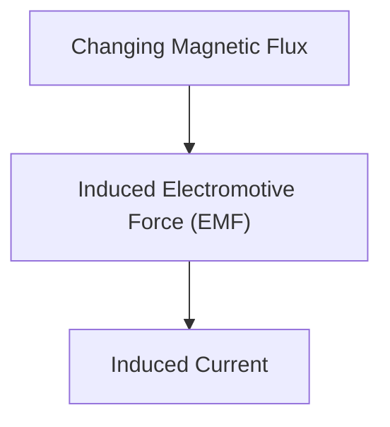

# Fisika: Induksi Elektromagnetik dan Mekanisme Motor

Induksi elektromagnetik adalah dasar dari generator dan motor.

## Hukum Faraday

## Hukum Induksi Elektromagnetik Faraday
$$ \mathcal{E} = -\frac{d\Phi_B}{dt} $$

## Bagian Verifikasi Teknis Tambahan 1

Bagian ini menggali lebih dalam tentang detail teknis lebih lanjut dan studi kasus. Kami akan mengevaluasi kinerja di bawah berbagai kondisi dan mempertimbangkan tantangan serta solusi untuk integrasi dengan sistem lain. Kami juga akan membahas prospek dan keterbatasan di masa depan.

## Bagian Verifikasi Teknis Tambahan 2

Bagian ini menggali lebih dalam tentang detail teknis lebih lanjut dan studi kasus. Kami akan mengevaluasi kinerja di bawah berbagai kondisi dan mempertimbangkan tantangan serta solusi untuk integrasi dengan sistem lain. Kami juga akan membahas prospek dan keterbatasan di masa depan.

## Bagian Verifikasi Teknis Tambahan 3

Bagian ini menggali lebih dalam tentang detail teknis lebih lanjut dan studi kasus. Kami akan mengevaluasi kinerja di bawah berbagai kondisi dan mempertimbangkan tantangan serta solusi untuk integrasi dengan sistem lain. Kami juga akan membahas prospek dan keterbatasan di masa depan.

## Bagian Verifikasi Teknis Tambahan 4

Bagian ini menggali lebih dalam tentang detail teknis lebih lanjut dan studi kasus. Kami akan mengevaluasi kinerja di bawah berbagai kondisi dan mempertimbangkan tantangan serta solusi untuk integrasi dengan sistem lain. Kami juga akan membahas prospek dan keterbatasan di masa depan.

## Bagian Verifikasi Teknis Tambahan 5

Bagian ini menggali lebih dalam tentang detail teknis lebih lanjut dan studi kasus. Kami akan mengevaluasi kinerja di bawah berbagai kondisi dan mempertimbangkan tantangan serta solusi untuk integrasi dengan sistem lain. Kami juga akan membahas prospek dan keterbatasan di masa depan.

## Bagian Verifikasi Teknis Tambahan 6

Bagian ini menggali lebih dalam tentang detail teknis lebih lanjut dan studi kasus. Kami akan mengevaluasi kinerja di bawah berbagai kondisi dan mempertimbangkan tantangan serta solusi untuk integrasi dengan sistem lain. Kami juga akan membahas prospek dan keterbatasan di masa depan.

## Bagian Verifikasi Teknis Tambahan 7

Bagian ini menggali lebih dalam tentang detail teknis lebih lanjut dan studi kasus. Kami akan mengevaluasi kinerja di bawah berbagai kondisi dan mempertimbangkan tantangan serta solusi untuk integrasi dengan sistem lain. Kami juga akan membahas prospek dan keterbatasan di masa depan.

## Bagian Verifikasi Teknis Tambahan 8

Bagian ini menggali lebih dalam tentang detail teknis lebih lanjut dan studi kasus. Kami akan mengevaluasi kinerja di bawah berbagai kondisi dan mempertimbangkan tantangan serta solusi untuk integrasi dengan sistem lain. Kami juga akan membahas prospek dan keterbatasan di masa depan.

## Bagian Verifikasi Teknis Tambahan 9

Bagian ini menggali lebih dalam tentang detail teknis lebih lanjut dan studi kasus. Kami akan mengevaluasi kinerja di bawah berbagai kondisi dan mempertimbangkan tantangan serta solusi untuk integrasi dengan sistem lain. Kami juga akan membahas prospek dan keterbatasan di masa depan.

## Bagian Verifikasi Teknis Tambahan 10

Bagian ini menggali lebih dalam tentang detail teknis lebih lanjut dan studi kasus. Kami akan mengevaluasi kinerja di bawah berbagai kondisi dan mempertimbangkan tantangan serta solusi untuk integrasi dengan sistem lain. Kami juga akan membahas prospek dan keterbatasan di masa depan.

## Bagian Verifikasi Teknis Tambahan 11

Bagian ini menggali lebih dalam tentang detail teknis lebih lanjut dan studi kasus. Kami akan mengevaluasi kinerja di bawah berbagai kondisi dan mempertimbangkan tantangan serta solusi untuk integrasi dengan sistem lain. Kami juga akan membahas prospek dan keterbatasan di masa depan.

## Bagian Verifikasi Teknis Tambahan 12

Bagian ini menggali lebih dalam tentang detail teknis lebih lanjut dan studi kasus. Kami akan mengevaluasi kinerja di bawah berbagai kondisi dan mempertimbangkan tantangan serta solusi untuk integrasi dengan sistem lain. Kami juga akan membahas prospek dan keterbatasan di masa depan.

## Bagian Verifikasi Teknis Tambahan 13

Bagian ini menggali lebih dalam tentang detail teknis lebih lanjut dan studi kasus. Kami akan mengevaluasi kinerja di bawah berbagai kondisi dan mempertimbangkan tantangan serta solusi untuk integrasi dengan sistem lain. Kami juga akan membahas prospek dan keterbatasan di masa depan.

## Bagian Verifikasi Teknis Tambahan 14

Bagian ini menggali lebih dalam tentang detail teknis lebih lanjut dan studi kasus. Kami akan mengevaluasi kinerja di bawah berbagai kondisi dan mempertimbangkan tantangan serta solusi untuk integrasi dengan sistem lain. Kami juga akan membahas prospek dan keterbatasan di masa depan.

## Bagian Verifikasi Teknis Tambahan 15

Bagian ini menggali lebih dalam tentang detail teknis lebih lanjut dan studi kasus. Kami akan mengevaluasi kinerja di bawah berbagai kondisi dan mempertimbangkan tantangan serta solusi untuk integrasi dengan sistem lain. Kami juga akan membahas prospek dan keterbatasan di masa depan.

## Bagian Verifikasi Teknis Tambahan 16

Bagian ini menggali lebih dalam tentang detail teknis lebih lanjut dan studi kasus. Kami akan mengevaluasi kinerja di bawah berbagai kondisi dan mempertimbangkan tantangan serta solusi untuk integrasi dengan sistem lain. Kami juga akan membahas prospek dan keterbatasan di masa depan.

## Bagian Verifikasi Teknis Tambahan 17

Bagian ini menggali lebih dalam tentang detail teknis lebih lanjut dan studi kasus. Kami akan mengevaluasi kinerja di bawah berbagai kondisi dan mempertimbangkan tantangan serta solusi untuk integrasi dengan sistem lain. Kami juga akan membahas prospek dan keterbatasan di masa depan.

## Bagian Verifikasi Teknis Tambahan 18

Bagian ini menggali lebih dalam tentang detail teknis lebih lanjut dan studi kasus. Kami akan mengevaluasi kinerja di bawah berbagai kondisi dan mempertimbangkan tantangan serta solusi untuk integrasi dengan sistem lain. Kami juga akan membahas prospek dan keterbatasan di masa depan.

## Bagian Verifikasi Teknis Tambahan 19

Bagian ini menggali lebih dalam tentang detail teknis lebih lanjut dan studi kasus. Kami akan mengevaluasi kinerja di bawah berbagai kondisi dan mempertimbangkan tantangan serta solusi untuk integrasi dengan sistem lain. Kami juga akan membahas prospek dan keterbatasan di masa depan.

## Bagian Verifikasi Teknis Tambahan 20

Bagian ini menggali lebih dalam tentang detail teknis lebih lanjut dan studi kasus. Kami akan mengevaluasi kinerja di bawah berbagai kondisi dan mempertimbangkan tantangan serta solusi untuk integrasi dengan sistem lain. Kami juga akan membahas prospek dan keterbatasan di masa depan.

## Bagian Verifikasi Teknis Tambahan 21

Bagian ini menggali lebih dalam tentang detail teknis lebih lanjut dan studi kasus. Kami akan mengevaluasi kinerja di bawah berbagai kondisi dan mempertimbangkan tantangan serta solusi untuk integrasi dengan sistem lain. Kami juga akan membahas prospek dan keterbatasan di masa depan.

## Bagian Verifikasi Teknis Tambahan 22

Bagian ini menggali lebih dalam tentang detail teknis lebih lanjut dan studi kasus. Kami akan mengevaluasi kinerja di bawah berbagai kondisi dan mempertimbangkan tantangan serta solusi untuk integrasi dengan sistem lain. Kami juga akan membahas prospek dan keterbatasan di masa depan.

## Bagian Verifikasi Teknis Tambahan 23

Bagian ini menggali lebih dalam tentang detail teknis lebih lanjut dan studi kasus. Kami akan mengevaluasi kinerja di bawah berbagai kondisi dan mempertimbangkan tantangan serta solusi untuk integrasi dengan sistem lain. Kami juga akan membahas prospek dan keterbatasan di masa depan.

## Bagian Verifikasi Teknis Tambahan 24

Bagian ini menggali lebih dalam tentang detail teknis lebih lanjut dan studi kasus. Kami akan mengevaluasi kinerja di bawah berbagai kondisi dan mempertimbangkan tantangan serta solusi untuk integrasi dengan sistem lain. Kami juga akan membahas prospek dan keterbatasan di masa depan.

## Bagian Verifikasi Teknis Tambahan 25

Bagian ini menggali lebih dalam tentang detail teknis lebih lanjut dan studi kasus. Kami akan mengevaluasi kinerja di bawah berbagai kondisi dan mempertimbangkan tantangan serta solusi untuk integrasi dengan sistem lain. Kami juga akan membahas prospek dan keterbatasan di masa depan.

## Bagian Verifikasi Teknis Tambahan 26

Bagian ini menggali lebih dalam tentang detail teknis lebih lanjut dan studi kasus. Kami akan mengevaluasi kinerja di bawah berbagai kondisi dan mempertimbangkan tantangan serta solusi untuk integrasi dengan sistem lain. Kami juga akan membahas prospek dan keterbatasan di masa depan.

## Bagian Verifikasi Teknis Tambahan 27

Bagian ini menggali lebih dalam tentang detail teknis lebih lanjut dan studi kasus. Kami akan mengevaluasi kinerja di bawah berbagai kondisi dan mempertimbangkan tantangan serta solusi untuk integrasi dengan sistem lain. Kami juga akan membahas prospek dan keterbatasan di masa depan.

## Bagian Verifikasi Teknis Tambahan 28

Bagian ini menggali lebih dalam tentang detail teknis lebih lanjut dan studi kasus. Kami akan mengevaluasi kinerja di bawah berbagai kondisi dan mempertimbangkan tantangan serta solusi untuk integrasi dengan sistem lain. Kami juga akan membahas prospek dan keterbatasan di masa depan.

## Bagian Verifikasi Teknis Tambahan 29

Bagian ini menggali lebih dalam tentang detail teknis lebih lanjut dan studi kasus. Kami akan mengevaluasi kinerja di bawah berbagai kondisi dan mempertimbangkan tantangan serta solusi untuk integrasi dengan sistem lain. Kami juga akan membahas prospek dan keterbatasan di masa depan.

## Bagian Verifikasi Teknis Tambahan 30

Bagian ini menggali lebih dalam tentang detail teknis lebih lanjut dan studi kasus. Kami akan mengevaluasi kinerja di bawah berbagai kondisi dan mempertimbangkan tantangan serta solusi untuk integrasi dengan sistem lain. Kami juga akan membahas prospek dan keterbatasan di masa depan.

## Bagian Verifikasi Teknis Tambahan 31

Bagian ini menggali lebih dalam tentang detail teknis lebih lanjut dan studi kasus. Kami akan mengevaluasi kinerja di bawah berbagai kondisi dan mempertimbangkan tantangan serta solusi untuk integrasi dengan sistem lain. Kami juga akan membahas prospek dan keterbatasan di masa depan.

## Bagian Verifikasi Teknis Tambahan 32

Bagian ini menggali lebih dalam tentang detail teknis lebih lanjut dan studi kasus. Kami akan mengevaluasi kinerja di bawah berbagai kondisi dan mempertimbangkan tantangan serta solusi untuk integrasi dengan sistem lain. Kami juga akan membahas prospek dan keterbatasan di masa depan.

## Bagian Verifikasi Teknis Tambahan 33

Bagian ini menggali lebih dalam tentang detail teknis lebih lanjut dan studi kasus. Kami akan mengevaluasi kinerja di bawah berbagai kondisi dan mempertimbangkan tantangan serta solusi untuk integrasi dengan sistem lain. Kami juga akan membahas prospek dan keterbatasan di masa depan.

## Bagian Verifikasi Teknis Tambahan 34

Bagian ini menggali lebih dalam tentang detail teknis lebih lanjut dan studi kasus. Kami akan mengevaluasi kinerja di bawah berbagai kondisi dan mempertimbangkan tantangan serta solusi untuk integrasi dengan sistem lain. Kami juga akan membahas prospek dan keterbatasan di masa depan.

## Bagian Verifikasi Teknis Tambahan 35

Bagian ini menggali lebih dalam tentang detail teknis lebih lanjut dan studi kasus. Kami akan mengevaluasi kinerja di bawah berbagai kondisi dan mempertimbangkan tantangan serta solusi untuk integrasi dengan sistem lain. Kami juga akan membahas prospek dan keterbatasan di masa depan.

## Bagian Verifikasi Teknis Tambahan 36

Bagian ini menggali lebih dalam tentang detail teknis lebih lanjut dan studi kasus. Kami akan mengevaluasi kinerja di bawah berbagai kondisi dan mempertimbangkan tantangan serta solusi untuk integrasi dengan sistem lain. Kami juga akan membahas prospek dan keterbatasan di masa depan.

## Bagian Verifikasi Teknis Tambahan 37

Bagian ini menggali lebih dalam tentang detail teknis lebih lanjut dan studi kasus. Kami akan mengevaluasi kinerja di bawah berbagai kondisi dan mempertimbangkan tantangan serta solusi untuk integrasi dengan sistem lain. Kami juga akan membahas prospek dan keterbatasan di masa depan.

## Bagian Verifikasi Teknis Tambahan 38

Bagian ini menggali lebih dalam tentang detail teknis lebih lanjut dan studi kasus. Kami akan mengevaluasi kinerja di bawah berbagai kondisi dan mempertimbangkan tantangan serta solusi untuk integrasi dengan sistem lain. Kami juga akan membahas prospek dan keterbatasan di masa depan.

## Bagian Verifikasi Teknis Tambahan 39

Bagian ini menggali lebih dalam tentang detail teknis lebih lanjut dan studi kasus. Kami akan mengevaluasi kinerja di bawah berbagai kondisi dan mempertimbangkan tantangan serta solusi untuk integrasi dengan sistem lain. Kami juga akan membahas prospek dan keterbatasan di masa depan.

## Bagian Verifikasi Teknis Tambahan 40

Bagian ini menggali lebih dalam tentang detail teknis lebih lanjut dan studi kasus. Kami akan mengevaluasi kinerja di bawah berbagai kondisi dan mempertimbangkan tantangan serta solusi untuk integrasi dengan sistem lain. Kami juga akan membahas prospek dan keterbatasan di masa depan.

## Bagian Verifikasi Teknis Tambahan 41

Bagian ini menggali lebih dalam tentang detail teknis lebih lanjut dan studi kasus. Kami akan mengevaluasi kinerja di bawah berbagai kondisi dan mempertimbangkan tantangan serta solusi untuk integrasi dengan sistem lain. Kami juga akan membahas prospek dan keterbatasan di masa depan.

## Bagian Verifikasi Teknis Tambahan 42

Bagian ini menggali lebih dalam tentang detail teknis lebih lanjut dan studi kasus. Kami akan mengevaluasi kinerja di bawah berbagai kondisi dan mempertimbangkan tantangan serta solusi untuk integrasi dengan sistem lain. Kami juga akan membahas prospek dan keterbatasan di masa depan.

## Bagian Verifikasi Teknis Tambahan 43

Bagian ini menggali lebih dalam tentang detail teknis lebih lanjut dan studi kasus. Kami akan mengevaluasi kinerja di bawah berbagai kondisi dan mempertimbangkan tantangan serta solusi untuk integrasi dengan sistem lain. Kami juga akan membahas prospek dan keterbatasan di masa depan.

## Bagian Verifikasi Teknis Tambahan 44

Bagian ini menggali lebih dalam tentang detail teknis lebih lanjut dan studi kasus. Kami akan mengevaluasi kinerja di bawah berbagai kondisi dan mempertimbangkan tantangan serta solusi untuk integrasi dengan sistem lain. Kami juga akan membahas prospek dan keterbatasan di masa depan.

## Bagian Verifikasi Teknis Tambahan 45

Bagian ini menggali lebih dalam tentang detail teknis lebih lanjut dan studi kasus. Kami akan mengevaluasi kinerja di bawah berbagai kondisi dan mempertimbangkan tantangan serta solusi untuk integrasi dengan sistem lain. Kami juga akan membahas prospek dan keterbatasan di masa depan.

## Bagian Verifikasi Teknis Tambahan 46

Bagian ini menggali lebih dalam tentang detail teknis lebih lanjut dan studi kasus. Kami akan mengevaluasi kinerja di bawah berbagai kondisi dan mempertimbangkan tantangan serta solusi untuk integrasi dengan sistem lain. Kami juga akan membahas prospek dan keterbatasan di masa depan.

## Bagian Verifikasi Teknis Tambahan 47

Bagian ini menggali lebih dalam tentang detail teknis lebih lanjut dan studi kasus. Kami akan mengevaluasi kinerja di bawah berbagai kondisi dan mempertimbangkan tantangan serta solusi untuk integrasi dengan sistem lain. Kami juga akan membahas prospek dan keterbatasan di masa depan.

## Bagian Verifikasi Teknis Tambahan 48

Bagian ini menggali lebih dalam tentang detail teknis lebih lanjut dan studi kasus. Kami akan mengevaluasi kinerja di bawah berbagai kondisi dan mempertimbangkan tantangan serta solusi untuk integrasi dengan sistem lain. Kami juga akan membahas prospek dan keterbatasan di masa depan.

## Bagian Verifikasi Teknis Tambahan 49

Bagian ini menggali lebih dalam tentang detail teknis lebih lanjut dan studi kasus. Kami akan mengevaluasi kinerja di bawah berbagai kondisi dan mempertimbangkan tantangan serta solusi untuk integrasi dengan sistem lain. Kami juga akan membahas prospek dan keterbatasan di masa depan.

## Bagian Verifikasi Teknis Tambahan 50

Bagian ini menggali lebih dalam tentang detail teknis lebih lanjut dan studi kasus. Kami akan mengevaluasi kinerja di bawah berbagai kondisi dan mempertimbangkan tantangan serta solusi untuk integrasi dengan sistem lain. Kami juga akan membahas prospek dan keterbatasan di masa depan.

## Bagian Verifikasi Teknis Tambahan 51

Bagian ini menggali lebih dalam tentang detail teknis lebih lanjut dan studi kasus. Kami akan mengevaluasi kinerja di bawah berbagai kondisi dan mempertimbangkan tantangan serta solusi untuk integrasi dengan sistem lain. Kami juga akan membahas prospek dan keterbatasan di masa depan.

## Bagian Verifikasi Teknis Tambahan 52

Bagian ini menggali lebih dalam tentang detail teknis lebih lanjut dan studi kasus. Kami akan mengevaluasi kinerja di bawah berbagai kondisi dan mempertimbangkan tantangan serta solusi untuk integrasi dengan sistem lain. Kami juga akan membahas prospek dan keterbatasan di masa depan.

## Bagian Verifikasi Teknis Tambahan 53

Bagian ini menggali lebih dalam tentang detail teknis lebih lanjut dan studi kasus. Kami akan mengevaluasi kinerja di bawah berbagai kondisi dan mempertimbangkan tantangan serta solusi untuk integrasi dengan sistem lain. Kami juga akan membahas prospek dan keterbatasan di masa depan.

## Bagian Verifikasi Teknis Tambahan 54

Bagian ini menggali lebih dalam tentang detail teknis lebih lanjut dan studi kasus. Kami akan mengevaluasi kinerja di bawah berbagai kondisi dan mempertimbangkan tantangan serta solusi untuk integrasi dengan sistem lain. Kami juga akan membahas prospek dan keterbatasan di masa depan.

## Bagian Verifikasi Teknis Tambahan 55

Bagian ini menggali lebih dalam tentang detail teknis lebih lanjut dan studi kasus. Kami akan mengevaluasi kinerja di bawah berbagai kondisi dan mempertimbangkan tantangan serta solusi untuk integrasi dengan sistem lain. Kami juga akan membahas prospek dan keterbatasan di masa depan.

## Bagian Verifikasi Teknis Tambahan 56

Bagian ini menggali lebih dalam tentang detail teknis lebih lanjut dan studi kasus. Kami akan mengevaluasi kinerja di bawah berbagai kondisi dan mempertimbangkan tantangan serta solusi untuk integrasi dengan sistem lain. Kami juga akan membahas prospek dan keterbatasan di masa depan.

## Bagian Verifikasi Teknis Tambahan 57

Bagian ini menggali lebih dalam tentang detail teknis lebih lanjut dan studi kasus. Kami akan mengevaluasi kinerja di bawah berbagai kondisi dan mempertimbangkan tantangan serta solusi untuk integrasi dengan sistem lain. Kami juga akan membahas prospek dan keterbatasan di masa depan.

## Bagian Verifikasi Teknis Tambahan 58

Bagian ini menggali lebih dalam tentang detail teknis lebih lanjut dan studi kasus. Kami akan mengevaluasi kinerja di bawah berbagai kondisi dan mempertimbangkan tantangan serta solusi untuk integrasi dengan sistem lain. Kami juga akan membahas prospek dan keterbatasan di masa depan.

## Bagian Verifikasi Teknis Tambahan 59

Bagian ini menggali lebih dalam tentang detail teknis lebih lanjut dan studi kasus. Kami akan mengevaluasi kinerja di bawah berbagai kondisi dan mempertimbangkan tantangan serta solusi untuk integrasi dengan sistem lain. Kami juga akan membahas prospek dan keterbatasan di masa depan.

## Bagian Verifikasi Teknis Tambahan 60

Bagian ini menggali lebih dalam tentang detail teknis lebih lanjut dan studi kasus. Kami akan mengevaluasi kinerja di bawah berbagai kondisi dan mempertimbangkan tantangan serta solusi untuk integrasi dengan sistem lain. Kami juga akan membahas prospek dan keterbatasan di masa depan.

## Bagian Verifikasi Teknis Tambahan 61

Bagian ini menggali lebih dalam tentang detail teknis lebih lanjut dan studi kasus. Kami akan mengevaluasi kinerja di bawah berbagai kondisi dan mempertimbangkan tantangan serta solusi untuk integrasi dengan sistem lain. Kami juga akan membahas prospek dan keterbatasan di masa depan.

## Bagian Verifikasi Teknis Tambahan 62

Bagian ini menggali lebih dalam tentang detail teknis lebih lanjut dan studi kasus. Kami akan mengevaluasi kinerja di bawah berbagai kondisi dan mempertimbangkan tantangan serta solusi untuk integrasi dengan sistem lain. Kami juga akan membahas prospek dan keterbatasan di masa depan.

## Bagian Verifikasi Teknis Tambahan 63

Bagian ini menggali lebih dalam tentang detail teknis lebih lanjut dan studi kasus. Kami akan mengevaluasi kinerja di bawah berbagai kondisi dan mempertimbangkan tantangan serta solusi untuk integrasi dengan sistem lain. Kami juga akan membahas prospek dan keterbatasan di masa depan.

## Bagian Verifikasi Teknis Tambahan 64

Bagian ini menggali lebih dalam tentang detail teknis lebih lanjut dan studi kasus. Kami akan mengevaluasi kinerja di bawah berbagai kondisi dan mempertimbangkan tantangan serta solusi untuk integrasi dengan sistem lain. Kami juga akan membahas prospek dan keterbatasan di masa depan.

## Bagian Verifikasi Teknis Tambahan 65

Bagian ini menggali lebih dalam tentang detail teknis lebih lanjut dan studi kasus. Kami akan mengevaluasi kinerja di bawah berbagai kondisi dan mempertimbangkan tantangan serta solusi untuk integrasi dengan sistem lain. Kami juga akan membahas prospek dan keterbatasan di masa depan.

## Bagian Verifikasi Teknis Tambahan 66

Bagian ini menggali lebih dalam tentang detail teknis lebih lanjut dan studi kasus. Kami akan mengevaluasi kinerja di bawah berbagai kondisi dan mempertimbangkan tantangan serta solusi untuk integrasi dengan sistem lain. Kami juga akan membahas prospek dan keterbatasan di masa depan.

## Bagian Verifikasi Teknis Tambahan 67

Bagian ini menggali lebih dalam tentang detail teknis lebih lanjut dan studi kasus. Kami akan mengevaluasi kinerja di bawah berbagai kondisi dan mempertimbangkan tantangan serta solusi untuk integrasi dengan sistem lain. Kami juga akan membahas prospek dan keterbatasan di masa depan.

## Bagian Verifikasi Teknis Tambahan 68

Bagian ini menggali lebih dalam tentang detail teknis lebih lanjut dan studi kasus. Kami akan mengevaluasi kinerja di bawah berbagai kondisi dan mempertimbangkan tantangan serta solusi untuk integrasi dengan sistem lain. Kami juga akan membahas prospek dan keterbatasan di masa depan.

## Bagian Verifikasi Teknis Tambahan 69

Bagian ini menggali lebih dalam tentang detail teknis lebih lanjut dan studi kasus. Kami akan mengevaluasi kinerja di bawah berbagai kondisi dan mempertimbangkan tantangan serta solusi untuk integrasi dengan sistem lain. Kami juga akan membahas prospek dan keterbatasan di masa depan.

## Bagian Verifikasi Teknis Tambahan 70

Bagian ini menggali lebih dalam tentang detail teknis lebih lanjut dan studi kasus. Kami akan mengevaluasi kinerja di bawah berbagai kondisi dan mempertimbangkan tantangan serta solusi untuk integrasi dengan sistem lain. Kami juga akan membahas prospek dan keterbatasan di masa depan.

## Bagian Verifikasi Teknis Tambahan 71

Bagian ini menggali lebih dalam tentang detail teknis lebih lanjut dan studi kasus. Kami akan mengevaluasi kinerja di bawah berbagai kondisi dan mempertimbangkan tantangan serta solusi untuk integrasi dengan sistem lain. Kami juga akan membahas prospek dan keterbatasan di masa depan.

## Bagian Verifikasi Teknis Tambahan 72

Bagian ini menggali lebih dalam tentang detail teknis lebih lanjut dan studi kasus. Kami akan mengevaluasi kinerja di bawah berbagai kondisi dan mempertimbangkan tantangan serta solusi untuk integrasi dengan sistem lain. Kami juga akan membahas prospek dan keterbatasan di masa depan.

## Bagian Verifikasi Teknis Tambahan 73

Bagian ini menggali lebih dalam tentang detail teknis lebih lanjut dan studi kasus. Kami akan mengevaluasi kinerja di bawah berbagai kondisi dan mempertimbangkan tantangan serta solusi untuk integrasi dengan sistem lain. Kami juga akan membahas prospek dan keterbatasan di masa depan.

## Bagian Verifikasi Teknis Tambahan 74

Bagian ini menggali lebih dalam tentang detail teknis lebih lanjut dan studi kasus. Kami akan mengevaluasi kinerja di bawah berbagai kondisi dan mempertimbangkan tantangan serta solusi untuk integrasi dengan sistem lain. Kami juga akan membahas prospek dan keterbatasan di masa depan.

## Bagian Verifikasi Teknis Tambahan 75

Bagian ini menggali lebih dalam tentang detail teknis lebih lanjut dan studi kasus. Kami akan mengevaluasi kinerja di bawah berbagai kondisi dan mempertimbangkan tantangan serta solusi untuk integrasi dengan sistem lain. Kami juga akan membahas prospek dan keterbatasan di masa depan.

## Bagian Verifikasi Teknis Tambahan 76

Bagian ini menggali lebih dalam tentang detail teknis lebih lanjut dan studi kasus. Kami akan mengevaluasi kinerja di bawah berbagai kondisi dan mempertimbangkan tantangan serta solusi untuk integrasi dengan sistem lain. Kami juga akan membahas prospek dan keterbatasan di masa depan.

## Bagian Verifikasi Teknis Tambahan 77

Bagian ini menggali lebih dalam tentang detail teknis lebih lanjut dan studi kasus. Kami akan mengevaluasi kinerja di bawah berbagai kondisi dan mempertimbangkan tantangan serta solusi untuk integrasi dengan sistem lain. Kami juga akan membahas prospek dan keterbatasan di masa depan.

## Bagian Verifikasi Teknis Tambahan 78

Bagian ini menggali lebih dalam tentang detail teknis lebih lanjut dan studi kasus. Kami akan mengevaluasi kinerja di bawah berbagai kondisi dan mempertimbangkan tantangan serta solusi untuk integrasi dengan sistem lain. Kami juga akan membahas prospek dan keterbatasan di masa depan.

## Bagian Verifikasi Teknis Tambahan 79

Bagian ini menggali lebih dalam tentang detail teknis lebih lanjut dan studi kasus. Kami akan mengevaluasi kinerja di bawah berbagai kondisi dan mempertimbangkan tantangan serta solusi untuk integrasi dengan sistem lain. Kami juga akan membahas prospek dan keterbatasan di masa depan.

## Bagian Verifikasi Teknis Tambahan 80

Bagian ini menggali lebih dalam tentang detail teknis lebih lanjut dan studi kasus. Kami akan mengevaluasi kinerja di bawah berbagai kondisi dan mempertimbangkan tantangan serta solusi untuk integrasi dengan sistem lain. Kami juga akan membahas prospek dan keterbatasan di masa depan.

## Bagian Verifikasi Teknis Tambahan 81

Bagian ini menggali lebih dalam tentang detail teknis lebih lanjut dan studi kasus. Kami akan mengevaluasi kinerja di bawah berbagai kondisi dan mempertimbangkan tantangan serta solusi untuk integrasi dengan sistem lain. Kami juga akan membahas prospek dan keterbatasan di masa depan.

## Bagian Verifikasi Teknis Tambahan 82

Bagian ini menggali lebih dalam tentang detail teknis lebih lanjut dan studi kasus. Kami akan mengevaluasi kinerja di bawah berbagai kondisi dan mempertimbangkan tantangan serta solusi untuk integrasi dengan sistem lain. Kami juga akan membahas prospek dan keterbatasan di masa depan.

## Bagian Verifikasi Teknis Tambahan 83

Bagian ini menggali lebih dalam tentang detail teknis lebih lanjut dan studi kasus. Kami akan mengevaluasi kinerja di bawah berbagai kondisi dan mempertimbangkan tantangan serta solusi untuk integrasi dengan sistem lain. Kami juga akan membahas prospek dan keterbatasan di masa depan.

## Bagian Verifikasi Teknis Tambahan 84

Bagian ini menggali lebih dalam tentang detail teknis lebih lanjut dan studi kasus. Kami akan mengevaluasi kinerja di bawah berbagai kondisi dan mempertimbangkan tantangan serta solusi untuk integrasi dengan sistem lain. Kami juga akan membahas prospek dan keterbatasan di masa depan.

## Bagian Verifikasi Teknis Tambahan 85

Bagian ini menggali lebih dalam tentang detail teknis lebih lanjut dan studi kasus. Kami akan mengevaluasi kinerja di bawah berbagai kondisi dan mempertimbangkan tantangan serta solusi untuk integrasi dengan sistem lain. Kami juga akan membahas prospek dan keterbatasan di masa depan.

## Bagian Verifikasi Teknis Tambahan 86

Bagian ini menggali lebih dalam tentang detail teknis lebih lanjut dan studi kasus. Kami akan mengevaluasi kinerja di bawah berbagai kondisi dan mempertimbangkan tantangan serta solusi untuk integrasi dengan sistem lain. Kami juga akan membahas prospek dan keterbatasan di masa depan.

## Bagian Verifikasi Teknis Tambahan 87

Bagian ini menggali lebih dalam tentang detail teknis lebih lanjut dan studi kasus. Kami akan mengevaluasi kinerja di bawah berbagai kondisi dan mempertimbangkan tantangan serta solusi untuk integrasi dengan sistem lain. Kami juga akan membahas prospek dan keterbatasan di masa depan.

## Bagian Verifikasi Teknis Tambahan 88

Bagian ini menggali lebih dalam tentang detail teknis lebih lanjut dan studi kasus. Kami akan mengevaluasi kinerja di bawah berbagai kondisi dan mempertimbangkan tantangan serta solusi untuk integrasi dengan sistem lain. Kami juga akan membahas prospek dan keterbatasan di masa depan.

## Bagian Verifikasi Teknis Tambahan 89

Bagian ini menggali lebih dalam tentang detail teknis lebih lanjut dan studi kasus. Kami akan mengevaluasi kinerja di bawah berbagai kondisi dan mempertimbangkan tantangan serta solusi untuk integrasi dengan sistem lain. Kami juga akan membahas prospek dan keterbatasan di masa depan.

## Bagian Verifikasi Teknis Tambahan 90

Bagian ini menggali lebih dalam tentang detail teknis lebih lanjut dan studi kasus. Kami akan mengevaluasi kinerja di bawah berbagai kondisi dan mempertimbangkan tantangan serta solusi untuk integrasi dengan sistem lain. Kami juga akan membahas prospek dan keterbatasan di masa depan.

## Bagian Verifikasi Teknis Tambahan 91

Bagian ini menggali lebih dalam tentang detail teknis lebih lanjut dan studi kasus. Kami akan mengevaluasi kinerja di bawah berbagai kondisi dan mempertimbangkan tantangan serta solusi untuk integrasi dengan sistem lain. Kami juga akan membahas prospek dan keterbatasan di masa depan.

## Bagian Verifikasi Teknis Tambahan 92

Bagian ini menggali lebih dalam tentang detail teknis lebih lanjut dan studi kasus. Kami akan mengevaluasi kinerja di bawah berbagai kondisi dan mempertimbangkan tantangan serta solusi untuk integrasi dengan sistem lain. Kami juga akan membahas prospek dan keterbatasan di masa depan.

## Bagian Verifikasi Teknis Tambahan 93

Bagian ini menggali lebih dalam tentang detail teknis lebih lanjut dan studi kasus. Kami akan mengevaluasi kinerja di bawah berbagai kondisi dan mempertimbangkan tantangan serta solusi untuk integrasi dengan sistem lain. Kami juga akan membahas prospek dan keterbatasan di masa depan.

## Bagian Verifikasi Teknis Tambahan 94

Bagian ini menggali lebih dalam tentang detail teknis lebih lanjut dan studi kasus. Kami akan mengevaluasi kinerja di bawah berbagai kondisi dan mempertimbangkan tantangan serta solusi untuk integrasi dengan sistem lain. Kami juga akan membahas prospek dan keterbatasan di masa depan.

## Bagian Verifikasi Teknis Tambahan 95

Bagian ini menggali lebih dalam tentang detail teknis lebih lanjut dan studi kasus. Kami akan mengevaluasi kinerja di bawah berbagai kondisi dan mempertimbangkan tantangan serta solusi untuk integrasi dengan sistem lain. Kami juga akan membahas prospek dan keterbatasan di masa depan.

## Bagian Verifikasi Teknis Tambahan 96

Bagian ini menggali lebih dalam tentang detail teknis lebih lanjut dan studi kasus. Kami akan mengevaluasi kinerja di bawah berbagai kondisi dan mempertimbangkan tantangan serta solusi untuk integrasi dengan sistem lain. Kami juga akan membahas prospek dan keterbatasan di masa depan.

## Bagian Verifikasi Teknis Tambahan 97

Bagian ini menggali lebih dalam tentang detail teknis lebih lanjut dan studi kasus. Kami akan mengevaluasi kinerja di bawah berbagai kondisi dan mempertimbangkan tantangan serta solusi untuk integrasi dengan sistem lain. Kami juga akan membahas prospek dan keterbatasan di masa depan.

## Bagian Verifikasi Teknis Tambahan 98

Bagian ini menggali lebih dalam tentang detail teknis lebih lanjut dan studi kasus. Kami akan mengevaluasi kinerja di bawah berbagai kondisi dan mempertimbangkan tantangan serta solusi untuk integrasi dengan sistem lain. Kami juga akan membahas prospek dan keterbatasan di masa depan.

## Bagian Verifikasi Teknis Tambahan 99

Bagian ini menggali lebih dalam tentang detail teknis lebih lanjut dan studi kasus. Kami akan mengevaluasi kinerja di bawah berbagai kondisi dan mempertimbangkan tantangan serta solusi untuk integrasi dengan sistem lain. Kami juga akan membahas prospek dan keterbatasan di masa depan.

## Bagian Verifikasi Teknis Tambahan 100

Bagian ini menggali lebih dalam tentang detail teknis lebih lanjut dan studi kasus. Kami akan mengevaluasi kinerja di bawah berbagai kondisi dan mempertimbangkan tantangan serta solusi untuk integrasi dengan sistem lain. Kami juga akan membahas prospek dan keterbatasan di masa depan.

## Bagian Verifikasi Teknis Tambahan 101

Bagian ini menggali lebih dalam tentang detail teknis lebih lanjut dan studi kasus. Kami akan mengevaluasi kinerja di bawah berbagai kondisi dan mempertimbangkan tantangan serta solusi untuk integrasi dengan sistem lain. Kami juga akan membahas prospek dan keterbatasan di masa depan.

## Bagian Verifikasi Teknis Tambahan 102

Bagian ini menggali lebih dalam tentang detail teknis lebih lanjut dan studi kasus. Kami akan mengevaluasi kinerja di bawah berbagai kondisi dan mempertimbangkan tantangan serta solusi untuk integrasi dengan sistem lain. Kami juga akan membahas prospek dan keterbatasan di masa depan.

## Bagian Verifikasi Teknis Tambahan 103

Bagian ini menggali lebih dalam tentang detail teknis lebih lanjut dan studi kasus. Kami akan mengevaluasi kinerja di bawah berbagai kondisi dan mempertimbangkan tantangan serta solusi untuk integrasi dengan sistem lain. Kami juga akan membahas prospek dan keterbatasan di masa depan.

## Bagian Verifikasi Teknis Tambahan 104

Bagian ini menggali lebih dalam tentang detail teknis lebih lanjut dan studi kasus. Kami akan mengevaluasi kinerja di bawah berbagai kondisi dan mempertimbangkan tantangan serta solusi untuk integrasi dengan sistem lain. Kami juga akan membahas prospek dan keterbatasan di masa depan.

## Bagian Verifikasi Teknis Tambahan 105

Bagian ini menggali lebih dalam tentang detail teknis lebih lanjut dan studi kasus. Kami akan mengevaluasi kinerja di bawah berbagai kondisi dan mempertimbangkan tantangan serta solusi untuk integrasi dengan sistem lain. Kami juga akan membahas prospek dan keterbatasan di masa depan.

## Bagian Verifikasi Teknis Tambahan 106

Bagian ini menggali lebih dalam tentang detail teknis lebih lanjut dan studi kasus. Kami akan mengevaluasi kinerja di bawah berbagai kondisi dan mempertimbangkan tantangan serta solusi untuk integrasi dengan sistem lain. Kami juga akan membahas prospek dan keterbatasan di masa depan.

## Bagian Verifikasi Teknis Tambahan 107

Bagian ini menggali lebih dalam tentang detail teknis lebih lanjut dan studi kasus. Kami akan mengevaluasi kinerja di bawah berbagai kondisi dan mempertimbangkan tantangan serta solusi untuk integrasi dengan sistem lain. Kami juga akan membahas prospek dan keterbatasan di masa depan.

## Bagian Verifikasi Teknis Tambahan 108

Bagian ini menggali lebih dalam tentang detail teknis lebih lanjut dan studi kasus. Kami akan mengevaluasi kinerja di bawah berbagai kondisi dan mempertimbangkan tantangan serta solusi untuk integrasi dengan sistem lain. Kami juga akan membahas prospek dan keterbatasan di masa depan.

## Bagian Verifikasi Teknis Tambahan 109

Bagian ini menggali lebih dalam tentang detail teknis lebih lanjut dan studi kasus. Kami akan mengevaluasi kinerja di bawah berbagai kondisi dan mempertimbangkan tantangan serta solusi untuk integrasi dengan sistem lain. Kami juga akan membahas prospek dan keterbatasan di masa depan.

## Bagian Verifikasi Teknis Tambahan 110

Bagian ini menggali lebih dalam tentang detail teknis lebih lanjut dan studi kasus. Kami akan mengevaluasi kinerja di bawah berbagai kondisi dan mempertimbangkan tantangan serta solusi untuk integrasi dengan sistem lain. Kami juga akan membahas prospek dan keterbatasan di masa depan.

## Bagian Verifikasi Teknis Tambahan 111

Bagian ini menggali lebih dalam tentang detail teknis lebih lanjut dan studi kasus. Kami akan mengevaluasi kinerja di bawah berbagai kondisi dan mempertimbangkan tantangan serta solusi untuk integrasi dengan sistem lain. Kami juga akan membahas prospek dan keterbatasan di masa depan.

## Bagian Verifikasi Teknis Tambahan 112

Bagian ini menggali lebih dalam tentang detail teknis lebih lanjut dan studi kasus. Kami akan mengevaluasi kinerja di bawah berbagai kondisi dan mempertimbangkan tantangan serta solusi untuk integrasi dengan sistem lain. Kami juga akan membahas prospek dan keterbatasan di masa depan.

## Bagian Verifikasi Teknis Tambahan 113

Bagian ini menggali lebih dalam tentang detail teknis lebih lanjut dan studi kasus. Kami akan mengevaluasi kinerja di bawah berbagai kondisi dan mempertimbangkan tantangan serta solusi untuk integrasi dengan sistem lain. Kami juga akan membahas prospek dan keterbatasan di masa depan.

## Bagian Verifikasi Teknis Tambahan 114

Bagian ini menggali lebih dalam tentang detail teknis lebih lanjut dan studi kasus. Kami akan mengevaluasi kinerja di bawah berbagai kondisi dan mempertimbangkan tantangan serta solusi untuk integrasi dengan sistem lain. Kami juga akan membahas prospek dan keterbatasan di masa depan.

## Bagian Verifikasi Teknis Tambahan 115

Bagian ini menggali lebih dalam tentang detail teknis lebih lanjut dan studi kasus. Kami akan mengevaluasi kinerja di bawah berbagai kondisi dan mempertimbangkan tantangan serta solusi untuk integrasi dengan sistem lain. Kami juga akan membahas prospek dan keterbatasan di masa depan.

## Bagian Verifikasi Teknis Tambahan 116

Bagian ini menggali lebih dalam tentang detail teknis lebih lanjut dan studi kasus. Kami akan mengevaluasi kinerja di bawah berbagai kondisi dan mempertimbangkan tantangan serta solusi untuk integrasi dengan sistem lain. Kami juga akan membahas prospek dan keterbatasan di masa depan.

## Bagian Verifikasi Teknis Tambahan 117

Bagian ini menggali lebih dalam tentang detail teknis lebih lanjut dan studi kasus. Kami akan mengevaluasi kinerja di bawah berbagai kondisi dan mempertimbangkan tantangan serta solusi untuk integrasi dengan sistem lain. Kami juga akan membahas prospek dan keterbatasan di masa depan.

## Bagian Verifikasi Teknis Tambahan 118

Bagian ini menggali lebih dalam tentang detail teknis lebih lanjut dan studi kasus. Kami akan mengevaluasi kinerja di bawah berbagai kondisi dan mempertimbangkan tantangan serta solusi untuk integrasi dengan sistem lain. Kami juga akan membahas prospek dan keterbatasan di masa depan.

## Bagian Verifikasi Teknis Tambahan 119

Bagian ini menggali lebih dalam tentang detail teknis lebih lanjut dan studi kasus. Kami akan mengevaluasi kinerja di bawah berbagai kondisi dan mempertimbangkan tantangan serta solusi untuk integrasi dengan sistem lain. Kami juga akan membahas prospek dan keterbatasan di masa depan.

## Bagian Verifikasi Teknis Tambahan 120

Bagian ini menggali lebih dalam tentang detail teknis lebih lanjut dan studi kasus. Kami akan mengevaluasi kinerja di bawah berbagai kondisi dan mempertimbangkan tantangan serta solusi untuk integrasi dengan sistem lain. Kami juga akan membahas prospek dan keterbatasan di masa depan.

## Bagian Verifikasi Teknis Tambahan 121

Bagian ini menggali lebih dalam tentang detail teknis lebih lanjut dan studi kasus. Kami akan mengevaluasi kinerja di bawah berbagai kondisi dan mempertimbangkan tantangan serta solusi untuk integrasi dengan sistem lain. Kami juga akan membahas prospek dan keterbatasan di masa depan.

## Bagian Verifikasi Teknis Tambahan 122

Bagian ini menggali lebih dalam tentang detail teknis lebih lanjut dan studi kasus. Kami akan mengevaluasi kinerja di bawah berbagai kondisi dan mempertimbangkan tantangan serta solusi untuk integrasi dengan sistem lain. Kami juga akan membahas prospek dan keterbatasan di masa depan.

## Bagian Verifikasi Teknis Tambahan 123

Bagian ini menggali lebih dalam tentang detail teknis lebih lanjut dan studi kasus. Kami akan mengevaluasi kinerja di bawah berbagai kondisi dan mempertimbangkan tantangan serta solusi untuk integrasi dengan sistem lain. Kami juga akan membahas prospek dan keterbatasan di masa depan.

## Bagian Verifikasi Teknis Tambahan 124

Bagian ini menggali lebih dalam tentang detail teknis lebih lanjut dan studi kasus. Kami akan mengevaluasi kinerja di bawah berbagai kondisi dan mempertimbangkan tantangan serta solusi untuk integrasi dengan sistem lain. Kami juga akan membahas prospek dan keterbatasan di masa depan.

## Bagian Verifikasi Teknis Tambahan 125

Bagian ini menggali lebih dalam tentang detail teknis lebih lanjut dan studi kasus. Kami akan mengevaluasi kinerja di bawah berbagai kondisi dan mempertimbangkan tantangan serta solusi untuk integrasi dengan sistem lain. Kami juga akan membahas prospek dan keterbatasan di masa depan.

## Bagian Verifikasi Teknis Tambahan 126

Bagian ini menggali lebih dalam tentang detail teknis lebih lanjut dan studi kasus. Kami akan mengevaluasi kinerja di bawah berbagai kondisi dan mempertimbangkan tantangan serta solusi untuk integrasi dengan sistem lain. Kami juga akan membahas prospek dan keterbatasan di masa depan.

## Bagian Verifikasi Teknis Tambahan 127

Bagian ini menggali lebih dalam tentang detail teknis lebih lanjut dan studi kasus. Kami akan mengevaluasi kinerja di bawah berbagai kondisi dan mempertimbangkan tantangan serta solusi untuk integrasi dengan sistem lain. Kami juga akan membahas prospek dan keterbatasan di masa depan.

## Bagian Verifikasi Teknis Tambahan 128

Bagian ini menggali lebih dalam tentang detail teknis lebih lanjut dan studi kasus. Kami akan mengevaluasi kinerja di bawah berbagai kondisi dan mempertimbangkan tantangan serta solusi untuk integrasi dengan sistem lain. Kami juga akan membahas prospek dan keterbatasan di masa depan.

## Bagian Verifikasi Teknis Tambahan 129

Bagian ini menggali lebih dalam tentang detail teknis lebih lanjut dan studi kasus. Kami akan mengevaluasi kinerja di bawah berbagai kondisi dan mempertimbangkan tantangan serta solusi untuk integrasi dengan sistem lain. Kami juga akan membahas prospek dan keterbatasan di masa depan.

## Bagian Verifikasi Teknis Tambahan 130

Bagian ini menggali lebih dalam tentang detail teknis lebih lanjut dan studi kasus. Kami akan mengevaluasi kinerja di bawah berbagai kondisi dan mempertimbangkan tantangan serta solusi untuk integrasi dengan sistem lain. Kami juga akan membahas prospek dan keterbatasan di masa depan.

## Bagian Verifikasi Teknis Tambahan 131

Bagian ini menggali lebih dalam tentang detail teknis lebih lanjut dan studi kasus. Kami akan mengevaluasi kinerja di bawah berbagai kondisi dan mempertimbangkan tantangan serta solusi untuk integrasi dengan sistem lain. Kami juga akan membahas prospek dan keterbatasan di masa depan.

## Bagian Verifikasi Teknis Tambahan 132

Bagian ini menggali lebih dalam tentang detail teknis lebih lanjut dan studi kasus. Kami akan mengevaluasi kinerja di bawah berbagai kondisi dan mempertimbangkan tantangan serta solusi untuk integrasi dengan sistem lain. Kami juga akan membahas prospek dan keterbatasan di masa depan.

## Bagian Verifikasi Teknis Tambahan 133

Bagian ini menggali lebih dalam tentang detail teknis lebih lanjut dan studi kasus. Kami akan mengevaluasi kinerja di bawah berbagai kondisi dan mempertimbangkan tantangan serta solusi untuk integrasi dengan sistem lain. Kami juga akan membahas prospek dan keterbatasan di masa depan.

## Bagian Verifikasi Teknis Tambahan 134

Bagian ini menggali lebih dalam tentang detail teknis lebih lanjut dan studi kasus. Kami akan mengevaluasi kinerja di bawah berbagai kondisi dan mempertimbangkan tantangan serta solusi untuk integrasi dengan sistem lain. Kami juga akan membahas prospek dan keterbatasan di masa depan.

## Bagian Verifikasi Teknis Tambahan 135

Bagian ini menggali lebih dalam tentang detail teknis lebih lanjut dan studi kasus. Kami akan mengevaluasi kinerja di bawah berbagai kondisi dan mempertimbangkan tantangan serta solusi untuk integrasi dengan sistem lain. Kami juga akan membahas prospek dan keterbatasan di masa depan.

## Bagian Verifikasi Teknis Tambahan 136

Bagian ini menggali lebih dalam tentang detail teknis lebih lanjut dan studi kasus. Kami akan mengevaluasi kinerja di bawah berbagai kondisi dan mempertimbangkan tantangan serta solusi untuk integrasi dengan sistem lain. Kami juga akan membahas prospek dan keterbatasan di masa depan.

## Bagian Verifikasi Teknis Tambahan 137

Bagian ini menggali lebih dalam tentang detail teknis lebih lanjut dan studi kasus. Kami akan mengevaluasi kinerja di bawah berbagai kondisi dan mempertimbangkan tantangan serta solusi untuk integrasi dengan sistem lain. Kami juga akan membahas prospek dan keterbatasan di masa depan.

## Bagian Verifikasi Teknis Tambahan 138

Bagian ini menggali lebih dalam tentang detail teknis lebih lanjut dan studi kasus. Kami akan mengevaluasi kinerja di bawah berbagai kondisi dan mempertimbangkan tantangan serta solusi untuk integrasi dengan sistem lain. Kami juga akan membahas prospek dan keterbatasan di masa depan.

## Bagian Verifikasi Teknis Tambahan 139

Bagian ini menggali lebih dalam tentang detail teknis lebih lanjut dan studi kasus. Kami akan mengevaluasi kinerja di bawah berbagai kondisi dan mempertimbangkan tantangan serta solusi untuk integrasi dengan sistem lain. Kami juga akan membahas prospek dan keterbatasan di masa depan.

## Bagian Verifikasi Teknis Tambahan 140

Bagian ini menggali lebih dalam tentang detail teknis lebih lanjut dan studi kasus. Kami akan mengevaluasi kinerja di bawah berbagai kondisi dan mempertimbangkan tantangan serta solusi untuk integrasi dengan sistem lain. Kami juga akan membahas prospek dan keterbatasan di masa depan.

## Bagian Verifikasi Teknis Tambahan 141

Bagian ini menggali lebih dalam tentang detail teknis lebih lanjut dan studi kasus. Kami akan mengevaluasi kinerja di bawah berbagai kondisi dan mempertimbangkan tantangan serta solusi untuk integrasi dengan sistem lain. Kami juga akan membahas prospek dan keterbatasan di masa depan.

## Bagian Verifikasi Teknis Tambahan 142

Bagian ini menggali lebih dalam tentang detail teknis lebih lanjut dan studi kasus. Kami akan mengevaluasi kinerja di bawah berbagai kondisi dan mempertimbangkan tantangan serta solusi untuk integrasi dengan sistem lain. Kami juga akan membahas prospek dan keterbatasan di masa depan.

## Bagian Verifikasi Teknis Tambahan 143

Bagian ini menggali lebih dalam tentang detail teknis lebih lanjut dan studi kasus. Kami akan mengevaluasi kinerja di bawah berbagai kondisi dan mempertimbangkan tantangan serta solusi untuk integrasi dengan sistem lain. Kami juga akan membahas prospek dan keterbatasan di masa depan.

## Bagian Verifikasi Teknis Tambahan 144

Bagian ini menggali lebih dalam tentang detail teknis lebih lanjut dan studi kasus. Kami akan mengevaluasi kinerja di bawah berbagai kondisi dan mempertimbangkan tantangan serta solusi untuk integrasi dengan sistem lain. Kami juga akan membahas prospek dan keterbatasan di masa depan.

## Bagian Verifikasi Teknis Tambahan 145

Bagian ini menggali lebih dalam tentang detail teknis lebih lanjut dan studi kasus. Kami akan mengevaluasi kinerja di bawah berbagai kondisi dan mempertimbangkan tantangan serta solusi untuk integrasi dengan sistem lain. Kami juga akan membahas prospek dan keterbatasan di masa depan.

## Bagian Verifikasi Teknis Tambahan 146

Bagian ini menggali lebih dalam tentang detail teknis lebih lanjut dan studi kasus. Kami akan mengevaluasi kinerja di bawah berbagai kondisi dan mempertimbangkan tantangan serta solusi untuk integrasi dengan sistem lain. Kami juga akan membahas prospek dan keterbatasan di masa depan.

## Bagian Verifikasi Teknis Tambahan 147

Bagian ini menggali lebih dalam tentang detail teknis lebih lanjut dan studi kasus. Kami akan mengevaluasi kinerja di bawah berbagai kondisi dan mempertimbangkan tantangan serta solusi untuk integrasi dengan sistem lain. Kami juga akan membahas prospek dan keterbatasan di masa depan.

## Bagian Verifikasi Teknis Tambahan 148

Bagian ini menggali lebih dalam tentang detail teknis lebih lanjut dan studi kasus. Kami akan mengevaluasi kinerja di bawah berbagai kondisi dan mempertimbangkan tantangan serta solusi untuk integrasi dengan sistem lain. Kami juga akan membahas prospek dan keterbatasan di masa depan.

## Bagian Verifikasi Teknis Tambahan 149

Bagian ini menggali lebih dalam tentang detail teknis lebih lanjut dan studi kasus. Kami akan mengevaluasi kinerja di bawah berbagai kondisi dan mempertimbangkan tantangan serta solusi untuk integrasi dengan sistem lain. Kami juga akan membahas prospek dan keterbatasan di masa depan.

## Bagian Verifikasi Teknis Tambahan 150

Bagian ini menggali lebih dalam tentang detail teknis lebih lanjut dan studi kasus. Kami akan mengevaluasi kinerja di bawah berbagai kondisi dan mempertimbangkan tantangan serta solusi untuk integrasi dengan sistem lain. Kami juga akan membahas prospek dan keterbatasan di masa depan.

## Bagian Verifikasi Teknis Tambahan 151

Bagian ini menggali lebih dalam tentang detail teknis lebih lanjut dan studi kasus. Kami akan mengevaluasi kinerja di bawah berbagai kondisi dan mempertimbangkan tantangan serta solusi untuk integrasi dengan sistem lain. Kami juga akan membahas prospek dan keterbatasan di masa depan.

## Bagian Verifikasi Teknis Tambahan 152

Bagian ini menggali lebih dalam tentang detail teknis lebih lanjut dan studi kasus. Kami akan mengevaluasi kinerja di bawah berbagai kondisi dan mempertimbangkan tantangan serta solusi untuk integrasi dengan sistem lain. Kami juga akan membahas prospek dan keterbatasan di masa depan.

## Bagian Verifikasi Teknis Tambahan 153

Bagian ini menggali lebih dalam tentang detail teknis lebih lanjut dan studi kasus. Kami akan mengevaluasi kinerja di bawah berbagai kondisi dan mempertimbangkan tantangan serta solusi untuk integrasi dengan sistem lain. Kami juga akan membahas prospek dan keterbatasan di masa depan.

## Bagian Verifikasi Teknis Tambahan 154

Bagian ini menggali lebih dalam tentang detail teknis lebih lanjut dan studi kasus. Kami akan mengevaluasi kinerja di bawah berbagai kondisi dan mempertimbangkan tantangan serta solusi untuk integrasi dengan sistem lain. Kami juga akan membahas prospek dan keterbatasan di masa depan.

## Bagian Verifikasi Teknis Tambahan 155

Bagian ini menggali lebih dalam tentang detail teknis lebih lanjut dan studi kasus. Kami akan mengevaluasi kinerja di bawah berbagai kondisi dan mempertimbangkan tantangan serta solusi untuk integrasi dengan sistem lain. Kami juga akan membahas prospek dan keterbatasan di masa depan.

## Bagian Verifikasi Teknis Tambahan 156

Bagian ini menggali lebih dalam tentang detail teknis lebih lanjut dan studi kasus. Kami akan mengevaluasi kinerja di bawah berbagai kondisi dan mempertimbangkan tantangan serta solusi untuk integrasi dengan sistem lain. Kami juga akan membahas prospek dan keterbatasan di masa depan.

## Bagian Verifikasi Teknis Tambahan 157

Bagian ini menggali lebih dalam tentang detail teknis lebih lanjut dan studi kasus. Kami akan mengevaluasi kinerja di bawah berbagai kondisi dan mempertimbangkan tantangan serta solusi untuk integrasi dengan sistem lain. Kami juga akan membahas prospek dan keterbatasan di masa depan.

## Bagian Verifikasi Teknis Tambahan 158

Bagian ini menggali lebih dalam tentang detail teknis lebih lanjut dan studi kasus. Kami akan mengevaluasi kinerja di bawah berbagai kondisi dan mempertimbangkan tantangan serta solusi untuk integrasi dengan sistem lain. Kami juga akan membahas prospek dan keterbatasan di masa depan.

## Bagian Verifikasi Teknis Tambahan 159

Bagian ini menggali lebih dalam tentang detail teknis lebih lanjut dan studi kasus. Kami akan mengevaluasi kinerja di bawah berbagai kondisi dan mempertimbangkan tantangan serta solusi untuk integrasi dengan sistem lain. Kami juga akan membahas prospek dan keterbatasan di masa depan.

## Bagian Verifikasi Teknis Tambahan 160

Bagian ini menggali lebih dalam tentang detail teknis lebih lanjut dan studi kasus. Kami akan mengevaluasi kinerja di bawah berbagai kondisi dan mempertimbangkan tantangan serta solusi untuk integrasi dengan sistem lain. Kami juga akan membahas prospek dan keterbatasan di masa depan.

## Bagian Verifikasi Teknis Tambahan 161

Bagian ini menggali lebih dalam tentang detail teknis lebih lanjut dan studi kasus. Kami akan mengevaluasi kinerja di bawah berbagai kondisi dan mempertimbangkan tantangan serta solusi untuk integrasi dengan sistem lain. Kami juga akan membahas prospek dan keterbatasan di masa depan.

## Bagian Verifikasi Teknis Tambahan 162

Bagian ini menggali lebih dalam tentang detail teknis lebih lanjut dan studi kasus. Kami akan mengevaluasi kinerja di bawah berbagai kondisi dan mempertimbangkan tantangan serta solusi untuk integrasi dengan sistem lain. Kami juga akan membahas prospek dan keterbatasan di masa depan.

## Bagian Verifikasi Teknis Tambahan 163

Bagian ini menggali lebih dalam tentang detail teknis lebih lanjut dan studi kasus. Kami akan mengevaluasi kinerja di bawah berbagai kondisi dan mempertimbangkan tantangan serta solusi untuk integrasi dengan sistem lain. Kami juga akan membahas prospek dan keterbatasan di masa depan.

## Bagian Verifikasi Teknis Tambahan 164

Bagian ini menggali lebih dalam tentang detail teknis lebih lanjut dan studi kasus. Kami akan mengevaluasi kinerja di bawah berbagai kondisi dan mempertimbangkan tantangan serta solusi untuk integrasi dengan sistem lain. Kami juga akan membahas prospek dan keterbatasan di masa depan.

## Bagian Verifikasi Teknis Tambahan 165

Bagian ini menggali lebih dalam tentang detail teknis lebih lanjut dan studi kasus. Kami akan mengevaluasi kinerja di bawah berbagai kondisi dan mempertimbangkan tantangan serta solusi untuk integrasi dengan sistem lain. Kami juga akan membahas prospek dan keterbatasan di masa depan.

## Bagian Verifikasi Teknis Tambahan 166

Bagian ini menggali lebih dalam tentang detail teknis lebih lanjut dan studi kasus. Kami akan mengevaluasi kinerja di bawah berbagai kondisi dan mempertimbangkan tantangan serta solusi untuk integrasi dengan sistem lain. Kami juga akan membahas prospek dan keterbatasan di masa depan.

## Bagian Verifikasi Teknis Tambahan 167

Bagian ini menggali lebih dalam tentang detail teknis lebih lanjut dan studi kasus. Kami akan mengevaluasi kinerja di bawah berbagai kondisi dan mempertimbangkan tantangan serta solusi untuk integrasi dengan sistem lain. Kami juga akan membahas prospek dan keterbatasan di masa depan.

## Bagian Verifikasi Teknis Tambahan 168

Bagian ini menggali lebih dalam tentang detail teknis lebih lanjut dan studi kasus. Kami akan mengevaluasi kinerja di bawah berbagai kondisi dan mempertimbangkan tantangan serta solusi untuk integrasi dengan sistem lain. Kami juga akan membahas prospek dan keterbatasan di masa depan.

## Bagian Verifikasi Teknis Tambahan 169

Bagian ini menggali lebih dalam tentang detail teknis lebih lanjut dan studi kasus. Kami akan mengevaluasi kinerja di bawah berbagai kondisi dan mempertimbangkan tantangan serta solusi untuk integrasi dengan sistem lain. Kami juga akan membahas prospek dan keterbatasan di masa depan.

## Bagian Verifikasi Teknis Tambahan 170

Bagian ini menggali lebih dalam tentang detail teknis lebih lanjut dan studi kasus. Kami akan mengevaluasi kinerja di bawah berbagai kondisi dan mempertimbangkan tantangan serta solusi untuk integrasi dengan sistem lain. Kami juga akan membahas prospek dan keterbatasan di masa depan.

## Bagian Verifikasi Teknis Tambahan 171

Bagian ini menggali lebih dalam tentang detail teknis lebih lanjut dan studi kasus. Kami akan mengevaluasi kinerja di bawah berbagai kondisi dan mempertimbangkan tantangan serta solusi untuk integrasi dengan sistem lain. Kami juga akan membahas prospek dan keterbatasan di masa depan.

## Bagian Verifikasi Teknis Tambahan 172

Bagian ini menggali lebih dalam tentang detail teknis lebih lanjut dan studi kasus. Kami akan mengevaluasi kinerja di bawah berbagai kondisi dan mempertimbangkan tantangan serta solusi untuk integrasi dengan sistem lain. Kami juga akan membahas prospek dan keterbatasan di masa depan.

## Bagian Verifikasi Teknis Tambahan 173

Bagian ini menggali lebih dalam tentang detail teknis lebih lanjut dan studi kasus. Kami akan mengevaluasi kinerja di bawah berbagai kondisi dan mempertimbangkan tantangan serta solusi untuk integrasi dengan sistem lain. Kami juga akan membahas prospek dan keterbatasan di masa depan.

## Bagian Verifikasi Teknis Tambahan 174

Bagian ini menggali lebih dalam tentang detail teknis lebih lanjut dan studi kasus. Kami akan mengevaluasi kinerja di bawah berbagai kondisi dan mempertimbangkan tantangan serta solusi untuk integrasi dengan sistem lain. Kami juga akan membahas prospek dan keterbatasan di masa depan.

## Bagian Verifikasi Teknis Tambahan 175

Bagian ini menggali lebih dalam tentang detail teknis lebih lanjut dan studi kasus. Kami akan mengevaluasi kinerja di bawah berbagai kondisi dan mempertimbangkan tantangan serta solusi untuk integrasi dengan sistem lain. Kami juga akan membahas prospek dan keterbatasan di masa depan.

## Bagian Verifikasi Teknis Tambahan 176

Bagian ini menggali lebih dalam tentang detail teknis lebih lanjut dan studi kasus. Kami akan mengevaluasi kinerja di bawah berbagai kondisi dan mempertimbangkan tantangan serta solusi untuk integrasi dengan sistem lain. Kami juga akan membahas prospek dan keterbatasan di masa depan.

## Bagian Verifikasi Teknis Tambahan 177

Bagian ini menggali lebih dalam tentang detail teknis lebih lanjut dan studi kasus. Kami akan mengevaluasi kinerja di bawah berbagai kondisi dan mempertimbangkan tantangan serta solusi untuk integrasi dengan sistem lain. Kami juga akan membahas prospek dan keterbatasan di masa depan.

## Bagian Verifikasi Teknis Tambahan 178

Bagian ini menggali lebih dalam tentang detail teknis lebih lanjut dan studi kasus. Kami akan mengevaluasi kinerja di bawah berbagai kondisi dan mempertimbangkan tantangan serta solusi untuk integrasi dengan sistem lain. Kami juga akan membahas prospek dan keterbatasan di masa depan.

## Bagian Verifikasi Teknis Tambahan 179

Bagian ini menggali lebih dalam tentang detail teknis lebih lanjut dan studi kasus. Kami akan mengevaluasi kinerja di bawah berbagai kondisi dan mempertimbangkan tantangan serta solusi untuk integrasi dengan sistem lain. Kami juga akan membahas prospek dan keterbatasan di masa depan.

## Bagian Verifikasi Teknis Tambahan 180

Bagian ini menggali lebih dalam tentang detail teknis lebih lanjut dan studi kasus. Kami akan mengevaluasi kinerja di bawah berbagai kondisi dan mempertimbangkan tantangan serta solusi untuk integrasi dengan sistem lain. Kami juga akan membahas prospek dan keterbatasan di masa depan.

## Bagian Verifikasi Teknis Tambahan 181

Bagian ini menggali lebih dalam tentang detail teknis lebih lanjut dan studi kasus. Kami akan mengevaluasi kinerja di bawah berbagai kondisi dan mempertimbangkan tantangan serta solusi untuk integrasi dengan sistem lain. Kami juga akan membahas prospek dan keterbatasan di masa depan.

## Bagian Verifikasi Teknis Tambahan 182

Bagian ini menggali lebih dalam tentang detail teknis lebih lanjut dan studi kasus. Kami akan mengevaluasi kinerja di bawah berbagai kondisi dan mempertimbangkan tantangan serta solusi untuk integrasi dengan sistem lain. Kami juga akan membahas prospek dan keterbatasan di masa depan.

## Bagian Verifikasi Teknis Tambahan 183

Bagian ini menggali lebih dalam tentang detail teknis lebih lanjut dan studi kasus. Kami akan mengevaluasi kinerja di bawah berbagai kondisi dan mempertimbangkan tantangan serta solusi untuk integrasi dengan sistem lain. Kami juga akan membahas prospek dan keterbatasan di masa depan.

## Bagian Verifikasi Teknis Tambahan 184

Bagian ini menggali lebih dalam tentang detail teknis lebih lanjut dan studi kasus. Kami akan mengevaluasi kinerja di bawah berbagai kondisi dan mempertimbangkan tantangan serta solusi untuk integrasi dengan sistem lain. Kami juga akan membahas prospek dan keterbatasan di masa depan.

## Bagian Verifikasi Teknis Tambahan 185

Bagian ini menggali lebih dalam tentang detail teknis lebih lanjut dan studi kasus. Kami akan mengevaluasi kinerja di bawah berbagai kondisi dan mempertimbangkan tantangan serta solusi untuk integrasi dengan sistem lain. Kami juga akan membahas prospek dan keterbatasan di masa depan.

## Bagian Verifikasi Teknis Tambahan 186

Bagian ini menggali lebih dalam tentang detail teknis lebih lanjut dan studi kasus. Kami akan mengevaluasi kinerja di bawah berbagai kondisi dan mempertimbangkan tantangan serta solusi untuk integrasi dengan sistem lain. Kami juga akan membahas prospek dan keterbatasan di masa depan.

## Bagian Verifikasi Teknis Tambahan 187

Bagian ini menggali lebih dalam tentang detail teknis lebih lanjut dan studi kasus. Kami akan mengevaluasi kinerja di bawah berbagai kondisi dan mempertimbangkan tantangan serta solusi untuk integrasi dengan sistem lain. Kami juga akan membahas prospek dan keterbatasan di masa depan.

## Bagian Verifikasi Teknis Tambahan 188

Bagian ini menggali lebih dalam tentang detail teknis lebih lanjut dan studi kasus. Kami akan mengevaluasi kinerja di bawah berbagai kondisi dan mempertimbangkan tantangan serta solusi untuk integrasi dengan sistem lain. Kami juga akan membahas prospek dan keterbatasan di masa depan.

## Bagian Verifikasi Teknis Tambahan 189

Bagian ini menggali lebih dalam tentang detail teknis lebih lanjut dan studi kasus. Kami akan mengevaluasi kinerja di bawah berbagai kondisi dan mempertimbangkan tantangan serta solusi untuk integrasi dengan sistem lain. Kami juga akan membahas prospek dan keterbatasan di masa depan.

## Bagian Verifikasi Teknis Tambahan 190

Bagian ini menggali lebih dalam tentang detail teknis lebih lanjut dan studi kasus. Kami akan mengevaluasi kinerja di bawah berbagai kondisi dan mempertimbangkan tantangan serta solusi untuk integrasi dengan sistem lain. Kami juga akan membahas prospek dan keterbatasan di masa depan.

## Bagian Verifikasi Teknis Tambahan 191

Bagian ini menggali lebih dalam tentang detail teknis lebih lanjut dan studi kasus. Kami akan mengevaluasi kinerja di bawah berbagai kondisi dan mempertimbangkan tantangan serta solusi untuk integrasi dengan sistem lain. Kami juga akan membahas prospek dan keterbatasan di masa depan.

## Bagian Verifikasi Teknis Tambahan 192

Bagian ini menggali lebih dalam tentang detail teknis lebih lanjut dan studi kasus. Kami akan mengevaluasi kinerja di bawah berbagai kondisi dan mempertimbangkan tantangan serta solusi untuk integrasi dengan sistem lain. Kami juga akan membahas prospek dan keterbatasan di masa depan.

## Bagian Verifikasi Teknis Tambahan 193

Bagian ini menggali lebih dalam tentang detail teknis lebih lanjut dan studi kasus. Kami akan mengevaluasi kinerja di bawah berbagai kondisi dan mempertimbangkan tantangan serta solusi untuk integrasi dengan sistem lain. Kami juga akan membahas prospek dan keterbatasan di masa depan.

## Bagian Verifikasi Teknis Tambahan 194

Bagian ini menggali lebih dalam tentang detail teknis lebih lanjut dan studi kasus. Kami akan mengevaluasi kinerja di bawah berbagai kondisi dan mempertimbangkan tantangan serta solusi untuk integrasi dengan sistem lain. Kami juga akan membahas prospek dan keterbatasan di masa depan.

## Bagian Verifikasi Teknis Tambahan 195

Bagian ini menggali lebih dalam tentang detail teknis lebih lanjut dan studi kasus. Kami akan mengevaluasi kinerja di bawah berbagai kondisi dan mempertimbangkan tantangan serta solusi untuk integrasi dengan sistem lain. Kami juga akan membahas prospek dan keterbatasan di masa depan.

## Bagian Verifikasi Teknis Tambahan 196

Bagian ini menggali lebih dalam tentang detail teknis lebih lanjut dan studi kasus. Kami akan mengevaluasi kinerja di bawah berbagai kondisi dan mempertimbangkan tantangan serta solusi untuk integrasi dengan sistem lain. Kami juga akan membahas prospek dan keterbatasan di masa depan.

## Bagian Verifikasi Teknis Tambahan 197

Bagian ini menggali lebih dalam tentang detail teknis lebih lanjut dan studi kasus. Kami akan mengevaluasi kinerja di bawah berbagai kondisi dan mempertimbangkan tantangan serta solusi untuk integrasi dengan sistem lain. Kami juga akan membahas prospek dan keterbatasan di masa depan.

## Bagian Verifikasi Teknis Tambahan 198

Bagian ini menggali lebih dalam tentang detail teknis lebih lanjut dan studi kasus. Kami akan mengevaluasi kinerja di bawah berbagai kondisi dan mempertimbangkan tantangan serta solusi untuk integrasi dengan sistem lain. Kami juga akan membahas prospek dan keterbatasan di masa depan.

## Bagian Verifikasi Teknis Tambahan 199

Bagian ini menggali lebih dalam tentang detail teknis lebih lanjut dan studi kasus. Kami akan mengevaluasi kinerja di bawah berbagai kondisi dan mempertimbangkan tantangan serta solusi untuk integrasi dengan sistem lain. Kami juga akan membahas prospek dan keterbatasan di masa depan.

## Bagian Verifikasi Teknis Tambahan 200

Bagian ini menggali lebih dalam tentang detail teknis lebih lanjut dan studi kasus. Kami akan mengevaluasi kinerja di bawah berbagai kondisi dan mempertimbangkan tantangan serta solusi untuk integrasi dengan sistem lain. Kami juga akan membahas prospek dan keterbatasan di masa depan.

## Bagian Verifikasi Teknis Tambahan 201

Bagian ini menggali lebih dalam tentang detail teknis lebih lanjut dan studi kasus. Kami akan mengevaluasi kinerja di bawah berbagai kondisi dan mempertimbangkan tantangan serta solusi untuk integrasi dengan sistem lain. Kami juga akan membahas prospek dan keterbatasan di masa depan.

## Bagian Verifikasi Teknis Tambahan 202

Bagian ini menggali lebih dalam tentang detail teknis lebih lanjut dan studi kasus. Kami akan mengevaluasi kinerja di bawah berbagai kondisi dan mempertimbangkan tantangan serta solusi untuk integrasi dengan sistem lain. Kami juga akan membahas prospek dan keterbatasan di masa depan.

## Bagian Verifikasi Teknis Tambahan 203

Bagian ini menggali lebih dalam tentang detail teknis lebih lanjut dan studi kasus. Kami akan mengevaluasi kinerja di bawah berbagai kondisi dan mempertimbangkan tantangan serta solusi untuk integrasi dengan sistem lain. Kami juga akan membahas prospek dan keterbatasan di masa depan.

## Bagian Verifikasi Teknis Tambahan 204

Bagian ini menggali lebih dalam tentang detail teknis lebih lanjut dan studi kasus. Kami akan mengevaluasi kinerja di bawah berbagai kondisi dan mempertimbangkan tantangan serta solusi untuk integrasi dengan sistem lain. Kami juga akan membahas prospek dan keterbatasan di masa depan.

## Bagian Verifikasi Teknis Tambahan 205

Bagian ini menggali lebih dalam tentang detail teknis lebih lanjut dan studi kasus. Kami akan mengevaluasi kinerja di bawah berbagai kondisi dan mempertimbangkan tantangan serta solusi untuk integrasi dengan sistem lain. Kami juga akan membahas prospek dan keterbatasan di masa depan.

## Bagian Verifikasi Teknis Tambahan 206

Bagian ini menggali lebih dalam tentang detail teknis lebih lanjut dan studi kasus. Kami akan mengevaluasi kinerja di bawah berbagai kondisi dan mempertimbangkan tantangan serta solusi untuk integrasi dengan sistem lain. Kami juga akan membahas prospek dan keterbatasan di masa depan.

## Bagian Verifikasi Teknis Tambahan 207

Bagian ini menggali lebih dalam tentang detail teknis lebih lanjut dan studi kasus. Kami akan mengevaluasi kinerja di bawah berbagai kondisi dan mempertimbangkan tantangan serta solusi untuk integrasi dengan sistem lain. Kami juga akan membahas prospek dan keterbatasan di masa depan.

## Bagian Verifikasi Teknis Tambahan 208

Bagian ini menggali lebih dalam tentang detail teknis lebih lanjut dan studi kasus. Kami akan mengevaluasi kinerja di bawah berbagai kondisi dan mempertimbangkan tantangan serta solusi untuk integrasi dengan sistem lain. Kami juga akan membahas prospek dan keterbatasan di masa depan.

## Bagian Verifikasi Teknis Tambahan 209

Bagian ini menggali lebih dalam tentang detail teknis lebih lanjut dan studi kasus. Kami akan mengevaluasi kinerja di bawah berbagai kondisi dan mempertimbangkan tantangan serta solusi untuk integrasi dengan sistem lain. Kami juga akan membahas prospek dan keterbatasan di masa depan.

## Bagian Verifikasi Teknis Tambahan 210

Bagian ini menggali lebih dalam tentang detail teknis lebih lanjut dan studi kasus. Kami akan mengevaluasi kinerja di bawah berbagai kondisi dan mempertimbangkan tantangan serta solusi untuk integrasi dengan sistem lain. Kami juga akan membahas prospek dan keterbatasan di masa depan.

## Bagian Verifikasi Teknis Tambahan 211

Bagian ini menggali lebih dalam tentang detail teknis lebih lanjut dan studi kasus. Kami akan mengevaluasi kinerja di bawah berbagai kondisi dan mempertimbangkan tantangan serta solusi untuk integrasi dengan sistem lain. Kami juga akan membahas prospek dan keterbatasan di masa depan.

## Bagian Verifikasi Teknis Tambahan 212

Bagian ini menggali lebih dalam tentang detail teknis lebih lanjut dan studi kasus. Kami akan mengevaluasi kinerja di bawah berbagai kondisi dan mempertimbangkan tantangan serta solusi untuk integrasi dengan sistem lain. Kami juga akan membahas prospek dan keterbatasan di masa depan.

## Bagian Verifikasi Teknis Tambahan 213

Bagian ini menggali lebih dalam tentang detail teknis lebih lanjut dan studi kasus. Kami akan mengevaluasi kinerja di bawah berbagai kondisi dan mempertimbangkan tantangan serta solusi untuk integrasi dengan sistem lain. Kami juga akan membahas prospek dan keterbatasan di masa depan.

## Bagian Verifikasi Teknis Tambahan 214

Bagian ini menggali lebih dalam tentang detail teknis lebih lanjut dan studi kasus. Kami akan mengevaluasi kinerja di bawah berbagai kondisi dan mempertimbangkan tantangan serta solusi untuk integrasi dengan sistem lain. Kami juga akan membahas prospek dan keterbatasan di masa depan.

## Bagian Verifikasi Teknis Tambahan 215

Bagian ini menggali lebih dalam tentang detail teknis lebih lanjut dan studi kasus. Kami akan mengevaluasi kinerja di bawah berbagai kondisi dan mempertimbangkan tantangan serta solusi untuk integrasi dengan sistem lain. Kami juga akan membahas prospek dan keterbatasan di masa depan.

## Bagian Verifikasi Teknis Tambahan 216

Bagian ini menggali lebih dalam tentang detail teknis lebih lanjut dan studi kasus. Kami akan mengevaluasi kinerja di bawah berbagai kondisi dan mempertimbangkan tantangan serta solusi untuk integrasi dengan sistem lain. Kami juga akan membahas prospek dan keterbatasan di masa depan.

## Bagian Verifikasi Teknis Tambahan 217

Bagian ini menggali lebih dalam tentang detail teknis lebih lanjut dan studi kasus. Kami akan mengevaluasi kinerja di bawah berbagai kondisi dan mempertimbangkan tantangan serta solusi untuk integrasi dengan sistem lain. Kami juga akan membahas prospek dan keterbatasan di masa depan.

## Bagian Verifikasi Teknis Tambahan 218

Bagian ini menggali lebih dalam tentang detail teknis lebih lanjut dan studi kasus. Kami akan mengevaluasi kinerja di bawah berbagai kondisi dan mempertimbangkan tantangan serta solusi untuk integrasi dengan sistem lain. Kami juga akan membahas prospek dan keterbatasan di masa depan.

## Bagian Verifikasi Teknis Tambahan 219

Bagian ini menggali lebih dalam tentang detail teknis lebih lanjut dan studi kasus. Kami akan mengevaluasi kinerja di bawah berbagai kondisi dan mempertimbangkan tantangan serta solusi untuk integrasi dengan sistem lain. Kami juga akan membahas prospek dan keterbatasan di masa depan.

## Bagian Verifikasi Teknis Tambahan 220

Bagian ini menggali lebih dalam tentang detail teknis lebih lanjut dan studi kasus. Kami akan mengevaluasi kinerja di bawah berbagai kondisi dan mempertimbangkan tantangan serta solusi untuk integrasi dengan sistem lain. Kami juga akan membahas prospek dan keterbatasan di masa depan.

## Bagian Verifikasi Teknis Tambahan 221

Bagian ini menggali lebih dalam tentang detail teknis lebih lanjut dan studi kasus. Kami akan mengevaluasi kinerja di bawah berbagai kondisi dan mempertimbangkan tantangan serta solusi untuk integrasi dengan sistem lain. Kami juga akan membahas prospek dan keterbatasan di masa depan.

## Bagian Verifikasi Teknis Tambahan 222

Bagian ini menggali lebih dalam tentang detail teknis lebih lanjut dan studi kasus. Kami akan mengevaluasi kinerja di bawah berbagai kondisi dan mempertimbangkan tantangan serta solusi untuk integrasi dengan sistem lain. Kami juga akan membahas prospek dan keterbatasan di masa depan.

## Bagian Verifikasi Teknis Tambahan 223

Bagian ini menggali lebih dalam tentang detail teknis lebih lanjut dan studi kasus. Kami akan mengevaluasi kinerja di bawah berbagai kondisi dan mempertimbangkan tantangan serta solusi untuk integrasi dengan sistem lain. Kami juga akan membahas prospek dan keterbatasan di masa depan.

## Bagian Verifikasi Teknis Tambahan 224

Bagian ini menggali lebih dalam tentang detail teknis lebih lanjut dan studi kasus. Kami akan mengevaluasi kinerja di bawah berbagai kondisi dan mempertimbangkan tantangan serta solusi untuk integrasi dengan sistem lain. Kami juga akan membahas prospek dan keterbatasan di masa depan.

## Bagian Verifikasi Teknis Tambahan 225

Bagian ini menggali lebih dalam tentang detail teknis lebih lanjut dan studi kasus. Kami akan mengevaluasi kinerja di bawah berbagai kondisi dan mempertimbangkan tantangan serta solusi untuk integrasi dengan sistem lain. Kami juga akan membahas prospek dan keterbatasan di masa depan.

## Bagian Verifikasi Teknis Tambahan 226

Bagian ini menggali lebih dalam tentang detail teknis lebih lanjut dan studi kasus. Kami akan mengevaluasi kinerja di bawah berbagai kondisi dan mempertimbangkan tantangan serta solusi untuk integrasi dengan sistem lain. Kami juga akan membahas prospek dan keterbatasan di masa depan.

## Bagian Verifikasi Teknis Tambahan 227

Bagian ini menggali lebih dalam tentang detail teknis lebih lanjut dan studi kasus. Kami akan mengevaluasi kinerja di bawah berbagai kondisi dan mempertimbangkan tantangan serta solusi untuk integrasi dengan sistem lain. Kami juga akan membahas prospek dan keterbatasan di masa depan.

## Bagian Verifikasi Teknis Tambahan 228

Bagian ini menggali lebih dalam tentang detail teknis lebih lanjut dan studi kasus. Kami akan mengevaluasi kinerja di bawah berbagai kondisi dan mempertimbangkan tantangan serta solusi untuk integrasi dengan sistem lain. Kami juga akan membahas prospek dan keterbatasan di masa depan.

## Bagian Verifikasi Teknis Tambahan 229

Bagian ini menggali lebih dalam tentang detail teknis lebih lanjut dan studi kasus. Kami akan mengevaluasi kinerja di bawah berbagai kondisi dan mempertimbangkan tantangan serta solusi untuk integrasi dengan sistem lain. Kami juga akan membahas prospek dan keterbatasan di masa depan.

## Bagian Verifikasi Teknis Tambahan 230

Bagian ini menggali lebih dalam tentang detail teknis lebih lanjut dan studi kasus. Kami akan mengevaluasi kinerja di bawah berbagai kondisi dan mempertimbangkan tantangan serta solusi untuk integrasi dengan sistem lain. Kami juga akan membahas prospek dan keterbatasan di masa depan.

## Bagian Verifikasi Teknis Tambahan 231

Bagian ini menggali lebih dalam tentang detail teknis lebih lanjut dan studi kasus. Kami akan mengevaluasi kinerja di bawah berbagai kondisi dan mempertimbangkan tantangan serta solusi untuk integrasi dengan sistem lain. Kami juga akan membahas prospek dan keterbatasan di masa depan.

## Bagian Verifikasi Teknis Tambahan 232

Bagian ini menggali lebih dalam tentang detail teknis lebih lanjut dan studi kasus. Kami akan mengevaluasi kinerja di bawah berbagai kondisi dan mempertimbangkan tantangan serta solusi untuk integrasi dengan sistem lain. Kami juga akan membahas prospek dan keterbatasan di masa depan.

## Bagian Verifikasi Teknis Tambahan 233

Bagian ini menggali lebih dalam tentang detail teknis lebih lanjut dan studi kasus. Kami akan mengevaluasi kinerja di bawah berbagai kondisi dan mempertimbangkan tantangan serta solusi untuk integrasi dengan sistem lain. Kami juga akan membahas prospek dan keterbatasan di masa depan.

## Bagian Verifikasi Teknis Tambahan 234

Bagian ini menggali lebih dalam tentang detail teknis lebih lanjut dan studi kasus. Kami akan mengevaluasi kinerja di bawah berbagai kondisi dan mempertimbangkan tantangan serta solusi untuk integrasi dengan sistem lain. Kami juga akan membahas prospek dan keterbatasan di masa depan.

## Bagian Verifikasi Teknis Tambahan 235

Bagian ini menggali lebih dalam tentang detail teknis lebih lanjut dan studi kasus. Kami akan mengevaluasi kinerja di bawah berbagai kondisi dan mempertimbangkan tantangan serta solusi untuk integrasi dengan sistem lain. Kami juga akan membahas prospek dan keterbatasan di masa depan.

## Bagian Verifikasi Teknis Tambahan 236

Bagian ini menggali lebih dalam tentang detail teknis lebih lanjut dan studi kasus. Kami akan mengevaluasi kinerja di bawah berbagai kondisi dan mempertimbangkan tantangan serta solusi untuk integrasi dengan sistem lain. Kami juga akan membahas prospek dan keterbatasan di masa depan.

## Bagian Verifikasi Teknis Tambahan 237

Bagian ini menggali lebih dalam tentang detail teknis lebih lanjut dan studi kasus. Kami akan mengevaluasi kinerja di bawah berbagai kondisi dan mempertimbangkan tantangan serta solusi untuk integrasi dengan sistem lain. Kami juga akan membahas prospek dan keterbatasan di masa depan.

## Bagian Verifikasi Teknis Tambahan 238

Bagian ini menggali lebih dalam tentang detail teknis lebih lanjut dan studi kasus. Kami akan mengevaluasi kinerja di bawah berbagai kondisi dan mempertimbangkan tantangan serta solusi untuk integrasi dengan sistem lain. Kami juga akan membahas prospek dan keterbatasan di masa depan.

## Bagian Verifikasi Teknis Tambahan 239

Bagian ini menggali lebih dalam tentang detail teknis lebih lanjut dan studi kasus. Kami akan mengevaluasi kinerja di bawah berbagai kondisi dan mempertimbangkan tantangan serta solusi untuk integrasi dengan sistem lain. Kami juga akan membahas prospek dan keterbatasan di masa depan.

## Bagian Verifikasi Teknis Tambahan 240

Bagian ini menggali lebih dalam tentang detail teknis lebih lanjut dan studi kasus. Kami akan mengevaluasi kinerja di bawah berbagai kondisi dan mempertimbangkan tantangan serta solusi untuk integrasi dengan sistem lain. Kami juga akan membahas prospek dan keterbatasan di masa depan.

## Bagian Verifikasi Teknis Tambahan 241

Bagian ini menggali lebih dalam tentang detail teknis lebih lanjut dan studi kasus. Kami akan mengevaluasi kinerja di bawah berbagai kondisi dan mempertimbangkan tantangan serta solusi untuk integrasi dengan sistem lain. Kami juga akan membahas prospek dan keterbatasan di masa depan.

## Bagian Verifikasi Teknis Tambahan 242

Bagian ini menggali lebih dalam tentang detail teknis lebih lanjut dan studi kasus. Kami akan mengevaluasi kinerja di bawah berbagai kondisi dan mempertimbangkan tantangan serta solusi untuk integrasi dengan sistem lain. Kami juga akan membahas prospek dan keterbatasan di masa depan.

## Bagian Verifikasi Teknis Tambahan 243

Bagian ini menggali lebih dalam tentang detail teknis lebih lanjut dan studi kasus. Kami akan mengevaluasi kinerja di bawah berbagai kondisi dan mempertimbangkan tantangan serta solusi untuk integrasi dengan sistem lain. Kami juga akan membahas prospek dan keterbatasan di masa depan.

## Bagian Verifikasi Teknis Tambahan 244

Bagian ini menggali lebih dalam tentang detail teknis lebih lanjut dan studi kasus. Kami akan mengevaluasi kinerja di bawah berbagai kondisi dan mempertimbangkan tantangan serta solusi untuk integrasi dengan sistem lain. Kami juga akan membahas prospek dan keterbatasan di masa depan.

## Bagian Verifikasi Teknis Tambahan 245

Bagian ini menggali lebih dalam tentang detail teknis lebih lanjut dan studi kasus. Kami akan mengevaluasi kinerja di bawah berbagai kondisi dan mempertimbangkan tantangan serta solusi untuk integrasi dengan sistem lain. Kami juga akan membahas prospek dan keterbatasan di masa depan.

## Bagian Verifikasi Teknis Tambahan 246

Bagian ini menggali lebih dalam tentang detail teknis lebih lanjut dan studi kasus. Kami akan mengevaluasi kinerja di bawah berbagai kondisi dan mempertimbangkan tantangan serta solusi untuk integrasi dengan sistem lain. Kami juga akan membahas prospek dan keterbatasan di masa depan.

## Bagian Verifikasi Teknis Tambahan 247

Bagian ini menggali lebih dalam tentang detail teknis lebih lanjut dan studi kasus. Kami akan mengevaluasi kinerja di bawah berbagai kondisi dan mempertimbangkan tantangan serta solusi untuk integrasi dengan sistem lain. Kami juga akan membahas prospek dan keterbatasan di masa depan.

## Bagian Verifikasi Teknis Tambahan 248

Bagian ini menggali lebih dalam tentang detail teknis lebih lanjut dan studi kasus. Kami akan mengevaluasi kinerja di bawah berbagai kondisi dan mempertimbangkan tantangan serta solusi untuk integrasi dengan sistem lain. Kami juga akan membahas prospek dan keterbatasan di masa depan.

## Bagian Verifikasi Teknis Tambahan 249

Bagian ini menggali lebih dalam tentang detail teknis lebih lanjut dan studi kasus. Kami akan mengevaluasi kinerja di bawah berbagai kondisi dan mempertimbangkan tantangan serta solusi untuk integrasi dengan sistem lain. Kami juga akan membahas prospek dan keterbatasan di masa depan.

## Bagian Verifikasi Teknis Tambahan 250

Bagian ini menggali lebih dalam tentang detail teknis lebih lanjut dan studi kasus. Kami akan mengevaluasi kinerja di bawah berbagai kondisi dan mempertimbangkan tantangan serta solusi untuk integrasi dengan sistem lain. Kami juga akan membahas prospek dan keterbatasan di masa depan.

## Bagian Verifikasi Teknis Tambahan 251

Bagian ini menggali lebih dalam tentang detail teknis lebih lanjut dan studi kasus. Kami akan mengevaluasi kinerja di bawah berbagai kondisi dan mempertimbangkan tantangan serta solusi untuk integrasi dengan sistem lain. Kami juga akan membahas prospek dan keterbatasan di masa depan.

## Bagian Verifikasi Teknis Tambahan 252

Bagian ini menggali lebih dalam tentang detail teknis lebih lanjut dan studi kasus. Kami akan mengevaluasi kinerja di bawah berbagai kondisi dan mempertimbangkan tantangan serta solusi untuk integrasi dengan sistem lain. Kami juga akan membahas prospek dan keterbatasan di masa depan.

## Bagian Verifikasi Teknis Tambahan 253

Bagian ini menggali lebih dalam tentang detail teknis lebih lanjut dan studi kasus. Kami akan mengevaluasi kinerja di bawah berbagai kondisi dan mempertimbangkan tantangan serta solusi untuk integrasi dengan sistem lain. Kami juga akan membahas prospek dan keterbatasan di masa depan.

## Bagian Verifikasi Teknis Tambahan 254

Bagian ini menggali lebih dalam tentang detail teknis lebih lanjut dan studi kasus. Kami akan mengevaluasi kinerja di bawah berbagai kondisi dan mempertimbangkan tantangan serta solusi untuk integrasi dengan sistem lain. Kami juga akan membahas prospek dan keterbatasan di masa depan.

## Bagian Verifikasi Teknis Tambahan 255

Bagian ini menggali lebih dalam tentang detail teknis lebih lanjut dan studi kasus. Kami akan mengevaluasi kinerja di bawah berbagai kondisi dan mempertimbangkan tantangan serta solusi untuk integrasi dengan sistem lain. Kami juga akan membahas prospek dan keterbatasan di masa depan.

## Bagian Verifikasi Teknis Tambahan 256

Bagian ini menggali lebih dalam tentang detail teknis lebih lanjut dan studi kasus. Kami akan mengevaluasi kinerja di bawah berbagai kondisi dan mempertimbangkan tantangan serta solusi untuk integrasi dengan sistem lain. Kami juga akan membahas prospek dan keterbatasan di masa depan.

## Bagian Verifikasi Teknis Tambahan 257

Bagian ini menggali lebih dalam tentang detail teknis lebih lanjut dan studi kasus. Kami akan mengevaluasi kinerja di bawah berbagai kondisi dan mempertimbangkan tantangan serta solusi untuk integrasi dengan sistem lain. Kami juga akan membahas prospek dan keterbatasan di masa depan.

## Bagian Verifikasi Teknis Tambahan 258

Bagian ini menggali lebih dalam tentang detail teknis lebih lanjut dan studi kasus. Kami akan mengevaluasi kinerja di bawah berbagai kondisi dan mempertimbangkan tantangan serta solusi untuk integrasi dengan sistem lain. Kami juga akan membahas prospek dan keterbatasan di masa depan.

## Bagian Verifikasi Teknis Tambahan 259

Bagian ini menggali lebih dalam tentang detail teknis lebih lanjut dan studi kasus. Kami akan mengevaluasi kinerja di bawah berbagai kondisi dan mempertimbangkan tantangan serta solusi untuk integrasi dengan sistem lain. Kami juga akan membahas prospek dan keterbatasan di masa depan.

## Bagian Verifikasi Teknis Tambahan 260

Bagian ini menggali lebih dalam tentang detail teknis lebih lanjut dan studi kasus. Kami akan mengevaluasi kinerja di bawah berbagai kondisi dan mempertimbangkan tantangan serta solusi untuk integrasi dengan sistem lain. Kami juga akan membahas prospek dan keterbatasan di masa depan.

## Bagian Verifikasi Teknis Tambahan 261

Bagian ini menggali lebih dalam tentang detail teknis lebih lanjut dan studi kasus. Kami akan mengevaluasi kinerja di bawah berbagai kondisi dan mempertimbangkan tantangan serta solusi untuk integrasi dengan sistem lain. Kami juga akan membahas prospek dan keterbatasan di masa depan.

## Bagian Verifikasi Teknis Tambahan 262

Bagian ini menggali lebih dalam tentang detail teknis lebih lanjut dan studi kasus. Kami akan mengevaluasi kinerja di bawah berbagai kondisi dan mempertimbangkan tantangan serta solusi untuk integrasi dengan sistem lain. Kami juga akan membahas prospek dan keterbatasan di masa depan.

## Bagian Verifikasi Teknis Tambahan 263

Bagian ini menggali lebih dalam tentang detail teknis lebih lanjut dan studi kasus. Kami akan mengevaluasi kinerja di bawah berbagai kondisi dan mempertimbangkan tantangan serta solusi untuk integrasi dengan sistem lain. Kami juga akan membahas prospek dan keterbatasan di masa depan.

## Bagian Verifikasi Teknis Tambahan 264

Bagian ini menggali lebih dalam tentang detail teknis lebih lanjut dan studi kasus. Kami akan mengevaluasi kinerja di bawah berbagai kondisi dan mempertimbangkan tantangan serta solusi untuk integrasi dengan sistem lain. Kami juga akan membahas prospek dan keterbatasan di masa depan.

## Bagian Verifikasi Teknis Tambahan 265

Bagian ini menggali lebih dalam tentang detail teknis lebih lanjut dan studi kasus. Kami akan mengevaluasi kinerja di bawah berbagai kondisi dan mempertimbangkan tantangan serta solusi untuk integrasi dengan sistem lain. Kami juga akan membahas prospek dan keterbatasan di masa depan.

## Bagian Verifikasi Teknis Tambahan 266

Bagian ini menggali lebih dalam tentang detail teknis lebih lanjut dan studi kasus. Kami akan mengevaluasi kinerja di bawah berbagai kondisi dan mempertimbangkan tantangan serta solusi untuk integrasi dengan sistem lain. Kami juga akan membahas prospek dan keterbatasan di masa depan.

## Bagian Verifikasi Teknis Tambahan 267

Bagian ini menggali lebih dalam tentang detail teknis lebih lanjut dan studi kasus. Kami akan mengevaluasi kinerja di bawah berbagai kondisi dan mempertimbangkan tantangan serta solusi untuk integrasi dengan sistem lain. Kami juga akan membahas prospek dan keterbatasan di masa depan.

## Bagian Verifikasi Teknis Tambahan 268

Bagian ini menggali lebih dalam tentang detail teknis lebih lanjut dan studi kasus. Kami akan mengevaluasi kinerja di bawah berbagai kondisi dan mempertimbangkan tantangan serta solusi untuk integrasi dengan sistem lain. Kami juga akan membahas prospek dan keterbatasan di masa depan.

## Bagian Verifikasi Teknis Tambahan 269

Bagian ini menggali lebih dalam tentang detail teknis lebih lanjut dan studi kasus. Kami akan mengevaluasi kinerja di bawah berbagai kondisi dan mempertimbangkan tantangan serta solusi untuk integrasi dengan sistem lain. Kami juga akan membahas prospek dan keterbatasan di masa depan.

## Bagian Verifikasi Teknis Tambahan 270

Bagian ini menggali lebih dalam tentang detail teknis lebih lanjut dan studi kasus. Kami akan mengevaluasi kinerja di bawah berbagai kondisi dan mempertimbangkan tantangan serta solusi untuk integrasi dengan sistem lain. Kami juga akan membahas prospek dan keterbatasan di masa depan.

## Bagian Verifikasi Teknis Tambahan 271

Bagian ini menggali lebih dalam tentang detail teknis lebih lanjut dan studi kasus. Kami akan mengevaluasi kinerja di bawah berbagai kondisi dan mempertimbangkan tantangan serta solusi untuk integrasi dengan sistem lain. Kami juga akan membahas prospek dan keterbatasan di masa depan.

## Bagian Verifikasi Teknis Tambahan 272

Bagian ini menggali lebih dalam tentang detail teknis lebih lanjut dan studi kasus. Kami akan mengevaluasi kinerja di bawah berbagai kondisi dan mempertimbangkan tantangan serta solusi untuk integrasi dengan sistem lain. Kami juga akan membahas prospek dan keterbatasan di masa depan.

## Bagian Verifikasi Teknis Tambahan 273

Bagian ini menggali lebih dalam tentang detail teknis lebih lanjut dan studi kasus. Kami akan mengevaluasi kinerja di bawah berbagai kondisi dan mempertimbangkan tantangan serta solusi untuk integrasi dengan sistem lain. Kami juga akan membahas prospek dan keterbatasan di masa depan.

## Bagian Verifikasi Teknis Tambahan 274

Bagian ini menggali lebih dalam tentang detail teknis lebih lanjut dan studi kasus. Kami akan mengevaluasi kinerja di bawah berbagai kondisi dan mempertimbangkan tantangan serta solusi untuk integrasi dengan sistem lain. Kami juga akan membahas prospek dan keterbatasan di masa depan.

## Bagian Verifikasi Teknis Tambahan 275

Bagian ini menggali lebih dalam tentang detail teknis lebih lanjut dan studi kasus. Kami akan mengevaluasi kinerja di bawah berbagai kondisi dan mempertimbangkan tantangan serta solusi untuk integrasi dengan sistem lain. Kami juga akan membahas prospek dan keterbatasan di masa depan.

## Bagian Verifikasi Teknis Tambahan 276

Bagian ini menggali lebih dalam tentang detail teknis lebih lanjut dan studi kasus. Kami akan mengevaluasi kinerja di bawah berbagai kondisi dan mempertimbangkan tantangan serta solusi untuk integrasi dengan sistem lain. Kami juga akan membahas prospek dan keterbatasan di masa depan.

## Bagian Verifikasi Teknis Tambahan 277

Bagian ini menggali lebih dalam tentang detail teknis lebih lanjut dan studi kasus. Kami akan mengevaluasi kinerja di bawah berbagai kondisi dan mempertimbangkan tantangan serta solusi untuk integrasi dengan sistem lain. Kami juga akan membahas prospek dan keterbatasan di masa depan.

## Bagian Verifikasi Teknis Tambahan 278

Bagian ini menggali lebih dalam tentang detail teknis lebih lanjut dan studi kasus. Kami akan mengevaluasi kinerja di bawah berbagai kondisi dan mempertimbangkan tantangan serta solusi untuk integrasi dengan sistem lain. Kami juga akan membahas prospek dan keterbatasan di masa depan.

## Bagian Verifikasi Teknis Tambahan 279

Bagian ini menggali lebih dalam tentang detail teknis lebih lanjut dan studi kasus. Kami akan mengevaluasi kinerja di bawah berbagai kondisi dan mempertimbangkan tantangan serta solusi untuk integrasi dengan sistem lain. Kami juga akan membahas prospek dan keterbatasan di masa depan.

## Bagian Verifikasi Teknis Tambahan 280

Bagian ini menggali lebih dalam tentang detail teknis lebih lanjut dan studi kasus. Kami akan mengevaluasi kinerja di bawah berbagai kondisi dan mempertimbangkan tantangan serta solusi untuk integrasi dengan sistem lain. Kami juga akan membahas prospek dan keterbatasan di masa depan.

## Bagian Verifikasi Teknis Tambahan 281

Bagian ini menggali lebih dalam tentang detail teknis lebih lanjut dan studi kasus. Kami akan mengevaluasi kinerja di bawah berbagai kondisi dan mempertimbangkan tantangan serta solusi untuk integrasi dengan sistem lain. Kami juga akan membahas prospek dan keterbatasan di masa depan.

## Bagian Verifikasi Teknis Tambahan 282

Bagian ini menggali lebih dalam tentang detail teknis lebih lanjut dan studi kasus. Kami akan mengevaluasi kinerja di bawah berbagai kondisi dan mempertimbangkan tantangan serta solusi untuk integrasi dengan sistem lain. Kami juga akan membahas prospek dan keterbatasan di masa depan.

## Bagian Verifikasi Teknis Tambahan 283

Bagian ini menggali lebih dalam tentang detail teknis lebih lanjut dan studi kasus. Kami akan mengevaluasi kinerja di bawah berbagai kondisi dan mempertimbangkan tantangan serta solusi untuk integrasi dengan sistem lain. Kami juga akan membahas prospek dan keterbatasan di masa depan.

## Bagian Verifikasi Teknis Tambahan 284

Bagian ini menggali lebih dalam tentang detail teknis lebih lanjut dan studi kasus. Kami akan mengevaluasi kinerja di bawah berbagai kondisi dan mempertimbangkan tantangan serta solusi untuk integrasi dengan sistem lain. Kami juga akan membahas prospek dan keterbatasan di masa depan.

## Bagian Verifikasi Teknis Tambahan 285

Bagian ini menggali lebih dalam tentang detail teknis lebih lanjut dan studi kasus. Kami akan mengevaluasi kinerja di bawah berbagai kondisi dan mempertimbangkan tantangan serta solusi untuk integrasi dengan sistem lain. Kami juga akan membahas prospek dan keterbatasan di masa depan.

## Bagian Verifikasi Teknis Tambahan 286

Bagian ini menggali lebih dalam tentang detail teknis lebih lanjut dan studi kasus. Kami akan mengevaluasi kinerja di bawah berbagai kondisi dan mempertimbangkan tantangan serta solusi untuk integrasi dengan sistem lain. Kami juga akan membahas prospek dan keterbatasan di masa depan.

## Bagian Verifikasi Teknis Tambahan 287

Bagian ini menggali lebih dalam tentang detail teknis lebih lanjut dan studi kasus. Kami akan mengevaluasi kinerja di bawah berbagai kondisi dan mempertimbangkan tantangan serta solusi untuk integrasi dengan sistem lain. Kami juga akan membahas prospek dan keterbatasan di masa depan.

## Bagian Verifikasi Teknis Tambahan 288

Bagian ini menggali lebih dalam tentang detail teknis lebih lanjut dan studi kasus. Kami akan mengevaluasi kinerja di bawah berbagai kondisi dan mempertimbangkan tantangan serta solusi untuk integrasi dengan sistem lain. Kami juga akan membahas prospek dan keterbatasan di masa depan.

## Bagian Verifikasi Teknis Tambahan 289

Bagian ini menggali lebih dalam tentang detail teknis lebih lanjut dan studi kasus. Kami akan mengevaluasi kinerja di bawah berbagai kondisi dan mempertimbangkan tantangan serta solusi untuk integrasi dengan sistem lain. Kami juga akan membahas prospek dan keterbatasan di masa depan.

## Bagian Verifikasi Teknis Tambahan 290

Bagian ini menggali lebih dalam tentang detail teknis lebih lanjut dan studi kasus. Kami akan mengevaluasi kinerja di bawah berbagai kondisi dan mempertimbangkan tantangan serta solusi untuk integrasi dengan sistem lain. Kami juga akan membahas prospek dan keterbatasan di masa depan.

## Bagian Verifikasi Teknis Tambahan 291

Bagian ini menggali lebih dalam tentang detail teknis lebih lanjut dan studi kasus. Kami akan mengevaluasi kinerja di bawah berbagai kondisi dan mempertimbangkan tantangan serta solusi untuk integrasi dengan sistem lain. Kami juga akan membahas prospek dan keterbatasan di masa depan.

## Bagian Verifikasi Teknis Tambahan 292

Bagian ini menggali lebih dalam tentang detail teknis lebih lanjut dan studi kasus. Kami akan mengevaluasi kinerja di bawah berbagai kondisi dan mempertimbangkan tantangan serta solusi untuk integrasi dengan sistem lain. Kami juga akan membahas prospek dan keterbatasan di masa depan.

## Bagian Verifikasi Teknis Tambahan 293

Bagian ini menggali lebih dalam tentang detail teknis lebih lanjut dan studi kasus. Kami akan mengevaluasi kinerja di bawah berbagai kondisi dan mempertimbangkan tantangan serta solusi untuk integrasi dengan sistem lain. Kami juga akan membahas prospek dan keterbatasan di masa depan.

## Bagian Verifikasi Teknis Tambahan 294

Bagian ini menggali lebih dalam tentang detail teknis lebih lanjut dan studi kasus. Kami akan mengevaluasi kinerja di bawah berbagai kondisi dan mempertimbangkan tantangan serta solusi untuk integrasi dengan sistem lain. Kami juga akan membahas prospek dan keterbatasan di masa depan.

## Bagian Verifikasi Teknis Tambahan 295

Bagian ini menggali lebih dalam tentang detail teknis lebih lanjut dan studi kasus. Kami akan mengevaluasi kinerja di bawah berbagai kondisi dan mempertimbangkan tantangan serta solusi untuk integrasi dengan sistem lain. Kami juga akan membahas prospek dan keterbatasan di masa depan.

## Bagian Verifikasi Teknis Tambahan 296

Bagian ini menggali lebih dalam tentang detail teknis lebih lanjut dan studi kasus. Kami akan mengevaluasi kinerja di bawah berbagai kondisi dan mempertimbangkan tantangan serta solusi untuk integrasi dengan sistem lain. Kami juga akan membahas prospek dan keterbatasan di masa depan.

## Bagian Verifikasi Teknis Tambahan 297

Bagian ini menggali lebih dalam tentang detail teknis lebih lanjut dan studi kasus. Kami akan mengevaluasi kinerja di bawah berbagai kondisi dan mempertimbangkan tantangan serta solusi untuk integrasi dengan sistem lain. Kami juga akan membahas prospek dan keterbatasan di masa depan.

## Bagian Verifikasi Teknis Tambahan 298

Bagian ini menggali lebih dalam tentang detail teknis lebih lanjut dan studi kasus. Kami akan mengevaluasi kinerja di bawah berbagai kondisi dan mempertimbangkan tantangan serta solusi untuk integrasi dengan sistem lain. Kami juga akan membahas prospek dan keterbatasan di masa depan.

## Bagian Verifikasi Teknis Tambahan 299

Bagian ini menggali lebih dalam tentang detail teknis lebih lanjut dan studi kasus. Kami akan mengevaluasi kinerja di bawah berbagai kondisi dan mempertimbangkan tantangan serta solusi untuk integrasi dengan sistem lain. Kami juga akan membahas prospek dan keterbatasan di masa depan.

## Bagian Verifikasi Teknis Tambahan 300

Bagian ini menggali lebih dalam tentang detail teknis lebih lanjut dan studi kasus. Kami akan mengevaluasi kinerja di bawah berbagai kondisi dan mempertimbangkan tantangan serta solusi untuk integrasi dengan sistem lain. Kami juga akan membahas prospek dan keterbatasan di masa depan.

## Bagian Verifikasi Teknis Tambahan 301

Bagian ini menggali lebih dalam tentang detail teknis lebih lanjut dan studi kasus. Kami akan mengevaluasi kinerja di bawah berbagai kondisi dan mempertimbangkan tantangan serta solusi untuk integrasi dengan sistem lain. Kami juga akan membahas prospek dan keterbatasan di masa depan.

## Bagian Verifikasi Teknis Tambahan 302

Bagian ini menggali lebih dalam tentang detail teknis lebih lanjut dan studi kasus. Kami akan mengevaluasi kinerja di bawah berbagai kondisi dan mempertimbangkan tantangan serta solusi untuk integrasi dengan sistem lain. Kami juga akan membahas prospek dan keterbatasan di masa depan.

## Bagian Verifikasi Teknis Tambahan 303

Bagian ini menggali lebih dalam tentang detail teknis lebih lanjut dan studi kasus. Kami akan mengevaluasi kinerja di bawah berbagai kondisi dan mempertimbangkan tantangan serta solusi untuk integrasi dengan sistem lain. Kami juga akan membahas prospek dan keterbatasan di masa depan.

## Bagian Verifikasi Teknis Tambahan 304

Bagian ini menggali lebih dalam tentang detail teknis lebih lanjut dan studi kasus. Kami akan mengevaluasi kinerja di bawah berbagai kondisi dan mempertimbangkan tantangan serta solusi untuk integrasi dengan sistem lain. Kami juga akan membahas prospek dan keterbatasan di masa depan.

## Bagian Verifikasi Teknis Tambahan 305

Bagian ini menggali lebih dalam tentang detail teknis lebih lanjut dan studi kasus. Kami akan mengevaluasi kinerja di bawah berbagai kondisi dan mempertimbangkan tantangan serta solusi untuk integrasi dengan sistem lain. Kami juga akan membahas prospek dan keterbatasan di masa depan.

## Bagian Verifikasi Teknis Tambahan 306

Bagian ini menggali lebih dalam tentang detail teknis lebih lanjut dan studi kasus. Kami akan mengevaluasi kinerja di bawah berbagai kondisi dan mempertimbangkan tantangan serta solusi untuk integrasi dengan sistem lain. Kami juga akan membahas prospek dan keterbatasan di masa depan.

## Bagian Verifikasi Teknis Tambahan 307

Bagian ini menggali lebih dalam tentang detail teknis lebih lanjut dan studi kasus. Kami akan mengevaluasi kinerja di bawah berbagai kondisi dan mempertimbangkan tantangan serta solusi untuk integrasi dengan sistem lain. Kami juga akan membahas prospek dan keterbatasan di masa depan.

## Bagian Verifikasi Teknis Tambahan 308

Bagian ini menggali lebih dalam tentang detail teknis lebih lanjut dan studi kasus. Kami akan mengevaluasi kinerja di bawah berbagai kondisi dan mempertimbangkan tantangan serta solusi untuk integrasi dengan sistem lain. Kami juga akan membahas prospek dan keterbatasan di masa depan.

## Bagian Verifikasi Teknis Tambahan 309

Bagian ini menggali lebih dalam tentang detail teknis lebih lanjut dan studi kasus. Kami akan mengevaluasi kinerja di bawah berbagai kondisi dan mempertimbangkan tantangan serta solusi untuk integrasi dengan sistem lain. Kami juga akan membahas prospek dan keterbatasan di masa depan.

## Bagian Verifikasi Teknis Tambahan 310

Bagian ini menggali lebih dalam tentang detail teknis lebih lanjut dan studi kasus. Kami akan mengevaluasi kinerja di bawah berbagai kondisi dan mempertimbangkan tantangan serta solusi untuk integrasi dengan sistem lain. Kami juga akan membahas prospek dan keterbatasan di masa depan.

## Bagian Verifikasi Teknis Tambahan 311

Bagian ini menggali lebih dalam tentang detail teknis lebih lanjut dan studi kasus. Kami akan mengevaluasi kinerja di bawah berbagai kondisi dan mempertimbangkan tantangan serta solusi untuk integrasi dengan sistem lain. Kami juga akan membahas prospek dan keterbatasan di masa depan.

## Bagian Verifikasi Teknis Tambahan 312

Bagian ini menggali lebih dalam tentang detail teknis lebih lanjut dan studi kasus. Kami akan mengevaluasi kinerja di bawah berbagai kondisi dan mempertimbangkan tantangan serta solusi untuk integrasi dengan sistem lain. Kami juga akan membahas prospek dan keterbatasan di masa depan.

## Bagian Verifikasi Teknis Tambahan 313

Bagian ini menggali lebih dalam tentang detail teknis lebih lanjut dan studi kasus. Kami akan mengevaluasi kinerja di bawah berbagai kondisi dan mempertimbangkan tantangan serta solusi untuk integrasi dengan sistem lain. Kami juga akan membahas prospek dan keterbatasan di masa depan.

## Bagian Verifikasi Teknis Tambahan 314

Bagian ini menggali lebih dalam tentang detail teknis lebih lanjut dan studi kasus. Kami akan mengevaluasi kinerja di bawah berbagai kondisi dan mempertimbangkan tantangan serta solusi untuk integrasi dengan sistem lain. Kami juga akan membahas prospek dan keterbatasan di masa depan.

## Bagian Verifikasi Teknis Tambahan 315

Bagian ini menggali lebih dalam tentang detail teknis lebih lanjut dan studi kasus. Kami akan mengevaluasi kinerja di bawah berbagai kondisi dan mempertimbangkan tantangan serta solusi untuk integrasi dengan sistem lain. Kami juga akan membahas prospek dan keterbatasan di masa depan.

## Bagian Verifikasi Teknis Tambahan 316

Bagian ini menggali lebih dalam tentang detail teknis lebih lanjut dan studi kasus. Kami akan mengevaluasi kinerja di bawah berbagai kondisi dan mempertimbangkan tantangan serta solusi untuk integrasi dengan sistem lain. Kami juga akan membahas prospek dan keterbatasan di masa depan.

## Bagian Verifikasi Teknis Tambahan 317

Bagian ini menggali lebih dalam tentang detail teknis lebih lanjut dan studi kasus. Kami akan mengevaluasi kinerja di bawah berbagai kondisi dan mempertimbangkan tantangan serta solusi untuk integrasi dengan sistem lain. Kami juga akan membahas prospek dan keterbatasan di masa depan.

## Bagian Verifikasi Teknis Tambahan 318

Bagian ini menggali lebih dalam tentang detail teknis lebih lanjut dan studi kasus. Kami akan mengevaluasi kinerja di bawah berbagai kondisi dan mempertimbangkan tantangan serta solusi untuk integrasi dengan sistem lain. Kami juga akan membahas prospek dan keterbatasan di masa depan.

## Bagian Verifikasi Teknis Tambahan 319

Bagian ini menggali lebih dalam tentang detail teknis lebih lanjut dan studi kasus. Kami akan mengevaluasi kinerja di bawah berbagai kondisi dan mempertimbangkan tantangan serta solusi untuk integrasi dengan sistem lain. Kami juga akan membahas prospek dan keterbatasan di masa depan.

## Bagian Verifikasi Teknis Tambahan 320

Bagian ini menggali lebih dalam tentang detail teknis lebih lanjut dan studi kasus. Kami akan mengevaluasi kinerja di bawah berbagai kondisi dan mempertimbangkan tantangan serta solusi untuk integrasi dengan sistem lain. Kami juga akan membahas prospek dan keterbatasan di masa depan.

## Bagian Verifikasi Teknis Tambahan 321

Bagian ini menggali lebih dalam tentang detail teknis lebih lanjut dan studi kasus. Kami akan mengevaluasi kinerja di bawah berbagai kondisi dan mempertimbangkan tantangan serta solusi untuk integrasi dengan sistem lain. Kami juga akan membahas prospek dan keterbatasan di masa depan.

## Bagian Verifikasi Teknis Tambahan 322

Bagian ini menggali lebih dalam tentang detail teknis lebih lanjut dan studi kasus. Kami akan mengevaluasi kinerja di bawah berbagai kondisi dan mempertimbangkan tantangan serta solusi untuk integrasi dengan sistem lain. Kami juga akan membahas prospek dan keterbatasan di masa depan.

## Bagian Verifikasi Teknis Tambahan 323

Bagian ini menggali lebih dalam tentang detail teknis lebih lanjut dan studi kasus. Kami akan mengevaluasi kinerja di bawah berbagai kondisi dan mempertimbangkan tantangan serta solusi untuk integrasi dengan sistem lain. Kami juga akan membahas prospek dan keterbatasan di masa depan.

## Bagian Verifikasi Teknis Tambahan 324

Bagian ini menggali lebih dalam tentang detail teknis lebih lanjut dan studi kasus. Kami akan mengevaluasi kinerja di bawah berbagai kondisi dan mempertimbangkan tantangan serta solusi untuk integrasi dengan sistem lain. Kami juga akan membahas prospek dan keterbatasan di masa depan.

## Bagian Verifikasi Teknis Tambahan 325

Bagian ini menggali lebih dalam tentang detail teknis lebih lanjut dan studi kasus. Kami akan mengevaluasi kinerja di bawah berbagai kondisi dan mempertimbangkan tantangan serta solusi untuk integrasi dengan sistem lain. Kami juga akan membahas prospek dan keterbatasan di masa depan.

## Bagian Verifikasi Teknis Tambahan 326

Bagian ini menggali lebih dalam tentang detail teknis lebih lanjut dan studi kasus. Kami akan mengevaluasi kinerja di bawah berbagai kondisi dan mempertimbangkan tantangan serta solusi untuk integrasi dengan sistem lain. Kami juga akan membahas prospek dan keterbatasan di masa depan.

## Bagian Verifikasi Teknis Tambahan 327

Bagian ini menggali lebih dalam tentang detail teknis lebih lanjut dan studi kasus. Kami akan mengevaluasi kinerja di bawah berbagai kondisi dan mempertimbangkan tantangan serta solusi untuk integrasi dengan sistem lain. Kami juga akan membahas prospek dan keterbatasan di masa depan.

## Bagian Verifikasi Teknis Tambahan 328

Bagian ini menggali lebih dalam tentang detail teknis lebih lanjut dan studi kasus. Kami akan mengevaluasi kinerja di bawah berbagai kondisi dan mempertimbangkan tantangan serta solusi untuk integrasi dengan sistem lain. Kami juga akan membahas prospek dan keterbatasan di masa depan.

## Bagian Verifikasi Teknis Tambahan 329

Bagian ini menggali lebih dalam tentang detail teknis lebih lanjut dan studi kasus. Kami akan mengevaluasi kinerja di bawah berbagai kondisi dan mempertimbangkan tantangan serta solusi untuk integrasi dengan sistem lain. Kami juga akan membahas prospek dan keterbatasan di masa depan.

## Bagian Verifikasi Teknis Tambahan 330

Bagian ini menggali lebih dalam tentang detail teknis lebih lanjut dan studi kasus. Kami akan mengevaluasi kinerja di bawah berbagai kondisi dan mempertimbangkan tantangan serta solusi untuk integrasi dengan sistem lain. Kami juga akan membahas prospek dan keterbatasan di masa depan.

## Bagian Verifikasi Teknis Tambahan 331

Bagian ini menggali lebih dalam tentang detail teknis lebih lanjut dan studi kasus. Kami akan mengevaluasi kinerja di bawah berbagai kondisi dan mempertimbangkan tantangan serta solusi untuk integrasi dengan sistem lain. Kami juga akan membahas prospek dan keterbatasan di masa depan.

## Bagian Verifikasi Teknis Tambahan 332

Bagian ini menggali lebih dalam tentang detail teknis lebih lanjut dan studi kasus. Kami akan mengevaluasi kinerja di bawah berbagai kondisi dan mempertimbangkan tantangan serta solusi untuk integrasi dengan sistem lain. Kami juga akan membahas prospek dan keterbatasan di masa depan.

## Bagian Verifikasi Teknis Tambahan 333

Bagian ini menggali lebih dalam tentang detail teknis lebih lanjut dan studi kasus. Kami akan mengevaluasi kinerja di bawah berbagai kondisi dan mempertimbangkan tantangan serta solusi untuk integrasi dengan sistem lain. Kami juga akan membahas prospek dan keterbatasan di masa depan.

## Bagian Verifikasi Teknis Tambahan 334

Bagian ini menggali lebih dalam tentang detail teknis lebih lanjut dan studi kasus. Kami akan mengevaluasi kinerja di bawah berbagai kondisi dan mempertimbangkan tantangan serta solusi untuk integrasi dengan sistem lain. Kami juga akan membahas prospek dan keterbatasan di masa depan.

## Bagian Verifikasi Teknis Tambahan 335

Bagian ini menggali lebih dalam tentang detail teknis lebih lanjut dan studi kasus. Kami akan mengevaluasi kinerja di bawah berbagai kondisi dan mempertimbangkan tantangan serta solusi untuk integrasi dengan sistem lain. Kami juga akan membahas prospek dan keterbatasan di masa depan.

## Bagian Verifikasi Teknis Tambahan 336

Bagian ini menggali lebih dalam tentang detail teknis lebih lanjut dan studi kasus. Kami akan mengevaluasi kinerja di bawah berbagai kondisi dan mempertimbangkan tantangan serta solusi untuk integrasi dengan sistem lain. Kami juga akan membahas prospek dan keterbatasan di masa depan.

## Bagian Verifikasi Teknis Tambahan 337

Bagian ini menggali lebih dalam tentang detail teknis lebih lanjut dan studi kasus. Kami akan mengevaluasi kinerja di bawah berbagai kondisi dan mempertimbangkan tantangan serta solusi untuk integrasi dengan sistem lain. Kami juga akan membahas prospek dan keterbatasan di masa depan.

## Bagian Verifikasi Teknis Tambahan 338

Bagian ini menggali lebih dalam tentang detail teknis lebih lanjut dan studi kasus. Kami akan mengevaluasi kinerja di bawah berbagai kondisi dan mempertimbangkan tantangan serta solusi untuk integrasi dengan sistem lain. Kami juga akan membahas prospek dan keterbatasan di masa depan.

## Bagian Verifikasi Teknis Tambahan 339

Bagian ini menggali lebih dalam tentang detail teknis lebih lanjut dan studi kasus. Kami akan mengevaluasi kinerja di bawah berbagai kondisi dan mempertimbangkan tantangan serta solusi untuk integrasi dengan sistem lain. Kami juga akan membahas prospek dan keterbatasan di masa depan.

## Bagian Verifikasi Teknis Tambahan 340

Bagian ini menggali lebih dalam tentang detail teknis lebih lanjut dan studi kasus. Kami akan mengevaluasi kinerja di bawah berbagai kondisi dan mempertimbangkan tantangan serta solusi untuk integrasi dengan sistem lain. Kami juga akan membahas prospek dan keterbatasan di masa depan.

## Bagian Verifikasi Teknis Tambahan 341

Bagian ini menggali lebih dalam tentang detail teknis lebih lanjut dan studi kasus. Kami akan mengevaluasi kinerja di bawah berbagai kondisi dan mempertimbangkan tantangan serta solusi untuk integrasi dengan sistem lain. Kami juga akan membahas prospek dan keterbatasan di masa depan.

## Bagian Verifikasi Teknis Tambahan 342

Bagian ini menggali lebih dalam tentang detail teknis lebih lanjut dan studi kasus. Kami akan mengevaluasi kinerja di bawah berbagai kondisi dan mempertimbangkan tantangan serta solusi untuk integrasi dengan sistem lain. Kami juga akan membahas prospek dan keterbatasan di masa depan.

## Bagian Verifikasi Teknis Tambahan 343

Bagian ini menggali lebih dalam tentang detail teknis lebih lanjut dan studi kasus. Kami akan mengevaluasi kinerja di bawah berbagai kondisi dan mempertimbangkan tantangan serta solusi untuk integrasi dengan sistem lain. Kami juga akan membahas prospek dan keterbatasan di masa depan.

## Bagian Verifikasi Teknis Tambahan 344

Bagian ini menggali lebih dalam tentang detail teknis lebih lanjut dan studi kasus. Kami akan mengevaluasi kinerja di bawah berbagai kondisi dan mempertimbangkan tantangan serta solusi untuk integrasi dengan sistem lain. Kami juga akan membahas prospek dan keterbatasan di masa depan.

## Bagian Verifikasi Teknis Tambahan 345

Bagian ini menggali lebih dalam tentang detail teknis lebih lanjut dan studi kasus. Kami akan mengevaluasi kinerja di bawah berbagai kondisi dan mempertimbangkan tantangan serta solusi untuk integrasi dengan sistem lain. Kami juga akan membahas prospek dan keterbatasan di masa depan.

## Bagian Verifikasi Teknis Tambahan 346

Bagian ini menggali lebih dalam tentang detail teknis lebih lanjut dan studi kasus. Kami akan mengevaluasi kinerja di bawah berbagai kondisi dan mempertimbangkan tantangan serta solusi untuk integrasi dengan sistem lain. Kami juga akan membahas prospek dan keterbatasan di masa depan.

## Bagian Verifikasi Teknis Tambahan 347

Bagian ini menggali lebih dalam tentang detail teknis lebih lanjut dan studi kasus. Kami akan mengevaluasi kinerja di bawah berbagai kondisi dan mempertimbangkan tantangan serta solusi untuk integrasi dengan sistem lain. Kami juga akan membahas prospek dan keterbatasan di masa depan.

## Bagian Verifikasi Teknis Tambahan 348

Bagian ini menggali lebih dalam tentang detail teknis lebih lanjut dan studi kasus. Kami akan mengevaluasi kinerja di bawah berbagai kondisi dan mempertimbangkan tantangan serta solusi untuk integrasi dengan sistem lain. Kami juga akan membahas prospek dan keterbatasan di masa depan.

## Bagian Verifikasi Teknis Tambahan 349

Bagian ini menggali lebih dalam tentang detail teknis lebih lanjut dan studi kasus. Kami akan mengevaluasi kinerja di bawah berbagai kondisi dan mempertimbangkan tantangan serta solusi untuk integrasi dengan sistem lain. Kami juga akan membahas prospek dan keterbatasan di masa depan.

## Bagian Verifikasi Teknis Tambahan 350

Bagian ini menggali lebih dalam tentang detail teknis lebih lanjut dan studi kasus. Kami akan mengevaluasi kinerja di bawah berbagai kondisi dan mempertimbangkan tantangan serta solusi untuk integrasi dengan sistem lain. Kami juga akan membahas prospek dan keterbatasan di masa depan.

## Bagian Verifikasi Teknis Tambahan 351

Bagian ini menggali lebih dalam tentang detail teknis lebih lanjut dan studi kasus. Kami akan mengevaluasi kinerja di bawah berbagai kondisi dan mempertimbangkan tantangan serta solusi untuk integrasi dengan sistem lain. Kami juga akan membahas prospek dan keterbatasan di masa depan.

## Bagian Verifikasi Teknis Tambahan 352

Bagian ini menggali lebih dalam tentang detail teknis lebih lanjut dan studi kasus. Kami akan mengevaluasi kinerja di bawah berbagai kondisi dan mempertimbangkan tantangan serta solusi untuk integrasi dengan sistem lain. Kami juga akan membahas prospek dan keterbatasan di masa depan.

## Bagian Verifikasi Teknis Tambahan 353

Bagian ini menggali lebih dalam tentang detail teknis lebih lanjut dan studi kasus. Kami akan mengevaluasi kinerja di bawah berbagai kondisi dan mempertimbangkan tantangan serta solusi untuk integrasi dengan sistem lain. Kami juga akan membahas prospek dan keterbatasan di masa depan.

## Bagian Verifikasi Teknis Tambahan 354

Bagian ini menggali lebih dalam tentang detail teknis lebih lanjut dan studi kasus. Kami akan mengevaluasi kinerja di bawah berbagai kondisi dan mempertimbangkan tantangan serta solusi untuk integrasi dengan sistem lain. Kami juga akan membahas prospek dan keterbatasan di masa depan.

## Bagian Verifikasi Teknis Tambahan 355

Bagian ini menggali lebih dalam tentang detail teknis lebih lanjut dan studi kasus. Kami akan mengevaluasi kinerja di bawah berbagai kondisi dan mempertimbangkan tantangan serta solusi untuk integrasi dengan sistem lain. Kami juga akan membahas prospek dan keterbatasan di masa depan.

## Bagian Verifikasi Teknis Tambahan 356

Bagian ini menggali lebih dalam tentang detail teknis lebih lanjut dan studi kasus. Kami akan mengevaluasi kinerja di bawah berbagai kondisi dan mempertimbangkan tantangan serta solusi untuk integrasi dengan sistem lain. Kami juga akan membahas prospek dan keterbatasan di masa depan.

## Bagian Verifikasi Teknis Tambahan 357

Bagian ini menggali lebih dalam tentang detail teknis lebih lanjut dan studi kasus. Kami akan mengevaluasi kinerja di bawah berbagai kondisi dan mempertimbangkan tantangan serta solusi untuk integrasi dengan sistem lain. Kami juga akan membahas prospek dan keterbatasan di masa depan.

## Bagian Verifikasi Teknis Tambahan 358

Bagian ini menggali lebih dalam tentang detail teknis lebih lanjut dan studi kasus. Kami akan mengevaluasi kinerja di bawah berbagai kondisi dan mempertimbangkan tantangan serta solusi untuk integrasi dengan sistem lain. Kami juga akan membahas prospek dan keterbatasan di masa depan.

## Bagian Verifikasi Teknis Tambahan 359

Bagian ini menggali lebih dalam tentang detail teknis lebih lanjut dan studi kasus. Kami akan mengevaluasi kinerja di bawah berbagai kondisi dan mempertimbangkan tantangan serta solusi untuk integrasi dengan sistem lain. Kami juga akan membahas prospek dan keterbatasan di masa depan.

## Bagian Verifikasi Teknis Tambahan 360

Bagian ini menggali lebih dalam tentang detail teknis lebih lanjut dan studi kasus. Kami akan mengevaluasi kinerja di bawah berbagai kondisi dan mempertimbangkan tantangan serta solusi untuk integrasi dengan sistem lain. Kami juga akan membahas prospek dan keterbatasan di masa depan.

## Bagian Verifikasi Teknis Tambahan 361

Bagian ini menggali lebih dalam tentang detail teknis lebih lanjut dan studi kasus. Kami akan mengevaluasi kinerja di bawah berbagai kondisi dan mempertimbangkan tantangan serta solusi untuk integrasi dengan sistem lain. Kami juga akan membahas prospek dan keterbatasan di masa depan.

## Bagian Verifikasi Teknis Tambahan 362

Bagian ini menggali lebih dalam tentang detail teknis lebih lanjut dan studi kasus. Kami akan mengevaluasi kinerja di bawah berbagai kondisi dan mempertimbangkan tantangan serta solusi untuk integrasi dengan sistem lain. Kami juga akan membahas prospek dan keterbatasan di masa depan.

## Bagian Verifikasi Teknis Tambahan 363

Bagian ini menggali lebih dalam tentang detail teknis lebih lanjut dan studi kasus. Kami akan mengevaluasi kinerja di bawah berbagai kondisi dan mempertimbangkan tantangan serta solusi untuk integrasi dengan sistem lain. Kami juga akan membahas prospek dan keterbatasan di masa depan.

## Bagian Verifikasi Teknis Tambahan 364

Bagian ini menggali lebih dalam tentang detail teknis lebih lanjut dan studi kasus. Kami akan mengevaluasi kinerja di bawah berbagai kondisi dan mempertimbangkan tantangan serta solusi untuk integrasi dengan sistem lain. Kami juga akan membahas prospek dan keterbatasan di masa depan.

## Bagian Verifikasi Teknis Tambahan 365

Bagian ini menggali lebih dalam tentang detail teknis lebih lanjut dan studi kasus. Kami akan mengevaluasi kinerja di bawah berbagai kondisi dan mempertimbangkan tantangan serta solusi untuk integrasi dengan sistem lain. Kami juga akan membahas prospek dan keterbatasan di masa depan.

## Bagian Verifikasi Teknis Tambahan 366

Bagian ini menggali lebih dalam tentang detail teknis lebih lanjut dan studi kasus. Kami akan mengevaluasi kinerja di bawah berbagai kondisi dan mempertimbangkan tantangan serta solusi untuk integrasi dengan sistem lain. Kami juga akan membahas prospek dan keterbatasan di masa depan.

## Bagian Verifikasi Teknis Tambahan 367

Bagian ini menggali lebih dalam tentang detail teknis lebih lanjut dan studi kasus. Kami akan mengevaluasi kinerja di bawah berbagai kondisi dan mempertimbangkan tantangan serta solusi untuk integrasi dengan sistem lain. Kami juga akan membahas prospek dan keterbatasan di masa depan.

## Bagian Verifikasi Teknis Tambahan 368

Bagian ini menggali lebih dalam tentang detail teknis lebih lanjut dan studi kasus. Kami akan mengevaluasi kinerja di bawah berbagai kondisi dan mempertimbangkan tantangan serta solusi untuk integrasi dengan sistem lain. Kami juga akan membahas prospek dan keterbatasan di masa depan.

## Bagian Verifikasi Teknis Tambahan 369

Bagian ini menggali lebih dalam tentang detail teknis lebih lanjut dan studi kasus. Kami akan mengevaluasi kinerja di bawah berbagai kondisi dan mempertimbangkan tantangan serta solusi untuk integrasi dengan sistem lain. Kami juga akan membahas prospek dan keterbatasan di masa depan.

## Bagian Verifikasi Teknis Tambahan 370

Bagian ini menggali lebih dalam tentang detail teknis lebih lanjut dan studi kasus. Kami akan mengevaluasi kinerja di bawah berbagai kondisi dan mempertimbangkan tantangan serta solusi untuk integrasi dengan sistem lain. Kami juga akan membahas prospek dan keterbatasan di masa depan.

## Bagian Verifikasi Teknis Tambahan 371

Bagian ini menggali lebih dalam tentang detail teknis lebih lanjut dan studi kasus. Kami akan mengevaluasi kinerja di bawah berbagai kondisi dan mempertimbangkan tantangan serta solusi untuk integrasi dengan sistem lain. Kami juga akan membahas prospek dan keterbatasan di masa depan.

## Bagian Verifikasi Teknis Tambahan 372

Bagian ini menggali lebih dalam tentang detail teknis lebih lanjut dan studi kasus. Kami akan mengevaluasi kinerja di bawah berbagai kondisi dan mempertimbangkan tantangan serta solusi untuk integrasi dengan sistem lain. Kami juga akan membahas prospek dan keterbatasan di masa depan.

## Bagian Verifikasi Teknis Tambahan 373

Bagian ini menggali lebih dalam tentang detail teknis lebih lanjut dan studi kasus. Kami akan mengevaluasi kinerja di bawah berbagai kondisi dan mempertimbangkan tantangan serta solusi untuk integrasi dengan sistem lain. Kami juga akan membahas prospek dan keterbatasan di masa depan.

## Bagian Verifikasi Teknis Tambahan 374

Bagian ini menggali lebih dalam tentang detail teknis lebih lanjut dan studi kasus. Kami akan mengevaluasi kinerja di bawah berbagai kondisi dan mempertimbangkan tantangan serta solusi untuk integrasi dengan sistem lain. Kami juga akan membahas prospek dan keterbatasan di masa depan.

## Bagian Verifikasi Teknis Tambahan 375

Bagian ini menggali lebih dalam tentang detail teknis lebih lanjut dan studi kasus. Kami akan mengevaluasi kinerja di bawah berbagai kondisi dan mempertimbangkan tantangan serta solusi untuk integrasi dengan sistem lain. Kami juga akan membahas prospek dan keterbatasan di masa depan.

## Bagian Verifikasi Teknis Tambahan 376

Bagian ini menggali lebih dalam tentang detail teknis lebih lanjut dan studi kasus. Kami akan mengevaluasi kinerja di bawah berbagai kondisi dan mempertimbangkan tantangan serta solusi untuk integrasi dengan sistem lain. Kami juga akan membahas prospek dan keterbatasan di masa depan.

## Bagian Verifikasi Teknis Tambahan 377

Bagian ini menggali lebih dalam tentang detail teknis lebih lanjut dan studi kasus. Kami akan mengevaluasi kinerja di bawah berbagai kondisi dan mempertimbangkan tantangan serta solusi untuk integrasi dengan sistem lain. Kami juga akan membahas prospek dan keterbatasan di masa depan.

## Bagian Verifikasi Teknis Tambahan 378

Bagian ini menggali lebih dalam tentang detail teknis lebih lanjut dan studi kasus. Kami akan mengevaluasi kinerja di bawah berbagai kondisi dan mempertimbangkan tantangan serta solusi untuk integrasi dengan sistem lain. Kami juga akan membahas prospek dan keterbatasan di masa depan.

## Bagian Verifikasi Teknis Tambahan 379

Bagian ini menggali lebih dalam tentang detail teknis lebih lanjut dan studi kasus. Kami akan mengevaluasi kinerja di bawah berbagai kondisi dan mempertimbangkan tantangan serta solusi untuk integrasi dengan sistem lain. Kami juga akan membahas prospek dan keterbatasan di masa depan.

## Bagian Verifikasi Teknis Tambahan 380

Bagian ini menggali lebih dalam tentang detail teknis lebih lanjut dan studi kasus. Kami akan mengevaluasi kinerja di bawah berbagai kondisi dan mempertimbangkan tantangan serta solusi untuk integrasi dengan sistem lain. Kami juga akan membahas prospek dan keterbatasan di masa depan.

## Bagian Verifikasi Teknis Tambahan 381

Bagian ini menggali lebih dalam tentang detail teknis lebih lanjut dan studi kasus. Kami akan mengevaluasi kinerja di bawah berbagai kondisi dan mempertimbangkan tantangan serta solusi untuk integrasi dengan sistem lain. Kami juga akan membahas prospek dan keterbatasan di masa depan.

## Bagian Verifikasi Teknis Tambahan 382

Bagian ini menggali lebih dalam tentang detail teknis lebih lanjut dan studi kasus. Kami akan mengevaluasi kinerja di bawah berbagai kondisi dan mempertimbangkan tantangan serta solusi untuk integrasi dengan sistem lain. Kami juga akan membahas prospek dan keterbatasan di masa depan.

## Bagian Verifikasi Teknis Tambahan 383

Bagian ini menggali lebih dalam tentang detail teknis lebih lanjut dan studi kasus. Kami akan mengevaluasi kinerja di bawah berbagai kondisi dan mempertimbangkan tantangan serta solusi untuk integrasi dengan sistem lain. Kami juga akan membahas prospek dan keterbatasan di masa depan.

## Bagian Verifikasi Teknis Tambahan 384

Bagian ini menggali lebih dalam tentang detail teknis lebih lanjut dan studi kasus. Kami akan mengevaluasi kinerja di bawah berbagai kondisi dan mempertimbangkan tantangan serta solusi untuk integrasi dengan sistem lain. Kami juga akan membahas prospek dan keterbatasan di masa depan.

## Bagian Verifikasi Teknis Tambahan 385

Bagian ini menggali lebih dalam tentang detail teknis lebih lanjut dan studi kasus. Kami akan mengevaluasi kinerja di bawah berbagai kondisi dan mempertimbangkan tantangan serta solusi untuk integrasi dengan sistem lain. Kami juga akan membahas prospek dan keterbatasan di masa depan.

## Bagian Verifikasi Teknis Tambahan 386

Bagian ini menggali lebih dalam tentang detail teknis lebih lanjut dan studi kasus. Kami akan mengevaluasi kinerja di bawah berbagai kondisi dan mempertimbangkan tantangan serta solusi untuk integrasi dengan sistem lain. Kami juga akan membahas prospek dan keterbatasan di masa depan.

## Bagian Verifikasi Teknis Tambahan 387

Bagian ini menggali lebih dalam tentang detail teknis lebih lanjut dan studi kasus. Kami akan mengevaluasi kinerja di bawah berbagai kondisi dan mempertimbangkan tantangan serta solusi untuk integrasi dengan sistem lain. Kami juga akan membahas prospek dan keterbatasan di masa depan.

## Bagian Verifikasi Teknis Tambahan 388

Bagian ini menggali lebih dalam tentang detail teknis lebih lanjut dan studi kasus. Kami akan mengevaluasi kinerja di bawah berbagai kondisi dan mempertimbangkan tantangan serta solusi untuk integrasi dengan sistem lain. Kami juga akan membahas prospek dan keterbatasan di masa depan.

## Bagian Verifikasi Teknis Tambahan 389

Bagian ini menggali lebih dalam tentang detail teknis lebih lanjut dan studi kasus. Kami akan mengevaluasi kinerja di bawah berbagai kondisi dan mempertimbangkan tantangan serta solusi untuk integrasi dengan sistem lain. Kami juga akan membahas prospek dan keterbatasan di masa depan.

## Bagian Verifikasi Teknis Tambahan 390

Bagian ini menggali lebih dalam tentang detail teknis lebih lanjut dan studi kasus. Kami akan mengevaluasi kinerja di bawah berbagai kondisi dan mempertimbangkan tantangan serta solusi untuk integrasi dengan sistem lain. Kami juga akan membahas prospek dan keterbatasan di masa depan.

## Bagian Verifikasi Teknis Tambahan 391

Bagian ini menggali lebih dalam tentang detail teknis lebih lanjut dan studi kasus. Kami akan mengevaluasi kinerja di bawah berbagai kondisi dan mempertimbangkan tantangan serta solusi untuk integrasi dengan sistem lain. Kami juga akan membahas prospek dan keterbatasan di masa depan.

## Bagian Verifikasi Teknis Tambahan 392

Bagian ini menggali lebih dalam tentang detail teknis lebih lanjut dan studi kasus. Kami akan mengevaluasi kinerja di bawah berbagai kondisi dan mempertimbangkan tantangan serta solusi untuk integrasi dengan sistem lain. Kami juga akan membahas prospek dan keterbatasan di masa depan.

## Bagian Verifikasi Teknis Tambahan 393

Bagian ini menggali lebih dalam tentang detail teknis lebih lanjut dan studi kasus. Kami akan mengevaluasi kinerja di bawah berbagai kondisi dan mempertimbangkan tantangan serta solusi untuk integrasi dengan sistem lain. Kami juga akan membahas prospek dan keterbatasan di masa depan.

