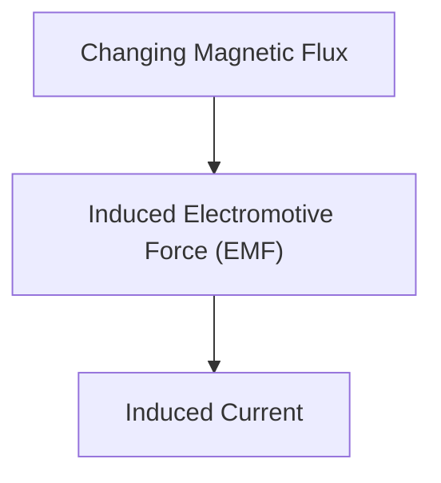

# Fisika: Induksi Elektromagnetik dan Mekanisme Motor

Induksi elektromagnetik adalah dasar dari generator dan motor.

## Hukum Faraday

## Hukum Induksi Elektromagnetik Faraday
$$ \mathcal{E} = -\frac{d\Phi_B}{dt} $$

## Bagian Verifikasi Teknis Tambahan 1

Bagian ini menggali lebih dalam tentang detail teknis lebih lanjut dan studi kasus. Kami akan mengevaluasi kinerja di bawah berbagai kondisi dan mempertimbangkan tantangan serta solusi untuk integrasi dengan sistem lain. Kami juga akan membahas prospek dan keterbatasan di masa depan.

