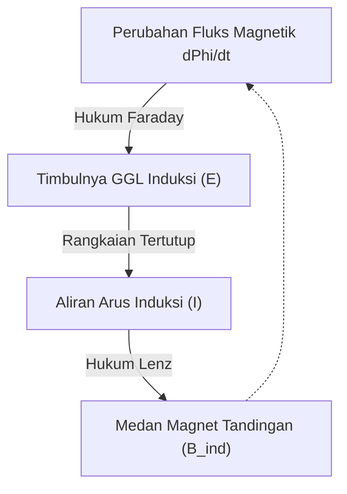

# Fisika: Prinsip Induksi Elektromagnetik dan Motor Listrik - Dari Faraday Hingga Kendaraan Listrik (EV)

Peradaban industri kontemporer tidak akan mampu bergerak tanpa energi listrik. Dari ponsel pintar di saku kita hingga robot-robot pabrik otomatis dan mobil listrik (EV) yang meluncur hening di jalanan kota, tenaga listrik adalah fondasi kehidupan modern. Namun, tahukah Anda bagaimana listrik diproduksi dan bagaimana listrik diubah menjadi gerak mekanis putar dengan efisiensi luar biasa?

Kunci dari transformasi ini adalah fenomena **induksi elektromagnetik**, yang ditemukan pada abad ke-19 oleh Michael Faraday. Penemuan ini mengubah sejarah peradaban dan meletakkan dasar teknik tenaga listrik dunia. Artikel ini mengupas tuntas prinsip dasar induksi elektromagnetik, arsitektur motor listrik, dan inovasi mutakhir pada sistem propulsi kendaraan listrik modern.

## 1. Apa itu Induksi Elektromagnetik? Terobosan Sejarah Michael Faraday

Pada tahun 1831, ilmuwan terkemuka asal Inggris, **Michael Faraday**, menuntaskan eksperimen monumental. Sebelas tahun sebelumnya, Hans Christian Ørsted telah membuktikan bahwa arus listrik menimbulkan medan magnet. Faraday memikirkan kebalikannya dengan intuisi tajam: *jika listrik mampu menciptakan medan magnet, maka gerakan medan magnet tentu sanggup menghasilkan listrik.*

Melalui serangkaian percobaan, Faraday membuktikan bahwa menggerakkan batang magnet di dalam kumparan kawat tertutup menghasilkan arus listrik spontan tanpa baterai kimia. Fenomena ini dinamai **induksi elektromagnetik**.

### Hukum Induksi Faraday dan Hukum Lenz

Terdapat tiga besaran fisis utama dalam memahami induksi elektromagnetik:
- **Fluks Magnetik ($\Phi_B$)**: Hasil kali skalar antara medan magnet $\mathbf{B}$ dan luas penampang yang ditembusnya secara tegak lurus. Secara visual, ini menggambarkan jumlah garis medan magnet yang memotong kumparan.
- **Gaya Gerak Listrik Induksi (GGL Induksi, $\mathcal{E}$)**: Tegangan listrik yang dibangkitkan pada ujung-ujung kumparan saat terjadi perubahan fluks magnetik.
- **Arus Induksi**: Arus listrik yang mengalir di dalam rangkaian tertutup akibat dorongan GGL induksi.

Hukum Induksi Faraday dirumuskan melalui persamaan diferensial yang ringkas dan elegan:

$$ \mathcal{E} = -\frac{d\Phi_B}{dt} $$

Persamaan ini menyatakan bahwa GGL induksi yang timbul pada suatu rangkaian berbanding lurus dengan laju perubahan fluks magnetik terhadap waktu.

Tanda **negatif ($-$)** di depan persamaan memuat makna fisis krusial yang melambangkan **Hukum Lenz**, dirumuskan oleh Heinrich Lenz pada 1834. Hukum Lenz adalah perwujudan hukum kekekalan energi pada elektromagnetisme: *arah arus induksi selalu sedemikian rupa sehingga medan magnet yang dihasilkannya melawan perubahan fluks magnetik yang menimbulkannya.*

Jika kita mendekatkan kutub utara magnet ke kumparan, kumparan akan membangkitkan kutub utara tandingan untuk menolaknya; sebaliknya, jika kutub utara ditarik menjauh, kumparan akan menjadi kutub selatan untuk menariknya kembali. Alam semesta selalu menunjukkan kelembaman dalam mempertahankan status quo elektromagnetiknya.

```mermaid
flowchart TD
    A["Perubahan Fluks Magnetik dPhi/dt"] -->|Hukum Faraday| B["Timbulnya GGL Induksi (E)"]
    B -->|Rangkaian Tertutup| C["Aliran Arus Induksi (I)"]
    C -->|Hukum Lenz| D["Medan Magnet Tandingan (B_ind)"]
    D -.-> A
```

## 2. Menghasilkan Daya Mekanis: Cara Kerja Motor Listrik

Induksi elektromagnetik adalah fondasi bagi **generator listrik**, yang mengubah energi kinetik mekanis menjadi listrik. Perangkat kebalikannya—yang mengubah energi listrik menjadi gerak putar mekanis—adalah **motor listrik**. Generator dan motor memiliki prinsip kesimetrian fisik yang identik.

### Gaya Lorentz dan Kaidah Tangan Kiri Fleming

Torsi penggerak motor bersumber dari **Gaya Lorentz**, gaya yang dialami oleh muatan listrik yang bergerak di dalam medan magnet:

$$ \mathbf{F} = q(\mathbf{E} + \mathbf{v} \times \mathbf{B}) $$

Untuk kawat lurus berarus listrik $I$ sepanjang $L$ di dalam medan magnet $\mathbf{B}$, gaya mekanis yang dihasilkan dirumuskan dengan $\mathbf{F} = I (\mathbf{L} \times \mathbf{B})$. Arah gaya ini ditentukan menggunakan **Kaidah Tangan Kiri Fleming**:
- **Jari Telunjuk**: Arah Medan Magnet ($\mathbf{B}$, Utara ke Selatan).
- **Jari Tengah**: Arah Arus Listrik ($I$).
- **Ibu Jari**: Arah Gaya Mekanis dorong ($\mathbf{F}$).

Di dalam motor listrik, kumparan diletakkan di antara kutub-kutub magnet. Ketika arus dialirkan, satu sisi kumparan mengalami gaya dorong ke atas dan sisi lainnya terdorong ke bawah. Pasangan gaya ini menciptakan torsi (momen putar) yang memutar rotor tanpa henti.

### Tiga Jenis Arsitektur Motor Listrik Utama

1. **Motor DC dengan Sikat (Brushed DC)**: Menggunakan komutator mekanis dan sikat karbon untuk membalikkan arah arus setiap setengah putaran. Pengendaliannya mudah, namun gesekan sikat menyebabkan percikan api, bising, dan keausan mekanis.
2. **Motor DC Tanpa Sikat (BLDC - Brushless DC)**: Menggantikan sikat mekanis dengan sirkuit semikonduktor daya (inverter). Magnet permanen neodymium dipasang pada rotor, sementara lilitan stator diaktifkan secara bergantian oleh perangkat lunak. Tanpa gesekan, efisiensinya melampaui 90%, berumur panjang, dan menjadi standar pada drone serta mobil listrik modern.
3. **Motor Induksi AC (AC Induction Motor)**: Diciptakan oleh [Nikola Tesla](/p/biography-nikola-tesla/) pada 1887. Stator dialiri arus bolak-balik multifasa guna membangkitkan medan magnet berputar. Medan putar ini memotong batang konduktor rotor sangkar tupai, menginduksikan arus pusar raksasa lewat **hukum Faraday**. Interaksi arus induksi dengan medan stator memutar rotor. Motor ini sangat andal dan tidak bergantung pada magnet tanah jarang.

## 3. Revolusi Kendaraan Listrik (EV): Dari Prinsip Fisika ke Jalan Raya

Industri otomotif global sedang berada di tengah transisi paling masif dalam sejarahnya: beralih dari mesin pembakaran internal (ICE) menuju sistem propulsi elektrik murni (EV).

### Keunggulan Fisik Motor Listrik Dibandingkan Mesin Bensin

Dibandingkan mesin bensin atau diesel, motor listrik memiliki keunggulan mutlak yang dijamin hukum fisika:
- **Torsi Maksimal Instan pada 0 RPM**: Mesin bensin harus berputar hingga ribuan RPM untuk mencapai torsi optimalnya. Sebaliknya, motor listrik menyalurkan 100% torsi puncak seketika saat arus dialirkan (0 RPM), menghasilkan akselerasi yang instan dan linier.
- **Efisiensi Energi Superior**: Mesin pembakaran internal terbatasi siklus Carnot sehingga efisiensi termalnya hanya 30–40%, dengan sebagian besar energi terbuang sebagai panas knalpot. Motor listrik EV mengonversi lebih dari 90–95% energi baterai langsung menjadi daya gerak roda.
- **Senyap dan Bebas Getaran**: Tanpa siklus ledakan pembakaran atau gerakan piston bolak-balik, motor bekerja sangat tenang dan mulus.

### Transformasi Motor Tesla: Induksi vs Magnet Permanen

Nama Tesla diambil dari nama penemu motor induksi, [Nikola Tesla](/p/biography-nikola-tesla/). Model-model awal seperti Tesla Roadster dan Model S menggunakan **motor induksi AC**, menghindari ketergantungan pada mineral tanah jarang.

Namun, untuk memaksimalkan efisiensi baterai pada model massal seperti Model 3 dan Model Y, pabrikan beralih ke **Motor Sinkron Reluktansi Berbantuan Magnet Permanen (PM-SynRM)**. Desain ini menggabungkan magnet neodymium dengan rongga reluktansi baja, mencapai efisiensi tertinggi pada kecepatan rendah di perkotaan dan kecepatan tinggi di jalan tol.

### Pengereman Regeneratif (Regenerative Braking): Keajaiban Hukum Faraday

Inovasi paling cerdas pada kendaraan listrik adalah **pengereman regeneratif**. Di sinilah Hukum Faraday kembali berperan penting.

Ketika pengemudi mengangkat kaki dari pedal gas atau menekan rem, sistem inverter membalikkan peran: baterai berhenti menyuplai daya, dan putaran roda mobil secara mekanis memutar balik rotor motor. Pada momen tersebut: **motor listrik seketika berubah menjadi generator listrik!**

Putaran roda menggerakkan kumparan memotong medan magnet, membangkitkan tegangan tinggi melalui induksi Faraday yang mengisi ulang baterai lithium. Bersamaan dengan itu, menurut Hukum Lenz, gaya lawan elektromagnetik menahan laju roda, memperlambat kendaraan secara halus. Lebih dari 70% energi gerak yang dulunya terbuang sia-sia sebagai panas rem kini dapat disimpan kembali.

## 4. Masa Depan Teknologi Motor: Superkonduktor dan Bahan Berkelanjutan

Hampir dua abad setelah pembuktian Faraday, inovasi motor listrik masih terus melesat:

- **Motor Superkonduktor**: Memanfaatkan material superkonduktor suhu tinggi (HTS) pada lilitan kumparan untuk melenyapkan resistansi listrik ($R = 0$). Tanpa kehilangan panas karena resistansi, motor ini memiliki kepadatan daya empat kali lipat lebih tinggi dengan bobot yang sangat ringan, menjadi kunci utama pesawat terbang listrik masa depan (eVTOL dan penerbangan komersial bersih).
- **Motor Bebas Tanah Jarang**: Untuk mengurangi ketergantungan pasokan neodymium, para peneliti mengembangkan motor sinkron rotor belitan (WRSM) dan magnet senyawa besi-nitrogen ($Fe_{16}N_2$).

## 5. Kesimpulan: Dunia yang Bergerak Berkat Kumparan Faraday

Seluruh kemajuan dunia modern saat ini berakar dari eksperimen meja kerja sederhana yang dijalankan Michael Faraday pada tahun 1831.

Prinsip sederhana bahwa perubahan medan magnet dapat melahirkan arus listrik membuktikan betapa perkasanya hukum dasar fisika dalam membentuk masa depan umat manusia. Di tengah peralihan dunia menuju era transportasi bersih, keharmonisan antara elektron dan medan magnet akan terus menjadi jantung penggerak peradaban kita.
