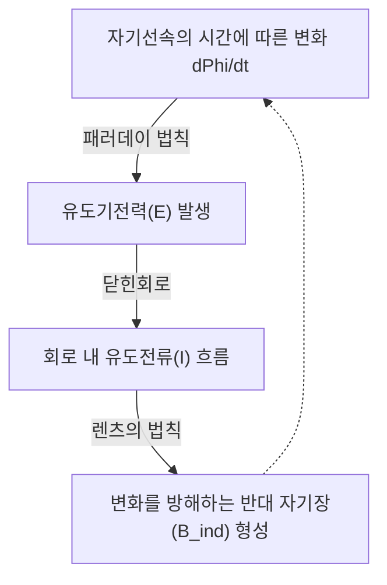

# 물리학: 전자기 유도와 전기 모터의 원리 - 패러데이의 발견에서 현대 전기차(EV)까지

현대 산업 문명의 모든 바퀴는 전기를 통해 굴러갑니다. 스마트폰에서부터 공장의 거대한 로봇 팔, 도심을 질주하는 전기차(EV)에 이르기까지 전기는 인류 삶의 가장 필수적인 에너지원입니다. 그렇다면 이 막대한 전기는 과연 어떤 원리로 생산되며, 어떻게 다시 강력한 기계적 회전 운동으로 전환되는 것일까요?

그 답의 열쇠는 19세기 마이클 패러데이가 발견한 물리 현상인 **전자기 유도(Electromagnetic Induction)** 에 있습니다. 전자기 유도는 역사를 바꾸고 현대 공학의 주춧돌을 놓았습니다. 본 글에서는 전자기 유도의 기본 원리부터 모터의 회전 메커니즘, 그리고 최첨단 전기차(EV)에 집약된 차세대 구동 기술에 이르기까지 그 경이로운 물리 법칙을 심층 해설합니다.

## 1. 전자기 유도란 무엇인가? 패러데이의 위대한 발견

1831년 영국의 물리학자이자 화학자인 **마이클 패러데이(Michael Faraday)** 는 물리학의 역사를 뒤흔든 위대한 실험적 발견을 이루어냈습니다. 1820년 한스 크리스티안 외르스테드가 "전류가 흐르면 자기장이 생긴다"는 사실(전생자)을 밝혀낸 이후, 패러데이는 그 역도 성립할 것이라는 통찰을 가졌습니다: *전기가 자기장을 만든다면, 자기장 역시 전기를 만들어낼 수 있어야 한다.*

수많은 실험 끝에 패러데이는 코일 속에서 자석을 움직일 때 코일에 저절로 전류가 흐른다는 사실을 입증했습니다. 이것이 바로 **전자기 유도** 의 발견입니다.

### 패러데이의 법칙과 렌츠의 법칙

전자기 유도를 이해하기 위해 반드시 알아야 할 세 가지 핵심 개념이 있습니다:
- **자기선속 (Magnetic Flux, $\Phi_B$)**: 어떤 단면을 수직으로 통과하는 자기장의 총량을 나타내는 양입니다. 직관적으로는 "코일 루프 안을 관통하는 자기력선의 가닥 수"라고 이해할 수 있습니다.
- **유도기전력 (Induced EMF, $\mathcal{E}$)**: 자기선속이 시간적으로 변할 때 코일 양단에 발생하는 전압입니다.
- **유도전류 (Induced Current)**: 유도기전력에 의해 닫힌회로를 따라 흐르는 전류입니다.

패러데이의 전자기 유도 법칙은 다음과 같이 간결하고 우아한 미분 공식으로 표현됩니다:

$$ \mathcal{E} = -\frac{d\Phi_B}{dt} $$

이 공식은 코일을 통과하는 자기선속의 시간에 따른 변화율이 클수록, 코일에 유도되는 전압(기전력)이 비례하여 강력해진다는 것을 의미합니다.

여기서 가장 중요한 물리적 의미를 담고 있는 것이 바로 맨 앞의 **음의 부호($-$)** 입니다. 이는 1834년 하인리히 렌츠가 정립한 **렌츠의 법칙(Lenz's Law)** 을 나타냅니다. 렌츠의 법칙은 전자기학에서의 에너지 보존 법칙을 의미합니다: *유도기전력은 항상 자기선속의 변화를 방해하려는 방향으로 발생한다.*

코일에 자석의 N극을 빠르게 들이밀면, 코일은 스스로 N극을 형성하여 자석을 밀어내려 하고, 반대로 N극을 멀리 빼내려 하면 S극을 형성하여 자석을 끌어당기려 합니다. 자연계는 급격한 상태 변화에 저항하는 강력한 관성을 지니고 있는 것입니다.

## 2. 전기로 회전력을 만들다: 전기 모터의 원리

전자기 유도가 기계적 운동을 전기에너지로 바꾸는 **발전기(Generator)** 의 기본 원리라면, 그 역과정인 전기에너지를 기계적 회전 운동으로 바꾸는 장치가 바로 **전기 모터(Motor)** 입니다. 발전기와 모터는 본질적으로 완벽히 동일한 물리적 대칭 구조를 갖습니다.

### 로런츠 힘과 플레밍의 왼손 법칙

모터가 회전하는 근본적인 힘은 자기장 속을 운동하는 전하가 받는 **로런츠 힘(Lorentz force)** 에서 비롯됩니다:

$$ \mathbf{F} = q(\mathbf{E} + \mathbf{v} \times \mathbf{B}) $$

자기장 $\mathbf{B}$ 속에서 전류 $I$가 흐르는 길이 $L$의 도선이 받는 전자기력은 $\mathbf{F} = I (\mathbf{L} \times \mathbf{B})$로 계산됩니다. 이 힘의 방향을 직관적으로 알려주는 것이 유명한 **플레밍의 왼손 법칙** 입니다:
- **검지**: 자기장의 방향 (N극 $\rightarrow$ S극)
- **중지**: 전류의 방향
- **엄지**: 도선이 받는 전자기력의 방향

모터 내부에는 자석 사이에 코일이 놓여 있습니다. 코일에 전류를 흘리면 한쪽 도선은 위쪽으로, 반대쪽 도선은 아래쪽으로 힘을 받게 됩니다. 이 힘의 불균형이 토크(Torque, 회전력)를 형성하여 모터의 회전자(Rotor)를 쉬지 않고 회전시킵니다.

### 현대 3대 모터 구조: 브러시 DC, BLDC, AC 유도 전동기

1. **브러시 DC 모터**: 회전할 때마다 기계적 브러시와 정류자(Commutator)를 통해 전류 방향을 물리적으로 뒤집어 주는 모터입니다. 제어가 단순하지만 브러시 마모로 인한 불꽃과 수명 한계가 있습니다.
2. **브러시리스 DC 모터 (BLDC)**: 기계적 접점 대신 전력 반도체 인버터와 센서를 통해 전자적으로 전류를 스위칭합니다. 회전자에 강력한 네오디뮴 영구자석을 배치하여 90% 이상의 고효율과 반영구적 수명을 자랑하며, 드론, 로봇, 현대 전기차 구동계의 표준으로 자리 잡았습니다.
3. **교류 유도 전동기 (AC Induction Motor)**: 천재 물리학자 [니콜라 테슬라](/p/biography-nikola-tesla/)가 1887년 발명했습니다. 고정자(Stator)에 교류를 흘려 고속 회전 자기장을 만들면, 회전자의 도체 바에 **전자기 유도 법칙** 에 의해 강력한 맴돌이 전류가 유도됩니다. 이 유도전류와 회전 자기장의 상호작용으로 모터가 회전합니다. 값비싼 희토류 자석이 전혀 필요 없고 구조가 극도로 견고합니다.

## 3. 전기차(EV)에 적용된 전자기 혁신

100년 넘게 이어져 온 내연기관(엔진) 중심의 자동차 산업은 오늘날 배터리와 모터 기반의 순수 전기차(EV) 시대로 급격한 패러다임 전환을 겪고 있습니다.

### 내연기관 엔진 대비 전기 모터의 압도적 우위

내연기관과 비교할 때 전기 모터는 물리 법칙이 보장하는 압도적인 장점들을 제공합니다:
- **0 RPM에서 뿜어져 나오는 즉각적 최대 토크**: 엔진은 일정 회전수에 도달해야 토크가 발휘되지만, 모터는 전류가 인가되는 0 RPM 순간부터 100% 최대 토크를 쏟아냅니다. 이것이 전기차 특유의 폭발적이고 짜릿한 가속감의 비결입니다.
- **경이로운 에너지 효율**: 내연기관은 열역학적 한계로 열효율이 30–40%에 불과하고 대다수 에너지가 열로 버려지지만, 전기 모터의 에너지 변환 효율은 90–95%를 웃돕니다.
- **무진동과 극도의 정숙성**: 피스톤의 폭발 행정이 없기 때문에 기계적 소음과 진동이 근본적으로 차단됩니다.

### 테슬라의 모터 철학과 진화

테슬라(Tesla)라는 사명은 유도전동기를 발명한 [니콜라 테슬라](/p/biography-nikola-tesla/)를 기리는 의미입니다. 실제로 초기 테슬라 로드스터와 모델 S는 희토류 영구자석이 필요 없는 순수 **AC 유도 전동기** 를 탑재하여 화제를 모았습니다.

그러나 이후 대량 양산된 모델 3와 모델 Y에서는 도심 주행 연비와 고속 효율을 극대화하기 위해 **영구자석 동기 릴럭턴스 모터(PM-SynRM)** 를 도입했습니다. 네오디뮴 자석의 자기력과 철심의 자기 저항(릴럭턴스) 토크를 결합하여 세계 최고 수준의 전비를 달성했습니다.

### 에너지를 거두어들이는 마법: 회생 제동 (Regenerative Braking)

전기차 최고의 기술적 성취 중 하나는 바로 **회생 제동** 입니다. 여기서 패러데이의 전자기 유도가 다시 한번 빛을 발합니다.

운전자가 가속 페달에서 발을 떼거나 브레이크를 밟으면, 차량의 인버터는 모터로 가는 전원을 차단하고 바퀴의 굴림 관성으로 모터를 강제로 돌리게 만듭니다. 그 순간, **모터는 즉각 완벽한 발전기로 변신합니다!**

바퀴의 운동에너지가 코일을 돌리며 패러데이 법칙에 따라 고전압 전기를 생산하여 배터리를 재충전합니다. 동시에 렌츠의 법칙에 의해 회전을 방해하는 강력한 역기전력 저항이 발생하여 차체를 부드럽게 감속시킵니다. 브레이크 패드의 마찰열로 허공에 날아가던 제동 에너지의 70% 이상을 배터리로 회수하여 전기차의 주행거리를 획기적으로 연장해 줍니다.

## 4. 모터 기술의 미래: 초전도와 친환경 혁신

전자기 유도가 발견된 지 약 200년이 지난 지금도 모터 기술은 진화를 멈추지 않고 있습니다:

- **초전도 모터 (Superconducting Motors)**: 전기저항이 완전히 0이 되는 초전도 코일을 사용하여 발열 손실을 원천 차단한 차세대 모터입니다. 기존 모터보다 부피와 무게를 4분의 1 이하로 줄이면서도 수배 이상의 고출력을 낼 수 있어, 도심 항공 모빌리티(UAM)와 미래 전기 비행기 상용화의 핵심 열쇠로 꼽힙니다.
- **희토류 프리(Rare-Earth-Free) 모터**: 특정 국가의 공급망 독점에 취약한 네오디뮴 희토류를 배제하기 위해 철-질소($Fe_{16}N_2$) 자석과 권선형 동기 전동기(WRSM) 개발이 전 세계적으로 가속화되고 있습니다.

## 5. 결론: 패러데이의 코일이 움직이는 세상

인터넷의 데이터를 나르는 거대한 데이터 센터부터 조용히 도심을 질주하는 전기차에 이르기까지, 인류의 현대 문명은 1831년 마이클 패러데이가 실험실 책상 위에서 코일과 자석을 움직였던 그 순간에 빚을 지고 있습니다.

자기장의 변화가 전기를 낳고, 그 전기가 다시 강력한 힘이 되어 문명을 전진시키는 전자기의 조화는 기초 물리학이 세상을 어떻게 근본적으로 바꿀 수 있는지를 보여주는 가장 아름다운 증거입니다.
