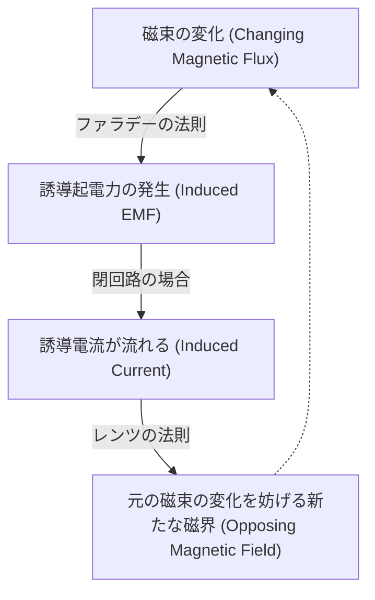

# 物理学: 電磁誘導とモーターの仕組み - ファラデーの発見からEVまで

現代社会は電気なしでは成り立ちません。スマートフォンから巨大な工場、そして街を走る電気自動車（EV）に至るまで、私たちの生活のあらゆる場面で電気が使われています。しかし、その電気がどのようにして作られ、どのようにして「動き」に変換されているのか、その根本的なメカニズムをご存知でしょうか？

その答えの鍵を握るのが、「電磁誘導（Electromagnetic Induction）」という物理現象です。19世紀にマイケル・ファラデーによって発見されたこの現象は、人類の歴史を根本から変え、現代のテクノロジーの基盤を築き上げました。本記事では、電磁誘導の基本原理からモーターの仕組み、そして最先端のEV技術に至るまで、その奥深い世界を徹底的に解説します。

## 1. 電磁誘導とは何か？ 偉大なるファラデーの発見

1831年、イギリスの物理学者であり化学者でもあるマイケル・ファラデーは、人類の歴史を揺るがす大発見をしました。「磁石を動かすことで、電線を流れる電流を生み出すことができる」という事実です。これが「電磁誘導」の発見です。

それ以前の1820年、ハンス・クリスティアン・エルステッドによって「電流が磁界を作る」ことが発見されていました（アンペールの法則などに繋がります）。ファラデーは「その逆も可能なはずだ」と考え、実験を重ねた末に見事それを実証したのです。

### ファラデーの電磁誘導の法則とレンツの法則

電磁誘導を理解するための基本的なキーワードがいくつかあります。

*   **磁束（Magnetic Flux, $\Phi_B$）**: 磁界の強さと、その磁界を垂直に貫く面積の積です。直感的には、「コイルの輪の中を何本の磁力線が通過しているか」を表す量だと考えてください。
*   **誘導起電力（Induced Electromotive Force, $\mathcal{E}$）**: 磁束が変化したときにコイルに発生する電圧のことです。
*   **誘導電流（Induced Current）**: 誘導起電力によって回路を流れる電流です。

ファラデーの法則は、次のような数式で表されます。

$$ \mathcal{E} = -\frac{d\Phi_B}{dt} $$

この美しい数式が意味しているのは、「コイルを貫く磁束が時間的に変化すると、その変化の速度に比例した電圧（起電力）が発生する」ということです。

ここで重要なのが、先頭についているマイナス符号（$-$）です。これは**レンツの法則（Lenz's Law）**を表しています。ハインリヒ・レンツが発見したこの法則は、「誘導起電力は、磁束の変化を妨げるような向きに発生する」という自然界の「現状維持の法則」のようなものです。例えば、コイルにN極を近づけると、コイルは反発してN極になろうとし（遠ざけようとする）、逆にN極を遠ざけようとするとS極になって引き止めようとします。

## 2. 動力を生み出す魔法：モーターの仕組み

電磁誘導の原理は、運動エネルギーを電気エネルギーに変換する「発電機（Generator）」の基礎です。そして、その逆のプロセス、つまり電気エネルギーを運動エネルギーに変換する装置が「モーター（電動機）」です。発電機とモーターは、本質的には同じ構造を持っています。

### フレミングの左手の法則とローレンツ力

モーターが回転する力を理解する上で欠かせないのが「ローレンツ力（Lorentz force）」です。磁界の中を導線（電流）が横切るとき、導線には力が発生します。この力の向きを示すのが、有名な**フレミングの左手の法則**です。

*   **人差し指**: 磁界の向き（N極からS極）
*   **中指**: 電流の向き
*   **親指**: 導線が受ける力の向き（電磁力）

モーターの基本的な構造は、磁石の間に置かれたコイルです。コイルに電流を流すと、コイルの片側は上向きの力を、もう片側は下向きの力を受けます。これにより回転する力（トルク）が生まれ、モーターが回るのです。

### 直流(DC)モーターと交流(AC)モーター

モーターには、電源の種類によって大きく分けてDC（直流）モーターとAC（交流）モーターがあります。

1.  **DCモーター (ブラシ付きモーター)**
    乾電池などで動く、ミニ四駆や工作キットなどでおなじみのモーターです。コイルが半回転するごとに電流の向きを反転させるための「整流子（コミュテーター）」と「ブラシ」という機械的な接点を持っています。構造が単純で制御しやすい反面、ブラシが摩耗するため寿命に限界があります。

2.  **ブラシレスDCモーター (BLDC)**
    ブラシと整流子の代わりに、電子回路（インバーター）を使って電流の向きを切り替えるモーターです。摩耗する部品がないため、長寿命で高効率、さらに高速回転が可能です。PCの冷却ファンやドローン、そして現代のEVの主流となっています。

3.  **ACインダクションモーター（誘導電動機）**
    ニコラ・テスラが発明した交流モーターです。外側の固定子（ステーター）に交流電流を流して「回転磁界」を作り出します。すると、内側の回転子（ローター）に先ほど説明した「電磁誘導」によって電流（渦電流）が発生します。この誘導電流と回転磁界の相互作用によってローターが回転します。磁石を一切使わずに強力な動力を得られるのが特徴で、工場などの産業機械で広く使われています。

## 3. 電気自動車（EV）への応用：モーター駆動の革新

現代の自動車産業は、100年以上続いた内燃機関（エンジン）の時代から、モーターを動力源とする電気自動車（EV）の時代へと大きなパラダイムシフトを迎えています。ここでも、ファラデーが発見した電磁誘導の原理が大活躍しています。

### EVにおけるモーターの優位性

ガソリンエンジンと比較して、EVに使用される電気モーターには圧倒的な利点があります。

*   **瞬間的な最大トルク**: エンジンは一定の回転数に達するまでトルクが出ませんが、モーターは電流を流した瞬間（0 RPM）から最大トルクを発揮します。これが、EV特有のシートに押し付けられるような鋭い加速感を生み出します。
*   **エネルギー効率の高さ**: ガソリンエンジンの熱効率が約30〜40%であるのに対し、電気モーターの効率は80〜90%以上にも達します。エネルギーのロスが極めて少ないのです。
*   **静粛性と振動の少なさ**: 爆発を伴うエンジンと違い、磁力によって回転するため、非常に静かで滑らかです。

### テスラとインダクションモーターの物語

興味深いことに、イーロン・マスク率いるテスラ（Tesla）の社名は、交流モーターの発明者ニコラ・テスラに由来しています。実際、初期の「テスラ・ロードスター」や「モデルS」には、レアアース（希土類磁石）を必要としない**ACインダクションモーター（誘導電動機）**が採用されていました。

しかし近年では、より高い効率と航続距離を求めて、「永久磁石同期モーター（PMSM）」や「ブラシレスDCモーター（BLDC）」が主流になりつつあります（例：モデル3など）。これらは強力なネオジム磁石などを使用し、小型でありながら非常に高い出力を誇ります。自動車メーカー各社は、用途やコストに応じてこれらのモーターを使い分け、あるいは組み合わせて最適な性能を引き出しています。

### 未来を拓く「回生ブレーキ」技術

EVの最大の発明の一つが**回生ブレーキ（Regenerative Braking）**です。ここで再び電磁誘導が登場します。

ドライバーがアクセルペダルから足を離したり、ブレーキを踏んだりしたとき、EVはモーターの駆動を止め、タイヤの回転力を利用してモーターを回します。つまり、**モーターを「発電機」として機能させる**のです。

モーターが発電機として働くとき、車輪の運動エネルギーが電気エネルギーに変換されてバッテリーに充電されます。同時に、発電時の抵抗（レンツの法則による反対方向の力）が強力なブレーキとして作用します。従来の車ではブレーキパッドの摩擦熱として無駄に捨てられていた運動エネルギーを回収し、航続距離を延ばすことができる魔法のようなシステムです。

## 4. モーター技術の未来：超電導と次世代材料

電磁誘導の発見から200年近くが経過した現在でも、モーター技術は進化を続けています。

次世代の技術として注目されているのが**超電導モーター**です。極低温に冷却することで電気抵抗がゼロになる「超電導材料」をコイルに使用することで、発熱によるエネルギーロスを完全になくし、これまでにない超高効率かつ小型・軽量なモーターが実現可能になります。実用化されれば、EVの性能を飛躍的に向上させるだけでなく、電動航空機（空飛ぶクルマや電動旅客機）の実現に向けた最大のブレイクスルーとなるでしょう。

また、特定の国に依存しがちなレアアースを使用しない「サステナブルな高効率モーター」の開発も世界中で急ピッチで進められています。新しい磁性材料の開発や、AIを用いたモーター内部の磁気回路の最適化設計など、物理学と情報工学が融合することで、限界と思われていたモーターの効率はまだ伸び代を残しています。

## 5. 結論：ファラデーのコイルが動かす世界

現代の私たちが享受している高度なテクノロジー社会は、1831年にマイケル・ファラデーが机の上で行った、小さなコイルと磁石の実験から始まりました。

磁束の変化が起電力を生むというシンプルな原理は、巨大な発電所のタービンを回して電力を生み出し、その電力がモーターを回転させてEVを走らせています。物理学の基礎理論がいかに強力に世界を変える力を持っているか、電磁誘導とその応用であるモーター技術は、最も雄弁に物語っています。

次にEVが街を音もなく走り抜けるのを見たとき、あるいはスマートフォンのバイブレーションが振動したとき、ぜひファラデーの偉大な発見と、目に見えない電子と磁力の力強いダンスに思いを馳せてみてください。
