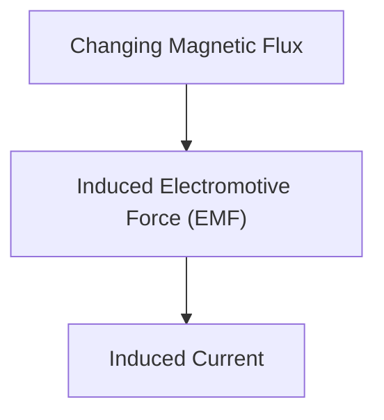

# Física: Indução Eletromagnética e o Mecanismo dos Motores

A indução eletromagnética é a base dos geradores e motores.

## Lei de Faraday

## Lei da Indução Eletromagnética de Faraday
$$ \mathcal{E} = -\frac{d\Phi_B}{dt} $$

## Verificação Técnica Adicional Parte 1

Nesta seção, nos aprofundamos em mais detalhes técnicos e estudos de caso. Avaliamos o desempenho sob várias condições e examinamos os desafios e soluções para a integração com outros sistemas. Também discutimos perspectivas futuras e limitações.

