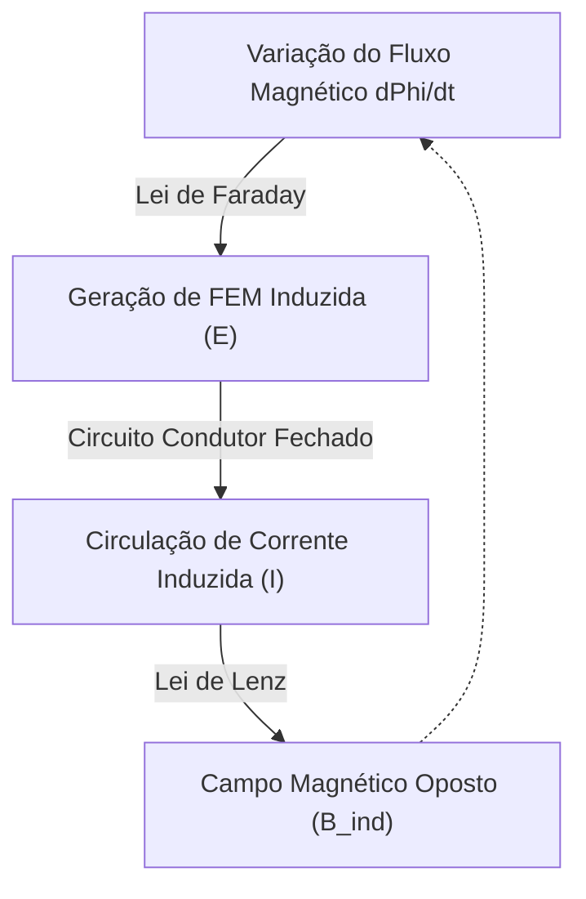

# Física: Princípios da Indução Eletromagnética e Motores - De Faraday aos Veículos Elétricos

A civilização industrial moderna depende intrinsecamente da eletricidade. Dos smartphones aos robôs fabris e aos veículos elétricos (EVs) que percorrem nossas avenidas, a energia elétrica move o mundo contemporâneo. No entanto, você sabe como essa eletricidade é gerada e como ela é convertida em movimento mecânico de rotação com tamanha eficiência?

A resposta para essa questão está na **indução eletromagnética**, descoberta no século XIX por Michael Faraday. Esse fenômeno mudou o curso da humanidade e estabeleceu os pilares da engenharia moderna. Neste artigo, examinamos os fundamentos da indução, o funcionamento dos motores elétricos e as tecnologias de ponta dos automóveis elétricos atuais.

## 1. O que é a Indução Eletromagnética? A Descoberta de Faraday

Em 1831, o físico e químico britânico **Michael Faraday** realizou um dos experimentos mais marcantes da história da ciência. Onze anos antes, Hans Christian Ørsted demonstrara que uma corrente elétrica cria um campo magnético ao seu redor. Faraday intuiu de forma brilhante a via inversa: *se a eletricidade gera magnetismo, o magnetismo em movimento deve ser capaz de produzir eletricidade.*

Após incansáveis testes, Faraday provou que, ao movimentar um ímã dentro de uma bobina condutora fechada, surge espontaneamente uma corrente elétrica no fio, sem qualquer bateria química conectada. Esse fenômeno foi batizado de **indução eletromagnética**.

### A Lei de Faraday e a Lei de Lenz

Para compreender a indução eletromagnética, três grandezas físicas são fundamentais:
- **Fluxo Magnético ($\Phi_B$)**: O produto da área pela componente normal do campo magnético $\mathbf{B}$ que a atravessa. Representa o total de linhas de campo magnético que penetram o interior de uma espira condutora.
- **Força Eletromotriz Induzida (FEM, $\mathcal{E}$)**: A diferença de potencial elétrico (tensão) que se manifesta nos terminais da bobina quando o fluxo magnético varia no tempo.
- **Corrente Induzida**: A corrente elétrica que percorre o circuito fechado sob ação da força eletromotriz.

A Lei da Indução de Faraday é expressa pela equação diferencial:

$$ \mathcal{E} = -\frac{d\Phi_B}{dt} $$

Essa equação afirma que a intensidade da tensão elétrica induzida em um circuito é diretamente proporcional à taxa temporal de variação do fluxo magnético.

O **sinal negativo ($-$)** é a essência da **Lei de Lenz**, formulada em 1834 por Heinrich Lenz. Ela traduz a conservação da energia no eletromagnetismo: *o sentido da corrente induzida é sempre aquele cujo campo magnético próprio se opõe à variação do fluxo magnético que lhe deu origem.*

Ao empurrar o polo norte de um ímã em direção à bobina, esta gera uma corrente que produz um polo norte para repeli-lo; ao afastar o ímã, ela cria um polo sul para segurá-lo. A natureza resiste a alterações abruptas no equilíbrio eletromagnético.

```mermaid
flowchart TD
    A["Variação do Fluxo Magnético dPhi/dt"] -->|Lei de Faraday| B["Geração de FEM Induzida (E)"]
    B -->|Circuito Condutor Fechado| C["Circulação de Corrente Induzida (I)"]
    C -->|Lei de Lenz| D["Campo Magnético Oposto (B_ind)"]
    D -.-> A
```

## 2. Produzindo Força Mecânica: O Princípio do Motor Elétrico

A indução eletromagnética é o alicerce do **gerador elétrico**, que transforma energia mecânica em eletricidade. O dispositivo recíproco, que transforma eletricidade em trabalho mecânico de rotação, é o **motor elétrico**. Motores e geradores possuem naturezas físicas simétricas.

### A Força de Lorentz e a Regra da Mão Esquerda

O torque de rotação de um motor decorre da **Força de Lorentz**, a força mecânica exercida sobre cargas elétricas que se movem em um campo magnético:

$$ \mathbf{F} = q(\mathbf{E} + \mathbf{v} \times \mathbf{B}) $$

Para um condutor de comprimento $L$ conduzindo corrente $I$ sob um campo magnético $\mathbf{B}$, a força resultante é $\mathbf{F} = I (\mathbf{L} \times \mathbf{B})$. O sentido dessa força é deduzido pela **Regra da Mão Esquerda de Fleming**:
- **Dedo Indicador**: Sentido do Campo Magnético ($\mathbf{B}$, do Norte para o Sul).
- **Dedo Médio**: Sentido da Corrente elétrica ($I$).
- **Dedo Polegar**: Direção da Força Mecânica motora ($\mathbf{F}$).

Dentro de um motor, bobinas são montadas no rotor dentro de um campo magnético. Ao receber corrente, um lado da bobina é impulsionado para cima e o lado oposto para baixo. Esse binário de forças gera o torque contínuo que mantém o motor girando.

### Principais Tipos de Motores Elétricos

1. **Motor de Corrente Contínua com Escovas (Brushed DC)**: Emprega um comutador mecânico e escovas de carvão para alternar a polaridade da corrente a cada meia volta. É barato e de controle simples, mas sofre desgaste abrasivo das escovas e faíscas.
2. **Motor de Corrente Contínua sem Escovas (BLDC)**: Substitui as escovas físicas por um inversor eletrônico de semicondutores. Com ímãs de neodímio de alta potência no rotor e bobinas eletronicamente chaveadas no estator, o motor BLDC atinge eficiências acima de 90%, sendo amplamente usado em drones, robótica e carros elétricos.
3. **Motor de Indução de Corrente Alternada (AC Induction Motor)**: Criado por [Nikola Tesla](/p/biography-nikola-tesla/) em 1887. O estator é alimentado com corrente alternada polifásica para produzir um campo magnético girante. Esse campo rotativo corta as barras condutoras do rotor em gaiola de esquilo, induzindo fortes correntes elétricas por **indução de Faraday**. A interação entre essas correntes e o campo do estator arrasta o rotor. É um motor duradouro que dispensa ímãs de terras raras.

## 3. A Revolução dos Veículos Elétricos (EV)

O setor automotivo mundial atravessa sua maior transformação em mais de um século, migrando dos motores de combustão interna (ICE) para a tração 100% elétrica.

### Vantagens do Motor Elétrico sobre o Motor a Combustão

Frente aos motores convencionais a combustão, os motores elétricos oferecem vantagens mecânicas notáveis:
- **Torque Máximo Instantâneo a 0 RPM**: Motores a pistão precisam alcançar rotações elevadas para atingir sua faixa ideal de torque. Motores elétricos disponibilizam 100% de seu torque imediatamente a 0 RPM, entregando arrancadas vigorosas e lineares.
- **Rendimento Energético Superior**: Os motores a gasolina perdem 60% a 70% de sua energia em calor no escapamento, atingindo eficiências térmicas modestas de 30% a 40%. Os motores de tração elétrica superam 90% a 95% de conversão de energia em movimento útil.
- **Silêncio e Ausência de Vibrações**: Sem ciclos de explosão de combustível, o funcionamento do conjunto é excepcionalmente suave e silencioso.

### A Filosofia de Motores na Tesla: De Indução a Ímãs Permanentes

O nome da Tesla homenageia diretamente o pai dos motores de indução, [Nikola Tesla](/p/biography-nikola-tesla/). Modelos pioneiros como o Roadster e o Model S utilizavam **motores de indução CA**, dispensando matérias-primas de terras raras.

Nos veículos de produção em massa como o Model 3 e o Model Y, a marca passou a adotar o **Motor Síncrono de Relutância Assistido por Ímãs Permanentes (PM-SynRM)**. Esse motor combina o fluxo dos ímãs de neodímio com cavidades de relutância no rotor, otimizando o consumo urbano e garantindo alta eficiência em rodovias.

### Frenagem Regenerativa: A Lei de Faraday na Prática

Uma das tecnologias mais engenhosas dos veículos elétricos é a **frenagem regenerativa (Regenerative Braking)**.

Quando o motorista alivia o acelerador ou pisa no freio, a eletrônica de bordo inverte o fluxo: a bateria para de fornecer energia e as rodas passam a girar o rotor forçadamente. Nesse momento: **o motor transforma-se imediatamente em um gerador elétrico**.

O movimento das rodas faz as bobinas cortarem o campo magnético, gerando por indução de Faraday uma corrente de alta tensão que recarrega a bateria de lítio. Ao mesmo tempo, pela Lei de Lenz, a força contraeletromotriz resultante opõe-se ao giro das rodas, desacelerando o carro de maneira suave. Dessa forma, mais de 70% da energia cinética que seria dissipada como calor nas pastilhas de freio é reaproveitada.

## 4. O Futuro dos Motores: Supercondutividade e Inovações Verdes

Quase dois séculos após as descobertas de Faraday, os motores continuam evoluindo com tecnologias avançadas:

- **Motores Supercondutores**: O uso de bobinas com materiais supercondutores de alta temperatura (HTS) elimina totalmente a resistência elétrica ($R = 0$). Sem perdas térmicas por efeito Joule, esses motores alcançam densidades de potência até quatro vezes maiores com peso e volume reduzidos, viabilizando a aviação comercial elétrica (aeronaves elétricas e eVTOLs).
- **Motores Livres de Terras Raras**: Para contornar restrições no fornecimento de neodímio, a indústria investe em motores síncronos de rotor bobinado (WRSM) e novos compostos magnéticos de nitreto de ferro ($Fe_{16}N_2$).

## 5. Conclusão: O Mundo Conduzido pela Bobina de Faraday

A sociedade tecnológica contemporânea — dos centros de dados conectados à frota crescente de veículos elétricos — tem raízes diretas no experimento conduzido por Michael Faraday em 1831.

A lei que associa a variação dos campos magnéticos à geração de eletricidade expressa o imenso poder da física básica em redefinir a vida humana. Rumo a um planeta com energia sustentável e limpa, a sinergia entre elétrons e magnetismo continua sendo a força que impulsiona o progresso da humanidade.
