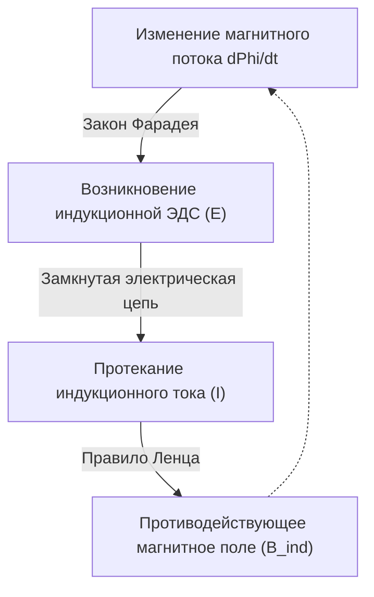

# Физика: Принципы электромагнитной индукции и работа электродвигателей - От Фарадея до электромобилей

Современная цивилизация немыслима без электроэнергии. От карманных смартфонов до роботизированных производств и бесшумных электромобилей (EV) на улицах городов — электричество приводит в движение всё вокруг. Но как рождается этот ток и каким образом электрическая энергия преобразуется во вращательное механическое движение с поразительным КПД?

Ответ кроется в явлении **электромагнитной индукции**, открытом в XIX веке Майклом Фарадеем. Это открытие изменило ход истории человечества и заложило основы всей современной электротехники. В этой статье мы подробно разберем фундаментальные законы индукции, физику работы электродвигателей и передовые технологии привода электромобилей.

## 1. Что такое электромагнитная индукция? Триумф Майкла Фарадея

В 1831 году выдающийся британский физик и химик **Майкл Фарадей** совершил открытие, перевернувшее развитие техники. За одиннадцать лет до этого Ханс Кристиан Эрстед доказал, что электрический ток порождает магнитное поле. Фарадей руководствовался глубокой интуицией: *если электричество создает магнетизм, то и движение магнита должно порождать электричество.*

После сотен опытов Фарадей доказал: движение постоянного магнита внутри замкнутой проволочной катушки мгновенно возбуждает в ней электрический ток без каких-либо химических батарей. Это явление получило название **электромагнитной индукции**.

### Закон электромагнитной индукции Фарадея и правило Ленца

Для описания индукции физика оперирует тремя ключевыми понятиями:
- **Магнитный поток ($\Phi_B$)**: Интеграл нормальной составляющей магнитной индукции $\mathbf{B}$ по площади контура. Наглядно он отражает количество силовых линий магнитного поля, пронизывающих витки катушки.
- **Индукционная электродвижущая сила (ЭДС, $\mathcal{E}$)**: Разность потенциалов (напряжение), возникающая на концах проводника при изменении магнитного потока.
- **Индукционный ток**: Ток, протекающий по замкнутой цепи под действием наведенной ЭДС.

Закон индукции Фарадея формулируется в виде дифференциального уравнения:

$$ \mathcal{E} = -\frac{d\Phi_B}{dt} $$

Закон гласит: величина наведенной в контуре электродвижущей силы прямо пропорциональна скорости изменения магнитного потока во времени.

Знак **«минус» ($-$)** имеет принципиальное значение и отражает **правило Ленца**, сформулированное российским физиком Генрихом Ленцем в 1834 году. Правило Ленца выражает фундаментальный закон сохранения энергии: *индукционный ток всегда направлен так, что создаваемое им собственное магнитное поле противодействует тому изменению внешнего магнитного потока, которым этот ток был вызван.*

Если приближать северный полюс магнита к катушке, в ней возникнет ток, создающий встречный северный полюс для отталкивания магнита. Если же удалять магнит, катушка сформирует южный полюс, чтобы удержать его. Природа упорно сопротивляется внешнему вмешательству.

## 2. Создание механической силы: Принцип работы электродвигателя

Электромагнитная индукция служит основой **генератора**, превращающего механическую работу во вращение и электричество. Обратное устройство — превращающее электрический ток в механическое вращение — это **электродвигатель**. Генератор и мотор представляют собой две стороны единой электромагнитной сущности.

### Сила Лоренца и правило левой руки

Вращающий момент двигателя порождается **силой Лоренца**, действующей на движущиеся заряды в магнитном поле:

$$ \mathbf{F} = q(\mathbf{E} + \mathbf{v} \times \mathbf{B}) $$

Для проводника длиной $L$ с током $I$ в магнитном поле $\mathbf{B}$ суммарная механическая сила Ампера равна $\mathbf{F} = I (\mathbf{L} \times \mathbf{B})$. Ее направление находят по классическому **правилу левой руки Флеминга**:
- **Указательный палец**: Направление магнитного поля ($\mathbf{B}$, от N к S).
- **Средний палец**: Направление тока в проводнике ($I$).
- **Большой палец**: Направление результирующей механической силы Ампера ($\mathbf{F}$).

Внутри двигателя витки обмотки ротора помещены между полюсами магнитов. При подаче тока одна сторона витка выталкивается вверх, а противоположная — вниз. Эта пара сил порождает крутящий момент (Torque), заставляющий ротор непрерывно вращаться.

### Три базовые архитектуры современных двигателей

1. **Коллекторный двигатель постоянного тока (Brushed DC)**: Использует механический коллектор и графитовые щетки для переключения направления тока каждые пол-оборота. Прост в управлении, но механическое трение щеток вызывает искрение, помехи и быстрый износ.
2. **Бесщеточный двигатель постоянного тока (BLDC)**: Механические щетки заменены полупроводниковым инвертором. На роторе закреплены мощные неодимовые магниты, а обмотки статора коммутируются электроникой. КПД превышает 90%, двигатель долговечен и развивает колоссальные обороты, став стандартом в дронах, робототехнике и электромобилях.
3. **Асинхронный двигатель переменного тока (AC Induction Motor)**: Изобретен [Николой Теслой](/p/biography-nikola-tesla/) в 1887 году. При подаче трехфазного тока на статор возникает вращающееся магнитное поле. Оно пересекает проводники короткозамкнутого ротора («беличьей клетки»), наводя в них мощные вихревые токи по **закону Фарадея**. Взаимодействие наведенных токов с полем статора раскручивает ротор. Он не требует редкоземельных металлов и исключительно надежен в тяжелой индустрии.

## 3. Революция в электромобилях (EV)

Мировой автопром переживает крупнейший тектонический сдвиг за столетие, переходя от двигателей внутреннего сгорания (ДВС) к электротяге.

### Преимущества тяговых электромоторов перед ДВС

По сравнению с традиционными бензиновыми моторами электродвигатели обладают неоспоримыми преимуществами:
- **Мгновенный пиковый крутящий момент с 0 об/мин**: ДВС требует раскрутки коленвала до нескольких тысяч оборотов для выхода на полку момента, тогда как электромотор отдает 100% крутящего момента с первого мгновения (0 RPM), обеспечивая ошеломляющую линейную динамику.
- **Колоссальный КПД**: Бензиновый мотор ограничен термодинамикой и теряет до 60–70% энергии в виде выхлопного тепла (КПД лишь 30–40%). Тяговый электромотор преобразует более 90–95% энергии батареи в движение колес.
- **Бесшумность и плавность**: Полное отсутствие возвратно-поступательного движения поршней и детонаций топлива гарантирует тишину и отсутствие вибраций.

### Инженерный путь Tesla: Индукция против постоянных магнитов

Компания Tesla названа в честь создателя асинхронного двигателя [Николы Теслы](/p/biography-nikola-tesla/). Ранние флагманы Roadster и Model S оснащались именно медными **асинхронными двигателями переменного тока**, не требовавшими дорогостоящих редкоземельных металлов.

Однако для массовых Model 3 и Model Y инженеры перешли на **синхронные реактивные двигатели с постоянными магнитами (PM-SynRM)**. Они сочетают неодимовые магниты с ротором специальной магнитной топологии, гарантируя рекордную энергоэффективность в городском трафике и высокую удельную мощность на скоростных магистралях.

### Рекуперативное торможение: Закон Фарадея в действии

Ключевой технологией высокой дальности хода электромобилей является **рекуперативное торможение (Regenerative Braking)**.

Когда водитель отпускает педаль акселератора или нажимает на тормоз, контроллер меняет режим работы инвертора: батарея перестает питать мотор, а набегающие колеса начинают принудительно вращать его вал. В это мгновение: **электродвигатель превращается в генератор!**

Кинетическая энергия машины вращает обмотки в магнитном поле, генерируя по закону Фарадея ток высокого напряжения, который заряжает тяговую батарею. Одновременно по правилу Ленца электромагнитное поле создает мощный тормозящий момент, мягко замедляющий автомобиль. До 70% кинетической энергии, которая в обычных автомобилях бесполезно рассеивалась в виде жара тормозных колодок, возвращается в аккумулятор.

## 4. Будущее электромоторов: Сверхпроводимость и устойчивые материалы

Спустя почти два века после опытов Фарадея электротехника открывает новые горизонты:

- **Сверхпроводящие двигатели**: Обмотки из высокотемпературных сверхпроводников (ВТСП) полностью лишены электрического сопротивления ($R = 0$). Без джоулева нагрева такие двигатели при четырехкратном росте удельной мощности становятся в разы легче обычных, открывая путь к безуглеродной электрической авиации (eVTOL и пассажирские лайнеры).
- **Безредкоземельные моторы**: Чтобы избежать дефицита неодима, ведущие институты разрабатывают двигатели с электромагнитным возбуждением ротора (WRSM) и новые сплавы нитрида железа ($Fe_{16}N_2$).

## 5. Заключение: Мир, приведенный в движение катушкой Фарадея

Вся технологическая среда современного мира — от глобальных вычислительных дата-центров до бесшумных электромобилей — берет начало в том скромном лабораторном опыте с катушкой и магнитом, который Майкл Фарадей провел в 1831 году.

Закон, связавший изменение магнитного поля с рождением электрического тока, доказывает безграничную мощь фундаментальной науки. В эпоху глобального перехода к зеленой энергетике невидимый танец электронов и магнитных полей остается главным двигателем человеческой цивилизации.
