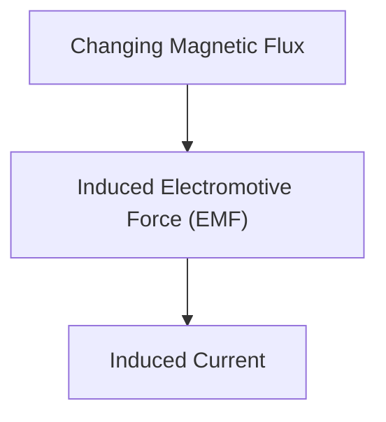

# 物理学：电磁感应与电机原理

电磁感应是发电机和电机的基础。

## 法拉第定律

```mermaid
flowchart TD
    A["Changing Magnetic Flux"] --> B["Induced Electromotive Force (EMF)"]
    B --> C["Induced Current"]
```

## 法拉第电磁感应定律
$$ \mathcal{E} = -\frac{d\Phi_B}{dt} $$

## 附加技术验证部分 1

本节深入探讨了进一步的技术细节和案例研究。我们将评估各种条件下的性能，并探讨与其他系统集成的挑战和解决方案。我们还将讨论未来的前景和局限性。

