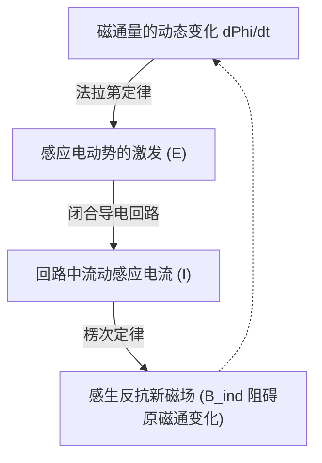

# 物理学：电磁感应与电动机原理 - 从法拉第的发现到现代电动汽车

现代工业文明的每一步运转都离不开电能。从指尖轻触的智能手机，到自动化工业流水线，再到穿梭于现代都市街头的电动汽车（EV），电能无处不在。然而，这奔涌不息的电流究竟从何而来？电能又是如何以惊人的效率转化为强劲的机械旋转动力的？

这扇连接电与动力的物理学大门，正是由 19 世纪由迈克尔·法拉第发现的 **电磁感应（Electromagnetic Induction）** 所开启。电磁感应彻底改变了人类文明的演进轨迹，铸就了现代电力工业与工业自动化的基石。本文将从严谨的物理原理出发，全方位拆解电磁感应定律、电动机的运行架构，并深入剖析现代新能源汽车动力革命背后的前沿核心科技。

## 1. 什么是电磁感应？法拉第的历史性破晓

1831 年，英国物理学家与化学家 **迈克尔·法拉第（Michael Faraday）** 完成了物理学史上最具颠覆性的实验之一。早在 1820 年，汉斯·奥斯特就已证实“电流可以产生磁场”（即电生磁）。法拉第凭借敏锐的物理直觉推断：*既然电能生磁，那么磁也必然能够生电。*

在经历无数次反复摸索后，法拉第终于证实：当穿过闭合导线线圈的磁场发生相对运动或强弱变化时，导线内部就会凭空产生流动的电流。这一伟大现象被命名为 **电磁感应** 。

### 法拉第电磁感应定律与楞次定律

深入理解电磁感应，必须掌握三个核心物理概念：
- **磁通量（Magnetic Flux, $\Phi_B$）** ：穿过某一给定闭合面积的磁感应强度矢量的面积分。形象地说，它代表“垂直穿过线圈平面的磁感线净净条数”。
- **感应电动势（Induced EMF, $\mathcal{E}$）** ：当磁通量发生改变时，在线圈两端产生的感生电势差（电压）。
- **感应电流（Induced Current）** ：在闭合回路中由感应电动势驱动形成的流动电荷。

法拉第电磁感应定律以极为洗练优雅的微分形式确立：

$$ \mathcal{E} = -\frac{d\Phi_B}{dt} $$

该公式揭示了自然界的本质规律：闭合回路中所激发的感应电动势大小，与穿过该回路的磁通量对时间的变化率严格成正比。

公式中最为深刻的灵魂是开头的 **负号（$-$）** ，它代表了物理学家海因里希·楞次于 1834 年总结的 **楞次定律（Lenz's Law）** 。楞次定律是电磁学中能量守恒定律的完美化身：*感应电流所产生的自身磁场，总是阻碍引起该感应电流的原磁通量的变化。*

当你把磁铁的 N 极快速推入线圈时，线圈会感应出同向的 N 极排斥磁铁的靠近；反之，当你把 N 极抽离线圈时，线圈便会感应出 S 极试图拉住磁铁。自然界总在顽强地抵抗外界强加的状态改变。

```mermaid
flowchart TD
    A["磁通量的动态变化 dPhi/dt"] -->|法拉第定律| B["感应电动势的激发 (E)"]
    B -->|闭合导电回路| C["回路中流动感应电流 (I)"]
    C -->|楞次定律| D["感生反抗新磁场 (B_ind 阻碍原磁通变化)"]
    D -.-> A
```

## 2. 驯服磁力驱动世界：电动机的工作原理

电磁感应是 **发电机（Generator）** 的灵魂——将机械动能转化为电能；而其逆向过程——将电能转化为机械动能的物理装置，正是 **电动机（Motor）** 。发电机与电动机在电磁学本质上是对偶同构的孪生体。

### 洛伦兹力与左手定则

当带电粒子在外部磁场中穿行时，会受到侧向偏转力，这被称为 **洛伦兹力（Lorentz force）** ：

$$ \mathbf{F} = q(\mathbf{E} + \mathbf{v} \times \mathbf{B}) $$

对于置于磁感应强度为 $\mathbf{B}$ 的磁场中、长度为 $L$ 且流经电流为 $I$ 的宏观载流导线，所受到的安培磁场力为 $\mathbf{F} = I (\mathbf{L} \times \mathbf{B})$。力的方向通过经典的三维 **左手定则（Fleming's Left-Hand Rule）** 判定：
- **食指** ：指向磁场方向（从 N 极指向 S 极）
- **中指** ：指向导线内电流方向
- **大拇指** ：垂直指示导线所受安培电磁力的推斥方向

在电动机内部，线圈对称置于永磁体或励磁磁极之间。当线圈通电时，左右两侧导线因电流方向相反，分别承受一上一下的相反力矩，形成电磁转矩（Torque），驱动转子源源不断地做高速圆周旋转。

### 三大主流电动机架构：有刷DC、无刷BLDC与交流感应电机

1. **有刷直流电动机（Brushed DC Motor）** ：采用机械换向器和碳刷，在每旋转半圈时强制机械反转电流极性。结构虽简单直观，但碳刷与换向器长期剧烈摩擦会导致火花磨损、电磁杂波，寿命极其有限。
2. **无刷直流电动机（BLDC）** ：利用半导体功率电子逆变器取代机械碳刷。强力钕铁硼永磁体固化在转子中央，由芯片和霍尔传感器毫秒级精准按序换向驱动定子电磁线圈。BLDC 具有高达 90% 以上的惊人能效，免维护且转速极高，成为无人机、机器人与新能源车的标准配置。
3. **交流感应电动机（AC Induction Motor）** ：由物理学巨擘[尼古拉·特斯拉](/p/biography-nikola-tesla/)于 1887 年发明。定子通入对称多相交流电产生高速“旋转磁场”，无需任何电刷，仅凭定子旋转磁场直接切过转子导条（鼠笼），依靠 **电磁感应定律** 在转子内部无接触感应出巨大的涡流。转子涡流与旋转磁场相互作用产生牵引扭矩。它不依赖贵重的稀土磁铁，结构坚不可摧，统治了全球大型工业机械领域。

## 3. 电动汽车（EV）的动力革命：从电磁原理到现代三电技术

全球百年汽车工业正经历从化石燃料内燃机（ICE）向纯电驱动（EV）的世纪大换道。而这场轰轰烈烈的工业更迭，正是法拉第电磁感应原理在汽车工业的登峰造极。

### 电动机相对燃油内燃机的降维打击优势

与传统汽油机相比，电动汽车驱动电机拥有物理定律赋予的绝对性能优势：
- **零转速爆发峰值扭矩（Instantaneous Peak Torque）** ：传统内燃机必须依靠曲轴加速至数千转才能攀升至扭矩平台，而电动机从通电的瞬间（0 RPM）即可倾泻 100% 的峰值扭矩，带来贴地飞行般的极致推背感。
- **超高的能量转换效率** ：汽油发动机受卡诺循环理论限制，综合热效率仅为 30%~40%，大半能量变成灼热尾气与震动损耗；而现代 EV 电驱系统综合电能转换效率普遍超越 90%~95%。
- **极致平顺与静谧** ：没有活塞往复撞击爆燃，电磁旋转从源头消除了机械抖动与轰鸣。

### 特斯拉与感应电机的工程传奇

特斯拉（Tesla）的名字直接致敬交流电之父[尼古拉·特斯拉](/p/biography-nikola-tesla/)。早期特斯拉旗舰车型 Roadster 与 Model S/X 便搭载了经典的 **交流感应电机（AC Induction Motor）** ，巧妙避开了对稀土原料的依赖。

而在追求更高工况续航里程的 Model 3 和 Model Y 上，工程师创新性地引入了 **永磁同步磁阻电机（PM-SynRM）** ，将高性能钕铁硼永磁体与转子磁阻凹槽拓扑完美融合，既保证了城市频繁启停下的极致省电，又维系了高速公路巡航时的宽广高效区。

### 动能回收系统（Regenerative Braking）：法拉第定律的艺术级应用

电动汽车最具魅力的核心黑科技莫过于 **动能回收（Regenerative Braking）** 。在这里，法拉第定律再次展现神威。

当驾驶员松开油门踏板或踩下刹车时，车辆主控芯片瞬间关闭向电机输送电池电流的逆变通路，改由车轮的旋转惯性反向拖动电动机高速旋转。在这一瞬间： **电动机直接无缝蜕变为了发电机！**

汽车的行车机械动能驱动线圈切割磁场，根据法拉第电磁感应定律激发出反向高压电流，反向充入底盘锂电池组；同时，根据楞次定律，感生电磁力产生强大的反向制动力矩，对车轮产生线性的减速阻力。传统燃油车通过刹车片剧烈摩擦白白变成热量废气浪费掉的能量，被 EV 重新回收高达 70% 以上，极大地扩展了严寒及高速工况下的续航里程。

## 4. 电机工程的未来前沿：超导技术与无稀土创新

在法拉第揭示电磁感应近两个世纪后的今天，电机物理与电气工程依然在爆发式前行：

- **超导电机（Superconducting Motors）** ：利用液氮温区的高温超导材料绕制电机励磁线圈，彻底消灭电流内阻（$R = 0$）。超导电机完全没有发热损耗，体积仅为传统电机的四分之一，功率密度可达常规电机的数倍，是未来全电动大型民航客机与电动垂直起降飞行器（eVTOL）实现商业化的核心钥匙。
- **无稀土永磁与新型磁阻电机** ：为规避稀土矿产供应链垄断，全球顶尖实验室正全力攻坚铁氮（$Fe_{16}N_2$）磁性化合物，以及基于深度强化学习 AI 拓扑优化的电励磁同步电机（WRSM），在摆脱稀土元素的同时将电机效率推向物理极致。

## 5. 结语：法拉第线圈所驱动的现代世界

今天，从承载全人类信息洪流的云端数据中心，到无声穿梭在大地上的新能源汽车，整个现代文明无时无刻不在法拉第的电磁脉搏中平稳律动。

磁通量的微妙变化能够孕育出照亮黑暗的电流，电流与磁场的交织能够迸发出推动万钧巨物的磅礴转矩。这不仅是基础物理学最精妙的数学对称，更向人类生动昭示了一个真理：正是对物理学基本规律的执着探寻，才赋予了人类驾驭自然、重构未来的无限力量。
