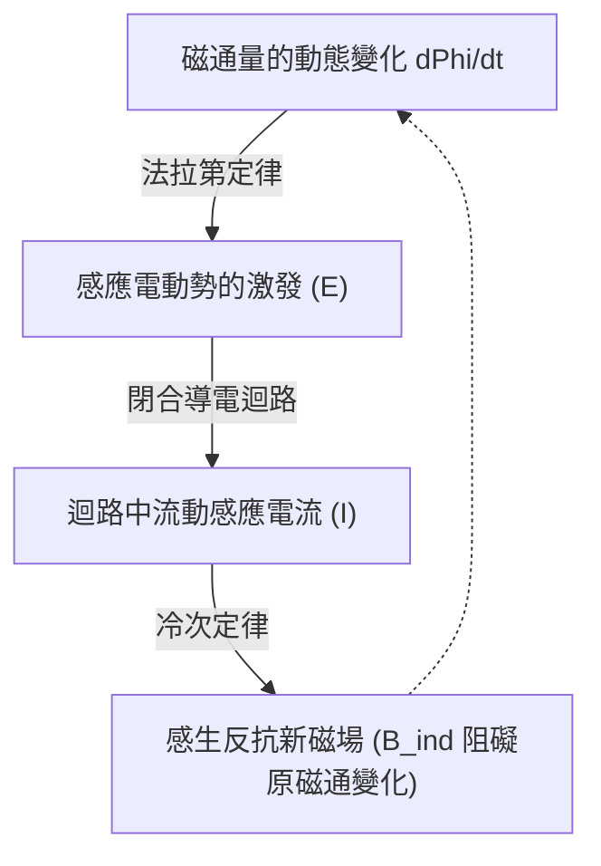

# 物理學：電磁感應與電動機原理 - 從法拉第的發現到現代電動車

現代工業文明的每一步運轉都離不開電能。從指尖輕觸的智慧型手機，到自動化工業產線，再到穿梭於現代都市街頭的電動車（EV），電能無處不在。然而，這奔湧不息的電流究竟從何而來？電能又是如何以驚人的效率轉化為強勁的機械旋轉動力的？

這扇連接電與動力的物理學大門，正是由 19 世紀由麥可·法拉第發現的 **電磁感應（Electromagnetic Induction）** 所開啟。電磁感應徹底改變了人類文明的演進軌跡，鑄就了現代電力工業與工業自動化的基石。本文將從嚴謹的物理原理出發，全方位拆解電磁感應定律、電動機的運作架構，並深入剖析現代新能源汽車動力革命背後的前沿核心科技。

## 1. 什麼是電磁感應？法拉第的歷史性破曉

1831 年，英國物理學家與化學家 **麥可·法拉第（Michael Faraday）** 完成了物理學史上最具顛覆性的實驗之一。早在 1820 年，漢斯·奧斯特就已證實「電流可以產生磁場」（即電生磁）。法拉第憑藉敏銳的物理直覺推斷：*既然電能生磁，那麼磁也必然能夠生電。*

在經歷無數次反覆摸索後，法拉第終於證實：當穿過閉合導線線圈的磁場發生相對運動或強弱變化時，導線內部就會憑空產生流動的電流。這一偉大現象被命名為 **電磁感應** 。

### 法拉第電磁感應定律與冷次定律

深入理解電磁感應，必須掌握三個核心物理概念：
- **磁通量（Magnetic Flux, $\Phi_B$）** ：穿過某一給定閉合面積的磁感應強度向量的面積分。形象地說，它代表「垂直穿過線圈平面的磁力線淨條數」。
- **感應電動勢（Induced EMF, $\mathcal{E}$）** ：當磁通量發生改變時，在線圈兩端產生的感生電位差（電壓）。
- **感應電流（Induced Current）** ：在閉合迴路中由感應電動勢驅動形成的流動電荷。

法拉第電磁感應定律以極為洗練優雅的微分形式確立：

$$ \mathcal{E} = -\frac{d\Phi_B}{dt} $$

該公式揭示了自然界的本質規律：閉合迴路中所激發的感應電動勢大小，與穿過該迴路的磁通量對時間的變化率嚴格成正比。

公式中最為深刻的靈魂是開頭的 **負號（$-$）** ，它代表了物理學家海因里希·冷次於 1834 年總結的 **冷次定律（Lenz's Law）** 。冷次定律是電磁學中能量守恆定律的完美化身：*感應電流所產生的自身磁場，總是阻礙引起該感應電流的原磁通量的變化。*

當你把磁鐵的 N 極快速推進線圈時，線圈會感應出同向的 N 極排斥磁鐵的靠近；反之，當你把 N 極抽離線圈時，線圈便會感應出 S 極試圖拉住磁鐵。自然界總在頑強地抵抗外界強加的狀態改變。

## 2. 馴服磁力驅動世界：電動機的工作原理

電磁感應是 **發電機（Generator）** 的靈魂——將機械動能轉化為電能；而其逆向過程——將電能轉化為機械動能的物理裝置，正是 **電動機（Motor，馬達）** 。發電機與電動機在電磁學本質上是對偶同構的孿生體。

### 勞侖茲力與左手定則

當帶電粒子在外部磁場中穿行時，會受到側向偏轉力，這被稱為 **勞侖茲力（Lorentz force）** ：

$$ \mathbf{F} = q(\mathbf{E} + \mathbf{v} \times \mathbf{B}) $$

對於置於磁感應強度為 $\mathbf{B}$ 的磁場中、長度為 $L$ 且流經電流為 $I$ 的巨觀載流導線，所受到的安培磁場力為 $\mathbf{F} = I (\mathbf{L} \times \mathbf{B})$。力的方向透過經典的三維 **左手定則（Fleming's Left-Hand Rule）** 判定：
- **食指** ：指向磁場方向（從 N 極指向 S 極）
- **中指** ：指向導線內電流方向
- **大拇指** ：垂直指示導線所受安培電磁力的推斥方向

在電動機內部，線圈對稱置於永久磁鐵或勵磁磁極之間。當線圈通電時，左右兩側導線因電流方向相反，分別承受一上一下的相反力矩，形成電磁轉矩（Torque），驅動轉子源源不絕地做高速圓周旋轉。

### 三大主流電動機架構：有刷DC、無刷BLDC與交流感應馬達

1. **有刷直流電動機（Brushed DC Motor）** ：採用機械換向器和碳刷，在每旋轉半圈時強制機械反轉電流極性。結構雖簡單直觀，但碳刷與換向器長期劇烈摩擦會導致火花磨損、電磁雜波，壽命極其有限。
2. **無刷直流電動機（BLDC）** ：利用半導體功率電子逆變器取代機械碳刷。強力釹鐵硼永久磁鐵固化在轉子中央，由晶片和霍爾感測器毫秒級精準按序換向驅動定子電磁線圈。BLDC 具有高達 90% 以上的驚人能效，免維護且轉速極高，成為無人機、機器人與新能源車的標準配置。
3. **交流感應電動機（AC Induction Motor）** ：由物理學巨擘[尼古拉·特斯拉](/p/biography-nikola-tesla/)於 1887 年發明。定子通入對稱多相交流電產生高速「旋轉磁場」，無需任何電刷，僅憑定子旋轉磁場直接切過轉子導條（鼠籠），依靠 **電磁感應定律** 在轉子內部無接觸感應出巨大的渦流。轉子渦流與旋轉磁場相互作用產生牽引扭矩。它不依賴貴重的稀土磁鐵，結構堅不可摧，統治了全球大型工業機械領域。

## 3. 電動車（EV）的動力革命：從電磁原理到現代三電技術

全球百年汽車工業正經歷從化石燃料內燃機（ICE）向純電驅動（EV）的世紀大換道。而這場轟轟烈烈的工業更迭，正是法拉第電磁感應原理在汽車工業的登峰造極。

### 馬達相對燃油內燃機的降維打擊優勢

與傳統汽油引擎相比，電動車驅動馬達擁有物理定律賦予的絕對性能優勢：
- **零轉速爆發峰值扭矩（Instantaneous Peak Torque）** ：傳統內燃機必須依靠曲軸加速至數千轉才能攀升至扭矩平台，而電動機從通電的瞬間（0 RPM）即可傾瀉 100% 的峰值扭矩，帶來貼地飛行般的極致貼背感。
- **超高的能量轉換效率** ：汽油引擎受卡諾循環理論限制，綜合熱效率僅為 30%~40%，大半能量變成灼熱廢氣與震動損耗；而現代 EV 電驅系統綜合電能轉換效率普遍超越 90%~95%。
- **極致平順與靜謐** ：沒有活塞往復撞擊爆燃，電磁旋轉從源頭消除了機械抖動與轟鳴。

### 特斯拉與感應馬達的工程傳奇

特斯拉（Tesla）的名字直接致敬交流電之父[尼古拉·特斯拉](/p/biography-nikola-tesla/)。早期特斯拉旗艦車型 Roadster 與 Model S/X 便搭載了經典的 **交流感應馬達（AC Induction Motor）** ，巧妙避開了對稀土原料的依賴。

而在追求更高工況續航里程的 Model 3 和 Model Y 上，工程師創新性地引入了 **永磁同步磁阻馬達（PM-SynRM）** ，將高性能釹鐵硼永久磁鐵與轉子磁阻凹槽拓撲完美融合，既保證了城市頻繁啟停下的極致省電，又維繫了高速公路巡航時的寬廣高效區。

### 動能回收系統（Regenerative Braking）：法拉第定律的藝術級應用

電動車最具魅力的核心黑科技莫過於 **動能回收（Regenerative Braking）** 。在這裡，法拉第定律再次展現神威。

當駕駛員鬆開油門踏板或踩下煞車時，車輛主控晶片瞬間關閉向馬達輸送電池電流的逆變通路，改由車輪的旋轉慣性反向拖動電動機高速旋轉。在這一瞬間： **電動機直接無縫蛻變為了發電機！**

汽車的行車機械動能驅動線圈切割磁場，根據法拉第電磁感應定律激發出反向高壓電流，反向充入底盤鋰電池組；同時，根據冷次定律，感生電磁力產生強大的反向制動力矩，對車輪產生線性的減速阻力。傳統燃油車透過煞車片劇烈摩擦白白變成熱量廢氣浪費掉的能量，被 EV 重新回收高達 70% 以上，極大地擴展了嚴寒及高速工況下的續航里程。

## 4. 馬達工程的未來前沿：超導技術與無稀土創新

在法拉第揭示電磁感應近兩個世紀後的今天，馬達物理與電氣工程依然在爆發式前行：

- **超導馬達（Superconducting Motors）** ：利用液氮溫區的高溫超導材料繞製馬達勵磁線圈，徹底消滅電流內阻（$R = 0$）。超導馬達完全沒有發熱損耗，體積僅為傳統馬達的四分之一，功率密度可達常規馬達的數倍，是未來全電動大型民航客機與電動垂直起降飛行器（eVTOL）實現商業化的核心鑰匙。
- **無稀土永磁與新型磁阻馬達** ：為規避稀土礦產供應鏈壟斷，全球頂尖實驗室正全力攻堅鐵氮（$Fe_{16}N_2$）磁性化合物，以及基於深度強化學習 AI 拓撲最佳化的電勵磁同步馬達（WRSM），在擺脫稀土元素的同時將馬達效率推向物理極致。

## 5. 結語：法拉第線圈所驅動的現代世界

今天，從承載全人類資訊洪流的雲端資料中心，到無聲穿梭在大地上的新能源汽車，整個現代文明無時無刻不在法拉第的電磁脈搏中平穩律動。

磁通量的微妙變化能夠孕育出照亮黑暗的電流，電流與磁場的交織能夠迸發出推動萬鈞巨物的磅礴轉矩。這不僅是基礎物理學最精妙的數學對稱，更向人類生動昭示了一個真理：正是對物理學基本規律的執著探尋，才賦予了人類駕馭自然、重構未來的無限力量。
