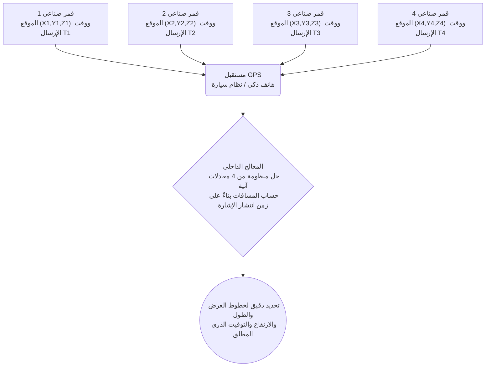

# الفضاء والتكنولوجيا: كيف يعمل نظام GPS - نظرية النسبية وتحديد المواقع بالأقمار الصناعية

في كل مرة نتحقق فيها من الاتجاهات على هواتفنا الذكية، أو نطلب سيارة عبر تطبيقات النقل، أو نعتمد على نظام الملاحة في السيارة، فإننا نستخدم **نظام تحديد المواقع العالمي (GPS)**. من توجيه الطائرات التجارية عبر المحيطات وإدارة الملاحة البحرية إلى مزامنة الطوابع الزمنية بالغة الدقة في المعاملات المالية العالمية، أصبح نظام GPS بنية تحتية غير مرئية ولكنها لا غنى عنها في الحضارة الحديثة.

ومع ذلك، لا يدرك الكثيرون أن هذه التقنية اليومية تعتمد بشكل جوهري على **نظريتي النسبية الخاصة والعامة لألبرت أينشتاين**—وهو فرع من الفيزياء النظرية يبدو للوهلة الأولى بعيداً تماماً عن تفاصيل حياتنا اليومية. وبدون التصحيحات النسبية التي وضعها أينشتاين، كان نظام GPS سيتراكم فيه خطأ في تحديد الموقع بمقدار يقارب **11.4 كيلومتر يومياً**، مما يجعل شبكة الأقمار الصناعية بأكملها عديمة الفائدة في غضون ساعات قليلة.

في هذا المقال، سنستعرض بالتفصيل المبادئ الهندسية لنظام التثليث المساحي، وتأثيرات النسبية على الساعات الذرية في المدار، والحلول الهندسية العبقرية التي تضمن دقة تحديد الموقع حول العالم.

## 1. الآلية الأساسية لنظام GPS: التثليث المساحي ودقة الوقت المطلقة

يحدد نظام GPS الإحداثيات الجغرافية ثلاثية الأبعاد للمستقبل الموجود على الأرض عبر التقاط إشارات الراديو التي تبثها مجموعة من الأقمار الصناعية التي تدور حول الأرض. يرتكز هذا الحساب على أسلوب هندسي يُعرف باسم **التثليث المساحي (Trilateration)**.

### 1.1. المفهوم الهندسي للتثليث المساحي (Trilateration)

لتحديد موقع نقطة بدقة متناهية في الفضاء ثلاثي الأبعاد، يحتاج جهاز الاستقبال إلى استقبال إشارات من **4 أقمار صناعية على الأقل**:

1. **القمر الصناعي الأول (كرة عدم اليقين)**: بحساب الوقت الذي تستغرقه إشارة الراديو للوصول من القمر الصناعي إلى المستقبل وضربها في سرعة الضوء، يتم تحديد المسافة. هذا يعني أن المستخدم يقع على سطح كرة افتراضية نصف قطرها تلك المسافة.
2. **القمر الصناعي الثاني (تقاطع دائري)**: بإضافة قمر صناعي ثانٍ، يتقاطع السطحان الكرويان ليكوّنا دائرة في الفضاء ثلاثي الأبعاد.
3. **القمر الصناعي الثالث (الانحصار في نقطتين)**: يتقاطع سطح الكرة الثالثة مع تلك الدائرة في **نقطتين منفصلتين تماماً**. تقع إحدى هاتين النقطتين عادة في الفضاء السحيق أو في أعماق باطن الأرض، وباستبعاد هذا الخيار المستحيل فيزيائياً، يتم تحديد نقطة وحيدة على سطح الأرض (خط العرض، خط الطول، والارتفاع).
4. **القمر الصناعي الرابع (تصحيح خطأ ساعة المستقبل)**: نظرياً، تكفي ثلاثة أقمار لتحديد الإحداثيات $(X, Y, Z)$، ولكن في الواقع الهندسي تبرز عقبة كبرى: **خطأ الساعة الداخلية للمستقبل**. لا تمتلك مذبذبات الكوارتز في الهواتف الذكية دقة النانوثانية الموجودة في الساعات الذرية للأقمار الصناعية. يوفر القمر الصناعي الرابع المعادلة الرابعة اللازمة لحل الإحداثيات المكانية وانحراف ساعة المستقبل $\Delta t$ في آن واحد.

### 1.2. حساب المسافة: سرعة الضوء كمضاعف هائل

تُحسب المسافة من القمر الصناعي إلى جهاز الاستقبال بناءً على زمن طيران الموجة الكهرومغناطيسية:

$$ \text{المسافة} = c \times \Delta t $$

حيث تمثل $c \approx 3 \times 10^8 \text{ m/s}$ سرعة الضوء في الفراغ. ولأن الضوء يقطع حوالي 300 متر في ميكروثانية واحدة فقط ($10^{-6}\text{ s}$)، فإن خطأً مقداره **ميكروثانية واحدة فقط يؤدي إلى خطأ في تحديد الموقع بمقدار 300 متر**. حتى الخطأ بمقدار نانوثانية واحدة ($10^{-9}\text{ s}$) يُحدث انزياحاً قدره 30 سنتيمتراً.

لذا، زُوّدت أقمار GPS بـ **ساعات ذرية تعمل بالسيزيوم-133 والروبيديوم-87** فائقة الاستقرار، والتي لا تخطئ ثانية واحدة إلا بعد مئات آلاف السنين. ولكن حتى مع هذه الدقة المطلقة، واجه العلماء حقيقة فيزيائية كونية: **معدل مرور الوقت في المدار يختلف عن وتيرته على سطح الأرض**.

## 2. نسبية أينشتاين: تقدم وتأخر الوقت في المدار

نسفت **النسبية الخاصة** (1905) و**النسبية العامة** (1915) لألبرت أينشتاين افتراض نيوتن الكلاسيكي بأن الوقت مطلق ويتدفق بشكل متطابق في كل أرجاء الكون. فالوقت نسبي ويتأثر بسرعة حركة الراصد وقوة مجال الجاذبية المحيط.

### 2.1. النسبية الخاصة: السرعة العالية تبطئ مرور الوقت

تنص النسبية الخاصة على أن الساعات المتحركة بسرعة بالنسبة لمراقب ثابت تبدو وكأنها تدق بشكل أبطأ (تمدد الزمن الحركي). ويُعبر عن ذلك بمعامل لورنتز:

$$ \Delta t' = \frac{\Delta t}{\sqrt{1 - \frac{v^2}{c^2}}} $$

حيث $v$ هي سرعة القمر الصناعي و $c$ هي سرعة الضوء.

تدور أقمار GPS على ارتفاع حوالي 20,200 كم بسرعة مدارية تصل إلى **$3.874\text{ كم/ثانية}$** (نحو 14,000 كم/ساعة). ونتيجة لهذه الحركة السريعة، فإن الساعات الذرية على متن الأقمار الصناعية **تتأخر بمقدار 7 ميكروثانية تقريباً كل يوم ($-7\ \mu\text{s/يوم}$)** مقارنة بالساعات على الأرض.

### 2.2. النسبية العامة: الجاذبية الضعيفة تسرّع مرور الوقت

من جانب آخر، بيّنت النسبية العامة أن الجاذبية هي انحناء في نسيج الزمكان بسبب الكتلة. في المناطق القريبة من الكتل الضخمة ينحني الزمكان بقوة ويمر الوقت ببطء؛ وعلى العكس، **كلما ابتعدنا عن الكتلة وضعف مجال الجاذبية، يتدفق الوقت بسرعة أكبر**.

على ارتفاع 20,200 كم، تبلغ جاذبية الأرض ربع قيمتها على السطح تقريباً. وبسبب وجودها في زمكان أقل انحناءً، فإن الساعات الذرية للأقمار الصناعية **تتقدم بمقدار 45 ميكروثانية تقريباً يومياً ($+45\ \mu\text{s/يوم}$)** مقارنة بالساعات الأرضية.

### 2.3. المحصلة النسبية الصافية: تقدم بمقدار +38 ميكروثانية يومياً

بما أن القمرين الصناعيين يتعرضان لكلا التأثيرين في وقت واحد، نقوم بجمعهما جبرياً:

- **تأثير النسبية الخاصة (السرعة)**: $-7\ \mu\text{s/يوم}$ (تأخر)
- **تأثير النسبية العامة (الجاذبية)**: $+45\ \mu\text{s/يوم}$ (تقدم)

$$ \text{المحصلة الصافية} = +45\ \mu\text{s/يوم} - 7\ \mu\text{s/يوم} = +38\ \mu\text{s/يوم} $$

التأثير الجذبي يفوق التأثير الحركي بفارق كبير. ونتيجة لذلك، تتقدم الساعات الذرية على متن أقمار GPS بمقدار **38 ميكروثانية كل 24 ساعة** مقارنة بالساعات على الأرض.

## 3. لماذا تُعد 38 ميكروثانية خطأً كارثياً؟

بالنسبة للحواس البشرية، يبدو الفارق الزمني البالغ 38 ميكروثانية (0.000038 ثانية) غير ملحوظ على الإطلاق. ولكن عند ضربه في سرعة الضوء الهائلة ($300,000\text{ كم/ثانية}$)، تكون النتيجة خطأً فادحاً:

$$ \text{الانزياح اليومي} = (3 \times 10^8\text{ م/ث}) \times (38 \times 10^{-6}\text{ ث}) = 11,400\text{ متر} = 11.4\text{ كم/يوم} $$

إذا تم تجاهل تأثيرات النسبية:
- في اليوم الأول، سيصل الخطأ إلى **11.4 كم**.
- في اليوم الثاني، سيتراكم ليصل إلى **22.8 كم**.
- في اليوم الثالث، سيتجاوز **34 كم**.

في غضون أيام قليلة، ستُظهر أنظمة الملاحة السيارات وكأنها تسير في عرض البحر أو فوق الجبال، وستفقد الملاحة الجوية قدرتها على الهبوط الآمن، مما يجعل النظام بأكمله غير صالح للاستخدام.

## 4. كيف تغلبت هندسة GPS على التأثيرات النسبية

لتفادي هذا الخطأ القاتل، ابتكر مهندسو GPS حلاً مزدوجاً يجمع بين الضبط المسبق للتردد على الأرض والتصحيح اللاسلكي المستمر عبر المحطات الأرضية.

### 4.1. الإزاحة المسبقة للتردد قبل الإطلاق

أكثر الحلول عبقرية تم تنفيذه على الأرض قبل إطلاق الصاروخ إلى الفضاء.

التردد القياسي للساعة الذرية على الأرض هو **10.23 ميغاهرتز**. ولو أُطلقت بهذا التردد، لدقت في الفضاء بسرعة فائقة. لذلك، قام المهندسون عمداً بضبط مذبذب الساعة الذرية ليعمل بتردد أقل قليلاً أثناء وجوده على الأرض:

$$ f_{\text{القمر الصناعي}} = 10.22999999543\text{ ميغاهرتز} $$

عندما يصل القمر الصناعي إلى مداره على ارتفاع 20,200 كم، فإن التسارع النسبي الصافي البالغ $+38\ \mu\text{s/يوم}$ يرفع التردد ليتطابق تماماً مع التردد المطلوب وهو **10.23 ميغاهرتز** كما يُرصد من الأرض.

### 4.2. المراقبة المستمرة من المحطات الأرضية والتعديل التلقائي

يفترض الضبط المسبق مداراً دائرياً مثالياً. لكن الواقع يحتوي على اضطرابات:
- **شذوذ المدار (Eccentricity)**: المدار بيضاوي قليلاً ($e \approx 0.01$)، مما يولد تذبذبات دورية تصل إلى 45 نانوثانية.
- **تفاوت شكل الأرض (الجيود)**: كتلة الأرض غير موزعة بانتظام متطابق.
- **ضغط الإشعاع الشمسي وجاذبية القمر**.

لذلك، تراقب محطة التحكم الرئيسية (MCS) ومحطات التتبع العالمية الأقمار على مدار 24 ساعة. وتقوم بحساب معاملات تصحيح الساعة ($a_0, a_1, a_2$) وإرسالها إلى الأقمار الصناعية. تبث الأقمار هذه البيانات في **رسالة الملاحة (Navigation Message)**، مما يتيح للهواتف الذكية تصفير أي خطأ متبقٍ بدقة متناهية.

## 5. نظام GPS كركيزة خفية للمجتمعات الحديثة

تتجاوز تطبيقات نظام GPS اليوم مجرد إرشاد السائقين على الطرقات:

- **النقل والمركبات الذكية**: يعتمد الطيران المدني (ADS-B)، وتوجيه سفن الحاويات، والسيارات ذاتية القيادة من المستوى 4 و 5 على تقنيات RTK و DGPS للحصول على دقة سنتيمترية.
- **الأسواق المالية والاتصالات**: يفرض التداول عالي التردد (HFT) توثيقاً زمنياً بالميكروثانية بموجب معايير MiFID II. كما تستخدم أبراج اتصالات 5G نبضات GPS (1PPS) لمزامنة موجات الراديو ومنع التداخل.
- **الزراعة الدقيقة والهندسة الإنشائية**: تسير الجرارات الزراعية ذاتية القيادة بدقة 2 سم لغرس البذور وتوزيع الأسمدة، وتعمل الآليات الثقيلة في مواقع البناء بشكل آلي استناداً لمخططات BIM ثلاثية الأبعاد.
- **الرصد الجيولوجي والتنبؤ بالأعاصير**: ترصد شبكات GPS الانزلاقات التكتونية بدقة المليمتر للتنبؤ بالزلازل والبراكين، وتقيس زمن تأخر الإشارات في الغلاف الجوي لتقدير كميات بخار الماء والتنبؤ بالعواصف الشديدة.

## 6. خاتمة: قوانين الكون بين يديك

عندما تنظر إلى النقطة الزرقاء التي تحدد موقعك على شاشة هاتفك، فأنت تشهد تحفة من أعظم التحف الهندسية في تاريخ البشرية: ملتقى يجمع بين هندسة إقليدس، واهتزازات ذرة السيزيوم، ونظرية أينشتاين حول انحناء الزمكان عبر 20 ألف كيلومتر من الفضاء.
