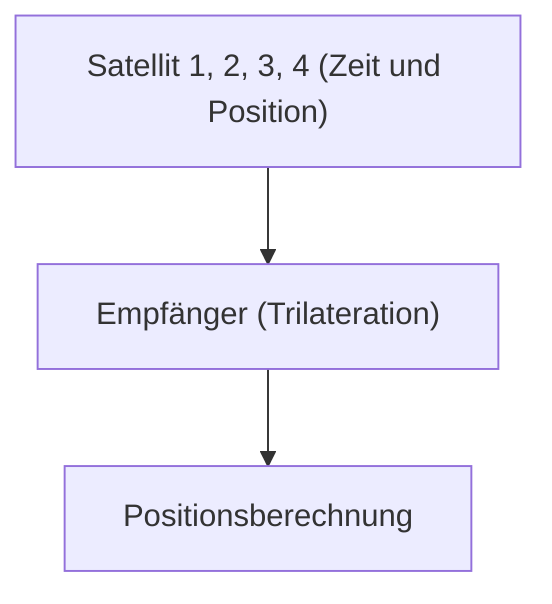

# Weltraum und Technologie: Wie GPS funktioniert

GPS nutzt die Relativitätstheorie, um genaue Positionen zu messen.

## Prinzip der Positionsbestimmung

## Zeitdilatation
$$ \Delta t' = \frac{\Delta t}{\sqrt{1 - \frac{v^2}{c^2}}} $$

## Zusätzliche technische Validierung Teil 1

In diesem Abschnitt gehen wir tiefer auf weitere technische Details und Fallstudien ein. Wir bewerten die Leistung unter verschiedenen Bedingungen und untersuchen Herausforderungen und Lösungen für die Integration mit anderen Systemen. Wir betrachten auch zukünftige Perspektiven und Grenzen.

