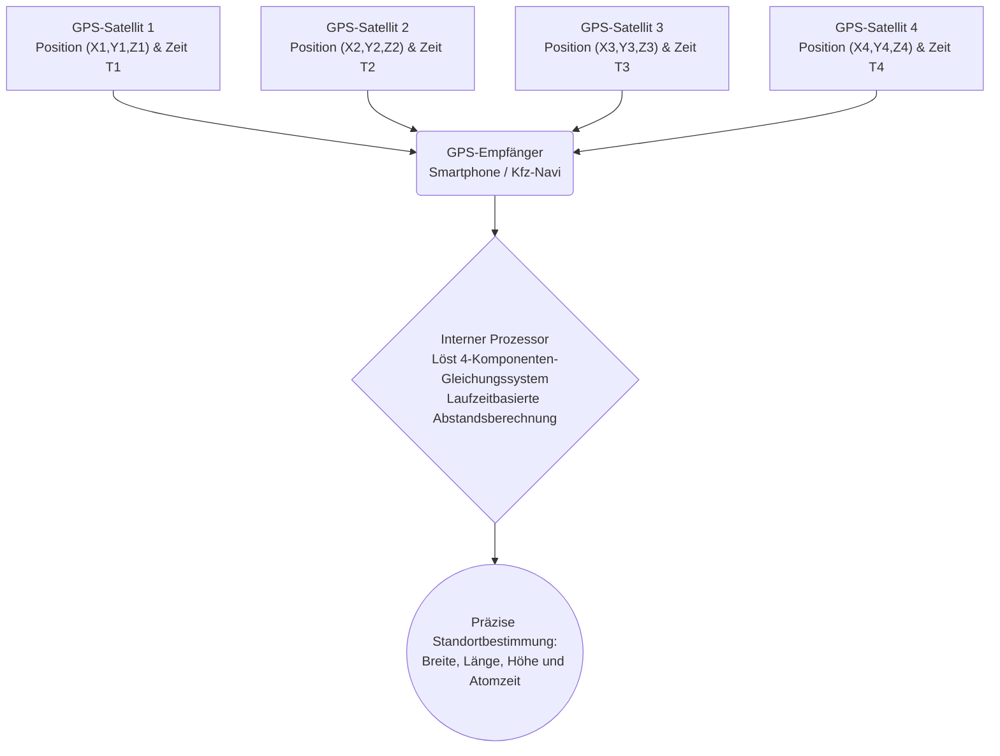

# Weltraum & Technik: Funktionsweise des GPS - Relativitätstheorie und Satellitennavigation

Ob bei der Navigation im Auto, der Routenführung auf dem Smartphone oder der Lokalisierung von Fahrdiensten: Das **Global Positioning System (GPS)** ist aus unserem Alltag nicht mehr wegzudenken. Von der transozeanischen Flugsicherung bis zur mikrosekundengenauen Synchronisation globaler Finanztransaktionen bildet das GPS das unsichtbare Rückgrat der modernen Gesellschaft.

Doch hinter dieser alltäglichen Technik verbirgt sich eine verblüffende physikalische Wahrheit: Ohne Albert Einsteins **Spezielle und Allgemeine Relativitätstheorie** würde das gesamte GPS-Netzwerk innerhalb kürzester Zeit kollabieren. Blieben relativistische Effekte unberücksichtigt, würde sich der Positionsfehler täglich um etwa **11,4 Kilometer** summieren, was das System innerhalb weniger Stunden unbrauchbar machen würde.

Dieser Beitrag erläutert die geometrische Trilateration, die relativistische Zeitverschiebung im Orbit und die ingenieurtechnischen Meisterleistungen, die weltweite Präzision gewährleisten.

## 1. Das Grundprinzip des GPS: Trilateration und präzise Zeitmessung

Das GPS bestimmt die dreidimensionale Position eines Empfängers auf der Erde durch den Empfang von Funksignalen mehrerer Satelliten. Das geometrische Kernverfahren hierfür ist die **Trilateration**.

### 1.1. Das geometrische Verfahren der Trilateration

Um einen Raumkoordinatenpunkt im dreidimensionalen Raum exakt zu bestimmen, benötigt der Empfänger Signale von mindestens **vier GPS-Satelliten**:

1. **Erster Satellit (Abstandskugelfläche)**: Durch Multiplikation der Signallaufzeit mit der Lichtgeschwindigkeit ermittelt der Empfänger die Entfernung zum Satelliten. Der Standort liegt auf einer gedachten Kugelschale um diesen Satelliten.
2. **Zweiter Satellit (Schnittkreis)**: Eine zweite Kugel schneidet die erste; der mögliche Standort wird auf einen zweidimensionalen Kreis im Raum eingegrenzt.
3. **Dritter Satellit (Zwei Schnittpunkte)**: Die Kugelschale des dritten Satelliten schneidet den Kreis an genau **zwei diskreten Punkten**. Da einer dieser Punkte meist tief im Erdinneren oder weit im Weltraum liegt, lässt er sich physikalisch ausschließen. Damit steht die dreidimensionale Position (Länge, Breite, Höhe) fest.
4. **Vierter Satellit (Korrektur des Empfängeruhrfehlers)**: Geometrisch reichen drei Satelliten für $(X, Y, Z)$ aus, doch in der Praxis existiert ein fundamentales Problem: **der Uhrenfehler des Empfängers**. Die Quarzuhr eines Smartphones erreicht bei weitem nicht die Nanosekunden-Präzision einer Atomuhr. Der vierte Satellit liefert die vierte Gleichung, mit der die Raumkoordinaten und der Uhrenfehler $\Delta t$ des Empfängers simultan gelöst werden.

```mermaid
flowchart TD
    S1["GPS-Satellit 1\nPosition (X1,Y1,Z1) & Zeit T1"] --> R(GPS-Empfänger\nSmartphone / Kfz-Navi)
    S2["GPS-Satellit 2\nPosition (X2,Y2,Z2) & Zeit T2"] --> R
    S3["GPS-Satellit 3\nPosition (X3,Y3,Z3) & Zeit T3"] --> R
    S4["GPS-Satellit 4\nPosition (X4,Y4,Z4) & Zeit T4"] --> R
    R --> C{"Interner Prozessor\nLöst 4-Komponenten-Gleichungssystem\nLaufzeitbasierte Abstandsberechnung"}
    C --> P((Präzise Standortbestimmung:\nBreite, Länge, Höhe und Atomzeit))
```

### 1.2. Entfernungsberechnung: Lichtgeschwindigkeit als Multiplikator

Die Distanz zwischen Satellit und Empfänger ergibt sich aus der Signallaufzeit:

$$ \text{Distanz} = c \times \Delta t $$

Dabei ist $c \approx 3 \times 10^8 \text{ m/s}$ die Lichtgeschwindigkeit im Vakuum. Da sich Licht in einer Mikrosekunde ($10^{-6}\text{ s}$) um rund 300 Meter fortbewegt, führt eine Ungenauigkeit von **nur einer Mikrosekunde zu einem Positionsfehler von 300 Metern**. Eine Abweichung von einer Nanosekunde ($10^{-9}\text{ s}$) erzeugt bereits einen Versatz von 30 Zentimetern.

Daher führen GPS-Satelliten hochpräzise **Cäsium-133- und Rubidium-87-Atomuhren** mit, deren Gangungenauigkeit in Hunderttausenden von Jahren weniger als eine Sekunde beträgt. Doch selbst die vollkommenste Uhr unterliegt einem grundlegenden physikalischen Phänomen: **Die Zeit vergeht im Erdorbit schneller als auf der Erdoberfläche**.

## 2. Einsteins Relativitätstheorie: Gangunterschiede der Uhren im Orbit

Die von Albert Einstein 1905 und 1915 veröffentlichten **Speziellen und Allgemeinen Relativitätstheorien** widerlegten Newtons Annahme einer absoluten Zeit. Die Zeit vergeht nicht überall im Universum im gleichen Takt, sondern hängt von der Relativgeschwindigkeit und dem umgebenden Schwerefeld ab.

### 2.1. Spezielle Relativitätstheorie: Hohe Geschwindigkeiten verlangsamen die Zeit

Die Spezielle Relativitätstheorie besagt, dass Uhren, die sich relativ zu einem ruhenden Beobachter bewegen, langsamer ticken. Diese kinematische Zeitdilatation wird durch den Lorentz-Faktor beschrieben:

$$ \Delta t' = \frac{\Delta t}{\sqrt{1 - \frac{v^2}{c^2}}} $$

Hierbei ist $v$ die Geschwindigkeit des Objekts und $c$ die Lichtgeschwindigkeit.

GPS-Satelliten umkreisen die Erde in einer Höhe von rund 20.200 km mit einer Umlaufgeschwindigkeit von ca. **$3,874\text{ km/s}$** (rund 14.000 km/h). Aufgrund dieser Bewegung gehen die Atomuhren im Satelliten im Vergleich zu Bodenstationen **täglich um etwa 7 Mikrosekunden nach ($-7\ \mu\text{s/Tag}$)**.

### 2.2. Allgemeine Relativitätstheorie: Schwächere Schwerkraft beschleunigt die Zeit

Die Allgemeine Relativitätstheorie beschreibt die Gravitation als Krümmung der vierdimensionalen Raumzeit. In der Nähe großer Massen ist die Raumzeit stark gekrümmt und die Zeit vergeht langsamer. **Je weiter man sich von der Masse entfernt und je schwächer das Schwerefeld ist, desto schneller vergeht die Zeit**.

In 20.200 km Höhe ist die Schwerkraft der Erde auf etwa ein Viertel des Bodenwerts reduziert. Da sich der Satellit in einer flacheren Raumzeit befindet, ticken seine Atomuhren **täglich um etwa 45 Mikrosekunden schneller ($+45\ \mu\text{s/Tag}$)** als Uhren auf der Erdoberfläche.

### 2.3. Die Überlagerung der Effekte: Netto-Vorsprung von +38 Mikrosekunden pro Tag

Da beide relativistischen Effekte gleichzeitig auf die Satelliten einwirken, müssen sie superponiert werden:

- **Effekt der Speziellen Relativitätstheorie (kinematisch)**: $-7\ \mu\text{s/Tag}$ (Verlangsamung)
- **Effekt der Allgemeinen Relativitätstheorie (gravitativ)**: $+45\ \mu\text{s/Tag}$ (Beschleunigung)

$$ \text{Netto-Abweichung} = +45\ \mu\text{s/Tag} - 7\ \mu\text{s/Tag} = +38\ \mu\text{s/Tag} $$

Der gravitative Effekt überwiegt deutlich. Folglich gehen die Atomuhren an Bord der GPS-Satelliten **jeden Tag um 38 Mikrosekunden vor**.

## 3. Warum 38 Mikrosekunden einen verheerenden Fehler bedeuten

Für das menschliche Empfinden scheinen 38 Mikrosekunden (0,000038 s) winzig. Bei Multiplikation mit der Lichtgeschwindigkeit ($300.000\text{ km/s}$) resultiert daraus jedoch ein fataler Drift:

$$ \text{Täglicher Fehler} = (3 \times 10^8\text{ m/s}) \times (38 \times 10^{-6}\text{ s}) = 11.400\text{ Meter} = 11,4\text{ km/Tag} $$

Ohne Berücksichtigung der Relativitätstheorie:
- Beträgt der Positionsfehler nach einem Tag **11,4 km**.
- Summiert er sich am zweiten Tag auf **22,8 km**.
- Übersteigt er am dritten Tag **34 km**.

Navigationssysteme im Auto würden Straßen verfehlen und Fahrzeuge auf freiem Feld oder im Meer orten. Das gesamte satellitengestützte Verkehrssystem wäre unbrauchbar.

## 4. Wie das GPS-System relativistische Abweichungen korrigiert

Um diese verheerende Drift zu unterbinden, kombiniert das GPS-System eine fundamentale Hardware-Anpassung vor dem Start mit kontinuierlichen Telemetriekorrekturen vom Boden aus.

### 4.1. Frequenz-Offset vor dem Raketenstart

Die eleganteste Korrektur erfolgt am Boden vor dem eigentlichen Start des Satelliten.

Die nominelle Schwingungsfrequenz einer terrestrischen Atomuhr beträgt **10,23 MHz**. Um die orbitalen Effekte auszugleichen, verstimmen die Ingenieure die Taktfrequenz der Satellitenuhren absichtlich auf einen minimal geringeren Wert:

$$ f_{\text{Satellit}} = 10,22999999543\text{ MHz} $$

Erreicht der Satellit seinen Orbit in 20.200 km Höhe, gleicht der relativistische Gangvorsprung von $+38\ \mu\text{s/Tag}$ diesen Offset exakt aus. Aus Sicht eines Empfängers auf der Erde schwingt die Uhr mit punktgenau **10,23 MHz**.

### 4.2. Kontinuierliche Überwachung durch Kontrollstationen

Die Vorabeinstellung geht von einer idealen Kreisbahn aus. In der Praxis treten jedoch Abweichungen auf:
- **Bahnexzentrizität**: Die Umlaufbahn ist leicht elliptisch ($e \approx 0,01$), was periodische Schwankungen von bis zu 45 Nanosekunden erzeugt.
- **Geoid-Unregelmäßigkeiten**: Die Erde ist keine perfekte Kugel; Masseverteilungen variieren.
- **Sonnenwind und Mondgravitation**.

Aus diesem Grund überwacht die **Master Control Station (MCS)** zusammen mit weltweiten Bodenstationen kontinuierlich alle Satelliten. Sie berechnet Korrekturparameter ($a_0, a_1, a_2$) und übermittelt diese via Uplink an die Satelliten. Diese senden die Werte in ihrer **Navigationsnachricht (Navigation Message)** an die Empfänger, wodurch verbleibende Restfehler in Echtzeit korrigiert werden.

## 5. Das GPS als Schlüsselkomponente moderner Infrastrukturen

Die Bedeutung des GPS reicht weit über die Navigation auf Mobilgeräten hinaus:

- **Verkehr und autonomes Fahren**: Flugmanagementsysteme (ADS-B), Containerschifffahrt und hochautomatisiertes Fahren (Level 4/5) nutzen differentielles GPS (DGPS) und Real-Time Kinematic (RTK) für Genauigkeiten im Zentimeterbereich.
- **Finanzmärkte und Telekommunikation**: Hochfrequenzhandel (HFT) erfordert Zeitstempel im Sub-Mikrosekundenbereich gemäß MiFID II. 5G-Mobilfunkmasten synchronisieren ihre Sendephasen mittels 1PPS-Signalen des GPS.
- **Präzisionslandwirtschaft und Bauwesen**: Autonome Traktoren steuern landwirtschaftliche Flächen mit 2 cm Genauigkeit an; Baumaschinen führen Erdarbeiten vollautomatisch nach 3D-CAD-Modellen aus.
- **Geowissenschaften und Katastrophenschutz**: GPS-Netze erfassen tektonische Verschiebungen im Millimeterbereich zur Erdbebenforschung und messen troposphärische Signalverzögerungen zur präzisen Vorhersage von Starkregenereignissen.

## 6. Fazit: Kosmische Physik in unserer Hand

Wenn wir auf die Straßenkarte unseres Smartphones blicken, erleben wir die praktische Synthese jahrhundertealter Wissenschaft: Euklidische Geometrie, atomare Quantensprünge von Cäsiumatomen und Einsteins gekrümmte Raumzeit verschmelzen über 20.000 Kilometer hinweg zu einem verlässlichen Wegweiser unseres Alltags.
