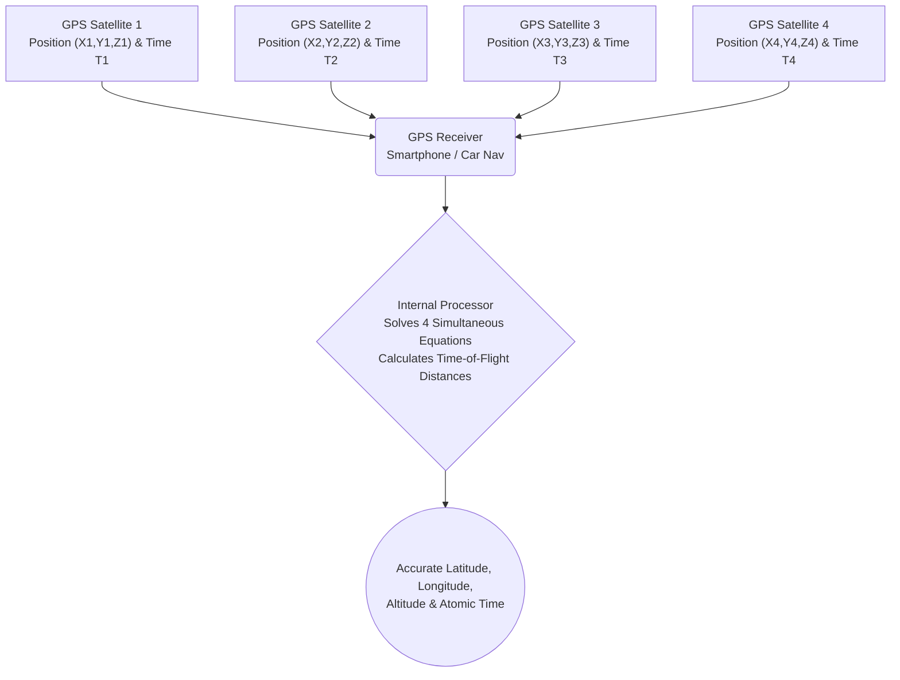

# Space & Technology: How GPS Works - General & Special Relativity in Satellite Positioning

Every time we check directions on our smartphones, hail a rideshare vehicle, or rely on an in-car navigation system, we are using the **Global Positioning System (GPS)**. From guiding autonomous drones and navigating commercial airliners across oceans to synchronizing millisecond-level timestamps for global financial markets, GPS has quietly evolved into one of modern civilization's most indispensable public utilities.

Yet beneath this everyday convenience lies a staggering scientific fact: GPS could not function for even a single day without Albert Einstein's **theories of Special and General Relativity**—branches of theoretical physics once considered purely abstract. Without relativistic corrections, GPS positioning errors would accumulate at roughly **11.4 kilometers (7 miles) per day**, rendering the entire satellite network useless within hours.

This article explores the foundational principles of satellite positioning, the geometric elegance of trilateration, and the profound relativistic phenomena that govern the ticking of clocks high above our planet.

## 1. The Core Architecture of GPS: Trilateration and Precise Timekeeping

GPS determines an observer's exact geographic coordinates by intercepting radio frequency signals broadcast by a constellation of satellites orbiting Earth. At the heart of this positioning algorithm is a geometric technique known as **trilateration**.

### 1.1. The Geometric Mechanics of Trilateration

To calculate a receiver's position in three-dimensional space, signals from at least **four distinct GPS satellites** must be simultaneously acquired:

1. **First Satellite (Sphere of Uncertainty)**: By multiplying the propagation time of the radio signal by the speed of light, the receiver computes its distance to the first satellite. This places the receiver somewhere on an imaginary spherical shell of that radius centered on Satellite 1.
2. **Second Satellite (Circular Intersection)**: Adding a second satellite creates a second sphere. The intersection of two distinct spheres forms a circle in space. The receiver must lie along this circular perimeter.
3. **Third Satellite (Two Discrete Points)**: Adding a third sphere intersects the circular perimeter at exactly two distinct points. One of these points is situated far out in outer space or deep within Earth's mantle; dismissing this physical impossibility pinpoints the exact physical location (latitude, longitude, and elevation) on Earth's surface.
4. **Fourth Satellite (Receiver Clock Correction)**: While three spheres geometrically determine spatial coordinates $(X, Y, Z)$, real-world receivers face a critical bottleneck: the **internal clock error of the receiver**. Smartphone quartz oscillators cannot match the nanosecond precision of satellite atomic clocks. A fourth satellite provides the necessary fourth variable, allowing the receiver to solve a system of simultaneous equations that resolves $X, Y, Z$, and the receiver's internal clock bias $\Delta t$.

### 1.2. Calculating Distance: The Multiplier Effect of Light Speed

The distance from a satellite to a receiver is calculated using the time-of-flight (ToF) of electromagnetic radiation:

$$ \text{Distance} = c \times \Delta t $$

Where $c \approx 3 \times 10^8 \text{ m/s}$ represents the speed of light in a vacuum. Because light travels approximately 300 meters in a single microsecond ($10^{-6}\text{ s}$), a timing discrepancy of merely **one microsecond creates a position error of 300 meters**. A discrepancy of one nanosecond ($10^{-9}\text{ s}$) produces a 30-centimeter error.

To maintain ultra-high accuracy, GPS satellites carry onboard atomic clocks powered by **cesium-133** and **rubidium-87** standards, stable to within a few parts in $10^{14}$. Yet, even the most perfect clock faces an unavoidable physical obstacle: **time itself flows at different rates in orbit than on Earth's surface**.

## 2. Einstein's Relativity and the Ticking of Orbital Clocks

Published in 1905 and 1915 respectively, Albert Einstein's **Special Theory of Relativity** and **General Theory of Relativity** demolished the Newtonian assumption of absolute, uniform time across the cosmos. According to Einstein, time is relative; its perceived cadence depends upon the relative velocity of the reference frame and the gravitational potential of the local spacetime.

### 2.1. Special Relativity: Velocity-Induced Time Dilation

Special relativity dictates that an observer measuring a moving clock will observe that clock ticking slower than their own at rest. This velocity-dependent time dilation is expressed by the Lorentz factor $\gamma$:

$$ \Delta t' = \frac{\Delta t}{\sqrt{1 - \frac{v^2}{c^2}}} $$

Where $v$ is the orbital velocity of the satellite and $c$ is the speed of light.

GPS satellites travel in semi-synchronous medium Earth orbits (MEO) at an altitude of approximately 20,200 km, circling the globe every 11 hours and 58 minutes. This requires an orbital speed of roughly **$v \approx 3.874 \text{ km/s}$** (nearly $14,000\text{ km/h}$).

Because of this rapid motion relative to stationary observers on Earth's surface, special relativity predicts that onboard atomic clocks tick **slower** by roughly **7 microseconds ($7\ \mu\text{s}$) per day**.

### 2.2. General Relativity: Gravitational Time Dilation

General relativity describes gravity not as an invisible Newtonian attraction, but as the geometric curvature of four-dimensional spacetime caused by mass and energy. The deeper a clock resides within a gravitational potential well, the slower time flows. Conversely, **clocks situated farther away from massive bodies experience weaker gravity and tick faster**.

On the surface of Earth, gravitational potential is deep due to proximity to Earth's mass. At an altitude of 20,200 km, the gravitational field strength experienced by a GPS satellite is roughly one-fourth of that at the equator. Consequently, spacetime around the satellite is significantly less curved.

This weaker gravitational potential causes satellite atomic clocks to run **faster** relative to clocks on Earth's surface by approximately **45 microseconds ($45\ \mu\text{s}$) per day**.

### 2.3. The Net Relativistic Time Difference

Because both physical mechanisms act simultaneously on the satellite, we must superimpose the two relativistic effects:

- **Special Relativity Effect (Kinematic)**: $-7\ \mu\text{s/day}$ (clock runs slower)
- **General Relativity Effect (Gravitational)**: $+45\ \mu\text{s/day}$ (clock runs faster)

$$ \text{Net Relativistic Bias} = +45\ \mu\text{s/day} - 7\ \mu\text{s/day} = +38\ \mu\text{s/day} $$

The gravitational blueshift massively dominates the kinematic kinematic time dilation. Therefore, satellite atomic clocks run faster than Earth-based clocks by **38 microseconds every 24 hours**.

## 3. Why 38 Microseconds Represents a Catastrophic Error

To human perception, 38 microseconds (0.000038 seconds) seems utterly negligible. However, when translated through the cosmic multiplier of the speed of light ($c = 300,000\text{ km/s}$), the consequences are severe:

$$ \text{Spatial Drift} = (3 \times 10^8\text{ m/s}) \times (38 \times 10^{-6}\text{ s}) = 11,400\text{ meters} = 11.4\text{ km/day} $$

If engineers had launched the GPS constellation without relativistic corrections, positioning data would drift by **11.4 kilometers every single day**.
- By Day 2: Error reaches 22.8 km.
- By Day 3: Error exceeds 34.2 km.
- Within a week, the system could not even determine which town or state a receiver was located in.

Car navigation would display vehicles miles out at sea or inside mountains. Aviation autopilot navigation would become hazardous, and automated container handling at shipping terminals would grind to a halt.

## 4. How GPS Engineers Compensate for Relativity

To neutralize this relativistic discrepancy, the architects of the GPS system engineered a multi-layered correction framework combining pre-flight hardware tuning and real-time algorithmic telemetry.

### 4.1. Pre-Launch Frequency Offset

The most elegant correction occurs before the satellite ever leaves Earth's surface. 

Standard ground-based atomic clocks are tuned to oscillate at a fundamental frequency of **10.23 MHz**. If launched with this configuration, orbital clocks would oscillate too rapidly. Engineers intentionally detune the satellite master oscillators to a slightly lower frequency on the ground:

$$ f_{\text{satellite}} = 10.22999999543\text{ MHz} $$

Once lifted into orbit at 20,200 km, the net relativistic frequency shift of $+38\ \mu\text{s/day}$ exactly counterbalances this intentional deficiency. From the viewpoint of a receiver on Earth, the satellite's signal appears precisely at the design frequency of **10.23 MHz**.

### 4.2. Ground Monitoring and Real-Time Telemetry Adjustments

Pre-launch oscillator detuning assumes an idealized circular orbit and an unperturbed gravitational field. In reality, several confounding factors exist:
- **Orbital Eccentricity**: GPS orbits are slightly elliptical ($e \approx 0.01$). As a satellite moves between perigee and apogee, its altitude and orbital speed vary periodically, creating an additional periodic relativistic oscillation of up to $45\text{ ns}$.
- **Geoid Irregularities**: Earth is an oblate spheroid with non-uniform mass distribution, causing micro-variations in gravitational potential.
- **Solar Radiation Pressure and Lunar Perturbations**: External celestial bodies subtly pull the satellite off its nominal orbital path.

To correct these dynamic variations, the **Master Control Station (MCS)** and dedicated worldwide tracking stations continuously monitor each satellite. Ground controllers calculate daily ephemeris corrections and clock offset polynomials ($a_0, a_1, a_2$), uploading them to the satellites via S-band uplinks. The satellites rebroadcast these coefficients in their 50 bps **Navigation Message**, enabling receivers to perform microsecond-by-microsecond clock synchronization.

## 5. GPS as the Invisible Backbone of Modern Society

Far beyond turn-by-turn vehicle routing, GPS has evolved into a foundational pillar of 21st-century technological civilization:

- **Next-Generation Mobility and Aviation**: Automated flight management systems, oceanic air traffic routing (ADS-B), and Level 4/5 autonomous vehicles rely on differential GPS (DGPS) and Real-Time Kinematic (RTK) positioning to navigate with centimeter-level precision.
- **Financial Market Synchronization**: High-frequency trading (HFT) platforms in New York, London, and Tokyo execute millions of algorithmic orders per second. To maintain transparent audit trails under regulatory frameworks like MiFID II, exchanges utilize GPS-derived Coordinated Universal Time (UTC) to timestamp transactions to sub-microsecond thresholds.
- **Telecommunications and Power Grids**: Cellular base stations (4G LTE and 5G NR) require strict phase and frequency alignment to prevent inter-cell cross-interference during beamforming. Power utility networks rely on GPS-synchronized Phasor Measurement Units (PMUs) to detect transient grid instability across vast continental distances.
- **Precision Agriculture and Earth Science**: Automated tractors guided by satellite RTK sow crops and apply fertilizer along corridors accurate to within two centimeters. Seismologists track tectonic plate subduction at millimeter scales to assess earthquake hazards, while GPS meteorologists infer atmospheric moisture content from signal delays to forecast severe storms.

## 6. Conclusion: Cosmic Laws in Everyday Life

Every time you look down at the pulsing blue dot on your phone screen, you are bearing witness to an extraordinary synthesis of human intellect. In that single coordinate, the geometry of Euclidean trilateration, the subatomic vibrations of cesium atoms, and Albert Einstein's revolutionary spacetime physics unite across 20,000 kilometers of vacuum.

GPS remains one of history's most triumphantly practical validations of pure theoretical science. What began as pencil-and-paper thought experiments regarding moving trains and falling elevators now anchors the digital infrastructure of our global civilization.
